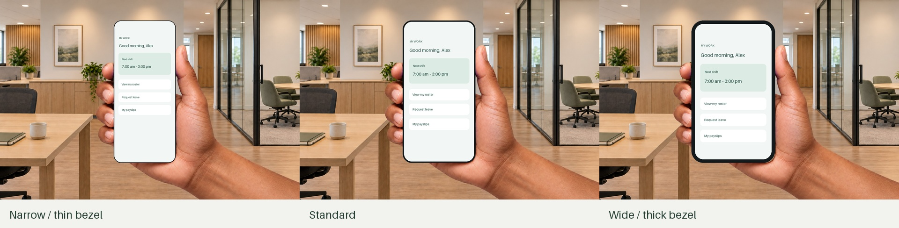

# Recovered phone-hand grip kit

Recovered 21 September 2026 from the original 9 September StageMark experiment. These are **implementation assets and a reference prototype**, not a newly shipped Workbench capability. Start with the [native implementation brief](../../research/phone-hand-grips.md).


This is a historical synthetic prototype render, not a Workbench screenshot. The screen is illustrative and the background is separate. Six original generated styles are supplied; each has two full-canvas RGBA PNGs. Fingers follow the phone's left edge while the palm/forearm stays attached to its right and bottom. Width changes translate the fingers; height changes scale both layers uniformly.



## Contents

| File | Purpose |
| --- | --- |
| [manifest.json](manifest.json) | Six IDs, exact source-phone bounds, dimensions, layer paths, checksums and demonstrated parameter ranges |
| `assets/` | 12 unchanged transparent PNGs, 1536 × 1024 each; 3,710,388 bytes total |
| [prototype/index.html](prototype/index.html) | Browser reference: styles, width/height/bezel/corners, backgrounds, illustrative or selected screen, PNG export |
| [prototype/geometry.js](prototype/geometry.js) | Top-left-coordinate reference transformation |
| [reference/GripGeometry.swift](reference/GripGeometry.swift) | Unflipped AppKit-coordinate equivalent; not compiled app code |
| [reference/geometry.test.cjs](reference/geometry.test.cjs) | Existing 324 geometry cases, rerun during recovery |
| [provenance.json](provenance.json) | Original prompts, generation method and source hashes; private filesystem paths removed |
| [verification.json](verification.json) | Fresh asset/geometry checks and explicit native/release gaps |

No app target or build script packages this directory. A native implementation must deliberately select runtime assets and verify the archive payload. Do not ship the prototype, review composites or example screen as hand layers. Generated source photographs used green/blue key surfaces; delivered PNGs contain real alpha. No competitor photo or user-supplied reference screenshot is included.

From this directory:

```sh
node reference/geometry.test.cjs
swiftc -typecheck reference/GripGeometry.swift
python3 -m http.server 8765 --bind 127.0.0.1
```

Open `http://127.0.0.1:8765/prototype/index.html`; stop the server afterward. Use synthetic images for review evidence. The prototype needs no account or external service. Its original StageMark name is retained as provenance. Its fixed 3:2 canvas does not establish native 16:9/16:10 behavior.

## Preserve these rules

- Keep the full PNG canvas. Cropping transparent margins invalidates source coordinates.
- Draw background → palm → fingertips → procedural bezel → clipped screen → branding. Both hand layers stay behind the screen; the bezel hides tiny contact overlaps.
- Use each variant's own source bounds. Do not stretch a hand to fit width or use a pre-cut phone hole as the viewport.
- Demonstrated screen aspect: 0.43–0.565; border: 0.004–0.025 of outer height; corners: 0.03–0.16 of screen width. This is a frontal portrait-phone rig, not a tablet, landscape or perspective rig.
- Keep the forearm's cut edge outside the output. A small or far-left phone may not allow that. The native brief defines visible recovery rather than stretching the wrist or silently moving the scene.
- Historical names describe fictional generated visual styles. Present six thumbnails with accessible names; do not classify the presenter or audience by identity.

The six keyed source photographs remain in the original kit; their hashes/prompts are preserved here and they are unnecessary for integration. Reuse these verified layers before generating more. Generate a new pose only for a demonstrated need, then repeat transparency, alignment and visual checks.
