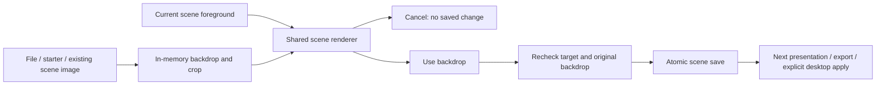

# Backgrounds that preserve the scene

Decision and specification · 13 September 2026. This record covers **scene preparation**, within Present a device. The broader product now also recognises persistent wallpaper as a separate job: see the [visual-experience contract](../site/handbook/contract.json). macOS provides its native baseline; a dedicated Workbench wallpaper experience is proposed. The useful Workbench promise is to prepare a composition once, then change its setting without rebuilding it.

## What the comparison changed

The existing Add backdrop action creates a new scene. It does not delete the old scene, but choosing a different picture means recreating device placement and branding. Missing-image recovery also directs people to start again. Fixing that editing continuity is more valuable than adding a large catalogue.

| Product / evidence | Craft or architecture worth learning | Workbench decision |
| --- | --- | --- |
| [Apple Wallpaper](https://support.apple.com/en-ie/guide/mac-help/-mchlp3013/mac) — native settings inspected | Recognisable image galleries, a current-selection preview and ordinary file/folder sources. Wallpaper options already include positioning and rotation. | Use native selection conventions. Keep changes to the actual desktop explicit. |
| [Unsplash Wallpapers](https://apps.apple.com/au/app/unsplash-wallpapers/id1284863847?mt=12) — official listing | A small photo-discovery workflow, history and monitor choices. | Recovery and a clear destination matter more than catalogue size. |
| [Irvue](https://apps.apple.com/gb/app/irvue-desktop-wallpapers/id1039633667?mt=12) — official listing/changelog | Curation, brightness filtering, channels and rotation. Older description text and current release features can differ. | Prefer purposeful composition to an endless feed. |
| [Plash](https://sindresorhus.com/plash) — 2.17.2 signed app settings inspected | General, Shortcuts and Advanced separate everyday controls from configuration. Muted audio and battery deactivation address the cost of a web renderer. It renders above wallpaper and cannot supply the Lock Screen. | A web backdrop is another runtime, not a new image format. Keep arbitrary websites out of demo scenes. |
| [24 Hour Wallpaper](https://24hourwallpaper.com/) and its [creation guide](https://create.24hourwallpaper.com/build/guide.html) — official documentation | Time-based photography and a portable images-plus-metadata package. | Useful future asset ideas; time-of-day scheduling does not solve the current scene-editing problem. |
| [Dynaper](https://apps.apple.com/gb/app/dynaper-dynamic-wallpapers/id1435296403?mt=12) — official listing | Author native dynamic HEIC rather than run another always-on renderer. | Leave dynamic-wallpaper authoring to a specialist unless repeated usage establishes a Workbench job. |

Native Apple Wallpaper was inspected without changing its selection. Plash was downloaded through the developer's official link, accepted by macOS as notarized, opened and inspected, then quit. Its General and Advanced settings were exercised as read-only surfaces; website playback, energy use, all-Spaces behaviour and Lock Screen behaviour were not tested. Other products were researched, not installed. Plash's [repository](https://github.com/sindresorhus/Plash) says it is no longer open source; no competitor code or artwork was copied into Workbench.

These findings do not establish that everyone can replace a specialist wallpaper app. For a local branded demo, Workbench can make the composition workflow self-contained. For everyday desktop rotation, Apple already provides a baseline.

## Ranked five

1. **Change backdrop without rebuilding the scene — implement now.** Preview a file, starter or existing scene image in the current composition, crop it, then apply or cancel. Also repair a missing image. This removes a complete repeated setup task.
2. **Backdrop dimming — park.** A single saved amount, affecting only the background before foreground artwork, can improve contrast. Test readable logos on bright and dark scenes before adding it; do not dim the device or persona.
3. **Explicit output and display preview — validate next.** Name the destination and show its aspect/crop. A laptop preview is insufficient evidence for an ultrawide display. Test a real second screen before promising parity.
4. **Reusable curated backdrops with provenance — park.** Start with existing local images. Add names/favourites/source credit only when finding reused images becomes difficult. Stock discovery needs attribution and download handling, not Google Images scraping; see the [Unsplash API requirements](https://unsplash.com/documentation).
5. **Gentle photo motion — implemented in source, 15 September.** One slow, opt-in photograph zoom replaces the need for a video runtime in this increment. Mac scenes and iOS scene previews share its parameters; a separate Mac action runs an app-owned desktop layer. Exports stay still. [Motion implementation and evidence](gentle-motion.md). Local video import, scheduling and generated Live Photos remain outside this feature.

This scene-backdrop increment excluded a wallpaper daemon, weather widgets, arbitrary HTML/CSS scripting, theme marketplaces, automated generation and a second library. That scope decision does not reject the independent wallpaper job. Prototype its still-image entry first; the current explicit desktop motion action reuses a prepared scene, while a direct wallpaper picker remains proposed. Native testing and energy limits are recorded separately. Existing desktop apply/restore ownership checks remain valuable and stay in place.

## Selected interaction

Entry: **Present a device → Change backdrop…**, also available beside **Backdrop missing**. Add backdrop continues to create a new scene.

The sheet has one composition preview, image choices, crop controls, **Cancel** and **Use backdrop**. It shows backgrounds already used in scenes and the bundled starters; **Choose image…** opens the native file picker. Original files remain local. Thumbnails select a candidate; they do not save or start presenting.

- Open with the current crop. A different image starts centred at 1×. Zoom, horizontal crop and vertical crop are labelled native controls; **Centre crop** resets only the background.
- Preview uses the existing pure scene renderer and target aspect. Device, logo, hand and persona stay in their existing positions. It does not request a camera or show a live device frame.
- Cancel or Escape leaves the saved archive and durable files unchanged. Cancelling the native file chooser returns to the same candidate.
- Apply captures the intended scene ID and changes only its image/crop fields. Preserve newer name or foreground edits. Reject a deleted scene or changed original backdrop rather than silently overwriting it.
- Reuse existing local scene images; copy imported or starter images only at successful application. Keep old images because duplicates and desktop recovery can still reference them.
- Validate image bytes and dimensions. Report missing/unreadable images or failed saves in the sheet; keep a usable retry/cancel path. Do not report success until the archive is saved.
- Changing a saved scene does not change the desktop or an already-running presentation. Presenting again uses the new composition.

No new database, archive version or renderer is required. The draft is one short-lived editing operation. Reusing a pure renderer does not start the live capture pipeline.

## Critical review

Claude challenged the generic brief without repository code or user records. Its strongest suggestions were to preserve meaningful composition during preview, keep crop coordinates relative, and resist a wallpaper daemon. Its duplicate-then-swap suggestion was rejected because it adds a new scene on each edit. A four-field patch onto the current scene preserves future foreground fields automatically; it does not need a list of every foreground property. Its proposed pixel-identical guarantee across resolutions was also rejected: shared rendering helps, but output aspects and device frames differ and need separate tests. File bookmarks already support ordinary moved-file recovery in Saved resources, so that suggestion is not a new feature.

The first generated study compared a sheet, inline filmstrip and separate library. It invented a logo/tagline and made the sheet preview portrait; those details were rejected. The second corrected the output aspect and control contract. Both are retained as hypotheses, not implementation evidence. The actual implementation uses a compact image list and labelled native sliders. See the [replacement preview](../site/assets/guide/backdrop-preview-actual.png), [starter preview](../site/assets/guide/backdrop-starter-actual.png), and [repaired scene](../site/assets/guide/backdrop-repaired-actual.png). These are captures of the real scene editor in a disposable fixture with synthetic names and artwork; they are not generated images or a live device feed.

## Native implementation choices

| Responsibility | Existing or native mechanism | Why it fits |
| --- | --- | --- |
| Local file selection | `NSOpenPanel`, short-lived security-scoped access | Familiar keyboard/file navigation; the preview snapshots bounded bytes before releasing access. |
| Thumbnail browsing | ImageIO downsampling, work cancelled when the sheet closes | Avoid decoding full-resolution artwork for every gallery entry. Repeated scene references appear once. |
| Preview | SwiftUI sheet with an AppKit view using `SceneRenderer` | The same composition math as existing export; no new capture session or renderer framework. |
| Apply | `SceneBackdrop` patch plus atomic `SceneStorage` save | Four explicit fields and a captured target ID; preserve other scene fields and reject stale backdrop edits. |
| Recovery | Retained source bytes, retained old assets and existing desktop journal | No destructive cleanup, migration or wallpaper-runtime ownership is introduced. |

## Validation

The full local regression suite passed on 13 September 2026. Stage checks: **72 tests, 1,739 assertions, zero failures**, including six new backdrop tests with 126 assertions. They cover unchanged/cancelled drafts; preservation of newer foreground edits; existing-image reuse; stale/deleted scenes; changed/missing image bytes; corrupt/future/read-only archives; failed-save rollback and retry; and preview-versus-saved rendering with nonuniform wide, portrait and EXIF-rotated JPEG images.

Native checks used the actual `DemoScenesView` with a fresh temporary scene directory and system integration disabled:

- Opening with the current crop leaves Use backdrop disabled. A different image starts centred at 1×.
- Selecting an existing image, changing zoom, then cancelling the native picker retains that candidate and zoom.
- Cancel and Escape leave the archive byte-identical. An unrelated pending scene-name edit remains unsaved.
- Importing a portrait image, changing crop and pressing Return preserves all four scene IDs and foreground/name fields. The new asset bytes match the source; the shared original stays untouched.
- A missing scene image can be repaired with an existing backdrop without copying it or changing another scene.
- The image list shows bundled starters, selected state and a composition preview. Controls and both actions remain visible after reducing the parent window.

These checks do not establish second-display framing, VoiceOver usability, energy use or what a meeting receiver captures. No live scene, desktop wallpaper or saved user presentation was modified for testing.
