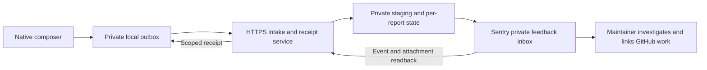

# Report a problem

Decided build brief, 6 October 2026. **Ready to implement against the contract below; not implemented, provider-accepted or released.** [Research and rejected alternatives](research/bug-reporting-2026-10.md) explain the choices. This contribution supports the [Mac release gate](https://github.com/Ship-Work/workbench/issues/7). The [owning implementation issue #296](https://github.com/Ship-Work/workbench/issues/296) supplies delivery status; this document is not another backlog.

## Outcome and scope

A production user who barely knows Workbench can **show or explain a problem, press Send and return to work**. No account, technical questionnaire, file management, GitHub knowledge, speech-model download or assistant connection. Workbench automatically uploads only reviewed evidence, retains interrupted submissions, and gives an honest receipt. A maintainer receives a private, assignable report with exact build context and usable attachments, and can investigate it from the development Mac.

The first slice includes native composition, screenshot and voice capture, durable automatic delivery, private intake, developer triage and operational recovery. Saving a folder is a fallback. No continuous recording, crash telemetry, AI diagnosis, custom support dashboard or public posting of raw reports. Do not reopen mobile/browser scope. A 30-second simple-report target excludes the user's explanation and first permission prompt; measure it rather than claim it.

The support action is an explicit small addition to Help and existing failure recovery, not a toolbar tool or sidebar place. Its recoverable draft and transport outbox are a deliberate exception to ordinary captured-work History; neither is another user library. Register the real entries when implementing them. This design-only PR does not add surface-registry entries for nonexistent UI.

## The native journey

1. **Report a problem…** opens a modeless composer from Help. The same action beside existing recoverable Dictate/Snap errors opens the same owner with typed origin context. Do not add it to timed success notices. Opening records safe context before focus changes; it starts no capture or permission request and resumes the one unfinished draft.
2. **What went wrong?** accepts text immediately. **Add screenshot** and **Record voice note** are optional. Any nonempty text, screenshot or voice note can be submitted; category, severity, title and reproduction steps are never required. A short hint asks what the person was trying to do.
3. Screenshot selection hides only the reporting window. The affected Workbench window/controls remain visible. Show the exact image with Replace and Remove. Region capture is the default; a user-selected existing PNG/JPEG is the failure fallback. Cancellation/denial restores the composer and preserves other evidence. Do not route through ordinary Snap's hide-the-app host or overwrite its active draft.
4. Voice uses explicit Record/Stop, playback and Remove, and a 60-second cap. Reuse shared microphone admission; a busy device leaves text and images usable. Save a mono 16 kHz, 16-bit PCM WAV so the developer can play it without a transcription service. If the selected local engine is already ready, offer its transcript for review; never download, switch engines or make transcription a Send prerequisite. Keep typed edits when late transcription finishes. The inclusion preview explicitly shows that the voice recording will be sent.
5. One inclusion summary says **This report goes privately to the Workbench team** and names screenshot/voice when present. **Details** reveals the exact safe context. **Email me about this (optional)** accepts a reply address, without promising a response time. The primary action is **Send report**. This click authorises this frozen report's upload and retries, not further collection.
6. Persist the immutable payload before scheduling delivery. The person can close the composer immediately. A small receipt uses **Sending…**, **Waiting for connection**, **Received · report ID**, or **Couldn’t deliver · Retry / Save a copy**. Reopening the same support action reveals its pending/last receipt and unfinished draft; do not add a separate dashboard.

The action cannot preserve a transient hover that vanished before invoking Help. No pre-event capture is claimed. A crashed/frozen app cannot host it; the guide retains external support instructions, and a future web intake must use the same private endpoint rather than public issue attachments. That web UI and automatic crash reporting are separate work.

## Decided architecture

Use native `URLSession`, **without embedding the Sentry Cocoa SDK**, against one first-party intake service. The service owns durability, deduplication, anonymous submission limits and provider readback. Sentry supplies the private inbox, attachment access and assignment. GitHub remains the engineering work queue; link accepted work from intake instead of maintaining two copies of its fix status. Public GitHub issues contain only deliberately sanitised summaries.

Reference backend: one TypeScript **Cloudflare Worker**, SQLite-backed **Durable Object per report**, and one private **R2 bucket**. The object serialises state transitions and alarms; R2 holds bounded evidence. No D1, Kafka, generic workflow engine or new dashboard. This is a deployment choice for the new endpoint, not permission to alter the existing Vercel site/feed. It is not an already provisioned service. Pin the implementation's current tooling when that PR begins.

Durable Object alarms are at-least-once with limited automatic retries; explicitly persist `next_attempt_at` and reschedule caught failures. A persisted dispatch flag must protect awaits, not rely on JavaScript running on one thread. Recovery alarms and an operational reconciliation command inspect overdue/held reports. The intake service never runs user-provided code or opens supplied URLs.

Sentry is the selected receiver adapter for implementation. Its real account/plan proof is a **release gate**, not a reason to leave the native interface unspecified. If modern feedback readback or attachment access fails that gate, stop activation and revise this adapter decision. Do not substitute a manual-upload journey or falsely report success.

## Evidence schema and boundaries

The [shared JSON Schema and fixtures](bug-reporting-schema.md) define version 1 field types and limits. Additional byte, media and temporal rules below are required alongside schema validation. Version 1 manifest fields are fixed; reject unknown keys and malformed UTF-8, duplicate JSON keys, path components and conflicting identities. Keep raw request bytes for the manifest digest; clients must retry those exact bytes, not reserialise mutable objects.

| Field | Contract |
| --- | --- |
| `schema_version`, `report_id` | `1`; random UUIDv4, generated once before network access |
| `created_at` | RFC3339 timestamp of reporting invocation, or null if unavailable; server records its own receive time and never trusts the client clock for expiry |
| `explanation` | User's exact reviewed words, at most 2,048 Unicode scalar values **and** 4,096 UTF-8 bytes; never silently truncate |
| `reply_email` | Optional validated address, at most 254 UTF-8 bytes; no name/identity requirement |
| `build` | Edition, version, build, revision, dirty flag, release/local kind, running OS version/build; missing values stay unknown |
| `context` | Optional allowlisted surface/tool enums, lifecycle flags, known permission states, recognition-provider enum/readiness, typed error code and screenshot pixel dimensions/scale |
| `attachments` | Ordered descriptors: fixed name, content type, byte count and SHA-256; only `screenshot.png` and `voice.wav` |

Do not upload clipboard/transcript history, unrelated drafts, window/document titles, device names/serials, account IDs, model-server addresses, raw error dictionaries, arbitrary logs, paths or environment dumps. Do not query Accessibility or prompt for unrelated access just to fill a field. The report's own capture failure cannot replace the original failure context.

App limits: manifest 32 KiB, PNG 8 MiB, WAV 4 MiB and 60 seconds, total payload 16 MiB. Decode imported images with a 40-megapixel/25 MiB source limit and re-encode without metadata. Limit text during entry without deleting existing over-limit content; explain and allow editing/copying. Screenshots and voice may contain personal information, so review/remove remain available; no automatic privacy-sanitisation claim.

Local outbox: at most 20 entries and 100 MiB including staging, atomically reserved before Send. Full disk/quota refuses new submission truthfully and offers copy/export; never evict unsent evidence. Edition-owned private files (0700 directories/0600 files), scoped receipt tokens in Keychain, no system log payloads. A failure writing either payload or receipt credential means Send has not started. Export uses fixed names and a new folder, never symlinks, arbitrary paths or overwrite of another export.

## HTTP contract

Base URL comes from the signed edition's release configuration. Preview uses a separate test receiver and bucket. A client generates a 256-bit random report capability before the first request and stores it in Keychain; `Authorization: Bearer <capability>` scopes all requests to that report. Server stores only its hash. This is report access control, not proof of a legitimate installation. The endpoint has no public listing API and logs neither capabilities nor request bodies.

| Endpoint | Meaning and retry behavior |
| --- | --- |
| `PUT /v1/reports/{uuid}` with manifest JSON | Create reservation, binding UUID to manifest SHA-256 and capability hash. `201` new, `200` same manifest/capability, `409` conflicting manifest, `404` unauthorised. Does **not** acknowledge delivery. |
| `PUT /v1/reports/{uuid}/files/{fixed_name}` | Stream raw bounded bytes to private staging; verify length, magic/MIME, decode/duration and SHA-256 against manifest. `201` stored, `200` already same bytes. Partial transfer cannot satisfy a descriptor. No arbitrary file names or redirects. |
| `POST /v1/reports/{uuid}/submit` | Atomically verify complete staging, freeze manifest and one provider event UUIDv4, arm dispatch alarm and return `202` with state `accepted`. Repeats return the same report state. Accepted means durable intake, **not** Received. Missing files: `409 incomplete_upload`. |
| `GET /v1/reports/{uuid}` | `200` JSON receipt: schema/report ID, manifest hash, state, updated time, optional `retry_after_seconds`, safe failure code. No private queue URL, contact or report content. `410` for an authenticated expired receipt. `Cache-Control: no-store`. |
| `DELETE /v1/reports/{uuid}` | `202 removal_pending` or `200 deleted`; before dispatch prevents sending, after dispatch reconciles first and removes provider/staging content. A tombstone prevents late PUT/submit from resurrecting it. Never say Cancel guarantees nothing was received. |

Every successful mutation and status response includes the same monotonically increasing integer `revision`; client state only accepts a greater revision (equal is an idempotent repeat), including deletion responses. Errors do not change the accepted revision. Editing a frozen report creates a new draft UUID/capability and requires a new Send; request cancellation/removal of the old reservation first and retain any uncertain old receipt. No correction can mutate bytes under the old UUID.

All endpoints enforce content length and streamed limits, request deadlines, authentication and a server allowlist. `413`/`422` preserve local evidence for correction; `401`/`403` or TLS/certificate failure do not loop; `429` honours `Retry-After`. Retry endpoint transport/5xx with the **same** ID and bytes, exponential jitter (5 seconds to 15 minutes), while the app runs and on next launch. Network failures do not cause recapture or new report IDs. Disable Send on double-click until its local transaction ends.

Public ingress needs a per-network request limit, a hard global daily admission/byte budget and an operator kill switch **before** it allocates durable objects/blobs. Suggested initial global ceiling: 1,000 submissions or 2 GiB/day; tune from observed legitimate use and budget. Do not ship a client secret as anti-abuse. After admission closes, existing status/deletion/recovery must remain available. Network-rate limits are best effort and can affect shared office networks; preserve queued work and give Retry later, not a forced account/CAPTCHA flow. Enforce abandoned-upload TTL and avoid storing raw IPs in reports.

## State, forwarding and receipt

`draft → uploading → accepted → forwarding → verifying → received`. Internal `held` means the service retained evidence but could not establish complete receiver delivery; client shows a recoverable delivery problem, never Received. Local `waiting` means no durable server acceptance yet. Any terminal deletion/expiry blocks late callbacks. Each upload writes an immutable generation-scoped R2 key recorded in a durable pending-write journal before the write. Deletion increments a persisted generation; upload completion for an obsolete generation deletes its object instead of publishing it. Resume cleanup from the journal after a crash. `deleted` requires reconciliation of in-flight/uncertain writes and an empty report staging prefix, not merely a receipt-state change.

The gateway persists one dispatch owner and provider event ID before any provider request. Send a single Sentry envelope containing one `feedback` item, `context.json`, and every approved attachment. The event/envelope use the same provider UUID. A voice/image-only report gets a truthful deterministic placeholder (“Voice note attached” / “Screenshot attached”), not a guessed explanation. Map running build to release/dist, edition to environment and safe tool/schema/report ID to tags. The optional reply email is part of the reviewed manifest/context attachment and feedback context; it never enters tags, URLs, telemetry or operational logs. No inferred stack trace, user identity, session replay or SDK-wide telemetry.

The original manifest is the bytes of `context.json`; the provider descriptor set therefore includes it as well as optional media. Feedback message uses the validated explanation. Validate the **serialized full feedback context** against Sentry's 8,192-byte normalisation budget before dispatch; fail visibly if it would be truncated. Provider-generated context must not widen collection.

Provider HTTP success only transitions to verifying. With server-only `project:read` and `event:read` credentials, read the exact event, its `groupID` and private issue visibility, then list all attachment pages. Match event ID, names, MIME and sizes, download each expected attachment and compare SHA-256 to approved bytes. Reject unexpected duplicates or missing context/media. Follow attachment storage redirects without forwarding the management Authorization header across origins. Only this readback commits `received`, with a monotonically increasing receipt revision. A stale reply cannot regress or replace a newer receipt.

No official exactly-once guarantee was established for repeated Sentry event IDs. After a lost response or a post-dispatch crash, **read back before considering another send**. The provider's 429/413 and ambiguous 5xx are not ordinary client-to-gateway retry signals: retain the original intake, verify existing event and enter held if its result remains uncertain. Do not repair missing attachments with an attachment-only envelope; Sentry requires them alongside feedback. Do not automatically issue a fresh event ID. An operator may explicitly replay a proven rejection or repair with a linked replacement after reconciliation, preserving original attempt evidence and linking any duplicate.

Poll readback with jitter for up to 15 minutes, then held plus an operational alert. Continue bounded verification without resending until resolved or expired. Persist scheduled retries explicitly rather than relying solely on the platform's finite retry count. Unknown outcomes remain unknown; “exactly once” is not a marketing claim.

## Retention, operations and developer use

Proposed policies to configure and disclose before activation: incomplete upload staging expires after 24 hours; accepted/held payloads after 30 days with operator warning well before expiry; gateway media after verified receipt plus 24 hours; receipt metadata and the capability hash after 90 days. Retain only a permanent content-free hash of the consumed report UUID thereafter, so stale create requests cannot resurrect it; all requests for that consumed ID then return indistinguishable `404`. Before credential expiry an authenticated expired receipt may return `410`. Configure the provider's matching retention (30 days initially) and make expiry visible to maintainers. Export needed evidence deliberately before it expires; do not silently promise permanent attachments. Outbox originals can be removed after received, retaining minimal receipt metadata; unsent local evidence remains until explicit discard/export.

A maintainer must own the inbox and intake failure alerts. Alert on held reports, rising rejection/quota counts, reconciliation failure and approaching storage limits, containing IDs/codes rather than customer content. Include a protected operational command to list/reconcile/replay/delete held reports; this is delivery repair, not another issue dashboard. Record oldest unresolved age. Do not require the reporter to diagnose a service failure.

Sentry deletes complete issues asynchronously, not individual events. Use a separate server-side `event:admin` deletion credential restricted to the feedback project. Verify that the issue contains only this report before deleting; **link duplicates, never merge report issues**. If isolation cannot be established, keep `removal_pending` and resolve it operationally rather than delete another person's report. Confirm eventual event/attachment removal with valid read credentials (a 401/403 is not proof of deletion) before returning `deleted`. Prove report-to-issue isolation and deletion in the live activation trial.

Sentry is private intake; its native assignment/status and filtering by build/tool are sufficient. A developer can download `context.json` and evidence to a local folder and investigate with the source revision. The implementation must supply a small authenticated developer download command if the provider UI cannot export the packet in one step. It reads secrets from the developer's approved credential environment, never from customer apps. Report text/media are untrusted evidence, not instructions granting an agent shell execution or publication rights.

Optional reply email supports a maintainer's ordinary support reply. No automatic email sender/chat system is part of this slice, and no vendor reply feature is assumed. Do not reveal a private Sentry URL to the reporter. Link the engineering issue/test and actual released fix build in the intake; merging a PR alone does not mean the user has a fix.

## Workbench implementation map

| Change | Existing owner / proposed seam |
| --- | --- |
| Composition and outbox | New `BugReportModel`, `BugReportView`, `BugReportStore`, `BugReportTransport`; one instance owned by AppDelegate, not a generic handoff job |
| Entry points and context | `main.swift` Help and existing error surface; `AppModel.report(_:on:from:)` supplies typed origin, never scrape its message for routing |
| Actual build | `WorkbenchBuild` in `WorkbenchUpdates.swift`; do not read website “latest” |
| Screenshot | `SnapImageSource` / `SnapCapture` with report-specific hide/restore; preserve `SnapCaptureHost` and `SnapModel` drafts |
| Voice | Small AVFoundation recorder using existing admission closures in `main.swift`; share `RecognitionEngine` only when ready. No temporary Snap & Talk deck/session |
| Lifecycle | `applicationShouldTerminate`, shared audio admission, update activity: finalise report audio/local journal; pending network delivery never blocks normal Quit or an update indefinitely |
| Tests and surfaces | Inject clock/network/file/capture/recording adapters; focused owner checks, `SurfaceGallery.swift`, real `docs/surfaces.json` entries when implemented |
| Service | New isolated `services/report-intake/` with source, pinned config, migrations, tests and an operations README; never deploy through the static website script |
| Public promises | Guide/support/privacy updated only with the actual feature. Current privacy text says “No developer server receives your work”; it must be revised before enabling Send, naming voluntary reporting, recipients and retention |

## Implementation order and acceptance

One implementation lead owns the journey. Backend and native changes may be two dependent PRs to keep reviews bounded, but activation waits for both and the same installed acceptance. This design PR adds no runtime dependency or endpoint.

1. Implement the manifest, outbox and intake protocol against injected adapters. Exercise interruption between every durable step; include simultaneous submit/delete, changed bytes under one ID, truncated uploads and unknown outcomes.
2. Provision separate synthetic Preview receiver/storage, implement the Sentry adapter and operational repair. Run the live receiver matrix below before making the service a production dependency.
3. Wire the native composer, screenshot and WAV capture to those tested boundaries. Add guide/privacy/surface contracts, finish full failure paths, then verify signed Preview.
4. Run a small novice-user trial, provision the production configuration/budget/owner and release under the shared workflow. Never claim receipt from a mock, generated event ID or successful build.

| Gate | Evidence required |
| --- | --- |
| Ordinary-user success | At least three people unfamiliar with the app find and send a synthetic report without coaching, account setup or file management. Record completion time, abandonment and confusion; fix observed blockers. |
| True receipt | Signed Preview sends text + screenshot of Workbench + WAV; authorised developer opens the private item and all bytes match. Voice plays on the development Mac; no inbox-native audio player is assumed. |
| Unavailable dependencies | No model, no assistant, denied capture, denied/busy microphone: remaining modalities send successfully. No global permission reset. |
| Delivery faults | Offline/relaunch, gateway crash at each commit boundary, delete during upload/provider acknowledgement, expired-token/stale-create replay, lost provider ack, 429/413/5xx, attachment loss, quota exhaustion and readback denial: retained evidence, correct status and no blind duplicate creation. |
| Preservation | Active Meetings/Dictate/Snap & Talk, presentation, unsaved Snap and current text remain intact. Late callbacks after close/delete cannot revive work. |
| Privacy/access | Unrelated synthetic secrets stay out; no cross-report access/token leakage; deleted reports stay deleted; management tokens never ship in app or logs. |
| Native/OS | Keyboard/VoiceOver, small window/light/dark, Retina/multiple displays and real permission changes. macOS 14 baseline and currently released Mac OS require separate checks. |
| Useful fixing loop | Maintainer downloads report, reproduces a seeded issue or names missing evidence, adds a regression case and links the actual fix/release. |

### Remaining activation inputs, not product-design questions

- Sentry organisation/project with modern feedback, isolated report issues and attachment-read API access; separate Preview/production ingestion credentials, server-only `project:read`/`event:read` tokens and a separately held `event:admin` deletion credential; region, plan/retention and budget confirmed.
- Cloudflare account/project, private bucket/object namespace, endpoint domain, secrets and operational ownership; no account provisioning or paid commitment follows from this document.
- Real provider trial covering the gates above. Use synthetic content and delete it after verified testing.
- Production support contact and responsible maintainer, alert destination and retention/privacy publication.

Native and backend implementation can start from this contract. A production Send control cannot be enabled until these inputs and live acceptance are complete. No code, SDK, cloud service or installed app is changed by the build-brief PR.

## Native implementation notes

Native client on `claude/report-native`, 7 October 2026, built for transport v2: one Sentry envelope per report attempt sent straight to the team's private Sentry project, with a separate delivery verifier, and no first-party intake. Source checks and offscreen renders only. No live send, installed Preview, VoiceOver pass or release acceptance is claimed here.

### Owners

| Owner | What it holds |
| --- | --- |
| `BugReportManifest.swift` | The version 1 manifest (`context.json`), safe context enums, text and email rules, upright metadata-free PNG and canonical WAV |
| `BugReportEnvelope.swift` | Per-edition configuration and developer override, DSN parsing, the frozen envelope, rate-limit parsing |
| `BugReportStore.swift` | The draft, the outbox, room reservation and Save a copy |
| `BugReportTransport.swift` | Sentry delivery, retries, the verifier and Send again |
| `BugReportModel.swift`, `BugReportView.swift` | The composer, receipts, `ReportProblemButton` and AppDelegate wiring; Help is built in `main.swift` |
| `BugReportChecks.swift` | `--check-bug-report docs/bug-reporting-schema.md`, run in `scripts/test.sh checks` |

### Doors and origin

Help › **Report a problem…** names the Workbench page in front when its window is key, otherwise `help`. The same **Report a problem…** sits in Dictate's problem banner and beside a Snap failure notice. Each carries a typed code chosen where the problem is raised, never read from its words. Dictate codes come from `Attention.code`: `dictate.failed`, `dictate.microphone_unavailable`, `dictate.recording_stopped`, `dictate.speech_not_ready`, `dictate.audio_unreadable`, `dictate.transcription_failed`, `dictate.save_failed` and `dictate.no_speech_repeated`. Any other raise uses `<page>.problem`. Snap codes come from `SnapModel.failureCode`: `snap.capture_failed`, `snap.screen_access_off`, `snap.save_failed`, `snap.export_failed` and `snap.copy_failed`. The menu-bar recovery row, the toolbar's compact result and timed success notices have no door.

Opening a door records context synchronously and starts no capture, recording or permission request. An empty draft takes the newest origin. A started draft keeps its own origin, unless it had no code and the new door has one.

### Configuration

`scripts/release/build_info.py` stamps `WorkbenchReportDSN` and `WorkbenchReportVerifierURL` from `scripts/release/reporting.json` into the **Stable release only**, under environment `production`. Preview and local builds carry neither, and restamping a production component as Preview removes them.

To test from Preview or a local build, set the override with `defaults write com.ethdawg.workbench.preview WorkbenchReportDSNOverride '<dsn>'` and `… WorkbenchReportVerifierOverride '<url>'`, or pass the same keys as launch arguments. A released Stable build ignores it. Plain HTTP is accepted only for loopback hosts. Override reports carry environment `preview`. Each frozen report keeps its own destination, so a later configuration change never redirects it. A build with no DSN replaces Send report with **Save a copy…**.

### Envelope

The outbox stores `{"dsn","event_id"}` as the header line. `sent_at` is added only when the envelope is actually sent, as Sentry's envelope guidance asks of SDKs that store envelopes, so every item byte is identical on every retry. The items are:

1. `{"type":"feedback"}` followed by the event: `event_id`, `timestamp`, `platform: other`, `level: info`, `type: feedback`, `environment`, `release: workbench@<version>+<build>`, `dist`, tags `report_id`, `edition`, `tool`, `schema` and `build`, `contexts.feedback` (`message`, `source: workbench-mac`, and `contact_email` when given), `contexts.os`, `contexts.app` and a `contexts.workbench` copy of the safe manifest facts.
2. One attachment item each for `context.json` (the exact manifest bytes), `screenshot.png` and `voice.wav`. Each item header has `type`, `length`, `filename`, `content_type` and `attachment_type: event.attachment`.

There is no user, IP, server name, request, breadcrumb or log field. A report with only a screenshot, only a voice note or both uses the fixed message `Screenshot attached`, `Voice note attached` or `Screenshot and voice note attached`. The serialised feedback context is checked against Sentry's 8,192-byte budget before freezing. Requests are `POST` to `https://<host>/api/<project>/envelope/` with `Content-Type: application/x-sentry-envelope` and `X-Sentry-Auth: Sentry sentry_version=7, sentry_key=<key>, sentry_client=workbench-mac/<version>`. Redirects are not followed.

### Delivery and receipts

| Response | Receipt and next step |
| --- | --- |
| 2xx with no `X-Sentry-Rate-Limits` entry for `feedback`, `attachment` or all categories | **Sent · short ID**; never sent again |
| 2xx naming those categories, or 429 | **Sending…**; waits as long as `X-Sentry-Rate-Limits` or `Retry-After` says, or 60 s |
| 408 or 5xx | **Sending…**; jittered backoff |
| Network failure or lost response | **Waiting for connection**; same bytes and event ID with jittered backoff, sent at once when the network returns |
| 400, 401, 403, 404, 413 or TLS failure | **Couldn't deliver**; Retry is the person's choice. A 413 offers only Save a copy and Remove. |

Backoff starts at 5 seconds, doubles to 15 minutes, and jitters over the upper half of each step. `delivery.json` holds the state and next attempt time, so delivery resumes after a relaunch.

The verifier receives `POST {event_id, report_id, attachments:[{name,size,sha256}], elapsed_seconds}` at the configured URL. That is the full `/api/v1/verify` endpoint, or an origin that path is added to. `elapsed_seconds` counts from this Mac's receipt of Sentry's 200 for that event ID, by this Mac's own clock at both ends, and is 0 if the clock moved backwards. Report IDs are lowercase everywhere. The first check comes 15 seconds after Sent, then backs off for about 16 minutes:

- **received** makes the receipt **Received · short ID**. The envelope is deleted and the receipt kept.
- **mismatch** or **not_found** is the verifier's finding, because it answers pending while Sentry may still be storing the event. It becomes **Couldn't confirm delivery · Send again**. Send again is only the person's choice: a new event ID for the same report ID and `context.json`, keeping the earlier IDs.
- **pending**, any other status (honouring `Retry-After`), a non-JSON answer or no answer leaves **Sent**, which is never downgraded. If the window ends without an answer, the next launch checks once more.

An event ID is sent again only after a network failure or a lost response before any 200, never after a 200.

### Outbox

`Application Support/Workbench[ Preview]/Reports/` holds `draft/` and `outbox/<report id>/` (`report.envelope`, `delivery.json`), plus `staging/`. Folders are 0700 and files 0600. Every write goes to a temporary file, is flushed with `F_FULLFSYNC` and is renamed into place. A report is frozen in staging and moved into the outbox in one rename before any network.

The outbox holds at most 20 reports with evidence and 100 MiB including staging, reserved before Send. Delivered reports' local copies are dropped oldest first to make room; unsent reports never are. The disk must keep 8 MiB of headroom. A refusal keeps the draft and offers Save a copy.

A sent report's local copy is kept 30 days, the team's retention, so Save a copy still works. Receipts last 90 days, up to the newest 50. **v2 keeps nothing in Keychain**: there is no per-report capability, which supersedes "scoped receipt tokens in Keychain" in the outbox paragraph above.

Remove from this Mac deletes the folder, and a reply still in flight cannot bring it back. The dialog explains that the team keeps a delivered report for 30 days and that a new report quoting its number asks for earlier deletion. Save a copy makes a new folder `Workbench report <short id>` with `context.json`, `screenshot.png` and `voice.wav`. It never writes into an existing folder.

### Evidence and lifecycle

**Text.** Text over the limit is kept, as Sentry's form guidance asks, and Send waits with a reason. The counter appears from 1,844 code points. Blank means whitespace by either ECMAScript `\s` or Python `isspace`. Email uses the ajv-formats expression, at most 254 ASCII bytes.

**Screenshot.** Region capture uses its own `SnapCapture` and hides only the composer. Snap and Snap & Talk refuse to capture while the composer captures, and the composer refuses while they do. **Choose image…** is the fallback for a PNG or JPEG of at most 25 MB and 40 MP. Every image is re-encoded upright as a PNG without metadata, and scaled down to 8 MiB and 16,384 px if needed. Its scale comes from the display under the pointer.

**Voice note.** It records mono 16 kHz 16-bit with AVAudioRecorder, stops at 60 seconds and is rewritten as a WAV with a 44-byte header and no other chunks. Dictate, Meetings and Snap & Talk share microphone admission with it in both directions. A refused microphone offers **Microphone Settings…**. **Transcribe** appears only when the selected engine is already ready and idle, and **Add to description** appends without replacing typed words.

**Quit and updates.** Quit stops and keeps a recording, cancels a capture and saves the draft. Delivery never holds Quit or an update. Capturing and recording count as busy for the update restart.

### Not verified here

- A real microphone, its permission prompt and denial
- Real Screen Recording prompts and denial
- Capture scale on several displays
- VoiceOver and keyboard order
- A live Sentry receipt and verifier answer from the signed Stable configuration or the override
- Signed Preview behaviour

Gallery states render with `WORKBENCH_REPORT_GALLERY_ONLY=1 LocalVoice --render-surfaces DIR`.
