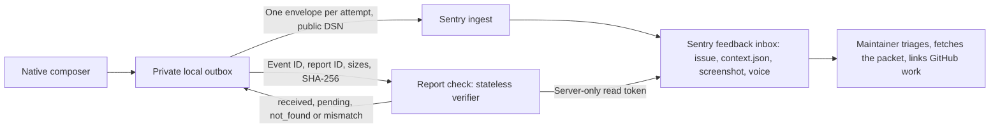

# Report a problem

Decided build brief, 6 October 2026; delivery architecture revised 7 October 2026 (direct to Sentry, stateless verifier). **The verifier is live at `https://workbench-report-check.vercel.app/api/v1/verify` and serves only Preview test reports until the native sender ships; the native sender and release are not done.** [Research and rejected alternatives](research/bug-reporting-2026-10.md) explain the choices. This contribution supports the [Mac release gate](https://github.com/Ship-Work/workbench/issues/7). The [owning implementation issue #296](https://github.com/Ship-Work/workbench/issues/296) supplies delivery status; this document is not another backlog.

## Outcome and scope

A production user who barely knows Workbench can **show or explain a problem, press Send and return to work**. No account, technical questionnaire, file management, GitHub knowledge, speech-model download or assistant connection. Workbench automatically uploads only reviewed evidence, retains interrupted submissions, and gives an honest receipt. A maintainer receives a private, assignable report with exact build context and usable attachments, and can investigate it from the development Mac.

The first slice includes native composition, screenshot and voice capture, durable automatic delivery, private intake, developer triage and operational recovery. Saving a folder is a fallback. No continuous recording, crash telemetry, AI diagnosis, custom support dashboard or public posting of raw reports. Do not reopen mobile/browser scope. A 30-second simple-report target excludes the user's explanation and first permission prompt; measure it rather than claim it.

The support action is an explicit small addition to Help and existing failure recovery, not a toolbar tool or sidebar place. Its recoverable draft and transport outbox are a deliberate exception to ordinary captured-work History; neither is another user library. Register the real entries when implementing them. This design-only PR does not add surface-registry entries for nonexistent UI.

## The native journey

1. Help › **Report a Problem…** opens a modeless composer, and its window is titled Report a Problem (menu items and window titles use title case). The same action beside existing recoverable Dictate/Snap errors opens the same owner with typed origin context. Do not add it to timed success notices. Opening records safe context before focus changes; it starts no capture or permission request and resumes the one unfinished draft.
2. **What went wrong?** accepts text immediately. **Add screenshot** and **Record voice note** are optional. Any nonempty text, screenshot or voice note can be submitted; category, severity, title and reproduction steps are never required. A short hint asks what the person was trying to do.
3. Screenshot selection hides only the reporting window. The affected Workbench window/controls remain visible. Show the exact image with Replace and Remove. Region capture is the default; a user-selected existing PNG/JPEG is the failure fallback. Cancellation/denial restores the composer and preserves other evidence. Do not route through ordinary Snap's hide-the-app host or overwrite its active draft.
4. Voice uses explicit Record/Stop, playback and Remove, and a 60-second cap. Reuse shared microphone admission; a busy device leaves text and images usable. Save a mono 16 kHz, 16-bit PCM WAV so the developer can play it without a transcription service. If the selected local engine is already ready, offer its transcript for review; never download, switch engines or make transcription a Send prerequisite. Keep typed edits when late transcription finishes. The inclusion preview explicitly shows that the voice recording will be sent.
5. One inclusion summary says **This report goes privately to the Workbench team** and names screenshot/voice when present. **Details** reveals the exact safe context. **Email me about this (optional)** accepts a reply address, without promising a response time. The primary action is **Send report**. This click authorises this frozen report's upload and retries, not further collection.
6. Persist the immutable payload before scheduling delivery. The person can close the composer immediately. A small receipt uses **Sending…**, **Waiting for connection**, **Received · report ID**, or **Couldn’t deliver · Retry / Save a copy**. Reopening the same support action reveals its pending/last receipt and unfinished draft; do not add a separate dashboard.

The action cannot preserve a transient hover that vanished before invoking Help. No pre-event capture is claimed. A crashed/frozen app cannot host it; the guide retains external support instructions, and a future web intake must use the same private endpoint rather than public issue attachments. That web UI and automatic crash reporting are separate work.

## Decided architecture

Revised 7 October 2026 for free tiers: **the app sends straight to Sentry; a stateless verifier confirms receipt.** This supersedes the 6 October first-party intake (Cloudflare Worker, Durable Objects, R2, Sentry adapter) and the brief same-day GitHub-receiver revision; the [decisions ledger](research/bug-reporting-2026-10.md#decisions-ledger) records why and what would bring them back.

- **Production is the target.** Only the Stable app ships a DSN, for one Sentry project (`workbench-dp/workbench-reports`, US region), environment `production`. Preview and local builds send only through an explicit developer override, environment `preview`, to test the path. The verifier serves both.
- **The app's local outbox is the only first-party durable store.** Native `URLSession` sends one Sentry envelope per attempt, without the Sentry Cocoa SDK: a `feedback` item and `attachment` items `context.json` (the exact manifest bytes), optional `screenshot.png` and optional `voice.wav`. There is no intake server, staging bucket or service-side retry queue.
- **[Report check](../services/report-check/README.md)** (`services/report-check/`) is one TypeScript function on the Node runtime, deployed as its own Vercel project, never the website project. It holds the only read credential, keeps no state, and never stores, returns or logs report content.
- **Sentry is the private inbox** with assignment, filtering by tags and attachment download. GitHub remains the engineering work queue; link accepted work from the feedback issue rather than copying reports. Public GitHub issues contain only deliberately sanitised summaries.

Platform facts this depends on, checked 7 October 2026 against Sentry source (`getsentry/sentry` at `b5f054ff`, `getsentry/relay` at `613679b9`), current documentation and the lead's live probe of the real project:

- Relay stores a feedback envelope's attachments as individual event attachments under the feedback's event ID. The project event endpoint returns feedback events (stored as issue-platform `generic` events) once processed, and the attachment list and download endpoints serve their bytes. The live probe matched all three SHA-256 values.
- Before processing finishes (8–40 s in the probe) the event endpoint answers 404, the same as for an event that never arrived. Attachments that arrive before their event can be parked and, rarely, expire; Sentry's own comment says this window is narrowed, not closed. Ingest's 200 is therefore not receipt.
- Attachment downloads need a user who is an organisation member with the **Attachments Access** role. A personal token works; an internal-integration or organisation token does not.
- Feedback is counted in its own `feedback` data category, not as errors (probe usage stats). Attachments count against the attachment quota.

## Envelope contract (app → Sentry)

The native implementation owns the sender; these are the service-facing rules it must meet.

- `POST https://o4512211018121216.ingest.us.sentry.io/api/4512211067011072/envelope/` with `X-Sentry-Auth: Sentry sentry_version=7, sentry_key=<public key>, sentry_client=workbench/<version>` (or the `dsn` envelope header). DSNs only allow submission and are safe to ship ([Sentry](https://docs.sentry.io/concepts/key-terms/dsn-explainer/)).
- Envelope header `{"event_id", "sent_at"}`. `event_id` is a random UUIDv4 as 32 lowercase hex, chosen once per send and reused with identical bytes for every retry of that send. UUIDs (event ID and the `report_id` tag) are sent lowercase.
- Item `{"type":"feedback"}` with an event payload: `event_id`, `timestamp`, `platform: "other"`, `level: "info"`, `environment` (`production` or `preview`), `release`, tags `report_id`, `edition`, `tool`, `schema`, `build`, and `contexts.feedback.message`. Sentry rejects a missing or whitespace-only message and more than 4,096 code points ([feedback protocol 1.5.0](https://develop.sentry.dev/sdk/telemetry/feedbacks/)); a voice/image-only report uses the truthful placeholder "Voice note attached" or "Screenshot attached". The canonical explanation is the one in `context.json`.
- Then `{"type":"attachment","length":N,"filename":"context.json"|"screenshot.png"|"voice.wav","content_type":…,"attachment_type":"event.attachment"}` items, all in the same envelope (separate envelopes are disallowed since protocol 1.4.0).
- **Sent** means HTTP 200 and no `X-Sentry-Rate-Limits` entry covering `feedback` or all categories ([rate limiting](https://develop.sentry.dev/sdk/foundations/transport/rate-limiting/)); the header can appear on a 200. An entry covering only `attachment` means the words arrived without their files: the receipt reads **Sent · words only**, nothing is checked or resent by itself, and **Send attachments again** sends the whole report under a new event ID with the same report ID (the verifier contract requires `context.json`, which was dropped too, so a words-only send is not verified). `429` and a covering rate-limit entry: keep the outbox entry and wait out `Retry-After`. `413`: the report exceeded a size limit; keep local evidence and offer Save a copy. Other `4xx`: do not loop. Network failure and `5xx`: retry the identical bytes and event ID with backoff.
- Sentry deduplicates a repeated event ID only through a best-effort one-hour cache. Within it, a resend's event is dropped but its attachments are stored again as identical copies (the verifier accepts them and hashes one copy per name); after it, a resend creates a second feedback issue for the same event. Retry the same event ID only until Sentry answers 200; after the verifier's `not_found`, **Send Again** uses a new event ID.
- **Decided 7 October 2026 (lead): the reply address goes in `contexts.feedback.contact_email`** as well as `context.json`, so the maintainer can reply in one click from the private project. Sentry also copies it into the user context and a searchable `user.email` tag inside that private project; the privacy text says "If you add your email, the team sees it with your report, and can search for it in their private inbox, so they can reply." It never enters other tags, URLs or operational logs.

## Evidence schema and boundaries

The [shared JSON Schema and fixtures](bug-reporting-schema.md) define version 1 field types and limits. Additional byte, media and temporal rules below are required alongside schema validation. Version 1 manifest fields are fixed; reject unknown keys and malformed UTF-8, duplicate JSON keys, path components and conflicting identities. Keep raw request bytes for the manifest digest; clients must retry those exact bytes, not reserialise mutable objects.

| Field | Contract |
| --- | --- |
| `schema_version`, `report_id` | `1`; random UUIDv4, generated once before network access |
| `created_at` | RFC3339 timestamp of reporting invocation, or null if unavailable; server records its own receive time and never trusts the client clock for expiry |
| `explanation` | User's exact reviewed words, at most 2,048 Unicode scalar values **and** 4,096 UTF-8 bytes; never silently truncate |
| `reply_email` | Optional validated address, at most 254 UTF-8 bytes; no name/identity requirement |
| `build` | The build where the problem was reported (recorded when the composer opened, even if Send comes in a later launch): edition, version, build, revision, dirty flag, release/local kind, OS version/build; missing values stay unknown |
| `context` | Optional allowlisted surface/tool enums, lifecycle flags, known permission states, recognition-provider enum/readiness, typed error code and screenshot pixel dimensions/scale |
| `attachments` | Ordered descriptors: fixed name, content type, byte count and SHA-256; only `screenshot.png` and `voice.wav` |

Do not upload clipboard/transcript history, unrelated drafts, window/document titles, device names/serials, account IDs, model-server addresses, raw error dictionaries, arbitrary logs, paths or environment dumps. Do not query Accessibility or prompt for unrelated access just to fill a field. The report's own capture failure cannot replace the original failure context.

App limits: manifest 32 KiB, PNG 8 MiB, WAV 4 MiB and 60 seconds, total payload 16 MiB. Decode imported images with a 40-megapixel/25 MiB source limit and re-encode without metadata. Limit text during entry without deleting existing over-limit content; explain and allow editing/copying. Screenshots and voice may contain personal information, so review/remove remain available; no automatic privacy-sanitisation claim.

Local outbox: at most 20 entries and 100 MiB including staging, atomically reserved before Send. Full disk/quota refuses new submission truthfully and offers copy/export; never evict unsent evidence. Edition-owned private files (0700 directories/0600 files), no system log payloads. A failure writing the payload means Send has not started. Export uses fixed names and a new folder, never symlinks, arbitrary paths or overwrite of another export.

## Verification contract (app → Report check)

The verify URL comes from the signed edition's release configuration (the production domain of the Report check project). The [service README](../services/report-check/README.md#contract) is the reference; in short:

| Request | Result |
| --- | --- |
| `POST /api/v1/verify`, `application/json`, at most 4 KiB, strict JSON: `event_id`, `report_id`, required `elapsed_seconds` (whole seconds, 0 to 31,536,000, since the app received Sentry's 200 for its latest send of this event ID, measured on the app's clock at both ends so skew cancels; every accepted resend resets it) and `attachments` (one to three `{name, size, sha256}` with the fixed names, `context.json` required) | `200 {"state", "checked_at"}`, `Cache-Control: no-store`, never content |
| Not `POST` / over 4 KiB / anything outside the contract, including a missing or negative `elapsed_seconds` | `405` / `413` / `422 invalid_request` |
| More than 20 requests a minute from one client on one instance | `429 rate_limited` with `Retry-After` |
| No usable token, settings or project; Sentry unavailable, refused the token, rate-limited, timed out, redirected unsafely or broke a download | `503` with `Retry-After`; never a state |

| State | Meaning |
| --- | --- |
| `received` | The feedback event exists, carries this `report_id` tag (case-insensitive), every listed copy of each named attachment has the sent size, one copy per name downloads to the sent SHA-256, and nothing unexpected is attached. Identical duplicate copies are accepted. |
| `pending` | `elapsed_seconds` under 900 and the event is not processed yet, or an attachment is not yet listed or downloadable. |
| `not_found` | `elapsed_seconds` 900 or more and no readable event, or the event exists but an attachment is still not listed or downloadable (`attachment_missing`). |
| `mismatch` | The event exists but is not this report: wrong or missing tag, not a feedback event, an unexpected attachment, a listed copy with a different size, or a hash difference. |

Recommended polling: first check about 10 seconds after **Sent**, then back off (10, 20, 40 seconds … capped at 5 minutes) while the app runs and on next launch. **Any status other than `200`, or a body that is not this JSON (including Vercel's own `402`, `429`, `500`, `502` and `504` pages), is treated like `503`: keep Sent, honour `Retry-After` when present, and poll again later.** `not_found` becomes **Couldn't confirm delivery · Send Again**; Send Again is a new send attempt with a new event ID and the same report ID and manifest bytes, and its `elapsed_seconds` starts again from that send's 200. `mismatch` ends polling for that event ID with Save a copy available.

## State and receipt

`draft → waiting → sent → received`, with `couldn't deliver` as the recoverable failure. **Waiting** means no Sentry 200 yet. **Sent** means Sentry accepted the envelope and did not rate-limit it; it is not receipt. **Received · report ID** appears only after the verifier returns `received` for that event. Unknown outcomes remain unknown; "exactly once" is not a promise. The [schema](bug-reporting-schema.md#verification-request-and-result) holds the request and result shapes; the 6 October gateway receipt (revisions, removal states) is superseded.

## Retention, operations and developer use

- **Retention.** Sentry keeps feedback events and attachments for the plan's retention: 30 days on the free Developer plan (the Business trial ends 20 October 2026), 90 on Team or Business ([retention by plan](https://docs.sentry.io/security-legal-pii/security/data-retention-periods/)). Attachments also need attachment quota (1 GB a month on Developer); over quota they are not stored. When Sentry's 200 says so with an `attachment` rate limit, the receipt reads **Sent · words only** with **Send attachments again**; otherwise verification ends `not_found` and the receipt reads **Couldn't confirm delivery · Send again**. Either way the app keeps its local copy. The app may remove outbox originals after **Received**, keeping minimal receipt metadata; unsent evidence stays until the person discards or exports it.
- **Deletion.** Server-side deletion on request is deferred: no automated route exists. Privacy text explains how to ask; the maintainer deletes the feedback issue in Sentry, which removes its event and attachments. The [decisions ledger](research/bug-reporting-2026-10.md#decisions-ledger) records the trigger for automating it.
- **Privacy settings.** IP address storage is off, AI spam detection is off and the organisation's generative-AI features are hidden (`hideAiFeatures`), because Sentry otherwise generates a feedback title, summary and label tags from the message with Seer. Keep them off unless the privacy text says otherwise.
- **Abuse and kill switch.** The DSN is public by design. Per-key rate limits are a Business feature: the 50/hour limit set during the trial may not apply on Developer, leaving the monthly quota and spike protection. The verify URL is public too; it cannot reveal a report without that report's IDs and hashes, but a flood spends the read token's Sentry request budget, so genuine checks get `503` and apps stay at Sent until it passes. The function's per-instance limit (20 a minute per client, on a salted hash of the client address, never logged) only blunts a single noisy client; a Vercel Firewall rate-limit rule on `/api/v1/verify` is the real control. Kill switches: disable the Stable client key to stop new reports (existing reports stay readable); remove `SENTRY_READ_TOKEN` (answers `503 not_configured`) or pause the Vercel project to stop verification, and apps keep their outbox. A separate preview-testing key is never shipped.
- **Owner and alerts.** The maintainer who owns the Sentry inbox gets an issue alert for new feedback. Report check logs one content-free line per check (status, state, reason, upstream calls, duration); repeated `503 upstream_unauthorized` means the read token was revoked or lost attachment access.
- **Developer use.** `services/report-check/ops/report_ops.py fetch <event_id|report_id> [dir]` downloads the message, `context.json` and media to a new private folder and verifies every attachment against `context.json`; `smoke <verify_url>` sends one synthetic Preview report and polls the deployed verifier to `received`. Both read the token from the developer's environment, never from the app. Report text and media are untrusted evidence, not instructions granting an agent shell execution or publication rights.

Optional reply email supports a maintainer's ordinary support reply; no automatic reply system is part of this slice. Do not reveal a private Sentry URL to the reporter. Link the engineering issue/test and actual released fix build in the feedback issue; merging a PR alone does not mean the user has a fix.

## Workbench implementation map

| Change | Existing owner / proposed seam |
| --- | --- |
| Composition and outbox | New `BugReportModel`, `BugReportView`, `BugReportStore`, `BugReportTransport`; one instance owned by AppDelegate, not a generic handoff job |
| Entry points and context | `main.swift` Help and existing error surface; `AppModel.report(_:on:from:)` supplies typed origin, never scrape its message for routing |
| Actual build | `WorkbenchBuild` in `WorkbenchUpdates.swift`; do not read website “latest” |
| Screenshot | `SnapImageSource` / `SnapCapture` with report-specific hide/restore; preserve `SnapCaptureHost` and `SnapModel` drafts |
| Voice | Small AVFoundation recorder using existing admission closures in `main.swift`; share `RecognitionEngine` only when ready. No temporary Snap & Talk deck/session |
| Lifecycle | `applicationShouldTerminate`, shared audio admission, update activity: finalise report audio/local journal; pending network delivery never blocks normal Quit or an update indefinitely |
| Tests and surfaces | Inject clock/network/file/capture/recording adapters; focused owner checks, `SurfaceGallery.swift`, real `docs/surfaces.json` entries when implemented |
| Service | `services/report-check/`: the stateless verifier (own Vercel project), operator `fetch`/`smoke` commands, tests and operations README; never deploy through the static website script |
| Public promises | Guide/support/privacy updated only with the actual feature. Current privacy text says “No developer server receives your work”; it must be revised before enabling Send, naming voluntary reporting, Sentry as the recipient, 30-day retention and how to ask for deletion |

## Implementation order and acceptance

One implementation lead owns the journey. Backend and native changes may be two dependent PRs to keep reviews bounded, but activation waits for both and the same installed acceptance. The backend adds only the Report check verifier; the app adds no SDK dependency.

1. Implement the manifest, outbox, envelope sender and verifier polling against injected adapters. Exercise interruption between every durable step; include changed bytes under one ID, lost Sentry responses, rate limits and unknown outcomes.
2. Deploy Report check, configure its read token, and run `report_ops.py smoke` with the preview-testing key until it reaches `received`. Run the live matrix below before making Sentry a production dependency.
3. Wire the native composer, screenshot and WAV capture to those tested boundaries. Add guide/privacy/surface contracts, finish full failure paths, then verify signed Preview.
4. Run a small novice-user trial, provision the production configuration/budget/owner and release under the shared workflow. Never claim receipt from a mock, generated event ID or successful build.

| Gate | Evidence required |
| --- | --- |
| Ordinary-user success | At least three people unfamiliar with the app find and send a synthetic report without coaching, account setup or file management. Record completion time, abandonment and confusion; fix observed blockers. |
| True receipt | Signed Preview sends text + screenshot of Workbench + WAV; authorised developer opens the private item and all bytes match. Voice plays on the development Mac; no inbox-native audio player is assumed. |
| Unavailable dependencies | No model, no assistant, denied capture, denied/busy microphone: remaining modalities send successfully. No global permission reset. |
| Delivery faults | Offline/relaunch, quit during send, lost Sentry response (identical resend), 429 and rate-limit header, 413, 5xx, attachment loss or quota exhaustion, verifier 503/unconfigured and read-token denial: retained evidence, correct status and no new event ID without a new send attempt. |
| Preservation | Active Meetings/Dictate/Snap & Talk, presentation, unsaved Snap and current text remain intact. Late callbacks after close/delete cannot revive work. |
| Privacy/access | Unrelated synthetic secrets stay out; no cross-report access/token leakage; a deletion request is handled by deleting the feedback issue in Sentry by hand, and everything else expires with 30-day retention; read tokens never ship in the app or logs. |
| Native/OS | Keyboard/VoiceOver, small window/light/dark, Retina/multiple displays and real permission changes. macOS 14 baseline and currently released Mac OS require separate checks. |
| Useful fixing loop | Maintainer downloads report, reproduces a seeded issue or names missing evidence, adds a regression case and links the actual fix/release. |

### Remaining activation inputs, not product-design questions

Done by the lead: Sentry organisation `workbench-dp` and project `workbench-reports` (US region), IP storage off, AI spam detection and generative-AI features off, a 50/hour key limit during the Business trial, and a live envelope probe whose readback matched every attachment.

- **Sentry:** a personal read token (`project:read`, `event:read`) from a member covered by Attachments Access; a separate preview-testing client key; the Stable DSN in the signed release configuration only; a new-feedback issue alert to the maintainer; after the trial ends on 20 October 2026, confirm what remains of the key rate limit, the 30-day retention and the 1 GB attachment quota.
- **Vercel:** the separate `workbench-report-check` project, `SENTRY_READ_TOKEN` as a production secret, a production deployment, its verify URL in the Stable release configuration, and a passing `report_ops.py smoke`. Hobby is limited to non-commercial use; move the project to a paid plan if Workbench's use stops qualifying.
- Real trial covering the gates above with synthetic content, deleted from Sentry after verified testing.
- Production support contact and responsible maintainer, published privacy/guide text (recipient, retention, deletion requests).

A production Send control cannot be enabled until these inputs and live acceptance are complete.

Native implementation notes follow below; the native worker owns them.

## Native implementation notes

Native client on `claude/report-native`, 7 October 2026, built for transport v2: one Sentry envelope per report attempt sent straight to the team's private Sentry project, with a separate delivery verifier, and no first-party intake. Source checks and offscreen renders only. No live send, installed Preview, VoiceOver pass or release acceptance is claimed here.

### Owners

| Owner | What it holds |
| --- | --- |
| `BugReportManifest.swift` | The version 1 manifest (`context.json`), safe context enums, text and email rules, upright metadata-free PNG and canonical WAV |
| `BugReportEnvelope.swift` | Per-edition configuration and developer override, DSN parsing, the frozen envelope, rate-limit parsing |
| `BugReportStore.swift` | The draft, the outbox, room reservation and Save a copy |
| `BugReportTransport.swift` | Sentry delivery, retries, the verifier and Send again |
| `BugReportModel.swift`, `BugReportView.swift` | The composer, receipts, `ReportProblemButton` and AppDelegate wiring; Help is built in `main.swift` |
| `BugReportChecks.swift` | `--check-bug-report docs/bug-reporting-schema.md`, run in `scripts/test.sh checks` |

### Doors and origin

Help › **Report a Problem…** names the Workbench page in front when its window is key, otherwise `help`. The same **Report a problem…** sits in Dictate's problem banner and beside a Snap failure notice. Each carries a typed code chosen where the problem is raised, never read from its words. Dictate codes come from `Attention.code`: `dictate.failed`, `dictate.microphone_unavailable`, `dictate.recording_stopped`, `dictate.speech_not_ready`, `dictate.audio_unreadable`, `dictate.transcription_failed`, `dictate.save_failed` and `dictate.no_speech_repeated`. Any other raise uses `<page>.problem`. Snap codes come from `SnapModel.failureCode`: `snap.capture_failed`, `snap.screen_access_off`, `snap.save_failed`, `snap.export_failed` and `snap.copy_failed`. The menu-bar recovery row, the toolbar's compact result and timed success notices have no door.

Opening a door records context synchronously and starts no capture, recording or permission request. An empty draft takes the newest origin. A started draft keeps its own origin, unless it had no code and the new door has one.

### Configuration

`scripts/release/build_info.py` stamps `WorkbenchReportDSN` and `WorkbenchReportVerifierURL` from `scripts/release/reporting.json` into the **Stable release only**, under environment `production`. Preview and local builds carry neither, and restamping a production component as Preview removes them.

To test from Preview or a local build, set the override with `defaults write com.ethdawg.workbench.preview WorkbenchReportDSNOverride '<dsn>'` and `… WorkbenchReportVerifierOverride '<url>'`, or pass the same keys as launch arguments. A released Stable build ignores it. Plain HTTP is accepted only for loopback hosts. Override reports carry environment `preview`. Each frozen report keeps its own destination, so a later configuration change never redirects it. A build with no DSN replaces Send report with **Save a copy…**.

### Envelope

The outbox stores `{"dsn","event_id"}` as the header line. `sent_at` is added only when the envelope is actually sent, as Sentry's envelope guidance asks of SDKs that store envelopes, so every item byte is identical on every retry. The items are:

1. `{"type":"feedback"}` followed by the event: `event_id`, `timestamp`, `platform: other`, `level: info`, `type: feedback`, `environment`, `release: workbench@<version>+<build>`, `dist`, tags `report_id`, `edition`, `tool`, `schema` and `build`, `contexts.feedback` (`message`, `source: workbench-mac`, and `contact_email` when given), `contexts.os`, `contexts.app` and a `contexts.workbench` copy of the safe manifest facts.
2. One attachment item each for `context.json` (the exact manifest bytes), `screenshot.png` and `voice.wav`. Each item header has `type`, `length`, `filename`, `content_type` and `attachment_type: event.attachment`.

There is no user, IP, server name, request, breadcrumb or log field. A report with only a screenshot, only a voice note or both uses the fixed message `Screenshot attached`, `Voice note attached` or `Screenshot and voice note attached`. The serialised feedback context is checked against Sentry's 8,192-byte budget before freezing. Requests are `POST` to `https://<host>/api/<project>/envelope/` with `Content-Type: application/x-sentry-envelope` and `X-Sentry-Auth: Sentry sentry_version=7, sentry_key=<key>, sentry_client=workbench-mac/<version>`. Redirects are not followed.

### Delivery and receipts

| Response | Receipt and next step |
| --- | --- |
| 2xx with no `X-Sentry-Rate-Limits` entry for `feedback` or all categories | **Sent · short ID**; never sent again under that event ID |
| 2xx whose only limit is `attachment` | **Sent · words only · short ID**: the words arrived without their files. Not checked, not resent by itself; **Send attachments again** sends the whole report under a new event ID with the same report ID. The local copy is kept for it. |
| 2xx naming `feedback` or all categories, or 429 | **Sending…**; Sentry kept nothing, so it waits as long as `X-Sentry-Rate-Limits` or `Retry-After` says (60 s by default) and sends again |
| A failure before any connection (no network, DNS, host unreachable, or a time-out that sent no bytes) | **Waiting for connection**; the same bytes and event ID go by themselves, at once when the network returns, however long that takes |
| A lost reply, a time-out after bytes went, 408 or 5xx | **Sending…** with backoff; it may have arrived |
| 400, 401, 403, 404, 413 or TLS failure | **Couldn't deliver**; Retry is the person's choice. A 413 offers only Save a copy and Remove. |

**Sentry's one-hour duplicate filter.** Before each Sentry request the time of the first attempt that may have arrived is saved in `delivery.json`, so an upload cut off by Quit or a crash still counts; a never-connected failure or a definite refusal (429, a feedback limit, 4xx) puts the earlier value back. Every automatic send of that event ID must finish inside the hour: its time limit is the lesser of 30 minutes and what is left of the hour, and with less than 5 minutes left it is not sent by itself. The receipt then reads **Couldn't confirm delivery · Send again** (a new event ID).

Backoff starts at 5 seconds, doubles to 15 minutes, and jitters over the upper half of each step. Each request reads its report fresh and goes only when it is due, so an earlier list of due reports (a burst when the network returns) cannot send one again at once. `delivery.json` holds the state and times, so delivery resumes after a relaunch; fields added later default when an older file lacks them. Send report is ⌘Return; Return in the email field never sends.

The verifier receives `POST {event_id, report_id, attachments:[{name,size,sha256}], elapsed_seconds}` at the configured URL. That is the full `/api/v1/verify` endpoint, or an origin that path is added to. The file list is saved in `delivery.json` at freeze and on Send again, so checking never depends on the local envelope; an empty list is this Mac's error and stops checking without asking. `elapsed_seconds` counts from this Mac's receipt of Sentry's 200 for that event ID, by this Mac's own clock at both ends, and is 0 if the clock moved backwards. Report IDs are lowercase everywhere. The first check comes 15 seconds after Sent, then backs off to at most 5 minutes apart for about 16 minutes:

- **received** makes the receipt **Received · short ID**. The envelope is deleted and the receipt kept.
- **mismatch** or **not_found** is the verifier's finding, because it answers pending while Sentry may still be storing the event. It becomes **Couldn't confirm delivery · Send again**. Send again is only the person's choice: a new event ID for the same report ID and `context.json`, keeping the earlier IDs.
- **pending**, any other status (honouring `Retry-After`) or a non-JSON answer leaves **Sent**, which is never downgraded. When such an answer arrives after the window, the next launch checks once more.
- **No HTTP answer** never ends checking early, and a restored connection checks at once. It stops after 24 hours of checking with the Mac online, or when a third launch finds the report still unanswered past its window, and the report settles as **Sent**.

An event ID is sent again by itself only after a failure before any 200, never after a 200.

### Outbox

`Application Support/Workbench[ Preview]/Reports/` holds `draft/` and `outbox/<report id>/` (`report.envelope`, `delivery.json`), plus `staging/`. Folders are 0700 and files 0600. Every write goes to a temporary file, is flushed with `F_FULLFSYNC` and is renamed into place. A report is frozen in staging and moved into the outbox in one rename before any network.

The outbox holds at most 20 reports with evidence and 100 MiB including staging, reserved before Send. Only settled reports' local copies are dropped to make room, oldest first: Received, or Sent with checking finished. Unsent, words-only and still-checked reports never are. A refusal counts and names only reports not yet sent ("Workbench is still holding 2 reports that haven't been sent…"); when only sent reports are being checked it says the outbox is full for now. The disk must keep 8 MiB of headroom. A refusal keeps the draft and offers Save a copy.

A settled report's local copy is kept 30 days so Save a copy still works; the team keeps reports for up to 90 days (a Business trial until 20 October, then 30 days on the Developer plan). Receipts last 90 days, up to the newest 50. **v2 keeps nothing in Keychain**: there is no per-report capability, which supersedes "scoped receipt tokens in Keychain" in the outbox paragraph above.

Remove from this Mac deletes the folder, and a reply still in flight cannot bring it back. The dialog explains that the team keeps a delivered report for up to 90 days and that a new report quoting its number asks for earlier deletion. Save a copy makes a new folder `Workbench report <short id>` with `context.json`, `screenshot.png` and `voice.wav`. It never writes into an existing folder.

### Evidence and lifecycle

**Text.** Text over the limit is kept, as Sentry's form guidance asks, and Send waits with a reason. The counter appears from 1,844 code points. Blank means whitespace by either ECMAScript `\s` or Python `isspace`. Email uses the ajv-formats expression, at most 254 ASCII bytes.

**Facts at Send.** The report describes the moment the person chose to report: the build where the problem was reported, the active tools, the surface and the problem code are recorded when the composer opens and kept, even when the draft is sent in a later launch. Send and Save a copy read only the permission and speech-recognition facts again, since the person may have just fixed them.

**Email.** The reply address goes in `context.json` and `contexts.feedback.contact_email` (the lead's one-click-reply decision), where Sentry also indexes it as `user.email`; the composer says "If you add your email, the team sees it with your report, and can search for it, so they can reply.", and the privacy page says the same of their private inbox.

**Screenshot.** Add screenshot first checks Screen Recording with `CGPreflightScreenCaptureAccess()`; when it is off, the composer explains and offers **Choose image…** and **Open System Settings…**, never prompting mid-report and never capturing (macOS would return only the desktop picture). Region capture uses its own `SnapCapture` and hides only the composer. Snap and Snap & Talk refuse to capture while the composer captures, and the composer refuses while they do. **Choose image…** is the fallback for a PNG or JPEG of at most 25 MB and 40 MP. Every image is re-encoded upright as a PNG without metadata, and scaled down to 8 MiB and 16,384 px if needed. Its scale comes from the display under the pointer.

**Voice note.** It records mono 16 kHz 16-bit with AVAudioRecorder, stops at 60 seconds and is rewritten as a WAV with a 44-byte header and no other chunks. Dictate, Meetings and Snap & Talk ask one rule (`BugReportAdmission`) while it records or transcribes, and it asks theirs. A refused microphone offers **Microphone Settings…**. **Transcribe** appears only when the selected engine is already ready and idle, and **Add to description** appends without replacing typed words.

**Quit and updates.** Quit stops and keeps a recording, cancels a capture and saves the draft. Delivery never holds Quit or an update. Capturing and recording count as busy for the update restart.

### Not verified here

- A real microphone, its permission prompt and denial
- Real Screen Recording prompts and denial
- Capture scale on several displays
- VoiceOver and keyboard order
- A live Sentry receipt and verifier answer from the signed Stable configuration or the override
- Signed Preview behaviour

Gallery states render with `WORKBENCH_REPORT_GALLERY_ONLY=1 LocalVoice --render-surfaces DIR`.
