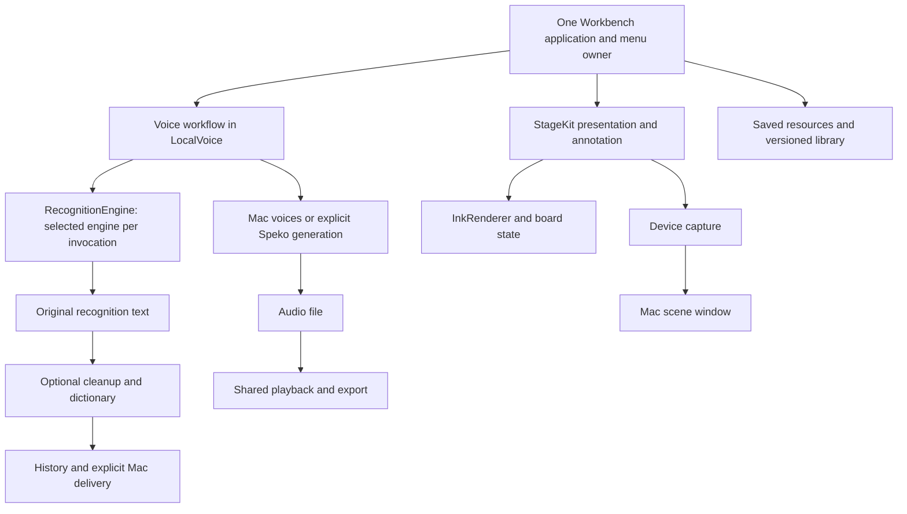

# A small app that benefits from better engines

Decision record · 13 September 2026. Read with [Workbench's product boundary](workbench.md) and [the category comparison](utility-comparison.md). GitHub issues are the contribution queue; this document explains the enduring direction.

Workbench should make a few everyday jobs dependable and pleasant without a required subscription. Better models and better coding agents should improve the implementation behind those jobs. They should not require people to relearn the app, surrender originals or migrate to another service.

## Keep the jobs stable

| Job | Native surface | Replaceable part | What remains the app's responsibility |
| --- | --- | --- | --- |
| Dictate into a Mac field | Shortcut, recording panel, draft review | Recognition and optional text refinement | Capture ownership, cancellation, destination, faithful result, original and recovery |
| Listen to text | Read aloud in the app window | Local or explicitly chosen speech generation | Playback, seek, stop, export and honest provider state |
| Explain a screen | Annotation overlay and board controls | Drawing renderer where justified | Input, undo, board persistence, deliberate export |
| Present a device | Scene editor, presentation window and device tile | Device capture and scene rendering | Connection state, display geometry, control placement and teardown |
| Reuse an item | Saved resources search and detail | Search/index internals only if needed | Explicit copy/open, durable references, understandable import/export |

A phone's live screen travels **to the Mac scene**. Workbench does not send Mac dictation or input to that phone. Separate floating overlays are not guaranteed to appear in another app's window share.

## What is worth copying, and what to develop next

A competitor could reproduce individual controls quickly. The stronger investment is a complete, dependable job, portable originals and fewer surprising transitions. These are differentiation hypotheses, not claims that competitors lack these features. These five pillars describe the implemented baseline; the engine layer is a shared foundation. The subsequent [visual-experience contract](../site/handbook/contract.json) recognises persistent wallpaper as its own user job alongside presentation. Keep its entry and lifecycle independent; the number of sidebar groups is not a product constraint.

| Pillar | Strongest current behaviour worth copying | One recommendation to distinguish the experience | Proof that would justify it |
| --- | --- | --- | --- |
| Dictate | Recoverable originals plus a personal correction with exact preview and safe Undo | **Context-respecting delivery:** personal names remain literal while insertion handles surrounding spaces and sentence boundaries, with clear copy fallback. Useful with every speech engine. | Same test phrases inserted mid-sentence in representative Mac/browser fields; no joins, duplicated spaces, submitted messages or changed names. Continue [#14](https://github.com/EthDawg/workbench/issues/14). |
| Read aloud | Generate once, then seek, replay and export the same audio | **A reading that keeps your place:** explicitly retain one reading and resume after interruption/relaunch, tied to that exact audio and text revision. Define its ownership, replacement/deletion and missing-file recovery. Validate a recurring long-reading need before building; no reading library. | Relaunch/sleep tests restore a bounded position without regenerating audio; changed/missing audio is explained. Consistent generation cancellation ([#16](https://github.com/EthDawg/workbench/issues/16)) is a prerequisite, not a second flagship. |
| Annotate | Retained ink and clean board export through the same renderer | **Explain, then share the marked image:** a deliberate native Screenshot handoff preserves marks and lets the user inspect the image before copying/saving. | The captured region, retained ink and exported pixels align at Retina/multiple displays; Cancel preserves the drawing. Continue [#18](https://github.com/EthDawg/workbench/issues/18). |
| Present | A prepared device/brand/persona composition, contextual controls and a scene that survives window-mode changes | **A fresh branded takeaway:** capture one current device frame inside that same composition, with controls excluded and disconnected/stale frames rejected. The backdrop editor supports preparation; this completes follow-up collateral. | Captured frame belongs to the selected connected device and current session; preview/export agree at the chosen aspect. Continue [#20](https://github.com/EthDawg/workbench/issues/20). |
| Saved resources | One small searchable collection of prompts, links and local file references with explicit keyboard actions | **A library people can safely exchange:** conditionally add review of added/changed/conflicting items before import; retain intentional local edits and explain unresolved file references. Validate a real collateral-exchange scenario first; code co-maintainership alone is not evidence of this need. Portable JSON stays the exchange format. | Exchange edited copies between two isolated libraries; review resolves differences without hidden overwrites or copying private media. Continue [#23](https://github.com/EthDawg/workbench/issues/23). |

Considered and cut: more dictation writing modes before insertion quality; more voices before reliable reading sessions; more brushes before a completed image handoff; browser/tenant orchestration before a fresh scene snapshot; semantic indexing before clear library exchange. The native Quick Look baseline is now an explicit saved-file action ([#22](https://github.com/EthDawg/workbench/issues/22)); library exchange still needs demonstrated demand before becoming the next implementation. Lack of novelty is no reason to skip a useful commodity feature. Existing file bookmarks already resolve ordinary moved files; “self-healing references” is not an unimplemented blank slate.

The supporting engine advantage should be **evidence-backed interchangeability**: change the recogniser or voice without changing the person's workflow, then publish same-input accuracy, latency and failure results. This requires the corpus in #24; the current app has not established output-quality leadership. These recommendations are directions for review, not five additional features implemented in the backdrop change.

## Current boundaries, verified in source

This is an implementation map, not a generic plugin architecture. `RecognitionProviders.swift` centralises preparation and recognition; `Cleanup.swift` keeps optional refinement separate. `AppModel.swift` still owns considerable voice orchestration. StageKit exposes actions without creating another menu owner. `DemoLibrary.swift` and scene formats validate versions. FluidAudio is pinned to an exact version.

The current CLI `--transcribe` job is **recognise this audio**, returning raw recognition. The app and App Intents perform **prepare dictation**, including selected cleanup, dictionary and history. Those are different contracts. Preserve the CLI's existing meaning. Before another integration needs complete dictation semantics, extract a small non-UI pipeline with explicit options; leave microphone, history, focus and paste decisions with its caller.

## Three improvements that matter over time

1. **Measure an engine upgrade before changing the default.** Existing tests establish transport, cancellation and deterministic behavior; a passing suite is not proof of speech accuracy. Use [evaluation corpus idea #24](https://github.com/EthDawg/workbench/issues/24) and the [evaluation template](model-evaluation.md) to compare the same public or consented inputs on the same hardware. Record names, numbers, omissions, latency, memory and failure behavior. Compare the complete user job separately from raw recognition.
2. **Make storage changes safe for older and newer files.** [Contribution idea #25](https://github.com/EthDawg/workbench/issues/25). Library and scene formats already check versions; older voice state and preferences need explicit compatibility treatment before their next schema change. A missing optional field can have a documented default. A malformed or unsupported future document must not be silently replaced with defaults. Keep the original bytes, explain recovery and test with old fixtures before writing.
3. **Extract only when there is a second real caller.** Keep capture, recognition, refinement and delivery separable, but do not add a plugin marketplace or platform abstraction without a concrete consumer. Engine provenance belongs first in an evaluation artifact. Add typed persisted provenance when a named diagnostic or comparison consumer actually reads it, with backwards-compatible decoding.

The storage review found uneven future migration handling, not evidence of current user data loss. A new dependency, engine or agent does not earn an automatic release. A contributor provides an isolated change, evidence and a rollback path; a maintainer decides what ships.

## Rules for maintainers and coding agents

- State the job, entry point and observable before/after behavior. Reuse existing app surfaces and data owners.
- Keep original media/text and provider settings captured for each operation. Do not change an in-flight job when settings change.
- Baseline against macOS and relevant category tools. Use their real interfaces where available; distinguish hands-on observations from documentation and benchmarks.
- Run focused behavioral checks, then the release checks. Use synthetic fixtures or an injectable store; never replace a person's current draft or library to make a demo pass.
- Before a model/default change, attach a same-input evaluation and name known regressions. Before a format change, attach old/current/future-format fixtures and recovery behavior.
- Keep AI-generated designs as experiments. Publish actual screenshots separately. Another model's agreement is not validation.
- Keep the native implementation until another platform has a real user job and acceptance criteria. Portable file formats and small pure operations are useful now; a Windows shell rewrite is not a prerequisite.

Claude challenged the generic architecture proposal without repository source or user records. Its useful contributions were requiring a real consumer before adding provenance and treating entry-point semantics as part of evaluation correctness. Source review confirmed these gaps; it did not substantiate a claim of existing data loss. The parent retained the narrower, evidence-backed interpretation.

## What this increment changes

Read aloud gains seeking in existing audio; annotation boards gain copy/PNG export; device scenes gain a normal resizable presentation option; saved resources gain a contextual Return action with truthful copy feedback and explicit Quick Look for supported local files. Backdrop replacement now preserves a prepared scene and repairs missing images through an explicit preview/apply operation. These use existing playback, renderer, window and library ownership. No new model, persisted user format, network service or application framework is introduced.

The earlier publication hold was superseded on 14 September 2026. [Preview 3](https://github.com/EthDawg/workbench/releases/tag/v2.0.0-preview.3) is signed, notarized and published; iOS 2.1.0 (1) has completed Apple processing but is not released. See the [release record](preview-2.0.md) and [iOS preparation](ios-preview.md#release-preparation--14-september-2026) for verified results and remaining acceptance.
