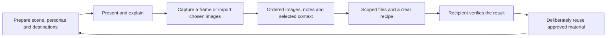

# Product direction: make an explanation useful beyond the moment

Updated 20 September 2026. Proposed investment direction for maintainer review, not a release commitment or an agreement attributed to every contributor. [The product contract](workbench.md) owns implemented behaviour; [the supporting review](research/product-direction-2026-09.md) records evidence, alternatives and experiments. GitHub issues remain the contribution queue.

Workbench should help someone prepare a recognisable workspace, explain software without losing their place, and leave behind material another person or their chosen AI can use. The opportunity is continuity between those steps: the right image, its explanation, the selected context and an explicit next job travel together.

The first customer hypothesis is a Mac-based solution engineer, trainer or technical consultant who repeatedly demonstrates software, sometimes on a phone, then prepares follow-up material. This is a prioritisation hypothesis. We have source review and some acceptance evidence, not weeks of interviews, measured demand or proof of an advantage over competitors.

Dictation, reading, annotation and wallpaper remain useful independent jobs. A person should not have to create a group, scene or AI account to use them. Dependable voice and input recovery remain foundations even when the next product experiment focuses on presenting.

## Three outcomes worth investing in

| Outcome | What a person should be able to do | Why invest next |
| --- | --- | --- |
| Explain with confidence | Prepare once, find the controls, show a phone or browser, mark what matters, and recover from an interruption while the audience sees the intended content. | Existing capabilities need proof as a complete journey. A polished local preview does not establish a good meeting. |
| Hand over useful material | Capture or import images, explain and order them, then give a selected recipient a readable package and a clear task. | Snap & Talk already links images, narration and a reusable `SKILL.md`. Removing transfer and access friction increases the value of that work. |
| Reuse preparation and context | Adapt a scene for another audience and find relevant approved captures without rebuilding or re-explaining everything. | Selected group/scene facts can save work before automatic tagging or generation is needed. |

The proposed reason to choose Workbench is a shorter, more reliable path to an understood explanation and an accepted follow-up artifact. Screenshot controls, semantic filenames and agent integration already exist elsewhere. Demonstrate the benefit against ordinary screenshots plus notes and a short recording.

## Connect existing primitives

This is a proposed journey; its arrows do not claim automatic transfers exist. Static scene export currently has an empty device viewport. Snap & Talk handoff copies instructions and opens an app; it does not grant file access or confirm completion.

| Part and existing owner | Small extension to prove |
| --- | --- |
| Capture/narration: `ReadbackModel` and portable session | Add chosen images through [#60](https://github.com/EthDawg/workbench/issues/60); make template/input/output access unambiguous through [#63](https://github.com/EthDawg/workbench/issues/63). |
| Device/scene: StageKit capture and presentation | A fresh still through [#20](https://github.com/EthDawg/workbench/issues/20), including source freshness and readable output. |
| Prepared groups: persona library and frozen live session | [Copy selected context at capture time #64](https://github.com/EthDawg/workbench/issues/64); a later group change must not relabel earlier material. |
| Drawing/boards: StageKit annotations and renderer | Keep marking fast; tie future semantic notes to the captured image they explain. |
| Prompts/links/files: Saved resources | Reuse existing import review. Try an explicitly chosen shared folder before creating a team service. |
| Voice: separate recognition, refinement and reading pipelines | Measure time to correct usable output before changing a model or default. |

Keep these owners. Do not create a universal project object, global tag graph, generic integration framework or second database to connect the first two callers.

## Known context first, intelligence when it earns its place

For a capture deliberately associated with a scene or prepared group, offer a reviewable context summary: scene, visible persona role and any explicitly chosen group label. Use existing IDs and readable snapshots; omit unavailable values. A group name may be private preparation context, so exported fields need deliberate selection. An imported screenshot does not inherit whichever scene happens to be open.

This removes the need to remember a tagging mode while presenting. It does not explain *why* a screen matters. Keep narration or a typed note as the primary explanation. Inference can suggest a title/tags later, but must not rewrite the original, invent customer facts or turn a suggestion into an authored statement.

1. **Crawl:** deterministic context, readable names, ordering and a portable package. Zero model calls for facts the app knows.
2. **Walk:** an explicit action on selected material, such as suggesting a title, extracting visible text or preparing a background prompt. Preview the result and preserve the source.
3. **Run:** background enrichment or a live agent adapter only after repeated use shows that manual selection/handoff is the costly step. Keep bounded inputs, cancellation, caching and honest failure.

Compare cost per accepted result: operator/correction minutes, retries, service spend, setup and device resources. Report time and money separately. A local model has resource and maintenance costs; a larger coding allowance does not remove review, testing or future support costs.

## A practical two-week sequence

This is a proposed sequence for available effort, not a dated promise. Keep at most two active implementation changes, with one writer per branch. Reserve roughly one third of effort for observing use, acceptance, documentation and repair. This allocation is a planning suggestion, not a measured optimum.

| Sequence | Tangible result | Existing work and gate |
| --- | --- | --- |
| First few days: finish and observe | A three-minute synthetic demo repeated successfully through one real meeting receiver, with discoverable controls and recorded limitations. | Finish active usability [PR #62](https://github.com/EthDawg/workbench/pull/62), then [#29](https://github.com/EthDawg/workbench/issues/29). Preserve the owning branch. Fix consequential failures before broadening the UI. |
| Remainder of week one: complete handoff | A five-screen explanation using Mac and phone images, corrected/reordered, and turned into a checked artifact without the author re-explaining it. | [#60](https://github.com/EthDawg/workbench/issues/60) plus [handoff fix #63](https://github.com/EthDawg/workbench/issues/63). Compare screenshots plus notes and a short recording. Record access failures, clarification, corrections and total time. |
| Week two: reuse what worked | Adapt a scene for a second fictional audience; carry selected context into a capture. Prove a clean live-phone still if that is the next bottleneck. | [Context #64](https://github.com/EthDawg/workbench/issues/64) and [snapshot #20](https://github.com/EthDawg/workbench/issues/20). Trial [background brief #65](https://github.com/EthDawg/workbench/issues/65) manually before adding a control. |
| Bounded evidence work alongside this | A first same-input model report, including failures and correction time. | [#24](https://github.com/EthDawg/workbench/issues/24). Start with current available engines; no model collection or automatic default change. |

The first two outcomes take priority. If they consume the available time, defer scene automation and additional AI actions. Physical acceptance needs suitable devices and a receiver; agents can prepare fixtures/instructions but cannot replace that evidence with simulation. The [review](research/product-direction-2026-09.md#experiments-and-stop-rules) defines tests and stop rules.

Ask target users to show a recent preparation/follow-up task, observe their work, then have another recipient use the result. Publish only consented or synthetic evidence. A small formative trial does not establish product-market fit.

## Keep wider ideas with a reason to revisit them

| Idea | First useful route | Before expanding |
| --- | --- | --- |
| Mobile Snap & Talk | Native screenshot → chosen transfer → Mac Add images, optionally with a typed/dictated explanation. | Repeated friction before a mobile receiver/full session editor. See [research PR #61](https://github.com/EthDawg/workbench/pull/61). |
| Team reuse | Curated copies in an approved shared folder; source/author/why preserved; selected items form a new session. | A second person successfully contributes and recomposes an explanation. Personal CloudKit sync is a different job. |
| Branded preparation | Existing assets/editable overlays and a complete background brief with dimensions, clear space and approved ingredients. | Repeat-use benefit before integrated generation, discovery or brand inheritance. |
| Group starting scenes | Duplicate a scene or explicitly copy a suggestion as [#28](https://github.com/EthDawg/workbench/issues/28) proposes. | Repeated setup pain; no live cross-library inheritance. |
| Personal settings | Durable local profiles and explicit portable settings as [#59](https://github.com/EthDawg/workbench/issues/59) proposes. | Migration safety [#25](https://github.com/EthDawg/workbench/issues/25), then sync demand and paired acceptance. |
| Notes, broader browser orchestration, more engines | Preserve focused issues and native alternatives. | A recurring job simpler primitives cannot complete. [PR #55](https://github.com/EthDawg/workbench/pull/55) already owns browser setup work. |

## Know the ecosystem without expanding the app's surface

Keep six service areas in view: personal input/accessibility, device capture, live presentation, reusable evidence, agent handoff, and managed-workplace compatibility. These are lenses for product decisions, not six new navigation groups or services. The [ecosystem review](research/product-direction-2026-09.md#ecosystem-service-areas-and-boundaries) maps each to its existing owner and a reason to invest further.

The near-term opportunity is to compose with tools people already have: Android through an approved scrcpy setup; Windows content through an approved remote-desktop window; Teams for audience delivery; shared files for reuse; and a skill for the agent's task. Workbench does not currently embed scrcpy, run natively on Windows, control Teams sharing or manage a corporate VPN.

Validate those routes before building adapters. Add MCP when repeated live queries or returning validated results improve the job; add a Teams/Slack integration when a particular meeting or thread needs a repeatable action that ordinary file delivery cannot provide. An enterprise opportunity may emerge around repeatable demo preparation, selected evidence and controlled sharing, but managed deployment, identity, retention and support obligations need an actual organisational use case. There is no enterprise-readiness claim or additional platform commitment here.

## Preserve the value as contributors and agents add code

- State the job, current workaround, one observable improvement and the state owner. Link the decision and issue instead of copying the strategy into every PR.
- Preserve original media and authored text. Freeze inputs/settings per operation; retain old/future-format files safely. A failed write must not erase the only good copy.
- Keep recognition, refinement, generation and delivery separate. The CLI recognises audio; prepared dictation adds cleanup/dictionary/history. Snap & Talk currently uses raw recognition. Evaluate the entry point being changed.
- Extract a shared operation when a second real caller needs it. Microphone, focus, history, permissions and paste decisions stay with their current owners. Portable recipes need no marketplace.
- Maintain one visual language: clear verbs, obvious primary action, compact controls with explicit expansion, predictable Escape/Cancel, keyboard access and native feedback. Test return to the underlying app and receiving share.
- Ground significant UI proposals in a small visual reference: image, original source link, observed pattern, Workbench adaptation and acceptance check. The [compact-controls examples](research/compact-controls-2026-09.md) show this approach using Superwhisper and Wispr Flow; distinguish reference images from implemented Workbench behaviour.
- Reuse the [existing generated studies, artwork and prompts](design-images.md#reuse-the-work-before-generating-again) to explore design language, handoff and collateral. Generate targeted alternatives, preserve the chosen intent and explain material differences in the implementation. Give another assistant the selected decision and approved context, then verify its contribution; image count and provider activity are not evidence of product value.
- Keep the existing canonical contracts: [Mac visual acceptance](../site/handbook/contract.json), [mobile](ios-preview.md), [selected-photo transfer](photo-handoff.md), [interaction behaviour](product-spec.md). Issues track work; dated records track evidence; releases track distribution.
- Distinguish source inspection, automated checks, isolated UI inspection, installed acceptance, real receiver and published distribution. None implies the next.
- Review human and agent contributions by the same standard. Preserve licensing and credit. The [working agreement](../CONTRIBUTING.md#proposed-ethanmatt-working-agreement) remains proposed; this review assigns no other contributor's time or approval.

This updates the 13 September direction. Shared-library import review, selected-text reading and capture recovery now exist; remaining acceptance is not a request to implement them again. Distribution status belongs in the [Preview 4 record](releases/2026-09-20-preview-4.md) and subsequent releases.
