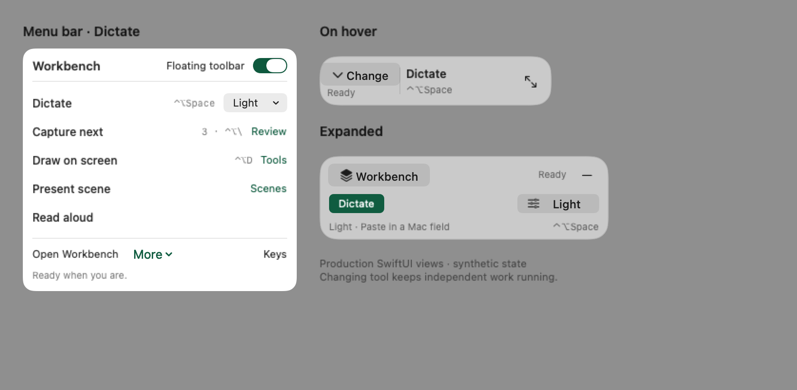
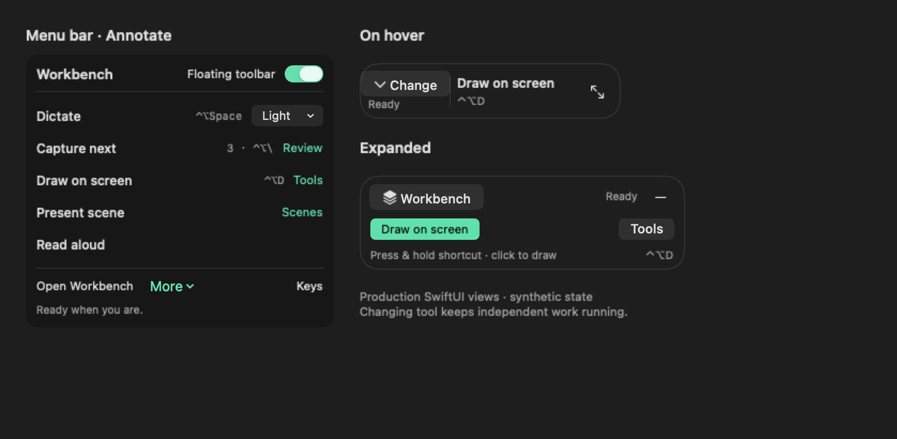

# Compact controls during a continuous presentation

The menu bar offers Dictate, Snap & Talk, Draw, Present and Read directly. Each main action takes one click; active work replaces Start with its own Finish, Done or End action. Secondary controls add a choice or a review surface: text style/destination, capture review, drawing tools, scene selection and shortcuts. There is no icon-only selector strip or six-dot drag grip, including during dictation and narration. The 288pt menu fits its content with 10pt outer padding rather than reserving a fixed 440pt height.

The floating toolbar has two tiers: a resting glyph and one revealed row. Hover reveals the selected tool's primary action and either its current status or configured shortcut. The glyph opens the native menu by click or keyboard, including Change tool, Position and Keep open. Changing controls does not stop independent work. Content determines the row size; it grows inward from any of eight docking positions and honours Reduce Motion. The [floating toolbar contract](floating-toolbar.md) owns the behavior, tests and current gallery.

The snapshots below record the earlier compact menu and capture controls. Their three-tier floating toolbar is superseded by the [current native gallery](assets/floating-toolbar/overview-light-standard.png). All snapshots use synthetic fixtures, not private user content.

The native Annotate menu is available in the application menu bar, the status icon’s right-click menu and the compact Tools action. It refreshes selected tools, ink, boards, undo/redo and actual configured shortcuts each time it opens. Finish Drawing keeps marks and releases input. These menus share the existing annotation owner and shortcut registrations.

A failed audio-only capture offers Retry transcription and Record again. Starting fresh moves the whole prior recovery folder into private Saved recordings before opening a new capture slot. The old WAV stays available for import; the current text draft is unchanged. A failed recognized-text save still blocks new capture until Retry saving succeeds. Invalid imports, changed metadata and unsafe files never silently replace recovery.

## State and ownership

| Activity | Start/change | Finish and preservation |
| --- | --- | --- |
| Device scene | Existing scene selection and presentation guard | End scene ends only the device scene |
| Drawing | Click, held or toggle shortcut; permitted during voice request, recording, transcription and cleanup | Done commits stroke/text, releases input and retains ink/boards; visible boards remain visible |
| Dictation | One microphone owner; snapshot cleanup/destination settings | Save transcript first. While drawing owns input, wait to paste or offer Copy now. Revalidate the original target after release; changed focus falls back to copy |
| Snap & Talk | Existing session and permission flow; count non-deleted captures | Finish narration keeps the session/capture count; review and handoff use existing session records |
| Reading | Existing reading operation | Pause/resume or stop remains separate |

Drawing cannot begin during final text insertion, cancellation, screen acquisition, board export, shortcut practice or shutdown. A changed hotkey registration ends only held drawing, so a missed key-up cannot leave it stuck. `finishDrawing()` is deliberately distinct from Escape/reset. The app no longer calls that reset whenever dictation changes phase. A board mouse click cannot bypass denied drawing admission.

Explicit Copy to clipboard permits capturing a thought without a Mac text field during a live scene. Automatic paste retains the existing Mac target checks and never sends text to a phone. Ordinary dictation waits for Snap & Talk's microphone/transcription queue. Quit cancels waiting insertion while retaining the saved capture.

## Build owners and acceptance

- `WorkbenchControlTool.swift` owns shared action availability, labels and context. `WorkbenchQuickPanel` and `FloatingToolbar` render it; choosing controls is not a global exclusive mode.
- `ToolbarCore` owns the floating toolbar transitions; `ToolbarKit` owns its native row, tracking, clock and animation. `FloatingToolbar` adapts the existing operation owners into a frozen view value.
- `AppModel` and `DrawingDeliveryGate` own saved-transcript delivery waiting. `TextDelivery` retains original-target revalidation, clipboard fallback and insertion reporting.
- `StageKitController` exposes the narrow drawing admission and settled state callback. `AppCoordinator` retains drawing, screenshot, export and practice ownership.
- Existing capture history remains history. Durable notes with titles/categories and importing notes into a Snap & Talk handoff are not implemented by this increment.
- Local automated and native evidence is in [the repair acceptance record](verification/2026-09-22-menu-repair.md) and [the durable toolbar integration](verification/2026-09-23-durable-toolbar.md). Actual microphone + phone + meeting-receiver behavior, physical multi-display movement and VoiceOver remain separate acceptance checks.

A MacBook’s built-in microphone requires an open lid. Workbench uses the current macOS input; an external microphone can be selected in Sound → Input for closed-lid work. This hardware limitation is separate from speech-model readiness. See [Apple Platform Security](https://support.apple.com/guide/security/secbbd20b00b/web).
