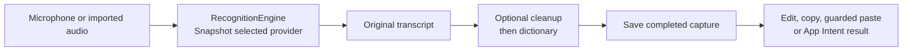

# Workbench implementation map

Workbench 2 combines the existing Voice and StageMark capabilities into one native app. It retains their useful boundaries: speech code owns speech state; StageKit owns drawing and presentation; the app owns lifecycle and shared entry points. This is a map of the current branch, not release or hardware-verification evidence.

## Targets and ownership

| Owner | Responsibility | Entry points |
| --- | --- | --- |
| `LocalVoice` executable target | App shell plus existing voice workflows, reading, cleanup, delivery and resources | `main.swift`, `WorkbenchHome.swift`, `AppModel.swift` |
| `StageKit` library target | Drawing, boards, timer, scene library and device video preview | Public `StageKitController`; internal `AppCoordinator` |
| `RecognitionEngine` actor | Selected recognition provider, preparation and one transcription at a time | `RecognitionProviders.swift` |
| `KeyboardCoachModel` | Combined shortcut catalogue, assignment, conflict feedback and safe practice | `KeyboardCoach.swift`; persistence/suspension closures supplied by the host |
| App Intents | Audio-file transcription returning a typed text result | `Shortcuts.swift` |

The internal Swift module remains `LocalVoice` to preserve App Intents type/metadata compatibility. Packaging names the installed binary `Workbench`, or `WorkbenchPreview` in Preview. StageKit is linked into it; Workbench does not launch a second StageMark process.

`StageKitController` exposes views, actions, lifecycle and shortcut descriptors rather than its internal coordinator. Host callbacks route navigation, hide Home before presenting and coordinate busy state. StageKit must not create another menu-bar item or terminate the app independently.

The two modules still have their own internal `Workbench.swift` style helpers and share the appearance preference domain. They are not identical mirrored files. Keep their appearance consistent through the [product contract](workbench.md); do not extract a larger shared framework without a concrete need.

## Native iPhone and iPad target

`Mobile/Workbench.xcodeproj` contains the separate **WorkbenchMobile** iOS/iPadOS 26+ target, generated by `scripts/mobile-project.py`. Its Preview identity is `com.ethdawg.workbench.mobile.preview`. It uses native SwiftUI/UIKit surfaces, not the Mac shell or a Catalyst target. [The mobile contract](ios-preview.md) owns its feature and evidence boundaries; the remaining Mac architecture in this document is unchanged.

| Mobile owner | Responsibility |
| --- | --- |
| `WorkbenchApp.swift`, `SavedView.swift` | Tools/Saved navigation and reopening local work |
| `MobileDocument.swift`, `MobileStore.swift` | Versioned, validated local manifest, atomic writes and retained original assets |
| `SpeechService.swift`, `ReadingService.swift` | Apple SpeechAnalyzer readiness/recoverable capture and AVSpeechSynthesizer playback/media controls |
| `TextWorkspaces.swift` | Original/editable text, deterministic cleanup, vocabulary and explicit delivery |
| `ImageWorkspace.swift`, `ImageCanvas.swift`, `ImageRendering.swift` | Chosen imports, PencilKit ink, independent wallpaper/backdrop state and PNG rendering |

`TextPrimitives.swift`, `DictationCleanup.swift` and `CorrectionRule.swift` from `Sources/LocalVoice`, plus the shared `Sources/PhotoHandoffKit` and `Sources/SceneSyncKit` files, are compiled into mobile. StageKit, AppKit, Carbon, FluidAudio, Mac model-server configuration and shell-based speech are not linked. Mobile assets and `library.json` live in its own sandbox. The separate SceneSyncKit manifest owns portable editable scenes, with optional same-account private sync. This does not sync transcripts, wallpaper projects or the entire resource library. Explicit selected-photo transfer uses its own account-bound store and transport; [photo-handoff.md](photo-handoff.md) owns that contract. Reuse shares an original asset by explicit choice while each image project owns its crop, ink and composition.

`scripts/test-mobile.sh` runs the native unit/UI targets with disposable Simulator state and prints the result bundle. Simulator tests, unsigned archives, development signing, physical-device acceptance and TestFlight distribution are distinct gates. The [mobile acceptance record](ios-preview.md#acceptance-record) reports the current result for each.

## Native surfaces and operation flow

`AppDelegate` owns the normal window, one status item/popover, menu commands, global voice shortcuts and the embedded StageKit controller. `WorkbenchHome` supplies navigation to Voice views, drawing controls, device scenes, Keyboard, Models and Settings. Opening the app shows Home; closing its window leaves the utility running. Settings uses `SMAppService.mainApp` for optional login launch.

Carbon registers global keys. Local event handling supports app-focused use. The unified coach receives both modules' assignments and suspends both registrations while recording or practising a shortcut. Validation covers duplicates, a deliberate set of common Mac commands and a temporary OS registration probe. Preference updates must retain the previous value on failure. Practice counts complete key-down/key-up pairs, rejects repeats as extra repetitions, and restores registrations on cancellation, selection change, window deactivation or disappearance. Current-layout labels sit on an ANSI drawing; this is not a physical-keyboard detector or another-app shortcut scanner.

Speech flow:

Microphone capture is capped at five minutes; file import at 30 minutes. Very short or effectively silent recordings are rejected. Imported source files are not modified. Each Parakeet request uses a fresh decoder state. A pending hold-to-record permission request cannot later start a stale recording after the key is released.

Automatic paste checks both the original application and accessibility field immediately before delivery, excludes secure fields, and never submits. Captures are saved before delivery. Clipboard restoration requires confirmed insertion and unchanged clipboard ownership; uncertainty leaves the transcript copied for recovery.

The fixed-size, nonactivating `CapturePanel` exposes recording, processing, cancellation, failure and delivery states without displaying transcript text. `AppModel` retains the transcription task and invocation ID, checks cancellation after each asynchronous stage, and keeps the capture gate closed until an engine unwinds. Delivery follows the history commit and is not offered as cancellable. Manual cleanup also guards the draft revision so a delayed result cannot overwrite newer edits.

`TextDelivery.Outcome` distinguishes a successful copy, confirmed insertion and an attempted but unconfirmed paste. `ClipboardReceiptModel` stores only delivery metadata and the clipboard generation returned by Workbench's write. It checks that generation while a receipt exists, clears stale cues when another copy occurs, and never reads unrelated clipboard text. Automatic receipts expire after eight seconds for copy or four for confirmed paste; still-current clipboard metadata remains in quick controls. Pinning extends the HUD until dismissal or clipboard change. A typed paste-attempt flag prevents duplicate-paste suggestions. The menu-bar icon exposes current readiness after the floating receipt hides.

`PresentationControlsPolicy` starts collapsed and opens only by click or Command-Slash. Escape closes expanded controls first, then ends the presentation on a later press. Source closes the controls before opening its sheet. `FloatingControlGeometry` shares eight anchors, clamping and snap detection with the recording HUD; each job persists its own placement. `CaptureSettings` freezes cleanup configuration, replacements and delivery preferences before recording or file processing. Text refinement is separate from speech recognition and configured in Models. Reduce Motion and Reduce Transparency are honoured. Beginning a StageKit interaction dismisses any voice receipt HUD. Window layering is not a guarantee of exclusion from a screen share. See the [interaction specification](product-spec.md).

## Replaceable recognition and reading

`RecognitionEngine` snapshots configuration per request, prevents concurrent transcription, and rejects configuration changes during preparation/transcription. The UI disables model changes while the voice workflow is busy. Provider changes release unused in-memory Parakeet state but retain its downloaded cache.

- **Parakeet:** FluidAudio 0.15.6 supplies Parakeet TDT v2 through Core ML. Model preparation downloads/loads the English model when needed. This path needs no background server.
- **Local model server:** a user-managed OpenAI-compatible audio transcription endpoint. Only exact loopback hosts are allowed; `localhost` is normalised to `127.0.0.1`. Requests use bounded multipart audio upload and require a JSON `text` result. Redirects, credentials in URLs, cookies, persistent cache and configured proxies are excluded. A validated configuration is only “connection checked on use.” Workbench does not install the server, accept arbitrary model files or guarantee that server's own data handling.

There is no fallback from one provider to another. Add an explicit `RecognitionProvider` case and engine dispatch when a new runtime has a clear setup, input, cancellation and availability contract. Do not duplicate recording, history, hotkeys or cleanup inside the adapter. [Provider documentation](model-providers.md) defines limits and tests.

Reading remains separate from recognition. Mac voices use `/usr/bin/say` with an argument array and a temporary UTF-8 input file, `AVAudioPlayer` for playback and `/usr/bin/afconvert` for M4A export. User text is not interpolated into shell commands. Optional Speko reading uses an explicit Keychain-backed key and sends submitted text online; it is not a transcription provider. New reading backends should preserve the same playback/export and explicit-consent boundaries.

Cleanup offers Original, deterministic Light, and optional Natural editing through Apple FoundationModels where available. Natural candidates are checked for ordered factual tokens, numbers and negation; rejected/unavailable edits fall back to Light. These guards reduce specific risks, not prove equivalent meaning. The unedited text stays available.

## Device presentation and Apple integrations

StageKit's `DemoCapture` uses AVFoundation external-device discovery and a video-only capture session. It drives a preview layer in a saved scene and handles source changes/reconnects. No microphone or movie-recording output is attached. Ending the presentation stops the session and releases its keep-awake assertion. Actual iPhone/iPad availability and disconnect/recovery behaviour depend on hardware and OS testing.

`NativePresentationApps` resolves and opens installed QuickTime Player or iPhone Mirroring using `NSWorkspace`. It does not embed, automate or capture those apps. A meeting app can share the selected Workbench or Apple window. A successful launch is not proof of device connection or a successful meeting share.

`TranscribeWithWorkbench` is the existing App Intent. Apple Shortcuts owns `Record Audio`; the intent accepts audio and returns that invocation's text through the normal voice pipeline. It never starts the microphone, copies or submits the result. Full Xcode metadata extraction and native discovery need package-level testing. The final live recording composition must be verified separately from synthetic invocation checks; [earlier integration notes](voice-integrations.md) are historical evidence for the previous Voice version.

No Services implementation, Share extension, private iPhone Mirroring integration or general app-automation bridge is added by this consolidation. Those are future adapters only if a useful workflow justifies them. Windows portability is likewise a future design decision: isolate platform-facing code, but do not promise portability for AppKit, AVFoundation device capture, Carbon or App Intents.

## Saved state and migration

| Data | Unified Preview location / owner |
| --- | --- |
| Voice session and resources | `Application Support/Workbench Preview/LocalVoice/state.json` and `demo-library.json` |
| Presentation boards/scenes/assets | `Application Support/Workbench Preview/StageMark` |
| Voice/model preferences | Current app defaults; recognition key `workbench.recognition.configuration.v1` |
| Stage preferences | `com.ethdawg.workbench.preview.stage` defaults suite |
| Appearance | Shared `com.ethdawg.workbench.preview` suite |
| Speko key | Keychain service derived from the current bundle ID; not copied from a legacy app |

Non-Preview files use `Application Support/Workbench`; identity and preference domains drop the `.preview` suffix.

The unified Preview prefers a legacy Preview data source, then legacy production, when its destination component is absent. Voice copies supported session/library files and selected shortcut preferences. StageKit copies supported preferences, boards and scenes/assets. Imports stage a complete directory before moving it into place. The StageKit copy refuses symbolic links and excludes a legacy desktop-recovery manifest, which could otherwise refer to a different current desktop arrangement. Existing unified data and the original checkouts/app data are not overwritten.

This is one-time migration, not ongoing synchronization or a rollback of user data. Verify sample originals, history, scene assets and keyboard settings in the installed package. A previous app archive does not back up the evolving unified data. Do not reset TCC, move established installed paths or delete session files as a release workaround.

## Verification and release boundaries

`bash scripts/test.sh` composes release-tool regressions, voice/core/library/cleanup/integration/keyboard checks, provider checks and the StageKit harness. `scripts/test-stage.sh --ci` compiles the StageKit tests separately. Provider transport checks exercise a synthetic loopback server; they do not establish transcription quality or compatibility of a real model server.

`--self-test` uses synthetic Mac speech, the selected recognizer and an M4A round-trip. `--check-input` covers global registration and release behaviour. Live keyboard practice, microphone permission/cancellation, exact-field paste, window focus, physical-device connection, meeting sharing and signed-package migration need their own runtime evidence.

The ordinary build is ad-hoc. `scripts/build.sh --preview` re-signs a distinct Preview archive with Developer ID; `scripts/install.sh` installs it and preserves the previous app ZIP. Neither operation notarizes, publishes, or runs the live acceptance checklist. Full Xcode metadata is enforced by `REQUIRE_APP_INTENTS=1` during packaging. [The current acceptance record](unification.md) and the release's own notes must identify what actually passed.

Source provenance is in [consolidation-source.md](consolidation-source.md). The original MIT license and upstream component attribution remain in [README](../README.md#credits-and-license). App Store work is separate and is not updated by this consolidation documentation.

## Portable personal scenes

[The personal scene contract](research/personal-scenes.md) owns the shared model and migration/sync rules. SceneSyncKit separates local commits and portable packages from its CloudKit transport; Mac adapts that model to StageKit while iOS renders it natively. Explicit imports create independent scene IDs, and active presentations use frozen copies. The shared test suite runs both photo and scene targets in CI.

## Gentle photograph motion

`SceneSyncKit/GentlePhotoMotion.swift` supplies compositor parameters and a pure eligibility predicate to both native targets. The optional `gentleMotion` scene field preserves legacy still defaults and travels in existing local/portable scene records. No new asset type or cloud service is involved.

`MovingSceneView` separates the Mac photograph layer from stationary foreground artwork and device video. `DesktopMotionController` owns one explicitly started desktop window, independent of a presentation. `SceneMotionPreview` implements the matching iOS photograph layer; editor playback is transient and galleries/export stay still. The [implementation record](gentle-motion.md) explains lifecycle and validation; the structured visual contract and mobile specification retain capability authority.

The [authored ambient starters](research/ambient-scenes.md) extend those hosts with `SceneSyncKit/AmbientPhotoLayer.swift`. A versioned, allowlisted `SceneAmbience` recipe references an immutable clean plate and transparent detail; its complete poster remains the static fallback and export image. Both targets use the same native layer geometry and still compositor. Rig-bearing libraries/packages use scene format v2, preserve exact pre-migration backups and reject unsupported recipes. This adds no new cloud transport, background service or media runtime. Ordinary photos retain the separate gentle-scale option; authored rigs never combine with whole-photo zoom.

## Prepared Mac overlay sessions

`PersonaLibrary` remains the saved asset/group owner. `PersonaSessionController` in `PersonaSession.swift` owns one bounded live snapshot and a window controller per placed instance. `PersonaHUDController` receives sanitized value state and ID-based actions, never private library/group names. `PersonaPresentationPreparation` owns an explicit draft and saves through the existing archive; v3 preserves an exact pre-upgrade manifest. The shell exposes the same actions through the existing StageKit shortcut catalogue and menu panel. No browser DOM, tab or URL tracking is involved. The [persona contract](personas.md) owns lifecycle, compatibility and verification.
