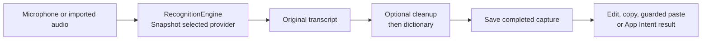

# Workbench implementation map

Workbench 2 combines the existing Voice and StageMark capabilities into one native app. It retains their useful boundaries: speech code owns speech state; StageKit owns drawing and presentation; the app owns lifecycle and shared entry points. This is a map of the current branch, not release or hardware-verification evidence.

## Targets and ownership

| Owner | Responsibility | Entry points |
| --- | --- | --- |
| `ToolbarKit` library target | Native toolbar session, production row and compact mark, tool chooser view, pointer tracking, content placement and window animation | `ToolbarSession.swift`, `ToolbarRow.swift`, `ToolbarChooserView.swift`, `ToolbarTrackingView.swift`, `ToolbarGeometry.swift`, `ToolbarWindowMotion.swift`, `ToolbarViewport.swift` |
| `ToolbarCore` library target | When the floating toolbar shows what, the remembered open/closed choice, the next action, the compact status, the chooser's keyboard and the press latch. No AppKit, no clock, no window | `ToolbarMachine.swift`, `ToolbarNextAction.swift`, `ToolbarStatus.swift`, `ToolbarChooser.swift`; the behaviour is owned by [floating-toolbar.md](floating-toolbar.md) |
| `LocalVoice` executable target | App shell plus existing voice workflows, reading, cleanup, delivery and resources | `main.swift`, `WorkbenchHome.swift`, `AppModel.swift` |
| `StageKit` library target | Drawing, boards, timer, scene library and device video preview | Public `StageKitController`; internal `AppCoordinator` |
| `StageKit/WorkbenchPalette.swift` | The adaptive Mac brand accent shared by Voice, StageKit and toolbar fixtures | `WorkbenchPalette.accent`; ToolbarKit accepts the colour as a value |
| `VoiceAppearance` library target | Shared voice states and brightness, with a fast input response for the recording trace and a calmer speaker response for Persona. `VoiceWave` carries the trace's level outward from its middle; `VoiceSpectrum` holds the bands Persona's ring draws as bars, playing a microphone buffer's frames in turn. The trace's input meter includes usable soft audio; the ring rests more quietly. No microphone, analysis or setting; each owner feeds it samples | `VoiceEnvelope.swift`, `VoiceStyle.swift`, `VoiceWave.swift`, `VoiceSpectrum.swift`, `VoiceTrace.swift`; StageKit and ToolbarKit depend on it |
| `RecognitionEngine` actor | Selected recognition provider, preparation and one transcription at a time | `RecognitionProviders.swift` |
| `ReadbackModel` | Snap & Talk pointer-display capture, narration, portable session manifests, recovery and sequential transcription | `ReadbackModel.swift`, `ReadbackView.swift` |
| `SnapModel` / `SnapStore` | Canonical Snap capture, editable originals, metadata, reversible archive and selected snapshots | `SnapCapture.swift`, `SnapCaptureHost.swift`, `SnapRendering.swift`, `SnapEditorView.swift`, `ImageWorkspaceEditing.swift`, `ImageWorkspaceCanvas.swift`, `CaptureImagePreview.swift`, `SnapWorkspaceView.swift`; [Snap contract](snap.md) |
| `SnapReadback` | Copy selected Snap evidence into compatible portable narrated sections, retaining source identity and deduplicating repeats | `SnapReadback.swift`; `ReadbackModel.onSaveCapturedSnap` routes new narrated captures through `SnapModel` |
| `WorkbenchHistoryModel` | Transcript metadata/search and one shared selection of typed transcript/Snap UUID references. On-device suggestions fill empty names and tags for review, never purpose, and need no account | `WorkbenchHistory.swift`, `HistorySelectionControls.swift`, `CaptureHistoryView.swift`, `LocalDetailSuggestions.swift`; the History page is `HistoryView.swift` |
| `HandoffJobsModel` | Explicit reviewed snapshots, private staging, receipts, retry and results, plus a cached, read-only listing of each task's frozen inputs for History | `HandoffJobs.swift`, `HandoffSessionEvidence.swift`, `SubscriptionCLI.swift` |
| `MeetingModel` | Default-off offers from Mac audio-activity metadata, explicit sources/start, retained recordings, segmented recognition and confirmed completed-recording removal | `MeetingDetection.swift`, `MeetingAudio.swift`, `MeetingModels.swift`, `MeetingRecovery.swift`, `MeetingTranscriptRemoval.swift`, `MeetingWorkspaceView.swift`; installed acceptance remains separate |
| `KeyboardCoachModel` | Combined shortcut catalogue, assignment, conflict feedback and safe practice | `KeyboardCoach.swift`; persistence/suspension closures supplied by the host |
| App Intents | Audio-file transcription returning a typed text result | `Shortcuts.swift` |
| macOS Services | Explicit selected text into a reviewable reading draft | `ReadSelectionService.swift`; declaration in `scripts/Info.plist` |
| `PresenterKit` / `PresenterModel` | Typed Chrome routing protocol; the existing Library remains authoritative | `PresenterProtocol.swift`, `PresenterSocket.swift`, `PresenterBridge.swift` |
| Chrome/native adapters | Profile-scoped tab targeting, framed transport, transient native picker | `BrowserExtension/`, `WorkbenchBrowserHost`, `PresenterPanel.swift` |

The internal Swift module remains `LocalVoice` to preserve App Intents type/metadata compatibility. Packaging names the installed binary `Workbench`, or `WorkbenchPreview` in Preview. StageKit is linked into it; Workbench does not launch a second StageMark process.

`StageKitController` exposes views, actions, lifecycle and shortcut descriptors rather than its internal coordinator. Host callbacks route navigation, hide Home before presenting and coordinate busy state. StageKit must not create another menu-bar item or terminate the app independently. Embedded, the shared toolbar is Workbench's one drawing control surface, so the Draw page leaves out the standalone app's floating-palette settings (Show the palette while drawing, Board palette); their stored values stay for the standalone app.

The two modules still have their own internal `Workbench.swift` style helpers and share the appearance preference domain. They are not identical mirrored files. Keep their appearance consistent through the [product contract](workbench.md); do not extract a larger shared framework without a concrete need.

## Chrome destination adapter

The [presenter contract](presenter-direction.md#state-and-security-boundaries) owns Chrome/native routing. `DemoResource.browserTarget` is optional and machine-local; imported and exported libraries strip it. No mobile or SceneSyncKit source depends on PresenterKit. The bundled host has no state or command authority of its own; it forwards bounded native-messaging frames over a current-user Unix socket to the app. Each browser installation owns its UUID, site grants and temporary tab bindings. The app owns conflict/error handling and the existing keyboard catalogue owns Switch to. No network listener, Accessibility permission or backend is added.

## Native iPhone and iPad target

`Mobile/Workbench.xcodeproj` contains the separate **WorkbenchMobile** iOS/iPadOS 26+ target, generated by `scripts/mobile-project.py`. Its Preview identity is `com.ethdawg.workbench.mobile.preview`. It uses native SwiftUI/UIKit surfaces, not the Mac shell or a Catalyst target. [The mobile contract](ios-preview.md) owns its feature and evidence boundaries; the remaining Mac architecture in this document is unchanged.

| Mobile owner | Responsibility |
| --- | --- |
| `WorkbenchApp.swift`, `SavedView.swift` | Tools/Saved navigation and reopening local work |
| `MobileDocument.swift`, `MobileStore.swift` | Versioned, validated local manifest, atomic writes and retained original assets |
| `SpeechService.swift`, `ReadingService.swift` | Apple SpeechAnalyzer readiness/recoverable capture and AVSpeechSynthesizer playback/media controls |
| `TextWorkspaces.swift` | Original/editable text, deterministic cleanup, vocabulary and explicit delivery |
| `ImageWorkspace.swift`, `ImageCanvas.swift`, `ImageRendering.swift` | Chosen imports, PencilKit ink, independent wallpaper/backdrop state and PNG rendering |

`TextPrimitives.swift`, `DictationCleanup.swift` and `CorrectionRule.swift` from `Sources/LocalVoice`, plus the shared `Sources/PhotoHandoffKit` and `Sources/SceneSyncKit` files, are compiled into mobile. StageKit, AppKit, Carbon, FluidAudio, Mac model-server configuration and shell-based speech are not linked. Mobile assets and `library.json` live in its own sandbox. The separate SceneSyncKit manifest owns portable editable scenes, with optional same-account private sync. This does not sync transcripts, wallpaper projects or the entire resource library. Explicit selected-photo transfer uses its own account-bound store and transport; [photo-handoff.md](photo-handoff.md) owns that contract. Reuse shares an original asset by explicit choice while each image project owns its crop, ink and composition.

`scripts/test-mobile.sh` runs the native unit/UI targets with disposable Simulator state and prints the result bundle. Simulator tests, unsigned archives, development signing, physical-device acceptance and TestFlight distribution are distinct gates. The [mobile acceptance record](ios-preview.md#acceptance-record) reports the current result for each.

## Native surfaces and operation flow

`WorkbenchQuickPanel` owns fixed utility actions and the receipt/editor well. `WorkbenchControlState` projects each capability’s own facts for its panel row and Home’s Persona control; its full `live` state still feeds the toolbar’s global action priority. A row’s title, enabled state, active symbol and dispatched operation agree. The row keeps the rendered operation as its button identity and checks it against the current owners before dispatch, so an obsolete ending cannot become a new start. Its header's `PanelSwitch` is the Floating toolbar switch: an AppKit row whose words and full 32 point height toggle the native switch, which is the row's one accessibility element; the words take the header's text scale, and the row grows with them. Its `PanelRecoveryRow` shows the first sentence of an error or notice with a door to the page that shows it in full. The page is recorded with the problem where it is raised: `AppModel.report(_:on:)` keeps an `Attention` (message and `Attention.Page`), and StageKit's coordinator and settings store post a `StageNotice` with its `StageNoticePage`, which `StageKitController.noticePage` returns with the notice; persona and scene notices belong to their own pages. Nothing reads the words to choose a door. `KeyboardCoachModel` remains the only shortcut editor and conflict checker. NSPopover keeps the panel's SwiftUI content alive between visits and never delivers `onDisappear`, so `PanelShortcutEditor` holds the well's editor for one visit and `AppDelegate` ends it whenever the popover opens or closes; `PanelLeaveWatch` closes the panel on a mouse press in another app or when Workbench resigns active (`QuickPanelLifecycle.swift`). `PromptInsertionRunner` checks exact destination snapshots around every selected-text write and before the guarded `TextDelivery` paste fallback; its native adapter owns cancellation and temporary Escape monitors. `PromptPickerController` owns the one transient Saved Prompts panel: `PromptPickerList` freezes the prompts saved in Library, `PromptPickerLayout` bounds its width and placement, and `PromptPickerAction` inserts or copies only after the panel has closed, when `PromptFieldReturn` waits up to about a second for the frozen field to be in front again. The panel is sized from its content's `onGeometryChange` report. `PromptPickerChecks` covers them without a window; the surface gallery renders the picker's states and opens the production panel invisibly to check it is the size of its content. `DemoPresentation.makeControlsMenu()` and `PersonaLibrary.makeControlsMenu()` return native snapshots to the shared toolbar while their existing controllers retain lifecycle ownership. `StageKitController.personasView` exposes independent preparation; `onOpenPersonas` delegates navigation to the host. Scene-specific persona selection keeps its own sheet.

AppDelegate owns the normal window, status panel, commands, global voice shortcuts and embedded StageKit controller. WorkbenchHome owns the single page record and the Voice, Screen and Saved sidebar groups. Its destination resolver retains section routes for Library (Resources, Packs, From iPhone) and Settings (General, Keyboard, Models, Connections); Your dictionary belongs to Dictate, while Meetings now has its own sidebar destination. WorkbenchPageHeader reads names and symbols from that record. WorkbenchDesktopChrome owns shared hover/selection styling, the finite greeting and SidebarMetrics, the one icon column both sidebar widths share, whose names lay out at their expanded width and fade; the surface gallery fails if collapsing moves the toggle or any icon. SidebarHintTarget reports pointer entry/exit and the window draws collapsed hints outside the scrolling list. HomeJourney orders the first-use, current-work and recent-work sections; the four Home workspace cards only change the route. HomeRecentWork projects History All’s newest five through HistoryList and HistoryRowsCache. HistoryDoor targets one transcript without selecting it or replacing the Dictate draft. ContentView owns the Dictate settings and Read Voice & pace sheets; a PageFocusRequest for dictateOptions opens the same Dictate sheet once and consumes the request. The sheet is independently scrollable with Done and Escape dismissal. Persistent preferences retain their existing owners. LocalPersonaProfileView remains the Home Me control, backed by the existing Persona ID preference. The founder introduction appears only in Settings. Opening the app shows Home; closing its window leaves independent work running. Settings uses SMAppService.mainApp for optional login launch.

Meetings uses the existing MeetingModel and immutable transcript UUID. completedTranscriptID is published only after transcript and completion-journal commits; the completion card opens History through a typed HistoryDoor. New recording/retry clears the previous link. Successful History removal clears a matching link after its commit, while failed removal retains the transcript, audio and link. Choosing Microphone only explicitly enables that source before Start; changing sources never starts recording and is refused while capture is busy.

The portable studies in [docs/experience](experience/index.html) use synthetic state and scenario fragments. They are review tools, with no connection to app data, permissions, recording or provider calls. SurfaceGallery renders the actual SwiftUI pages and sheets under isolated preferences for implementation evidence.

`CapturePanelController` also owns the persistent floating toolbar, its saved position and the tool chooser's nonactivating panel (`ToolbarChooserPanel.swift`). `FloatingToolbarSurface` selects contextual tools, compact dictation/reading, narration or a temporary screenshot hide without changing the saved floating-toolbar preference (`AppModel.floatingToolbarVisible`, which the panel's and Settings' switches, Window's Show or Hide floating toolbar and the toolbar's Hide toolbar all change); Hide toolbar hides the tools in every mode, while recording, reading and narration keep their own controls. Dictation captures the current Mac target at the toolbar click. Snap & Talk reuses this panel instead of creating a second recording window. A square template status icon is explicitly visible on launch; Window commands recover toolbar access when the menu bar is crowded. Debug QA bundles can provide a bounded temporary `WorkbenchFixtureRoot` to exercise these actual surfaces without using Preview/production storage; release builds ignore it.

The floating toolbar placement owner retains optional edge/fraction/display data in its existing free-position record. `ToolbarEdgePlacement` supplies one drag preview/release result, with whole-edge attachment and corner/centre attraction. `ToolbarGeometry` and the row share horizontal top/bottom/free/corner layouts and vertical side columns. Attached outside edges keep an eight-point inset, with centred expansion along an edge and inward growth at corners. `ToolbarWindowMotion` uses one cancellable frame clock through resizing and orientation changes. `CaptureHUDControls` rejects measurements from an old orientation, keeps result-card sizes separate and shares prospective accessory fitting with the snap guide. `ToolbarHintController` uses one stable rail, inboard at side edges, and suppresses hints during movement. Chooser, prompt, Position and native options panels also open inboard of side columns. Native controls remain disabled until the row fits its host. Named docks keep display affinity alongside their legacy placement. The collapsed target uses one 8-bit alpha step for WindowServer hit routing, with no stacked fills or native shadow.

Carbon registers global keys. Local event handling supports app-focused use. The unified coach receives both modules' assignments and suspends both registrations while recording or practising a shortcut. Validation covers duplicates, a deliberate set of common Mac commands and a temporary OS registration probe. Preference updates must retain the previous value on failure. Practice counts complete key-down/key-up pairs, rejects repeats as extra repetitions, and restores registrations on cancellation, selection change, window deactivation or disappearance. Recording and practice also end when the app resigns active or a menu begins tracking. Current-layout labels sit on an ANSI drawing; this is not a physical-keyboard detector or another-app shortcut scanner.

Snap & Talk has its own editable shortcut. A first press captures only the display containing the pointer through ScreenCaptureKit, with the pointer included, before starting AVFoundation microphone recording. A second press commits the WAV into the user-chosen session folder and queues it through the shared recognition engine. Screenshots and audio commit before transcription, so another section can begin while recognition proceeds sequentially. Interrupted recordings remain visible as unfinished sections; queued work resumes from saved audio after relaunch. The manifest owns ordering, while UUID directories keep reordering non-destructive. `ReadbackOrdering.swift` presents a compact native table with same-table, single-use drag tokens and insertion feedback. Its draft order is separate from storage until Save; `saveSectionOrder` verifies the original active IDs/order and merges the chosen permutation into the latest section records. Cancel and hover never write. Replacement archives prior media inside the section, and deletion moves the whole section into the session's `trash` directory until explicitly emptied. Its handoff menu writes only a task prompt to the clipboard, reveals the local folder and opens a chosen installed AI app; the user still grants folder access and submits the prompt, so Workbench never silently uploads session media.

Speech flow:

```mermaid
flowchart LR
    Input["Microphone or imported audio"] --> Engine["RecognitionEngine<br/>Snapshot selected provider"]
    Engine --> Original["Original transcript"]
    Original --> Cleanup["Optional cleanup<br/>then dictionary"]
    Cleanup --> History["Save completed capture"]
    History --> Output["Edit, copy, guarded paste<br/>or App Intent result"]
```

Microphone capture is capped at five minutes; file import at 30 minutes. Very short or effectively silent recordings are rejected as routine, not as failures (see below). Imported source files are not modified. Failed audio-only recovery can be retained under LocalVoice/SavedRecordings through an atomic same-volume directory move before a fresh recording; recognized-text save failures retain the single-slot guard. The source file for an import is validated before releasing recovery, and selecting the current recovery invokes its owned retry. Each Parakeet request uses a fresh decoder state. A pending hold-to-record permission request cannot later start a stale recording after the key is released.

Automatic paste checks both the original application and accessibility field immediately before delivery, excludes secure fields, and never submits. Rich-text focus resolves only to its nearest editable ancestor; a different field or app is rejected. Supported Electron accessibility trees are enabled only when the application explicitly reports its documented attribute as false. `OpaqueEditorDestination` handles only Sublime Text's observed focused-standard-window shape. Dictation arms its bounded input, application-activation and window/focus observation; an observed change invalidates the captured destination permanently, and idle, cancellation or delivery releases the monitors. Saved Prompts and other unreadable apps do not use it. It sends once and reports Sent to Sublime Text · still copied, without claiming confirmed insertion or creating a recurring unresolved-delivery warning. Scrolling does not invalidate the target; edits, clicks, app changes and timed-out snapshots do. Confirmation reads string, attributed or range text and polls for at most 1.2 seconds after one PID-directed paste; it never retries insertion. Exact text and selection checks cover repeated text and delayed updates. `TextDelivery.System` supplies Accessibility trust, field eligibility, the pasteboard and the ⌘V poster; `TextDeliveryChecks` runs the unapproved path on an isolated pasteboard and asserts one copy with no paste events. `AccessibilitySetup` asks macOS for approval on every click, which shows macOS's request only once and relists Workbench after a reset. It opens System Settings at once, except on a first click while Workbench is in front, when it waits for a request to take focus and opens Settings only if none did; the voice preferences record that first request. `AccessibilitySetupChecks` covers that route with injected effects, including the resign-active signal, and never touches TCC. Captures are saved before delivery. Clipboard restoration requires confirmed insertion and unchanged clipboard ownership; uncertainty leaves the transcript copied for recovery. `AccessibilityBridge` is the one door to the Accessibility framework's element reads, writes and observers; every `AXUIElement*` and `AXObserver*` call is made there, in place on the calling thread, keeping each budget's own messaging timeout and Apple's default for elements without one, because that IPC logs no AXCommon fault in any context (`docs/verification/2026-10-06-ax-bridge/`). The voice listings, which do fault from a Swift task's thread, stay in `MacVoiceCatalog` under its own rule. `scripts/check-accessibility-bridge.py` fails the harness phase when an element call appears outside the bridge, a voice listing outside `ReadingVoices.swift`, or either inside a `Task` closure there.

The nonactivating `CapturePanel` carries recording, processing, cancellation, failure and delivery states in the toolbar's own host without displaying transcript text (#134 T4): at rest only recording adds a dot and voice trace to the icon-free pill. The expanded row retains a fixed Switch tool icon, a separate recording signal and the next action with Cancel in the owning chooser row. Technical failures retain their recovery view (`FloatingResultView`); copied delivery uses a brief `ClipboardCueHUD` and confirmed insertion stays quiet. A dictation that hears no speech (a tap, silence, a sound that is not speech, or speech that came back as no words) is routine, not a failure: `AppModel.endWithoutSpeech` publishes a `CaptureCue`, which shows "No speech heard" and one short hint at the toolbar's place. `CaptureCueClock` lets it go after 1.6 s that the person is not holding it by hover or VoiceOver focus, VoiceOver hears the same words, and any recording of our own stays in capture recovery for Retry. Failures (microphone permission or start, the engine or provider, saving and recovered recordings) keep the explicit 480 × 128 recovery view, available when the toolbar is revealed. A reading that stopped because its audio could not be read keeps its reason, Retry and dismiss in the same way until one is chosen.

Brief feedback shares one lifetime (#134 T5). `NoticeLifetime` counts seconds of visible, unheld time on a monotonic clock (`ProcessInfo.systemUptime`, the timebase of NSEvent and Carbon key events), tied to one event ID: `present` starts it once, pointer, focus, menu and pin holds pause the same remaining value, and `NoticeExpiry` wakes its owner, which ends the notice only if it is still that event and due. Views read a lifetime to draw a countdown ring and report holds; they never start or end it. `FeedbackCoachModel` owns the one coaching card: `request` asks only for a lesson not yet retired in `CoachTips` (the edition's own preferences) and only while the host's `canPresent` says it can be shown; the host shows `CoachCardView`, then calls `didPresent` (which starts the four seconds, retires the lesson and announces it once) or `drop`, which runs the owner's fallback so the gesture still gets its ordinary feedback. `PointerPresence` reports a pointer already resting where a notice appears, which SwiftUI hover misses until the pointer moves, so the card and the receipt HUD start held. New dictation, teardown, sleep and lock remove it. The first lesson is the hold gesture: `VoiceHotkeys` carries each Carbon or NSEvent key timestamp to `AppModel.shortcutChanged`, which times the press that began a Hold attempt as a `HoldGesture`; `stopRecording` asks `HoldLesson.teaches` only after the recorder ran, and a successful hold retires the lesson. `UnresolvedDeliverySlot` keeps one `UnresolvedDelivery` (a failed copy, an unconfirmed paste, a stopped delivery or nothing pasted) in `AppModel`, naming the transcript in History or the draft revision it came from, never the words. `AppModel` hands it `DeliveryRecords` (History and the draft as they are) at each step: a delivered outcome resolves it only when its text equals the record's words now, a draft entry acts only while `draftRevision` is unchanged, `removeTranscript` drops an entry naming that transcript, and every `SavedState` write carries it (optional, so older state decodes, and dropped if a later build's kind cannot be read) only while what is written still holds its words. Launch restores it after capture recovery has settled the draft. The receipt's `clear()` on a new or retried capture and at teardown only ends presentation. `LocalConfirmation` gives `KeyboardCoachModel` and `SnapModel` their four-second ✓ confirmations, classified where the save or export succeeded and announced once through `FeedbackAnnouncement`, which only the running app posts. `AppModel` retains the transcription task and invocation ID, checks cancellation after each asynchronous stage, and keeps the capture gate closed until an engine unwinds. Delivery follows the history commit and is not offered as cancellable. Manual cleanup also guards the draft revision so a delayed result cannot overwrite newer edits.

`TextDelivery.Outcome` distinguishes a successful copy, confirmed insertion and an attempted but unconfirmed paste, and why a copy was not pasted: no Accessibility approval, a changed field or an unreadable one. `ClipboardReceiptModel` stores only delivery metadata and the clipboard generation returned by Workbench's write. It checks that generation while a receipt exists, clears stale cues when another copy occurs, and never reads unrelated clipboard text. Confirmed insertion stays quiet. A copied fallback shows a three-second two-line cue with no Review, pin, word count, dismiss button or countdown. Hover or VoiceOver can hold it for reading. Expiry hides only the cue; still-current clipboard metadata remains in quick controls. A typed paste-attempt flag prevents duplicate-paste suggestions. Saved delivery recovery remains with its owner after the floating cue hides.

Image viewing and editing share the controller described under [Snap, selected history and explicit assistant tasks](#snap-selected-history-and-explicit-assistant-tasks). Its window follows Home during capture; closing Home preserves an open editing draft in its own window.

`WorkbenchHome` presents Library image preparation using immutable bytes and the existing StageKit scene or Persona editor. History and Snap & Talk call `saveCapturedImageToLibrary` with the explicitly chosen image item. That adapter never reads the shared preview’s suspended Snap editor. It verifies the exported file before the Library reference commits, and reports cancellation or partial failure without inventing success. History’s session door opens `ReadbackView` on its existing Sessions sheet; merely opening that picker never reloads the session.

Library resources keep references to original local files. Supported raster images open in the shared image workspace, which holds file access only while reading the image bytes. Other supported formats keep the native `QLPreviewView` route, including SVG. That preview holds its security-scoped access lease until it closes, its resource is removed, the Library view disappears, or Home hides, closes or minimizes. Missing, executable and unsupported inputs are rejected. Search and selection remain owned by the Library.

`DemoLibraryModel.prepareImage` freezes one supported local image with a bounded read while its existing file-access lease is held. Moved or stale references require Locate file; preparation never refreshes a reference or saves an asset. `StageKitController.backdropReplacementView(imageData:title:)` passes the validated snapshot into the existing scene replacement transaction, or explicit first-scene creation when the scene library is empty. `personaImportView(imageData:title:)` uses `PersonaImageImportView` to hold the existing portrait editor session. Cancel writes nothing, and preparing or saving leaves live presentation and Persona copies with their existing owners. `DemoLibraryModel.saveImageToLibrary` exports the supplied rendered PNG to a chosen file, verifies its exact bytes, then saves a bookmarked file reference through the existing Library transaction. An export followed by a Library conflict keeps the file and reports that partial result; no internal Snap or session file becomes a resource implicitly.

`PresentationControlsPolicy` starts collapsed and opens only by click or Command-Slash. Escape closes expanded controls first, then ends the presentation on a later press. Source closes the controls before opening its sheet. `FloatingControlGeometry` shares eight anchors, clamping and snap detection with the recording HUD; each job persists its own placement. The break timer stores only its normalized free position or named anchor plus display identity in `break-timer-placement.json`; countdown state and appearance remain separate. `TimerTransport` is the countdown's one next action for the Draw page, quick controls, Timer menu, floating timer and the toolbar’s activity chooser: Pause and Resume act only on a started countdown with time left, while Start and Restart go through `startTimer`'s admission, activity and window path. Each of those controls keeps the `TimerStep` it showed, the transport and the countdown it belongs to, and performs it only while it is still the next step for that countdown (#174): a Pause or Resume on screen never becomes a Start or Restart, and Restart only ever comes from a control drawn after the countdown finished. Missing displays and resolution changes recover through current visible bounds, while corrupt/future placement data is retained and used only as a temporary default. `CaptureSettings` freezes cleanup configuration, replacements and delivery preferences before recording or file processing. Text refinement is separate from speech recognition and configured in Models. Reduce Motion and Reduce Transparency are honoured. Beginning another activity preserves saved voice recovery with its owner; no recovery badge is drawn on the pill. Window layering is not a guarantee of exclusion from a screen share. See the [interaction specification](product-spec.md).

## Replaceable recognition and reading

`RecognitionEngine` snapshots configuration per request, prevents concurrent transcription, and rejects configuration changes during preparation/transcription. The UI disables model changes while the voice workflow is busy. Provider changes release unused in-memory Parakeet state but retain its downloaded cache.

`LiveVoiceService` reserves the selected engine for a capture and serializes bounded rolling windows across its sources. `LiveVoiceInput` bounds callback delivery; overload or failed inference invalidates live completion while original recording continues. `LiveVoiceSession.swift` defines the view projection and confirmed-word journal. `MeetingModel` and `AppModel` remain the workflow owners and publish the same snapshot shape. `DictationVoiceCapture` reuses `MeetingSystemCapture` to write the recovery store's 16 kHz WAV directly. There is no progressive external paste. The interface, ownership and unverified hardware limits are in [live voice](live-voice.md).

- **Parakeet:** FluidAudio 0.15.6 supplies Parakeet TDT v2 through Core ML. Model preparation downloads/loads the English model when needed. This path needs no background server. A recording longer than one 15-second window has its ending read again and joined on (`TranscriptEnding`).
- **Local model server:** a user-managed OpenAI-compatible audio transcription endpoint. Only exact loopback hosts are allowed; `localhost` is normalised to `127.0.0.1`. Requests use bounded multipart audio upload and require a JSON `text` result. Redirects, credentials in URLs, cookies, persistent cache and configured proxies are excluded. A validated configuration is only “connection checked on use.” Workbench does not install the server, accept arbitrary model files or guarantee that server's own data handling.

There is no fallback from one provider to another. Add an explicit `RecognitionProvider` case and engine dispatch when a new runtime has a clear setup, input, cancellation and availability contract. Do not duplicate recording, history, hotkeys or cleanup inside the adapter. [Provider documentation](model-providers.md) defines limits and tests.

Reading remains separate from recognition. `ReadSelectionService` accepts only the string on the macOS Services request pasteboard. An empty request fails instead of consulting the general clipboard, screen, Accessibility or another window. Every import goes through AppModel's one reading-import decision: the Service's selection and Read aloud in History and Library. A different existing reading stays unchanged behind explicit Keep current / Replace reading controls; importing never starts playback or sends text online. Keep current leaves the draft, player, generation and position as they were. Replace ends the old reading first, cancelling its generation through Cancel generation's path, then discards its audio and progress, so a late result from it is dropped; the new text shows at once and waits for Listen. A Save audio the person chose is never cancelled this way: Replace waits for it and says so, and the save's export stops itself after a minute plus a tenth of the reading's length, so a hung conversion cannot hold Replace until relaunch. Home opens workspaces without reading the clipboard or starting playback. Read keeps its typed playback failure beside the transport; Dictate only shows its own attention and transcript delivery receipt. The existing reading admission and import owners remain unchanged. `ListeningText` prepares the spoken copy and maps it back to the displayed text. `MacVoiceCatalog` lists, resolves and defaults installed voices by identifier; the names `say` lists, and the voices only `say` can speak, are read from `NSSpeechSynthesizer` once per process and only when a saved choice needs them, on the main thread, because that scan looks the Siri-era voices up by language and name and logs for each. `MacSpeechRenderer` renders Mac voices through `AVSpeechSynthesizer` into a growing 16-bit WAV (`ReadingAudioFile`) with word marks, and `ReadingPlayer` plays any source through `AVAudioEngine` while rendering continues; `/usr/bin/afconvert` exports M4A. `NeuralSpeechRenderer` renders the optional neural voices (Pocket TTS through FluidAudio) into the same growing file with one mark per sentence; both renderers are a `ReadingRenderer`, so playback, seeking, cancellation and Save audio are shared. `NeuralVoiceStore` owns the one download and the loaded model, and never downloads in passing. Audio a voice has not rendered yet makes playback wait. A source that throws, or a finished one with less audio than it lists, is read no more and ends the reading once through the player's finish path: playback and pause state clear, the unreadable audio is discarded, the text and voice stay, and Read shows the reason beside Listen with Retry, which makes new audio. That typed failure lasts until Listen, Retry, a replaced draft or Dismiss clears it; the panel and other pages show the same message, and a later, unrelated error does not hide Retry. Voices only `say` can speak keep `/usr/bin/say` with an argument array and a temporary UTF-8 input file. User text is not interpolated into shell commands. Optional Speko reading uses an explicit Keychain-backed key and sends text online only after Listen or Save audio. Its voice catalogue is fetched without reading text; Automatic keeps balanced routing, while a selected catalogue entry pins the provider/model/voice tuple Speko marks as compatible. This TTS adapter is not a transcription provider. New reading or recognition backends should preserve their separate playback/capture and explicit-consent boundaries.

Cleanup offers Original, deterministic Light, and optional Natural editing through Apple FoundationModels where available. Natural candidates are checked for ordered factual tokens, numbers and negation; rejected/unavailable edits fall back to Light. These guards reduce specific risks, not prove equivalent meaning. The unedited text stays available.

## Device presentation and Apple integrations

StageKit's `DemoCapture` uses AVFoundation external-device discovery and a video-only capture session. It drives a preview layer in a saved scene and handles source changes/reconnects. No microphone or movie-recording output is attached. Ending the presentation stops the session and releases its keep-awake assertion. Actual iPhone/iPad availability and disconnect/recovery behaviour depend on hardware and OS testing.

`NativePresentationApps` resolves and opens installed QuickTime Player or iPhone Mirroring using `NSWorkspace`. It does not embed, automate or capture those apps. A meeting app can share the selected Workbench or Apple window. A successful launch is not proof of device connection or a successful meeting share.

The shared **Connection & audio…** guide separates picture, voice conversation and Mac control. First source selection is explicit. `PresentationHandoff` joins capture teardown and native window closure before an explicit End preview & open action launches Apple’s app. Restricted video access is distinguished from user-denied access. [The phone route contract](phone-presenting.md) records the flow, native limits and receiver checks.

`TranscribeWithWorkbench` is the existing App Intent. Apple Shortcuts owns `Record Audio`; the intent accepts audio and returns that invocation's text through the normal voice pipeline. It never starts the microphone, copies or submits the result. Full Xcode metadata extraction and native discovery need package-level testing. The final live recording composition must be verified separately from synthetic invocation checks; [earlier integration notes](voice-integrations.md) are historical evidence for the previous Voice version.

The selected-text Service is the only Services adapter: it declares plain-text input and no return type, and production/Preview packages use distinct port names. No Share extension, private iPhone Mirroring integration or general app-automation bridge is added. Those remain future adapters only if a useful workflow justifies them. Windows portability is likewise a future design decision: isolate platform-facing code, but do not promise portability for AppKit, AVFoundation device capture, Carbon, Services or App Intents.

`ReadbackView` keeps capture and Stop above independently scrolling thumbnails and one selected section. `ReadbackModel.reviewedSectionID` owns review selection; manifest publication reconciles removed IDs without following background work. Sessions, settings, ordering and Recently Deleted use separate sheets. `transcriptDrafts` receives an edit before either save; `transcriptSaveFailures` retains it through failed reads/writes and subsequent publication. Retry and confirmed discard resolve the pending edit; close, session changes, handoff and normal termination wait for resolution.

`ReadingSelectionImport.readFile` validates one bounded UTF-8 regular file. `AppModel.importReadingFile` presents the native picker and passes accepted text to the existing reading-import decision. File origin affects the explanatory wording only; playback, replacement and explicit audio-export admission keep their existing owners.

## Snap & Talk skill packs

Hand off offers four built-in reply-only skills that can run as connected tasks: Prepare follow-up, Meeting notes and follow-up (decisions, actions as Owner · action · date with gaps flagged, and a follow-up message), Sharpen my prompt (rewrites a spoken draft without carrying it out) and Coach my conversation (needs You and Others turns). They are ordinary skill files in a pack bundled with the app (`Sources/LocalVoice/Resources/workbench-pack`), read and digest-checked like an installed pack; editing one means updating its size and SHA-256 in that `pack.json`. Each suggests its own task until the person edits it. Any skill, built-in or installed, declares that behaviour in its own `SKILL.md` metadata (see [private packs](private-packs.md)); without it a skill keeps the manual, file-producing handoff.

`PrivatePackKit` owns validated catalogues, immutable releases, commit-pinned GitHub reads and atomic activation in the edition-owned `Packs` directory. `PackLibraryModel` owns optional GitHub App device sign-in, Keychain credentials, six-hour update checks and adapters into existing stores. Pack entries declare compatible handoff inputs; helpers are copied, never executed by Workbench. Imported scenes/personas become personal copies. `ReadbackResources` supplies the neutral default and reads legacy installed packs; company payloads are no longer bundled. New sessions retain complete skill snapshots and immutable `skill-pack.json`, while `session.json` remains compatible with older applications. Selected transcript handoffs use `handoff.json`, `SKILL.md`, `inputs/` and `outputs/`, with an explicit dictation role and source-linked original/cleaned wording. No hosted session store or AI execution service is introduced. See [the pack contract](private-packs.md).

## Snap, selected history and explicit assistant tasks

`CaptureImagePreview` owns the one expanded image window, its bounded source collection, current decode and explicit edit lifecycle. The app attaches it to `SnapModel`'s draft transitions, so every capture, import and edit uses the same window without page-specific sheets. `ImageWorkspaceEditing` holds the draft's undo/redo and transient tool choices; changes keep `SnapModel.draft` current. `ImageWorkspaceCanvas` maps pointer and keyboard coordinates through crop, rotation and zoom; it draws with the same `SnapRendering` compositor used for saved PNGs. `StageImagePreview` is a lazy image descriptor crossing StageKit's host callback, with no dependency on the LocalVoice module or change to scene/Persona state. Library file scopes stay open only while their full bytes are read. Frozen source bytes are retained for the opened image's copy/export/edit actions.

`SnapStore` owns one versioned record per UUID with immutable original and rendered PNGs, per-record revision checks and reversible archive. `SnapCapture` directs Apple's region/window selector to an owned temporary file; display capture reuses `ReadbackScreenCapture`. `SnapModel` owns unsaved editor state and returns immutable selected bytes. `SnapCaptureHost` is the host's one completion path for every capture door: it hides the window for acquisition, opens the Snap page with the editor or the problem, restores the window and the app in front after a cancelled selector, and returns to the capture's app after Save & Copy. The host also supplies busy guards. `ScreenCaptureAccess` is the one seam through which Snap and Snap & Talk read and request Screen Recording; without it a capture stops before hiding anything and the Snap page explains. `SnapReadback` prepares portable copies before appending one compatible manifest batch, retaining the chosen skill, previous section order and original media. The reverse capture callback makes new Snap & Talk captures visible in the same history; earlier sessions are not migrated. [snap.md](snap.md) owns storage and failure details.

`WorkbenchHistoryStore` keeps metadata and typed references in `LocalVoice/history-library.json`; it does not copy transcript text or Snap media. Its one model belongs to `AppModel` and is injected into History and the Snap page. Snap selection bindings preserve references of other kinds. Named selection load/save/update are explicit; filter changes never discard selection. History's filtered-row cache uses the model's metadata revision, so choosing rows or changing a named selection reuses the search; only successfully saved detail changes invalidate it. The active named-selection UUID identifies a continuing overview, while an ad-hoc overview uses its selected IDs. Damaged/future state and stale saves remain protected.

`HandoffJobStore` freezes reviewed text, roles, selected images and a compatible skill under one private job UUID. `selection.json` carries typed references and roles; the portable `handoff.json` and skill layout remain available. Fingerprinting reuses identical preparation, receipt state tracks attempts, and the input digest is rechecked before dispatch. `HandoffJobsModel` owns job state, cancellation and the result; a changed live selection cannot rewrite active inputs. `SnapHandoffSnapshot.reviewedHandoffSource` selects the rendered image when edited, keeping uncropped originals local unless separately reviewed for sharing. Session evidence keeps the screenshot/narration pairing and leaves audio in its portable session.

Named Snap synthesis carries its logical review identity, stored source names/archive choices and optional prior document as reference. `SnapStore` owns the single current document under `Snaps/Reviews`; immutable task receipts remain under the existing handoff owner. Publication rebases known frozen-input links and compares the prior document digest before replacing it. A changed document remains intact; explicit replacement first preserves its content in that task's outputs. History groups attempts by review identity and identifies the current document by its digest, so a newer failed or Ready job cannot hide the previous successful result.

Connections use optional, explicitly enabled official installed CLI adapters with provider-owned sign-in. The bounded connected route returns draft text with selected images through Codex or Claude Code, using separate provider limits. Claude images are passed directly in bounded stream input; they do not enable file-reading tools. The adapter does not install dependencies, extract browser sessions, select a paid API fallback or execute arbitrary pack helpers. It must surface readiness, refusal, limits, cancellation and incomplete output honestly. Compatible rich-file/deck skills keep the complete manual handoff. Results do not write Saved Prompts or alter originals automatically. Provider mocks and source builds do not prove a real signed-in round trip.

## Explicit meeting capture

`AppModel.meetings` owns meeting recording and recovery separately from ordinary dictation and portable Snap & Talk sections. The host admits only compatible audio work, retains completed transcripts through the existing history store and participates in shutdown/update guards. Detection is disabled by default and reads supported Mac audio-activity metadata only. Known-app input can offer after consecutive observations. The exact `com.apple.avconferenced` service additionally requires both input and output on one process in each consecutive observation; the streak is keyed by service bundle, not PID, and its offer remains a possibility and retains the service PID/bundle as the capture scope. Known communication apps and browsers rank ahead of that fallback. Other shared services are not passive candidates. An offer cannot open audio capture or send data. Review chooses the app source and optional current microphone; Start is explicit. Disabling detection, dismissing and snoozing preserve saved work. When both the microphone and an app's audio were recorded, `MeetingConversation` splits each preserved track into utterances by loudness, recognises them separately and saves turns labelled You and Others; a microphone utterance that repeats the other side at the same time (laptop speakers) is dropped. The mixed transcript stays the original wording, and any failure saves it unchanged.

`MeetingAudio` owns selected Mac app audio and optional microphone tracks. `MeetingStore`/`MeetingProcessor` in `MeetingModels.swift` and `MeetingRecovery.swift` enforce a two-hour ceiling, bounded recognition segments and checkpoints with retained audio for retry. Gap/channel notes are carried into shared transcript metadata rather than being inserted into the original words. A browser process can include multiple tabs; phone-only or protected audio is outside the guarantee. Availability below macOS 14.2 is reported by the UI. Real permissions, route loss, cancellation, headphones and a call relayed through this Mac remain native acceptance requirements in [issue #112](https://github.com/Ship-Work/workbench/issues/112).

`MeetingRecordingPlayback` owns the explicitly opened History recording review. It reads the committed meeting with the selected transcript UUID, composes the original tracks on their recorded offsets without changing files, and never substitutes generated Read audio. Preparation does not autoplay. Dismissal, competing capture/reading and shutdown stop playback. Hiding, closing or minimizing Home pauses it through the native window boundary, with no automatic resume; a review in use blocks removal of that same recording. Missing or corrupt tracks surface a failure with the retained folder still revealable when safe. History owns the sheet so lazy-row recycling cannot close it.

## Capture recovery

`ToolbarCaptureKind` supplies the three source actions in the revealed Snap and prepared Snap & Talk row. `FloatingToolbar.pressCapture` uses the shared press generation and freezes the session identity before dispatching to the app's existing capture starts. `ReadbackModel` keeps Screen on `captureDisplay` and uses its owned `SnapImageSource` for Region/Window. A request token rejects late selector results after cancellation or shutdown; session identity and admission are checked again before committing through the existing Snap History/import path. No session format or shortcut preference changes.

`ReadbackAvailability` performs read-only folder/manifest availability checks for Snap & Talk. `ReadbackModel` owns published unavailable-path state, explicit recent-entry removal and validated relocation. The mounted workspace polls at two-second intervals and app activation refreshes it too; no global directory scan, automatic path guessing or deletion is introduced. An unavailable active session retains its in-memory identity/drafts for recovery while its stale grid is replaced by Locate/Check/Remove controls. Active recording controls and independent recognition jobs retain their owners.

`CaptureRecoveryStore` owns one versioned local pending capture in `LocalVoice/CaptureRecovery`, separate from the ordinary draft/history file. It owns only validated UUID-named recording files and a bounded metadata record; imported audio URLs never become deletion targets. A capture must commit to history before normal delivery or Shortcuts success. Failed saving retains raw text, current draft and owned audio. Retry saving uses the same history ID and never replays an old destination or reruns a model. A changed or unreadable journal stays intact and blocks a new capture until reviewed.

Quit stops work and preserves pending recovery. On reopening, an acknowledged journal can be cleared; an unacknowledged capture never replaces a differing nonempty saved draft. Retry adds that immutable capture to History. Confirmed Discard removes only the pending owned files and preserves the current draft. A full disk can block both state and recovery-text writes: the error asks for Copy/Save before quitting and does not claim durable text. Photo and scene sync do not include this recovery folder.

## Saved state and migration

`DemoLibraryImport` compares a validated, bounded exchange document with a frozen local library. It removes incoming bookmarks and browser targets before comparison or file-availability checks, and ignores timestamp-only differences. Unchanged and Keep mine records retain their exact local state; chosen updates preserve local file/browser attachments only when the incoming reference still identifies the same destination. `DemoLibraryModel` owns the review and choices. It checks the saved file against its loaded bytes before applying; Review again reloads an outside edit and resets choices. An identical import does not write. The store prepares private bytes in a sibling file before atomic rename, so a reported staging or permission failure cannot follow replacement of the original. Original media is never copied or changed.

| Data | Unified Preview location / owner |
| --- | --- |
| Voice session and resources | `Application Support/Workbench Preview/LocalVoice/state.json` and `demo-library.json` |
| Presentation boards/scenes/assets | `Application Support/Workbench Preview/StageMark` |
| Voice/model preferences | Current app defaults; recognition key `workbench.recognition.configuration.v1` |
| Stage preferences | `com.ethdawg.workbench.preview.stage` defaults suite |
| Appearance | Shared `com.ethdawg.workbench.preview` suite |
| Speko key | Keychain service derived from the current bundle ID; not copied from a legacy app |
| Snap & Talk sessions | User-chosen Finder folders containing `session.json`, media, transcripts, recovery files and a complete selected skill snapshot; immutable `skill-pack.json` records new-session provenance |
| Snaps | Edition-owned `Snaps`, one UUID directory per original/edit record; reversible archive and stable `Reviews` documents |
| Shared history details/selections | `LocalVoice/history-library.json`; typed references and metadata, with original transcripts and images kept by their existing owners |
| Assistant tasks | Edition-owned `Handoffs`; immutable selected inputs, `receipt.json`, attempt history and `result.md`; provider credentials remain provider-owned |
| Meeting recovery | Edition-owned `Meetings`; local audio and recovery state, with completed text retained in existing transcript history |
| Optional content packs | Edition-owned `Packs` under application support; Keychain owns GitHub tokens; preferences own selected skills and optional workspace appearance. `SnapTalkSkillPacks` remains readable for older local installations. |

Non-Preview files use `Application Support/Workbench`; identity and preference domains drop the `.preview` suffix.

`VoicePreferences` distinguishes missing settings from values the current build cannot decode. A failed load leaves both the original `voicePreferences.v2` value and its shortcut migration marker unchanged. Before a later save replaces that value, it keeps the exact original property-list value and any prior marker under a unique `voicePreferences.v2.unreadable.<UUID>` key in the same edition's preferences. Existing recovery entries are never rewritten. If recovery readback fails, the save refuses replacement. These are local recovery copies, not an independent backup or a disk-flush guarantee; repair is manual and no saved format is migrated. `scripts/test-voice-preferences.py` exercises malformed, future-enum and wrong-type values through subsequent saves, as well as failed recovery and ordinary migration, using temporary suites only.

The unified Preview prefers a legacy Preview data source, then legacy production, when its destination component is absent. Voice copies supported session/library files and selected shortcut preferences. StageKit copies supported preferences, boards and scenes/assets. Imports stage a complete directory before moving it into place. The StageKit copy refuses symbolic links and excludes a legacy desktop-recovery manifest, which could otherwise refer to a different current desktop arrangement. Existing unified data and the original checkouts/app data are not overwritten.

This is one-time migration, not ongoing synchronization or a rollback of user data. Verify sample originals, history, scene assets and keyboard settings in the installed package. A previous app archive does not back up the evolving unified data. Do not reset TCC, move established installed paths or delete session files as a release workaround.

## Verification and release boundaries

`bash scripts/test.sh` composes release-tool regressions, voice/core/library/cleanup/integration/keyboard checks, provider checks and the StageKit harness. `scripts/test-stage.sh --ci` compiles the StageKit tests separately. Provider transport checks exercise a synthetic loopback server; they do not establish transcription quality or compatibility of a real model server.

`scripts/test-snap.sh` exercises the actual store, renderer, organisation, Snap model and portable-session importer with synthetic data. Native capture and the app path are unreachable fixture stubs. Focused Persona workspace/quick/control checks use the existing StageKit harness. These establish preservation and source behavior. The [capability Preview acceptance record](releases/2026-09-27-capability-preview.md) separately records installed clipboard/editing, saved mixed-selection, assistant round-trip and app-only audio checks. Region/window selectors, live microphone/headphone/call routes and the remaining native gates still require acceptance before release.

Speko voice catalogue loading bounds each streamed response to 2 MiB, the complete result to 1,000 voices and each refresh to 20 requests, including empty pages with fresh cursors. Redirects are refused, and cancellation or rejection cancels the owned session. `scripts/test-speko-catalog.py` checks the actual catalogue transport with intercepted synthetic responses, including a body that exceeds its limit without reaching EOF and endlessly paginated empty results. It does not use a real key or establish live provider availability.

`--self-test` uses synthetic Mac speech, the selected recognizer and an M4A round-trip. `--check-core` includes the deterministic reading checks, whose player renders offline; `--check-reading-render` renders synthetic text with installed voices to files and compares word marks with the audio, without playing it. `--check-input` covers global registration and release behaviour. Live keyboard practice, microphone permission/cancellation, exact-field paste, window focus, physical-device connection, meeting sharing and signed-package migration need their own runtime evidence.

The ordinary build is ad-hoc. `scripts/build.sh --preview` re-signs a distinct Preview archive with Developer ID; `scripts/install.sh` installs it and preserves the previous app ZIP. Neither operation notarizes, publishes, or runs the live acceptance checklist. Full Xcode metadata is enforced by `REQUIRE_APP_INTENTS=1` during packaging. [The current acceptance record](unification.md) and the release's own notes must identify what actually passed.

Source provenance is in [consolidation-source.md](consolidation-source.md). The original MIT license and upstream component attribution remain in [README](../README.md#credits-and-license). App Store work is separate and is not updated by this consolidation documentation.

## Portable personal scenes

[The personal scene contract](research/personal-scenes.md) owns the shared model and migration/sync rules. SceneSyncKit separates local commits and portable packages from its CloudKit transport; Mac adapts that model to StageKit while iOS renders it natively. Explicit imports create independent scene IDs, and active presentations use frozen copies. The shared test suite runs both photo and scene targets in CI.

## Gentle photograph motion

`SceneSyncKit/GentlePhotoMotion.swift` supplies compositor parameters and a pure eligibility predicate to both native targets. The optional `gentleMotion` scene field preserves legacy still defaults and travels in existing local/portable scene records. No new asset type or cloud service is involved.

`MovingSceneView` separates the Mac photograph layer from stationary foreground artwork and device video. `DesktopMotionController` owns one explicitly started desktop window, independent of a presentation. `SceneMotionPreview` implements the matching iOS photograph layer; editor playback is transient and galleries/export stay still. The [implementation record](gentle-motion.md) explains lifecycle and validation; the structured visual contract and mobile specification retain capability authority.

The Mac editor hosts `MovingSceneView` through `SceneCanvas`. `SceneMotionState` resolves temporary edit/pause state and native activity, visibility, accessibility and energy conditions into playback plus a visible reason. `SceneList` delegates selection, field editing and drag feedback to AppKit; model methods commit complete revision-checked changes. `LogoBrowser` uses an ephemeral `WKWebView` and an isolated script world for explicit image selection. `LogoWebImport` owns bounded, cancellable download validation; the existing logo store and scene model own the confirmed save. No browser credentials, search history or additional asset library are persisted.

The [authored ambient starters](research/ambient-scenes.md) extend those hosts with `SceneSyncKit/AmbientPhotoLayer.swift`. A versioned, allowlisted `SceneAmbience` recipe references an immutable clean plate and transparent detail; its complete poster remains the static fallback and export image. Both targets use the same native layer geometry and still compositor. Rig-bearing libraries/packages use scene format v2, preserve exact pre-migration backups and reject unsupported recipes. This adds no new cloud transport, background service or media runtime. Ordinary photos retain the separate gentle-scale option; authored rigs never combine with whole-photo zoom.

## Prepared Mac overlay sessions

`PersonaLibrary` remains the saved asset/group owner. `PersonaSessionController` in `PersonaSession.swift` owns one bounded live snapshot and a window controller per placed instance. The single floating card's `PersonaCardDeck` in `PersonaCardDeck.swift` freezes each candidate as a `PersonaSourceSnapshot` (the saved record and its image revision), names the card on screen as a `PersonaShownCard` with a stable copy identity, and decodes only requested and nearby cards within the 256 MB budget. The shown card has one owner, `shownCard`, from which the displayed identity, image and label derive; Hide keeps it for `showAgain()`, `replaceShownWithSelected()` and `updateShownCard()` change it only on request, and the live selection reconciles against the card's own group, never the group preparation shows. `shownIdentity` names the live copy the workspace labels Shown, a prepared set's selected copy included, whose update the session keeps per copy. `PersonaLibrary.makeControlsMenu()` supplies frozen public labels and ID-based actions to the shared toolbar and menu panel. Embedded Workbench suppresses the separate `PersonaHUDController`; standalone fixtures retain it for compatibility. `PersonaPresentationPreparation` owns an explicit draft and saves through the existing archive; v3 preserves an exact pre-upgrade manifest. The shell exposes the same actions through the existing StageKit shortcut catalogue and menu panel. No browser DOM, tab or URL tracking is involved. The [persona contract](personas.md) owns lifecycle, compatibility and verification.

`PersonaAppearance` in `PersonaAppearance.swift` is a persona's one Circle / Card / Original choice with Circle's framing; `PersonaCircleRenderer` and `PersonaCardRenderer` draw it from the unchanged original and supply its known edge. The deck and a prepared session draw a copy's other look from its frozen source, keyed by that look, and `PersonaOverlayController.reshape` keeps the artwork's width and centre. `PersonaOverlayController` draws each shown card in its own click-through panel. `PersonaArtworkOutline` is the card's visible edge, measured from its pixels or supplied by an appearance that knows its shape; the voice outline (`PersonaVoiceRing.swift`, fed by `PersonaVoice.swift`) and the move and resize handles (`PersonaHandles.swift`) both follow it. The outline takes its speaker response, stroke and colour from `VoiceAppearance`, in `WorkbenchPalette`'s accent. The toolbar uses the faster input response; `VoiceStyle.outlineStroke` gives Persona a quieter resting edge so speaking is a distinct audience cue. Handles are separate small panels shown when the pointer pauses near a card, so a locked card's artwork keeps ignoring the mouse while the handles take it; unlocked artwork takes clicks only inside its visible edge. A shared global mouse-moved monitor follows the pointer only while a card shows. It needs no Accessibility permission and watches no keys.

### Persona live camera

`PersonaLiveCamera` owns one explicitly started video-only `ProfileCameraSession`, request/visit generations, readiness and stalled-frame deadlines, and a `PersonaOverlayController` that renders its preview layer inside the same circle, drag and resize geometry as saved artwork. `PersonaLibrary` owns the shared live-source decision. A ready frame replaces a shown card; an earlier failure preserves it. Source preparation starts nothing. Hide, End, sleep during permission/startup/live use, and shutdown stop the capture and reject old callbacks. The workspace and native menu freeze their visit before acting; the floating toolbar uses the same typed source actions. Camera placement stays in memory and cannot write the saved artwork's placement record. The camera owner checks the device already held by `DemoCapture` before requesting access and again before opening it, preserving independent Present work. Synthetic camera checks exercise lifecycle, ownership and real overlay rendering separately from installed hardware acceptance.

### Profile camera

`ProfileCamera` owns one explicit camera visit inside `LocalPersonaProfileView`. The preview replaces the profile content in the same sheet, avoiding ImageKit’s separate picture-taker sheet. Permission, startup, a live frame, the shutter and failure have distinct states. Request identities reject late permission, frame, photo and timeout callbacks. Startup has a ten-second deadline; lost frames and photo completion have five-second deadlines. Cancel and Choose photo stay reachable. `ProfileCameraSession` configures and stops AVFoundation on a serial queue, connects video only, retains only the latest frame and releases it on stop. Preview and photo use matching mirroring. A selected device never silently falls back after disconnect. The photo remains in memory until the existing Persona editor’s Use photo commits it.

### Floating toolbar without overflow

`ToolbarActivityActions` projects commands from the existing Dictate, Read, Snap,
Snap & Talk, StageKit, Meetings and insertion owners. Each command carries the
actual operation identity; `ToolbarChooserModel` invalidates held commands when
that identity or command changes, without cancelling them for unrelated updates.
Meeting Stop revalidates its generation after the asynchronous dispatch. The
chooser’s footer opens the selected workspace and does not follow hover.

`StageKitController.PersonaCycle` reads the frozen live deck or prepared sets.
`PersonaLiveSettings` binds the active generation and selected live copy, while
`DemoPresentation.LiveSettings` belongs to the running presenter, independently of
saved-scene selection. `PresentWorkspaceView` reuses the existing prompt picker
and browser-switch owner. `ToolbarSettingsView` observes `CaptureHUDControls` and
its existing reducer for Keep open and placement; no parallel setting is stored.
The actual layout and routing rules are in [the toolbar contract](floating-toolbar.md).

## Shared live voice experience

`LiveVoiceTranscriptView` renders `LiveVoiceSnapshot` with selectable native text, stable reading position and source health. Meetings and Dictate read their existing capture owners. `MeetingAutoFinish` consumes selected-process activity on the monotonic recording watcher; no speech/silence classifier ends a call. `MeetingFollowUp` prepares the existing `HandoffReviewRequest` for an exact committed transcript. `LiveDictationDelivery` owns a verified AX selected span and its bounded monitors; `AppModel` connects preview, durable finalization, cancellation and recovery. The toolbar retains its single host and adds truthful voice transport through its existing chooser. [Live voice](live-voice.md) owns behavior and native acceptance limits.
