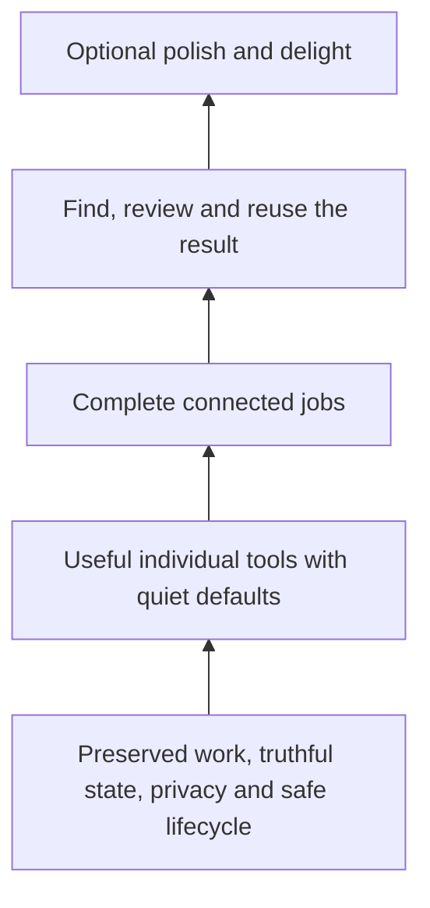

# Focused Mac foundation

Decided implementation brief, 6 October 2026, revised after adversarial product review. Prepared at main `7989426b41f84afaf8e38bf57ae4b2a68935aacb`. Concurrent research-only PR #275 was merged into the branch before final handoff; the inspected app-source baseline is unchanged. **Specification, not a claim that these changes work in the installed or public app.** [Research, dissent and review findings](research/mac-foundation-2026-10.md) distinguish current source, limited native inspection, user reports and platform evidence. The review reverses the original decision to retain Read and reduces the first implementation tranche.

The subsequent coverage audit at main `8985093` adds explicit customer installation, first speech setup and runtime permission transitions below. [Coverage evidence and older-issue disposition](research/mac-foundation-2026-10.md#coverage-audit-download-to-repeat-use) distinguish existing implementation from work still owed. Contributor setup #2 is separate from customer installation.

The [build-ready Library and surface consolidation](#build-ready-library-and-surface-consolidation) adds explicit Resources/Packs decisions, conditional legacy preservation and L1–L4 acceptance. [Companion-app research](research/library-companion-2026-10.md) is context only; mobile remains paused.

## Outcome and authority

Workbench helps someone speak, explain and present in the apps they already use, then keep and reuse the result. Its landing promise is small, useful Mac tools. The default experience must deliver that promise without learning a taxonomy, preparing a scene, connecting an assistant or approving unrelated permissions.

The [product contract](workbench.md) owns the product and names; [interaction contract](product-spec.md) owns existing jobs; [source map](design.md) owns implementation boundaries; the [handbook contract](../site/handbook/contract.json) owns Present capability and acceptance status; [#7](https://github.com/Ship-Work/workbench/issues/7) remains the only programme/release gate. This brief decides the refinement target and bounded work packages. It does not create another roadmap, store or release process. Its dated target supersedes conflicting older proposals for these packages; historical records retain their provenance. Implementors update each owning contract when behavior changes, rather than appending another competing design.

**Chosen approach: recompose and finish the existing native foundations.** Keep capture, recovery, History, immutable handoff inputs and toolbar lifecycle owners. Replace an implementation internally where evidence warrants it, but preserve its data and external behavior. A wholesale app rewrite would discard useful tested preservation logic while leaving managed-device constraints unchanged. A cosmetic pass would leave incomplete delivery and permission journeys unchanged. An additional onboarding wizard or universal workspace would add more to learn.

The decisions below are fixed: user outcomes, the retained/retired scope, data/permission boundaries, closure and acceptance. Keep established names for retained tools unless an observed comprehension problem warrants a change. Layout within the hierarchy, native control selection, Swift types, factoring and implementation order inside a package remain flexible. Material deviations need an evidence-backed update to the owning issue, including the simpler alternative and affected acceptance; ordinary coding choices do not need another product decision. Working source and previous investment do not grant a capability permanent scope.

**Start here:** make Meetings produce useful copied words, make assistant handoff work manually, and prove Present's approved phone-to-receiver route. Retire Read and close the already-paused browser paths. Limit the first surface pass to changes needed for those jobs and removing unrelated controls. Do not wait for a wholesale Persona/settings polish pass or new release automation before shipping a bounded fix with the existing release owner's evidence. The final reset still requires its complete acceptance; intermediate improvements must make narrower claims.

## 1. One understandable offering

The durable contribution policy is [Value before scope](workbench.md#value-before-scope), not a new checklist owned by this project brief. Its value hierarchy is:

Every addition must strengthen a named job on accepted foundations. Delivery infrastructure supports this entire hierarchy; it is not another product to grow. Marketing explains the hierarchy; it does not set a broader roadmap. If an exploratory request conflicts with it, first investigate the underlying need and recommend subtraction or an existing route. Do not mechanically implement nouns and adjectives from a prompt.

Call them **tools** in user-facing explanations. The retained names are Dictate, Meetings, Snap, Snap & Talk, Draw, Present and Persona. **Retire Read, the Workbench-owned text-to-speech capability, from the active product.** Do not rename it Listen, hide it behind Advanced or add an enable switch. Timer remains a small companion, not a new desktop destination. Keep Home, History, Library and Settings. Do not add Create, Workspace, Studio, Mirror or another mode hierarchy.

### What earns continued investment

The product has three reasons to return: speak useful words into existing work; leave a meeting with reusable words; explain something visually to a person or assistant and retain the material. These are investment priorities, not new navigation modes or claims of proven adoption.

| Area | Decision and evidence boundary | Investment limit |
| --- | --- | --- |
| Dictate / Meetings | Core: direct recurring input and meeting outcomes reported by the maintainer; existing preservation and recognition serve them | Improve completion, fidelity and recovery. Do not add more engines or automatic meeting management to prove relevance. |
| Snap / Snap & Talk / Present | Core visual explanation: useful image, ordered narrated material or readable phone view, delivered to a real recipient | Finish the current capture-to-output/receiver routes. Snap shares capture and supports a short copy-out path; its editor must not become a graphics suite. Present remains unaccepted on the reported work Mac until actual evidence. |
| Draw / Timer | Supporting live explanation, with immediate visible output and clear exit | Retain the small existing controls; no new planning, timer or annotation product line. |
| Persona | Supporting saved artwork, plausible value in live explanation but weak evidence for broader investment | Keep basic use and the selection-only scene copy. Freeze camera, voice-reactive decoration, multi-card/group and layout expansion. Do not undertake a general Persona rewrite in this reset; preserve existing compatible work and repair safety defects. Further investment requires a real presentation task that benefits. |
| Read | Retire: ordinary listening has a capable native route and no demonstrated recurring Workbench listening job offsets the separate engine/settings/playback workflow | Preserve old material and shared code where needed. No further voice/selection polish to justify sunk work; hold Read-only #267 from the refinement batch. |
| Providers, packs, prompts and other integrations | Means of completing a core job, not independent reasons to grow the app | Manual/neutral baseline first. Preserve useful existing resources and supported adapters; freeze new providers, pack browsers and destination expansion without observed repeated friction. |

Read's strongest keep argument is prepared Markdown listening and reusable/exportable generated audio; that functionality exists. The maintainer's present lack of use and the absence of a repeated listening/export job outweigh that hypothetical advantage. This is a product decision, not a claim that speech is unhelpful for everyone or that Read never improved. [Apple's macOS 26 guide](https://support.apple.com/en-au/guide/mac-help/mh27448/26/mac/26) documents selection speech, highlighting and playback controls for the ordinary case. Native behavior is not identical and may read available window text when nothing is selected; do not auto-trigger it or promise equivalent selection/privacy semantics. VoiceOver support for Workbench remains required.

**Present stays Present.** Its subtitle is “Your phone on a clean stage.” Apple iPhone Mirroring is a separate external product with different requirements; renaming Workbench's USB preview to Mirror would obscure that difference. A still scene remains usable without a phone. Backdrops are optional polish, not the starting job.

| Tool | First useful action | Normal completion / useful exit | Secondary choices |
| --- | --- | --- | --- |
| Dictate | Speak into the intended app | Words saved, delivered if verified, otherwise copied with a manual paste cue | Text style, delivery, dictionary, activation |
| Meetings | Choose call audio, explicitly start | Full transcript visible and one-click Copy transcript | Microphone inclusion, recording options, review/export, follow-up |
| Snap | Capture or deliberately paste/import an image | Inspect at readable size; Save & Copy | Crop/marks; preserve original |
| Snap & Talk | Capture screens with optional narration | Review ordered material, then a complete handoff | Skill/template only when needed; session/output choices explained |
| Draw | Mark the screen | Escape returns input to the underlying app; marks remain by existing rules | Tools/board and Timer |
| Present | Show the chosen phone in a neutral or saved stage window | End releases only Present's owned resources | Scene options, full screen, concise connection help |
| Persona | Show chosen artwork | Hide/Show preserves it; End releases the visit | Appearance, groups, optional camera/voice response |

**Surface decisions:**

- Sidebar retains flat Voice / Screen / Saved groups for the remaining tools; remove Read and its routes rather than reserve an empty slot. No new navigation level. The page title and one-sentence outcome explain unfamiliar names.
- Home shows current work first when it exists, then compact preparation links for Dictate, Meetings, Snap & Talk and Present, followed by recent History results. Replace Home's Snap quick-start with Present; Snap stays directly reachable elsewhere. Exact link arrangement and recent-item count may follow viewport evidence; five is the existing starting point, not a product invariant. Opening a link never starts capture. Keep first-dictation guidance dismissible and returnable.
- Use a static Home heading. Remove the typewriter greeting and decorative teaching that repeats each visit. Move the existing Me profile edit entry to Persona, retaining its profile/artwork identity; no new profile system. No large capability cards, readiness dashboard, repeated setup checklist or promotional content ahead of work.
- Each tool page has a stable content area, one prominent action appropriate to its phase, and relevant status beside it. Stop/End, content selection and a useful result action must remain reachable. Put optional setup in one clearly named group for the current task; do not replace a wall of visible controls with a nested wall of menus.
- The panel remains a fast action list. The toolbar retains the already-decided compact/reveal lifecycle and fixed active-work priority in [floating-toolbar.md](floating-toolbar.md); this is not another toolbar redesign. Use the same action/admission owner on each entry point. Reuse the existing menu, keyboard and accessibility conventions.
- History owns saved results; a result may be reviewed and copied at its origin through that exact record. Library owns reusable resources/packs. Settings owns application preferences, Keyboard, Models and Connections. Do not add another result list or hide essential Copy behind assistant setup.

First viewport, at the app's supported minimum size and larger text, must show the current job, its content/status and its primary action without scrolling through optional settings. A legitimate recording or recovery warning takes priority over decorative content. Native keyboard and VoiceOver traversal are acceptance, not inferred from a screenshot.

### Why the tools connect

Tools must first earn a place through user value; a different input, output or lifecycle alone is insufficient. Dictate delivers short speech into another app; Meetings deliberately retains a long recording and transcript. They share recognition and History, not one overloaded page. Snap produces an editable image; Snap & Talk produces an ordered explanation that may become a deck. They share capture and preserved image bytes, not a mandatory session wizard. Draw and Timer support a live explanation and keep their own explicit endings. A provider, template, style, backdrop or delivery destination is a choice within a job, never a new tool.

| Connection | Fixed ownership and reason | Remove or constrain |
| --- | --- | --- |
| Persona → Present | Persona owns saved cards and independent artwork/camera over other apps. Present may place a **frozen still copy** inside its own shared window, so the receiver sees that composition. | Replace the embedded full Persona library with a selection-only saved-card picker: choose/cancel and an explicit Open Persona route. No creation, deletion, groups, appearance editor, camera or voice meter inside that chooser. Scene size/placement changes affect only the copy. Editing the original never silently changes a running stage. |
| Persona preparation → live Persona | Default is one selected card and Show; existing advanced work remains compatible within Persona. Any inspector acts on the actual shown copy. | Keep groups and layouts' distinct meanings and freeze expansion. Do not expose them to single-card first use or redesign all inspectors in this tranche. Reuse the current shared owner for a necessary fix. |
| Present → prompts | No inherent connection: text reuse is useful in any app and does not compose the phone window. Library owns saved prompts and their picker/delivery. | Remove Saved Prompts from Present and Prompts from its toolbar accessory. Preserve Library records, filters, exact text, delivery cancellation and Copy prompt as baseline. Optional Insert requires a valid captured target; opening Library must not infer one. No new Prompts tool or shortcut. |
| Library → tool preparation | Library owns shared prompts, links, skills and packs. A deliberate use/import passes a selected resource to its owning tool. | Saved scenes stay in Present; saved cards stay in Persona. No duplicate scene/persona master galleries. Legacy downloaded photos retain conditional Library access. Packs remain in Library, not a second Settings destination. |
| History → reuse | History owns saved results; tool result views and handoff link the exact record/attempt. | No separate Meetings archive, assistant inbox or new dashboard. A direct origin Copy is useful access to the same record, not duplication of ownership. |

**Settings has four sections with specific jobs:** General holds app lifecycle/appearance preferences; Keyboard owns one conflict-checked catalogue; Models holds speech recognition and text cleanup; Connections holds optional supported assistant destinations. Remove Read's engine/voice/provider setup. Each retained model row first shows the job, selected choice and actual readiness; selected-provider details appear only when relevant. Task choices such as Dictate delivery use one `[Tool] options` owner, reachable contextually; a Settings shortcut can open that same owner. Existing Mac menu/keyboard aliases are useful when they dispatch the same action. Remove contradictions now; a wholesale settings-layout rewrite is not prerequisite work. The cut is competing ownership and irrelevant choices, not an arbitrary count of entry points.

**Present's optional composition is deliberately small:** backdrop, phone frame/fit, an optional logo and a saved still persona copy. A logo identifies the presentation without introducing another live tool; keep its existing optional import/placement, rendering, removal/export and missing-asset recovery, with no branding wizard. Keep one neutral default and native window resizing. Use the shared compact Position… control for keyboard placement rather than nested window-size/window-position preset menus. Preserve usable fullscreen/exit and exact End. Decorative hand-cutout authoring is legacy-only, not another group hidden under Scene options. The live controls refer to the running window; preparation refers to the saved scene. Neither silently rebuilds the other.

## 2. Meetings finishes with usable words

Retain `MeetingModel`, `LiveVoiceSession`, `MeetingRecovery`, shared recognition and the existing transcript store. Current main already has live text, pause/resume, reconnect, retained audio, completed text and shared transcript review; rebuilding those is outside this package.

The first completed result is **Copy transcript**, with Review transcript / Export and Prepare follow-up as secondary actions. Copy resolves the committed transcript UUID and uses its complete current text, including the final words of a long meeting. Native selected-text Command-C copies only that selection. Review exposes current/original wording and existing recording review without loading Dictate, changing the shared selection or starting playback. No guessed speaker identities; channel labels remain channel labels.

Before Start, show actual recognition readiness and source admission. Do not say Ready to record when the host will immediately reject the action for model setup or conflicting work. Model preparation reuses Models and preserves source/microphone choices. Opening Models or returning from it never starts recording. New recording prepares a fresh recording; Start is still explicit.

Represent capture problems as domain-specific reason and available action, not string equality against a microphone error. Distinguish mic denial, app-audio refusal/restriction where known, unsupported OS, source disappeared, no samples, recognition unavailable, save failure and unknown failure. Main copy says what could not happen and what was preserved; technical details remain secondary. Recheck availability on return and at dispatch.

When valid, explicitly offer microphone-only after app-audio failure, explaining that remote participants through headphones will be missing; offer app-only after microphone refusal. Never silently substitute sources or label partial coverage complete. If neither is available, preserve work, explain the limit and allow exit. No attempt to reset privacy, bypass management or install audio drivers.

During recording, Pause/Resume/Finish remain bound to that session generation. Finish waits for or reports incomplete final transcription; completed text must not conceal a missing tail. Delayed permission, audio or recognition callbacks after Cancel cannot restart capture or overwrite a newer session. Existing stop-and-keep, no-speech, save retry and quit recovery remain intact. Retry saving uses the same UUID and never repeats an external paste.

**Not in this package:** pasted external transcripts, new audio import, speaker diarization, automatic notes/send, calendar integration or another Meetings library. External transcript import needs durable provenance and unknown-duration handling before audio review can be offered correctly. Reconsider it only after repeated observed input need. “Simple copy/paste” here means useful native copying and manual paste into the user's destination.

## 3. Handoff works without optional setup

Keep one existing review over immutable selected inputs, a request and the chosen skill. A meeting follow-up uses the existing appropriate skill/reference roles; advanced editing remains possible, but the normal route does not require reselecting every role or engine.

**Copy instructions is always first-class when the material can be prepared safely.** For text it includes the actual needed content and request. For images/rich files it explains the exact attachment or local-folder step and exposes the selected files. A local path is not an attachment. Missing/unreadable evidence blocks preparation with a reason; it must never silently omit the source. Do not recursively package trash, unused audio, sibling folders or credentials.

Manual app opening and a connected run have different labels and outcomes:

| User action | Truthful outcome | Must not imply |
| --- | --- | --- |
| Copy instructions | Instructions copied; paste and attach the named files if needed | Submitted, sent or running |
| Open receiving app | The actual resolved app opened, instructions still available | Files attached, account connected or task accepted |
| Run with Claude Code / Run with Codex | Explicit compatible runner accepted this frozen task | The desktop conversation is being controlled or arbitrary rich-file tools are available |
| Result available | Validated result is readable and linked to the exact task in History | Exit code or window launch proves useful output |

Recheck provider state and distinguish off, checking, missing/unsupported executable, sign-in needed, status unverifiable/restricted, input limit, incompatible skill, busy, ready and a dispatch failure. Present one relevant explanation beside the selected destination and keep the manual action usable. Setup is secondary, retains the entire review and rechecks on return without auto-running. Preserve organization controls and the existing runner restrictions. No credential migration, paid API substitution or automatic cloud fallback.

Use current `HandoffJobsModel`, provider readiness and existing receipts. Failed/interrupted tasks keep frozen inputs and attempt identity, with Copy instructions and an explicit Retry. Unknown remote completion stays uncertain, so Retry cannot be advertised as duplication-free. Copy/review results uses the exact saved text; missing or unreadable results remain recoverable problems. Do not create a generic permission/agent framework to share a handful of view states.

Bind copied/opened/failure feedback to the originating attempt and resolved host. Closing, replacing or repeating a handoff invalidates its older callbacks. An earlier launch failure must not overwrite a newer handoff notice. The two-attempt reversed-completion case belongs in H2; #274's host-name repair alone does not close this separate race recorded in #63.

Consume [#274](https://github.com/Ship-Work/workbench/pull/274)'s actual-host labeling and [#275](https://github.com/Ship-Work/workbench/pull/275)'s research when available. [#63](https://github.com/Ship-Work/workbench/issues/63) separately owns agreement between Snap & Talk's prompt, frozen deck skill, optional template and output location. Complete that bounded scope; do not make a general artifact runner part of this reset. A manual rich-file result returns through the existing session/file/History affordances, with the file visibly accessible; do not claim automatic import/return where it is absent.

## 4. Present is a durable phone stage

[**#276**](https://github.com/Ship-Work/workbench/issues/276) and its existing Claude implementation own this work. Do not start a competing Present branch. Keep direct USB video, window by default, one explicit first device selection, exact-device reconnect, a neutral still scene without mandatory library preparation, and optional saved scene customization. The default page shows the preview, observed connection status, next useful action and Present/End. Scene editing and help are secondary.

Supplement #276's proposed PhoneLink behavior with these required distinctions:

- No phone detected is different from a failed/unavailable USB probe. A USB device without a usable screen source does not prove missing Trust. A discovered source is available to try, not proof of live video.
- Camera access not requested, pending, denied and restricted have different transitions. Observation may run without opening capture; opening Present/help never prompts for unrelated access. Permission granted after End cannot revive capture.
- Generic capture/configuration failure says the picture could not start. Say another app is using it only when the platform error establishes that cause. Preserve a bounded underlying error for diagnostics.
- Keep Choose source reachable when the remembered source is missing and exactly one alternative exists. Never switch to that alternative, a webcam or another phone without explicit selection.
- Keep source available, current-generation picture live locally and receiver-verified sharing separate. Stalled frames lose Live honestly. Reconnect/lock/sleep and stale callbacks cannot retain a false Live state. Ending is idempotent and invalidates outstanding work.
- A compact Can't see your phone? help sheet gives current facts, short conditional checks and approved alternatives. If Trust was already completed, do not loop back indefinitely. QuickTime is an optional diagnostic; failure there is another observation, not proof of a cable or policy cause.
- Opening QuickTime or another fallback waits for Workbench capture release and stage closure, launches once and reports launch failure. The saved scene survives. No personal Apple Account login, privacy reset or managed-policy change is a remedy Workbench performs.
- USB baseline remains video only. Say phone sound is not included. A Teams/Zoom route is separately rehearsed; a Mac picture cannot establish that an audience hears phone replies. Apple iPhone Mirroring remains secondary, with its same-account and phone-microphone limitations visible when selected.

Connection details are an explicit locally reviewable copy/export of **observed facts, possible causes and unknowns**. Record exact build/source/OS, probe success, source counts, authorization, phase, current-generation frame state and bounded error code. Exclude serials, raw device IDs, personal device names, accounts, media and unfiltered error dictionaries. A receipt cannot promise to identify every work-Mac restriction. Verify a headless probe's identity before transferring its permission result to the app.

Do not mark the reported work-machine problem fixed until that machine's approved route works or its restriction is established and a useful supported fallback is demonstrated. A blocked hardware gate remains explicit; synthetic PhoneLink tests do not close it.

## 5. Remove dormant scope without losing work

Retirement is a behavior change with preservation tests, not file deletion. #276 already owns Present route/motion/wallpaper simplification and its announced separate photo-sync door removal. Coordinate with that owner, including the exceptions below.

| Area | Decision now | Preservation / return trigger |
| --- | --- | --- |
| Read text-to-speech | Retire the owned capability across navigation, contextual actions, Settings, Services and runtime; no hidden re-enable route | Preserve the old draft as ordinary text, exported files and compatible state; keep recognition, original recording playback and Snap & Talk. Details below. Reconsider only for demonstrated repeated listening needs inadequately served by the native route. |
| Present motion and animated desktop | Remove from the normal Present surface and new-use paths; default still renderer | Keep assets/config readable. Stop owned motion safely; never restore over later manual wallpaper. Return only after a named use case and receiver-tested prototype. |
| Wallpaper creation from scenes | Retire user-facing creation actions; no new Wallpaper tool | **Keep pending Restore desktop/recovery reachable** until resolved, with existing ownership check. Removing setup must not strand a prior effect. |
| iPhone photo/cloud transfer | Remove Home arrival cue and new-use Library/Settings promotion as coordinated in #276; keep conditional legacy access for existing records or opt-in | Keep every downloaded item inspectable/exportable, including successful transfers never imported into a scene. Retain scene references, record provenance, pending/failed recovery and existing disable/cloud-removal controls for opted-in users. Do not leave refresh running with its switch hidden. No automatic remote deletion, entitlement removal or data migration in a UI-removal PR. Resolve active transfers before retiring their controls. |
| Scene iCloud sync | Pause new setup and routine cloud activity separately from phone-photo transfer | Keep `MacSceneSync`'s local portable storage, migration, materialized assets and recovery. Preserve pending operations and undownloaded records honestly; local availability must not be claimed for cloud-only assets. Conditional legacy recovery may explicitly retrieve/export existing work, without enabling ongoing sync. No automatic cloud deletion or entitlement removal. |
| Chrome destination integration | Make the existing pause effective across UI and runtime, as specified below | Saved URLs/profile bindings/shortcut assignments remain inspectable and exportable; normal URL opening is explicit and makes no profile guarantee. No new browser infrastructure. |
| Decorative hand cutouts | Remove new authoring/import/tone/position controls from the core scene flow | Render existing saved assets; retain remove/export and missing-asset recovery. No background asset migration. |
| Animated greeting / profile promotion | Static Home; Me profile editing under Persona | Preserve the same profile and existing art. No reset or new account. |
| New recipe engines, agent/MCP bridge, arbitrary imports, extra platforms | Defer | Only return for observed repeated friction the current file/native route cannot solve, with an owner and acceptance. |

Existing issues are the queue. #58/#57/#26/#27/#59/#65/#70 and other speculative work are not dependencies of this reset. The release owner records their disposition in their existing issues when reconciling, preserving unfinished recovery or accepted obligations. Do not bulk-close them as fixed or infer retirement deletes data. #130/#131 and #75 do not become active through this brief. The old #134 plan's “Meetings inside Dictate” is superseded by current main's Meetings destination; do not reintroduce that fold.

**Paused must mean unavailable to start, not merely hidden.** Browser package G removes Present's Switch to Browser Tab, application-menu Switch to…, shortcut editing/catalogue promotion and registration of saved Switch to bindings. Fresh default bindings are already disabled; upgrade profiles are the important additional case. Remove Chrome connection Enable/Repair/extension-install promotion from Library. Stop automatic socket/listener startup from `browser.enabled`; reject indirect Library activation, extension commands and stale callbacks while paused. Retain the preference/binding values without registering or acting on them. An older extension may still retry from Chrome: refuse commands, never queue them for later replay, and do not claim the app controls Chrome's process or uninstalls the extension.

Saved browser links retain their target metadata. Show a concise paused explanation with Copy link and explicit Open in default browser; opening must neither silently clear the profile binding nor claim the intended signed-in profile was used. A conditional existing-connection status can allow Stop/disconnect. Do not move browser setup to another Settings page. Keep source and compatibility tests for a later evidence-backed decision, but remove active promotion and new installation/package instructions. A single product availability decision must govern entry, registration, startup and dispatch; this does not justify a general feature-flag framework or user switch.

Phone-photo and scene-cloud retirement follow the same closure rule: no hidden automatic network refresh on launch, activation or page visit after new use is paused. Cancel owned refresh safely, preserve pending/uncertain outcomes and local records, retain explicit legacy stop/recovery/export, and never equate a local archive with confirmed cloud deletion. Package E may land connection repair and these removals in separate bounded PRs under its existing owner. For each retired integration, record visible entries, shortcuts, startup/indirect routes, running callbacks, saved-state behavior and packaging/docs; source search and behavioral tests must supplement the surface registry.

Legacy scene retrieval must be read-only against existing cloud records. Do not call the current general `SceneLibraryModel.refresh()` as a recovery shortcut: it resumes sync and can upload queued edits, and its cloud sync can create a zone. An explicit retrieval/export cannot enable recurring sync, create/delete records or transmit unrelated pending edits. Preserve that queue unchanged. Test a cloud-only scene alongside dirty local work; missing account/access yields an honest recoverable state, never an empty-scene overwrite. Reuse bounded existing read operations; this exception does not authorize rebuilding cloud sync.

### Read retirement is a narrow removal, not an audio rewrite

Read is route `speak`, toolbar `.read` and shortcut id **6**. `ReadbackModel`, route `readback` and shortcut id **5** are **Snap & Talk and stay**. Keep Dictate/Meetings recognition, meeting original-recording review, captured narration playback, VoiceOver, prompt insertion and their update-busy guards. Visual **Read result** means inspect an answer; keep it and label it Review result. Remove only its separate Read aloud action.

Remove Read's sidebar/page, panel/toolbar/current-work projections, Window menu, Keyboard catalogue/registration, History/Library/result TTS actions, selected-text Service, voice/provider/model-download settings and public promises. Saved enabled keys and old toolbar modes must resolve safely without admission. Remove the Service from both edition bundles and update `scripts/release/preview.py`, which currently requires it. Retain unrelated Services, signing and release checks. Stop TTS startup voice enumeration, key/status discovery, activation observers, previews, provider catalogues, neural loads/downloads and online generation. Stale callbacks, routes or Service invocations cannot resurrect it. Remove production TTS developer-command admission too; isolated test fixtures can retain needed generators.

`SavedState` shares `speechText`, voice/rate and unrelated Dictate/history/recovery data. Preserve compatible decoding and round-trip dormant fields. For a nonempty old draft, atomically save its exact text as one UTF-8 file referenced by an ordinary Library file resource, using an idempotent migration identity and file/reference readback before marking success. **Do not migrate it into a prompt:** reading supports one million characters, Library prompts only 50,000. Do not truncate, normalize, duplicate on relaunch, replace Dictate's draft or fabricate a transcript. Keep the source field; a failed migration retains it with a contextual retry/recovery path in Library. Fresh/empty profiles get no legacy item, page or banner. Do not add a permanent Legacy Read screen.

Exported audio remains where the person saved it. Generated audio is otherwise transient in this source; do not invent a reading archive or scan user folders. Use existing update/shutdown admission to finish or cancel owned generation/export safely, preserve text and reject late completion. Never sweep similarly named temporary folders belonging to other work or another edition. Inert provider preferences, TTS keys and caches may remain without a settings panel; retirement must not read or send them. Optional later cache removal is limited to the verified inactive Pocket TTS subtree. **Keep FluidAudio and its shared parent:** Parakeet recognition still depends on them. Do not delete system voices or unrelated credentials.

Hold Read-only [#267](https://github.com/Ship-Work/workbench/pull/267) from this delivery; do not merge it merely because it is nearly ready. Its selection/draft work is real progress but does not establish demand. Preserve its history and take only independently justified shared fixes. Reconcile #17/#161/#173 as superseded feature acceptance or relevant preservation checks, not falsely completed work. Removal tests replace old presence/success obligations alongside shared non-regression checks.

### Build-ready Library and surface consolidation

Added 6 October 2026 against main `7f2b00aa629f3d76b3697925d2f6bfdd6c9b2ee6`. This closes the Library and control-detail gaps in packages A/E/G/H/F; it does not create another workstream. [The source audit and companion research](research/library-companion-2026-10.md) separate observed source, the supplied screenshot, open PRs and platform evidence. **The deliverable here is a build-ready specification. The app is not declared clean or accepted by this document.**

#### Library has two sections and one purpose

Keep **Resources** and **Packs** inside Library. Remove **From iPhone** as a section, Home arrival offer, new setup, Settings toggle and indirect admission. Do not replace it with Sync, Devices, Legacy or Advanced navigation. Showing a phone belongs to Present and does not depend on phone-photo transfer. Keep useful existing material reachable through the conditional recovery below.

Resources holds reusable prompts, links and file references. Packs supplies optional reusable content into the existing tool owners. History holds captured/generated results. Present owns scenes; Persona owns saved cards; a pack is a source of those personal copies, never a second master gallery. Resources keeps its existing prompt/link/file schema; installed skills remain pack-owned and are offered in their compatible tool. Search here does not become a new cross-pack catalogue. Keep these names and state owners. Use neutral Library copy such as “Keep useful prompts, links and files together.” Remove demo-only/product/persona terminology from the heading and search placeholder; retain existing metadata and search compatibility, with product/persona fields optional in editing.

| Control or state | Build target | Owner / preservation |
| --- | --- | --- |
| Resources Add | Keep New prompt, New link, Add local file… and Save clipboard as prompt… in one Add menu; preserve local keyboard aliases | `DemoLibraryModel` and its editor. Explicit Save commits; Cancel changes nothing. Rename ambiguous Save current transcript to Save Dictate transcript as prompt… and open the same editor with the complete current Dictate draft; disable when empty. Oversized text is refused without truncation, with file-save guidance. |
| Search / favourites / selection | Search the same records; a favourites filter is a useful selection filter, not another view or collection | Preserve query, selection and existing metadata/session semantics; do not add relaunch persistence merely for this refinement. No match offers Clear filters. No selection shows a quiet instruction rather than stale details. Labels and accessible names use Resources/Library consistently. |
| Prompt | Copy prompt is the primary action; exact content, no assistant or Accessibility dependency | Library owns prompt reuse after Present's Saved Prompts and toolbar Prompts accessory are removed. Remove helper copy advertising those removed entries. Optional insertion uses the existing frozen-target admission and cancellable owner; Library navigation cannot invent a target. |
| Link | Open link and Copy link; browser-bound legacy links explain that the integration is paused and offer explicit Open in default browser | Keep URL/profile/tab metadata in local saved records on open and relaunch. Preserve G's portable-exchange sanitization: ordinary Library import/export strips `browserTarget` and machine bookmarks. The separate Export saved browser settings action retains an inert recovery record; it cannot enable or import browser switching. Remove Switch to tab and the action that clears a binding merely to open the URL. No Chrome enable/repair/listener route. |
| File | Open file is primary; Quick Look and Show in Finder remain direct secondary actions | Show filename and a short location first. Full path and Copy path remain available in secondary details, not a multi-line implementation dump. Locate file… is primary recovery only when missing/unreadable; valid files can use Change file… in secondary actions. Replacement must be explicit and preserve the previous reference on cancel/error. |
| Image preparation | Use in Present… / Use in Persona… only for supported selected files | Preserve existing snapshot/choose/cancel semantics. Opening preparation never presents or shows artwork. Saved scene/card owners remain authoritative. |
| Edit / favourite / Remove | Selection-scoped; explain removal affects the Library reference, not the external original | Do not put a whole-app Delete behind an unlabeled trash glyph. Retain its accessible name and confirmation. Keyboard focus cannot remove another row after selection changes. |
| Import / export | Keep in More with the existing preview and conflict decisions | Preserve Keep mine / Use incoming / Review again / Apply import and concurrent-file-change protection. Existing local access bookmarks stay with retained local records; portable exchange never carries or grants those bookmarks or browser bindings. Export explains whether it contains references or actual media; never imply a portable bundle when media was not copied. |
| Feedback | Brief factual result next to its action; no sentence assembled as “Saved Saved Read text” | Use “Saved.” or a complete deliberately written phrase. Existing lifetime/accessibility rules apply. Persistent recovery remains until resolved; unrelated successful actions cannot dismiss it. |
| Corrupt or externally changed library | Explain that saved resources are preserved and editing is held; keep Show saved library and applicable export/recovery reachable | Never replace unreadable storage with an empty library or hide a whole-store fault in one row. Disable only writes that cannot safely commit. |

Keep the existing Return/IME/marked-text, text-editor, sheet and key-window admission. Preserve ⌘F, ⌘N and ⇧⌘S with one dispatch per press; hidden SwiftUI keyboard buttons are still entry points. Search focus must not steal typing from an editor, an import decision or another app. This is not a new Library model or metadata migration. Under the Grammar, removals and clearer labels are Quality; the conditional recovery entry and the explicit dual-input skill choice are Options of Library/the existing handoff action, justified by preserved work and an unambiguous destination. Register them deliberately during implementation, with no new capability or place.

#### Packs earns its place by getting content into a job

Keep optional packs and the existing GitHub device flow. Change the hierarchy so usable installed content comes before connection/account maintenance. With no packs, offer one Add a pack entry and explain that the ordinary tools work without it. Opening Packs does not sign in or install. A pack deep link pre-fills the existing add flow and waits for a deliberate action. Do not add a marketplace, catalogue browser, pack authoring UI, new identity or provider.

| State / action | Required behaviour |
| --- | --- |
| No connection | Existing verified installed packs stay usable offline. Sign-in is contextual to Add/update, never a gate over Resources, neutral handoff or installed content. |
| Connect / device code | Preserve Copy code and open GitHub, Cancel and expiry/error recovery. Cancel invalidates late callbacks. Account/access details stay secondary; no token in UI/evidence. |
| Installed pack | Name, version, relevant content and use actions first. Check for updates / source contribution / Remove pack stay together in its actions. Existing automatic-update preference remains reachable with the same stored value; disconnect retains installed content. |
| Use skill | Route to the declared supported input. A transcript-only skill prepares History handoff; a Snap & Talk-only skill prepares that session. If both are supported and no unambiguous invocation context exists, ask **Use with transcripts** or **Use with Snap & Talk** in a small local choice. Never silently choose a different job, replace unsaved session setup, submit to an assistant or begin capture. Existing admission must resolve busy/unsaved state first. |
| Add scene / Add persona | Import a personal copy into Present / Persona, select it and show the result there. Do not immediately Show or start a presentation. Updating or removing the source pack cannot mutate that copy. |
| Save resource… | After the chosen file is written and verified, register/select its ordinary Library file reference and offer Open file. On Library failure keep the saved file, report its real location and offer a reference-only retry; do not write another copy or claim Library success. Cancel writes nothing. This explicitly closes the current disk-only action's missing Library return. |
| Update / cancel / failure | Existing verified version remains active until complete validated replacement. Show actual progress/status at the affected pack; no false success or entire-Library busy wall. Preserve immutable session snapshots and independent jobs. |
| Remove / disconnect | Distinct actions. Remove stops updates and removes only that pack's owned downloads after confirmation; personal copies and sessions survive. Disconnect ends account access, not saved work. |
| Workspace appearance | Keep the existing optional setting, secondary to content, with clear Reset. Preserve active branding and pack identity; no separate workspace setup or expansion. |

Use `PackLibraryModel`, `PrivatePackKit`, existing task/session admission and the current Library transaction boundaries. Do not silently change the chosen automatic-update policy during this layout work. Tests must distinguish content saved on disk, a Library reference committed, a tool prepared and a job actually started.

#### Retired material remains accessible without keeping the retired product

**Fresh profile:** no From iPhone, recovery section, empty legacy banner, Read file or setup/enable switch. **Upgraded profile:** normal Resources first, plus **Recover saved items…** in More only when retirement evidence requires it. This opens a small contextual sheet, not another navigation destination. Eligibility includes local records, an enabled legacy preference, account/checkpoint/suppression state, pending upload/deletion or incomplete preservation; it must not disappear merely because the user chose Turn off or there are no downloaded photos. All detection is local and must not create a store/zone, contact iCloud or start a worker.

- Read's exact old draft follows the existing one-file/idempotent-reference rule. A valid saved file is an ordinary file row. When preservation is incomplete, show one short explanation beside that item or conditional recovery entry, with Retry saving text and Show original saved state in details. State what is preserved and what failed; do not expose “receipt” or internal worktree paths in the primary message. If the source cannot be verified, say so and prevent overwrite. Fresh/empty profiles see nothing. Keep deliberate rename/remove from being undone by relaunch; a recovery receipt is not permission to recreate deleted Library entries.
- For downloaded phone photos, project each existing record through its original owner and make inspect/Save a copy/Show in Finder available even when never used as a backdrop. Preserve bytes, IDs, account provenance and scene references. No automatic bulk copy, deletion or relabeling as a new capture. A missing JPEG/cloud-only record says it is unavailable locally, with explicit recovery or export of available metadata.
- Turn off stops this Mac's routine activity and leaves material and pending outcomes intact. Do not claim it disables another device. Removing a local photo leaves its cloud and independent scene copies; removing a cloud copy leaves local/composed copies. Existing cloud-copy removal remains separately confirmed for the exact account/item, with honest unknown/pending outcomes and no automatic replay. It must not require turning routine sync back on.
- **Neither `PhotoHandoffModel.refresh()` nor `SceneLibraryModel.refresh()` is a recovery reader.** The former can replay deletions and upload queued photos; the latter can upload dirty scenes and create a zone. Recovery retrieval must use bounded reads for the selected existing record/account only. Preserve unrelated queued uploads/deletions. A deliberately chosen retry of a pending write remains an explicit separate action, not a side effect of inspection.
- Saved `photos` routes resolve through the existing central route table to Library. If legacy recovery is relevant, reveal its conditional entry without starting it; otherwise show Resources. **A2 adds** a safe `speak` → Library recovery landing with no activation; accepted H currently sends that old route to its harmless Dictate fallback. Update that compatibility check explicitly when A2 implements the new alias. `readback` remains Snap & Talk. Stop/End takes precedence over readiness, and late callbacks cannot restart any retired activity.

The requested removal is of the normal From iPhone product, not of access to the person's files. PR #286's inspected head removes the live model/view/refresh and redirects `photos` to Library, but does not by itself establish this conditional preservation experience. Reconcile that gap in E before claiming X2/L3 accepted; retaining a directory alone is insufficient. Keep the old mobile source and entitlement history paused. No companion app is implemented by this spec.

#### No loose controls at the integration boundary

The existing registry identifies entries and owners, but intentionally excludes many controls internal to a page. Therefore use one review of the actual final candidate covering the registry, page-local controls and runtime routes. Store the review delta with the candidate's existing verification evidence, not in a second permanent registry.

| Surface family | Required final disposition / inspection |
| --- | --- |
| Home, sidebar, page sections and footer | Retained tools/places only, no Read or From iPhone; static Home; profile editing under Persona; current work and useful results ahead of setup. Collapsed hints, names, focus and minimum-width layout remain coherent. |
| App/Window/Help menus and status panel | Same retained actions/owners/names as their pages; remove stale Read/browser/photo/prompts links and help promises. Inspect nested menus, disabled items and current-state labels, not only top-level names. |
| Toolbar rest/reveal/chooser/accessories/context menu | Keep reducer and active-work priority. Remove Read and Present's general Prompts accessory. Test cancellation, hide/show, Escape, drag/Position, stale saved modes and permission refusal with another job active. |
| Dictate / Meetings / Snap / Snap & Talk | Existing D/M/S/ST/H/Q journeys and contextual options. No retired TTS action in results; original-recording playback remains. Every start source must reach the same Stop/result/recovery owner. |
| Draw / Timer / Present / Persona | Existing U/P journeys and frozen scene copies. No duplicated Persona editor, general prompts or wallpaper setup in Present. Retain pending desktop restoration; preserve existing artwork/layouts and unrelated jobs. |
| History / Library / Packs / all context menus | Same selected record throughout review/copy/export/reuse. Follow this section's row/pack/legacy rules; remove Read aloud and paused browser execution. Test right-click, Quick Look, empty/search/no-selection and multi-selection paths. |
| Settings, tool sheets, Keyboard and Models | General/Keyboard/Models/Connections only; no Read engine/voice options, photo setup or browser repair. Inspect every toggle's stored value, owner and actual effect. Keep useful retained choices; remove inert duplicates and “enable retired feature” switches. No reset to defaults as cleanup. |
| Global/local keys, Services, App Intents, URLs, launch/activation/timers and developer admission | Test old saved bindings/URLs and indirect calls. Retired operations cannot start; compatible aliases reach their intended owner without side effects. Bundles, helper installation and packaging must match visible scope. |
| Errors, confirmations, offers, import/recovery and update UI | Actionable, truthful, scoped to affected work; cancellation and a useful exit always available. No full-path dump, false green status, indefinite success toast or setup requirement for Copy/Stop. Legitimate recovery is retained. |
| Public site, guide, handbook and release notes | Match the exact accepted artifact, supported route and actual delivery. Remove retired feature/companion promises; preserve historical records as historical. |

For **each** interactive control, the candidate review records keep/move/remove, its owner/action, reachability in applicable empty/ready/busy/failed/permission-denied/legacy states and evidence. A family row is coverage guidance, not a substitute for enumerating its concrete controls. Cross-check all current registry IDs, then enumerate page-local buttons, toggles, pickers, context actions, hidden keyboard controls and dynamic/native menus from source and the running candidate. No unexplained remainder is allowed. A retained toggle without a demonstrable intended effect is a defect; stored preferences must retain their documented persistence, while transient filters/reveals may remain transient. A retired capability that still accepts new work through an indirect handler is also a defect. Moved or duplicate entries may retain a shared handler reached by the surviving owner. Do not remove valid Mac aliases merely to hit a control-count target.

Test light/dark, default/minimum window, longer labels/larger text, keyboard-only and VoiceOver, including focus return from sheets and menu dismissal. Keep actionable recovery visible while collapsing technical details. Use synthetic data and an isolated profile for evidence; never reset the installed user's saved work. Source checks and gallery renders support this inspection but cannot prove the native paths or receiver outcome.

Build in the existing ownership order: A owns Library/pack hierarchy and cross-surface consistency; E owns photo/cloud retirement and conditional recovery; G owns effective browser pause; H owns Read preservation; F owns the candidate evidence gate. Coordinate `WorkbenchHome`, `DemoLibraryView`, `AppModel`, `main.swift`, registry and gallery writes one at a time. The smallest independently accepted slices may land first. The overall clean-app claim still requires all earlier foundation journeys **and L1–L4 below**; no excluded area becomes complete because its tab disappeared.

## 6. Make refinement a delivery requirement

More prose alone will not prevent regression. Add acceptance to the existing surface checks, PR review and publication path, with one integration/release owner. No new quality dashboard, background monitor, telemetry or cleanup schedule.

**Contribution check:** Add the existing [Value before scope](workbench.md#value-before-scope) questions to the existing PR template during package F. Review changes across product and supporting utilities together. Name the removed/replaced complexity or justify its net increase. A claimed simplification that adds another workflow, settings group or persistent service fails until a smaller option has been ruled out. This is proportionate review, not an additional approval system or document per fix.

| Supporting area | Decided boundary | Acceptance / existing owner |
| --- | --- | --- |
| CI/CD | Preserve the single `.github/workflows/ci.yml`, its scope classifier, merge-group handling and required aggregate gate. Extend existing jobs; do not add a separate “quality” workflow, orchestrator or release command. Parallel phases are not sprawl merely because there are several jobs. | Each added check names the concrete failure caught and its execution/maintenance cost. Test selective skips and negative gate cases. Consolidate only proven duplicate coverage; do not weaken protections to reduce a count. |
| Updates | Keep `WorkbenchUpdates`/Sparkle and one installation/promotion path. Show version/value, useful progress and a clear deferral while work is active. No new upgrade wizard or competing checker. | Actual old-to-new update, busy deferral, cancellation/failure, relaunch and saved-data preservation. Reuse #271 and the release workflow. |
| Permissions | Contextual requests only for the action that needs access; local saved-material operations remain useful | Denied/restricted/unknown and return-from-Settings checks; no global “finish setup” wall or permission-reset support recipe. |
| Settings | General, Keyboard, Models and Connections retain shared preferences; task options live with their tool | A new switch needs a real persistent user choice. Resolve design uncertainty with a default and evidence, not by exposing both designs as switches. |
| Marketing/docs | One focused landing promise and one owning contract per capability. Derive status from accepted package/route evidence | Audit each current claim and route against the release. Correct “Signed by Apple” to accurate Developer ID signing/notarization wording; qualify universal call support, automatic rich-result return, lossless absolutes and setup-duration claims unless the evidence supports them. No new microsite or feature-led page for this reset. |

### Download, installation and the first useful result

The entry journey is **public download → installed Workbench → chosen job → useful result → find it again**. A person choosing Draw, opening a saved image or preparing a manual handoff must not prepare speech, connect an assistant or grant unrelated access first. Keep the existing optional first-dictation help, dismissible and returnable; do not create a welcome carousel, permission checklist, model-selection wizard or global “All set” screen. A brief explanation of the menu bar and how to reopen Workbench belongs beside the first successful job, where useful. Task-specific success describes what happened, such as “Copied. Paste with ⌘V.”

**Customer installation owner: [#287](https://github.com/Ship-Work/workbench/issues/287).** Keep the signed/notarized ZIP and Sparkle. The public landing/download/help copy must agree on supported hardware/OS, edition, current released version and installation destination. For a first install use Applications in the person's home folder (`~/Applications`); replace an existing copy in its current Applications folder, including `/Applications`. Show human-readable directions with the exact folder reachable through Finder; a fresh user should not need Terminal, Copy build details or knowledge of `~`. Build details remain a verification/support tool. Do not silently relocate, remove duplicate apps, change update channels or copy Preview data into Stable.

Use the existing update area and native Sparkle UI for recovery. If a known download-location/read-only error prevents updating, explain quit → move the app → reopen the installed copy → retry. Installation authorization refusal leaves the working version and saved material intact; show that installation did not finish and a deliberate retry/help route. When administration or policy restrictions are actually established, explain the need for the organisation's approved route. A generic install or network error does not prove management policy. Do not repeatedly request authorization, recommend privacy/Gatekeeper bypass or claim that changing folder defeats policy. An update on an unwritable volume, interrupted download, invalid archive, insufficient disk space or failed relaunch must have an honest result and recoverable work; use the available typed error, otherwise an unknown failure with reviewable details. Keep the existing save-before-quit, busy deferral, signer, archive verification and previous-package recovery. Binary rollback still needs the storage-compatibility checks in [updating](updating.md).

The site should describe the primary **Update to [version]** action and retain Settings for manual checks/preferences. Remove unverified setup-time claims. A blocked automatic check must not be called “up to date”; a background check must not interrupt recording or presenting. Test first browser installation separately from a trusted developer installation and separately from an actual old-to-new Sparkle replacement.

**First speech/model lifecycle owner: [#15](https://github.com/Ship-Work/workbench/issues/15), with [#165](https://github.com/Ship-Work/workbench/issues/165) retaining Dictate's manual delivery.** The existing recognition/model owner remains authoritative across Dictate and Meetings; no second downloader or readiness store. On the first deliberate speech action, offer one recommended local model, the download requirement and approximate size when known, with Download and Not now. Do not download missing recognition models just because the app launched, or preload optional cleanup/TTS. Existing usable cached recognition works offline and does not need repeated consent; cached preparation must not silently reacquire missing bytes. Upgraded profiles retain their choices, useful cache and work without replaying onboarding.

During preparation show the actual phase and measured progress where available; otherwise use an honest indeterminate phase. Deduplicate requests. Cancel/Not now leaves unrelated tools and saved material usable; cancelling must revoke admission so a late completion cannot record or change a newer configuration. Stop network acquisition where supported. For a genuinely non-interruptible load phase, say it is finishing safely, with no automatic capture and no blocked app navigation. Retry/relaunch use validated cache, never a partial model presented as ready, never delete the last usable model, and never promise byte-level resume unless supported. Distinguish known network, storage, invalid-cache and load/configuration failures; unknown errors do not become “check your connection.” Recovery names one useful next action with optional details, not a raw error as the entire experience.

A configured local server is **configured, not yet verified**, until an actual operation supplies evidence. Admission and successful-service evidence are distinct: a syntactically valid selected server configuration may accept a deliberate recording/transcription attempt while its status remains unverified. Do not deadlock first use by requiring success before allowing that attempt. Download/Not now applies only to missing required assets of the selected on-device engine, never as a forced switch from a retained server choice. Do not run a hidden private-audio test or silently switch to a cloud provider. Preserve captured audio when a real request fails, with the existing retry/export route. Keep the differing tool contracts: Dictate/Meetings require their selected engine's admission prerequisites before normal live transcription; Snap & Talk may deliberately record narration for later transcription when its existing flow clearly explains this. Model setup completion never starts a recording without a new deliberate start.

### Permissions follow the action and remain recoverable

Reuse each operation's existing owner. The shared rule is consistent behaviour, not a new global permission manager. The action must remain understandable from page, menu, toolbar and shortcut. **Stop, Cancel, Finish, End and copying available results are evaluated before new-work readiness.** Rechecking an expired permission cannot strand an existing job. Snap & Talk's shortcut currently checks permissions before reaching Stop; #63 owns that correction.

| Situation | Required behaviour and useful remainder |
| --- | --- |
| Not requested or pending | Explain the dependency beside the deliberate action. Request only that action's dependency; preserve the selection/draft. Pending is not granted. Cancelling invalidates late callbacks. |
| Denied, restricted, unavailable or unknown | Use the distinction the OS/API actually supplies. A Boolean false cannot prove policy or denial. Offer System Settings only when relevant, a useful available route and an exit; no repeated nag or false “Grant” action that promises success. |
| Return from Settings, permission revoked, device changed or disappeared | Recheck on return and at dispatch; keep chosen inputs and work. Require a new start, reject stale callbacks and keep end actions reachable. If Settings cannot open or macOS actually requires relaunch, explain the observed limit without losing work. |
| Accessibility unavailable for Dictate | Recognition remains useful when its own prerequisites are met. Copy plus ordinary ⌘V is a complete supported result. No automatic paste/submit, mandatory grant or repeated setup banner. Preserve the chosen delivery preference while projecting actual availability. |
| Screen or microphone access unavailable for Snap/Snap & Talk | Saved/imported images, typed notes, editing, export and manual handoff stay usable. Ask for access only when capture/narration needs it. A passive “Check again” must not request both permissions; label an actual request honestly. No silent source substitution. |
| Meetings source unavailable | Apply §2: explicit mic-only/app-only alternative when valid, with the missing coverage stated. No device, no samples, loss/revocation and offline recognition use the existing retained-audio owner. Stop/save/review stay available. |
| Assistant setup unavailable | Apply §3: Copy instructions and explicit attachment guidance remain complete. A failed CLI version probe is unverified, not proof that no CLI is installed. Opening an assistant, submitting a request and receiving a result remain separate states. |
| Present source unavailable | Apply §4: do not convert a missing source or probe failure into an Apple Account, Trust, policy or other-app diagnosis. Keep explicit device selection and saved scenes; end pending capture safely. |

No permissions are needed merely to browse or copy already accessible local records. File/clipboard denial or an unavailable export destination still receives truthful local recovery; “permission-free” does not authorize bypassing OS or organisation controls. Do not add a mandatory input-device picker or sound-check ritual from a competitor screenshot. Explain and reuse existing input routing first; add a choice only for a demonstrated routing need.

### Verification and release

The CI baseline already has one workflow, read-only permissions, explicit merge-group triggering, a documented native split and a final conditional aggregate. No evidence here justifies replacing that foundation. The missing acceptance tie should be a small addition to the existing publication preflight. If its implementation grows a second framework, reduce it before merging.

**Implementation check:** Every affected journey names its entry, state owner, default success, unavailable dependency, cancellation, retained work and useful exit. Extend the relevant existing behavior harness and production surface gallery. Check actual enabled actions and callbacks, including stale menu/permission completions; a test of the label function alone is insufficient. Use independently specified expected outcomes. A deliberately broken case must fail the intended assertion.

**Native check:** Use synthetic material on the signed candidate, record the in-app build identity and keep the test result separate from source/build/CI. Do not reset production data or TCC. Actual denial, restricted access, keyboard/paste, device and receiver behavior must be tested by an owner able to exercise them. Fixtures can cover combinations but cannot stand in for those observations.

**Comprehension check:** Before accepting the combined experience, a person who did not implement it attempts three outcome-only tasks without coaching: finish a meeting and paste its words, prepare an assistant handoff with connections unavailable, and put a phone on the stage or recover from an unavailable phone. Record the first action, wrong turns, help needed and result. A normal path that needs the implementor to explain which verb/menu/setup to use fails this review even if all buttons technically work. Correct the hierarchy or words in the owning slice, not with another tutorial. One independent contributor is sufficient for this bounded gate; it is not a claim of statistically representative user research.

**Value check:** A working demonstration establishes usability, not a reason to return. Before promoting a tool or undertaking substantial optional redesign, record one real recurring job, the person's current alternative, the advantage sought, total preparation/correction effort and whether they choose Workbench again on a later naturally arising occasion. Use brief consented observations in the existing issue, without private content, telemetry, a retention dashboard, arbitrary usage quota or standing review meeting. Synthetic tasks test mechanics; they do not prove demand. For Snap & Talk include the useful final deck and revisions, not merely a generated file. For Meetings include whether copied words serve the next real task. Occasional but consequential presentation can justify value; daily frequency is not mandatory. Absent advantage or voluntary reuse means freeze further investment or retire the capability, rather than add features to manufacture a reason to use it. This learning gate does not delay preservation/security fixes.

**Release check:** Extend the existing release evidence and `scripts/release/publish_update.py` preflight with a versioned acceptance receipt next to `release.json`, bound to source, channel, build, bundle and final archive hash. The receipt references the release's human-readable evidence, lists required journey IDs and pass/fail/not-tested dispositions, exact environment and observer. It contains no user content. A missing/unknown ID, stale artifact identity, missing evidence, or failed/not-tested required scenario rejects promotion before an external write. CI tests these rejection cases with fixtures. A document claiming pass is an attestation, not a substitute for observation or independent review.

The existing version-controlled release configuration supplies the baseline and impacted/promoted capability/route requirements **independently of the candidate receipt**. The receipt cannot choose its own smaller required set. Expand H2/P1 into explicit tested host/client/route variants for every promoted route; a generic aggregate pass cannot cover an omitted variant. Changing that policy requires an explained scope/claim change in review. Keep reset-completion requirements distinct from each slice's release-impact policy. Start with the actual declared journeys and a small explicit requirements list; do not build a generic host/OS applicability engine. Exercise one real evidence record before automating its validation.

Keep cheap core smoke checks for each candidate; expand native coverage for the affected source/runtime/OS boundaries. Older evidence can support an unchanged path only with an explicit impact review and still-valid environment, never solely because the version number increased. Preview findings transfer to production only with source/configuration equivalence plus exact-production-package identity, opening and permission/delivery smoke. UI screenshots are not that equivalence check. Consume the release-lead work in [#277](https://github.com/Ship-Work/workbench/pull/277), rather than adding another release tool.

All retained visible tools and saved-work access receive a core smoke; retired Read receives absence and preservation checks. The detailed foundation gate below is required before this reset is described as complete. **A related, independently accepted slice may ship while another slice is blocked**, using #7's existing release evidence and exact identity. Meetings Copy need not wait for phone hardware, Persona polish or the new receipt validator. Declare the supported improvement and outstanding limits, never imply the whole reset is done. The automated receipt gate is required before the reset-complete release, not before the first useful bounded fix. Withdraw or narrow unsupported claims; do not call failed behavior accepted.

| ID | Complete journey / acceptance | Required evidence |
| --- | --- | --- |
| D1 | Dictate from a real app, stop, preserve words, verified insertion or obvious manual Copy/Command-V; no automatic submit | Native ordinary field plus unavailable Accessibility path; retained draft/history and changed-target case |
| M1 | Start appropriate call source, live words, pause/resume, finish, full Copy transcript and paste, review original/export, new recording | Signed native call + mic and app-only/headphones; long transcript final marker; >30-minute recording; actual source loss/recovery |
| M2 | Unready model, permission refusal, invalid source, cancel during setup, save failure, quit/retry | Targeted harness plus native permission/settings-return scenario; same UUID, retained audio and no late capture |
| H1 | Text-only follow-up with both assistants unavailable, full instructions copied/pasted, unchanged prepared work | Native clipboard/keyboard/VoiceOver; no inference process, setup or Accessibility needed |
| H2 | Image/file handoff with attachment-only host, limits, setup return, interruption/uncertain completion, retry and result reuse | Frozen selection tests; native real host manual roundtrip; connected roundtrip only for each promoted supported runner |
| S1 | Snap capture, inspect, crop/mark, Save & Copy, search/reopen, cancelled selector | Native window/region selector and paste; original retained; no phantom record after cancel |
| ST1 | Five synthetic Snap & Talk sections, reorder/correct one, deliberate template/no-template, handoff, inspect useful deck and find it again | #63 exact prompt/skill checks plus actual selected host and rendered output; original bytes unchanged; no false auto-return claim |
| P1 | No phone, discovered phone, explicit selection, current frame, window sharing, End, reconnect; managed unavailable route | #276 state/lifecycle checks plus actual approved work Mac/phone and named meeting receiver; distinguish local video/audio claims |
| P2 | Remembered device missing/one alternative, failed probe, unknown error, denied/pending access, fallback launch failure, late frame after End | Negative state tests and native applicable paths; independent work and saved scene survive |
| R1 | History search → exact transcript/result/image review → copy/export/reuse → back | Consume #263/#137 evidence; native foreground-refresh and exact-task receipt navigation still need their own observation |
| U1 | Draw then Escape; basic Persona Show/Hide/End; Timer end/restart | Affected signed native entry points, keyboard, active-work precedence; consume relevant #264/#265 shared work; Read-only #267 is superseded |
| U2 | Existing installation discovers an update, explains it, defers for active work, installs/relaunches and preserves saved material | Actual old-to-new artifact and edition; native busy/cancel/failure path, separate existing Sparkle preference retention; consume #271 |
| I1 | Public site → browser download → correct installed edition → open → chosen useful job → reopen saved result | Fresh account/appropriate clean environment, real browser and downloaded signed package; no Terminal or setup coaching; truthful requirements/destination and exact release identity; no unrequested speech download or permission wall |
| I2 | Downloads/read-only location, authorization refusal, offline/failed download, disk failure and safe retry/relaunch | Existing updater/installer tests plus applicable native refusal/location/relaunch; working app/data retained, no edition switch or policy bypass; same source/build/hash as the candidate, and a separately observed old-to-new Sparkle update |
| Q1 | First speech download, Not now/cancel, failed preparation, retry/relaunch, cached offline use and configured-but-unverified server | Existing recognition-owner tests with injected failures, late completion and duplicate starts; fresh-account signed-native Download/Not now/offline path; no microphone start from setup completion or launch |
| Q2 | Deny/revoke/restore access across relevant retained jobs; no input device; failed Settings opening; cancel pending request | Small targeted matrix using existing harnesses, plus actual applicable OS refusal/return observations on the signed candidate; shared end actions always reachable, no auto-start on return and no invented policy diagnosis |
| Q3 | Optional access/connections unavailable: Dictate → manual paste; imported Snap & Talk inputs + typed notes → manual handoff; saved records → review/copy/export | Native exact text/input checks and keyboard traversal; no dependency prompt for these already accessible materials; preserve originals and useful recovery, test clipboard/export failure where supported |
| L1 | Resources: fresh/empty/search/filter, prompt/link/file/image, keyboard/IME, edit/remove, missing file, import conflict and export | Native Library task with exact copied text, same selected record and safe defaults; actual source controls and hidden keys inventoried; no retired action or path-heavy primary copy |
| L2 | Packs: empty/disconnected/offline installed, sign-in cancel, add/deep link, skill input selection, personal import, update failure, remove and appearance reset | Existing pack fixtures plus signed native use-to-owner return; file plus Library reference readback, immutable sessions/copies, no automatic job or account wall |
| L3 | Legacy Read/photo/cloud: empty fresh profile, downloaded never-used photo, missing/cloud-only item, account change, pending upload/delete, corrupt state, disable/relaunch and late completion | Exact preserved bytes/IDs, conditional reachable inspect/export/stop/recovery; no ordinary refresh used for reads, no unrelated remote write, no duplicate resurrection; coordinate X2/X3 |
| L4 | Every registered and page-local control, dynamic/native menu and runtime alias has a keep/move/remove disposition on the final candidate | One source-and-native control delta in existing verification evidence, cross-checked to the registry with no unexplained remainder; keyboard/VoiceOver/minimum-window and actual retained toggle effects; site/guide/handbook agree |
| X1 | Minimum-size/larger-text/VoiceOver, relaunch with retained work, upgrade an existing profile, fresh account first use | Exact candidate; data preserved; scoped actual denied permissions; no inaccessible primary/Stop/Copy or startup permission wall; three uncoached outcome tasks |
| X2 | Retired doors and runtime admission absent, old resources and pending recovery reachable, marketing matches tested package | Registry plus source-route audit; upgraded enabled browser/shortcut and cloud/photo profiles; never-reused download and cloud-only scene; no listener/refresh/command replay, native access/export/stop and desktop recovery; site/handbook claim review |
| X3 | Read removed end-to-end; old reading text and unrelated work survive | Fresh and upgraded signed bundles; disabled old shortcut/Service/provider calls; exact large Unicode draft in one Library file through two relaunches; failed-migration recovery; exported audio, recognition, original-recording playback, Snap & Talk and prompt-insertion update guard preserved |

For presentation, a remote participant must see readable current video after resize/rotation/reconnect and a clean End. Any promoted audio route additionally requires presenter voice, phone reply, interruption and a second response without echo on the named app/OS/client/headphone setup. No universal “any call” or “works on managed Macs” claim follows from a local preview. Test the minimum supported OS and the current release OS for affected capture/permission APIs, or explicitly narrow the supported route.

## Delivery packages and dependencies

GitHub issues below own status and implementation claims; this table is a handoff map, not a second task tracker. Before starting, reread current main, issue comments and open PRs. Another owner may have completed part of a slice since this snapshot.

| Package | Existing owner / code starting points | Boundary and merge order |
| --- | --- | --- |
| A: focused ownership and surfaces | [#279](https://github.com/Ship-Work/workbench/issues/279); `WorkbenchHome`, Library/prompt picker, page headers, `SurfaceGallery`, surface registry | §1; first remove irrelevant doors and expose core action/results. Home arrangement is evidence-led. Freeze general Persona inspector and Settings restyle; #276 owns selection-only Persona reuse. No toolbar reducer rewrite. |
| B: Meetings completion | [#280](https://github.com/Ship-Work/workbench/issues/280); `MeetingWorkspaceView`, `MeetingModel`, `MeetingAudio`, `TranscriptReview`, `AppModel` transcript copy/retention | §2 and M1/M2; first committed Copy, then admission/problem projection. Review/export reuse #263. No new import/recognition engine. |
| C: resilient handoff | [#281](https://github.com/Ship-Work/workbench/issues/281); `HistorySelectionControls`, `HandoffJobs`, `SubscriptionCLI`, existing delivery feedback | §3 and H1/H2; adopt #274 first or coordinate equivalent change. Availability/readiness then truthful manual and failed-task paths. |
| D: portable deck contract | Existing [#63](https://github.com/Ship-Work/workbench/issues/63); `ReadbackModel`, `ReadbackView`, bundled deck skill and checks | ST1, template/output scope and exact host trial. Independent of generic runner work; no auto rich-artifact engine. |
| E: phone stage | Existing [#276](https://github.com/Ship-Work/workbench/issues/276); StageKit capture/presentation/PhoneLink, handbook | §4, scoped §5 retirement and P1/P2. Existing Claude owner; this brief supplies boundary corrections and cross-app acceptance. |
| F: durable acceptance | [#282](https://github.com/Ship-Work/workbench/issues/282) under #7; existing harnesses/gallery, release scripts/evidence, contributor instructions | §6; use current evidence/identity gates for independently accepted fixes; small validator before the reset-complete release. Coordinate #277. No general applicability framework or paperwork programme. |
| G: effective browser pause | [#283](https://github.com/Ship-Work/workbench/issues/283); `PresenterBridge`, `PresenterPanel`, `DemoLibraryView`, app menu/hotkeys/catalogue, browser host compatibility | §5 and X2. Close every entry and runtime admission; preserve targets/settings. Separate from A's prompt ownership and E's cloud/photo retirement. No adapter expansion or browser uninstall. |
| H: retire Read | [#284](https://github.com/Ship-Work/workbench/issues/284); `AppModel`, `SavedState`, routes/menus, Library, Services metadata and package validator | §5 and X3. Preserve draft/shared dependencies; no TTS rescue, hidden mode or broad audio refactor. Coordinate shared files with A/B/C. |
| I: customer installation/update recovery | [#287](https://github.com/Ship-Work/workbench/issues/287); `WorkbenchUpdates`, `WorkbenchUpdateDriver`, current site release tokens, install/update contracts | §6 and I1/I2/U2. Consume merged #271; use existing Sparkle and release owner. No custom installer, extra checker or new distribution format. #2 remains contributor setup. |
| J: first useful speech and changing access | Existing [#15](https://github.com/Ship-Work/workbench/issues/15) and [#165](https://github.com/Ship-Work/workbench/issues/165); `AppModel`, `RecognitionProviders`, `ModelSettingsView`, first-use/Delivery views | §6 and Q1–Q3/D1; first speech setup is #15's bounded implementation, manual delivery stays #165. B/C/D/E own their action-specific changes; A owns cross-surface presentation, not duplicate permission state. |

Order by delivered value: **B and C's manual baseline first; E's transport viability before composition polish; A's minimum ownership cuts and G/H retirement next; D's exact output contract and actual value trial; then remaining accepted refinement and F's small automated gate.** I/J close the installation/first-use gap before the reset-complete claim; they can follow the first useful fixes and do not create more concurrent implementers. Independent work may proceed with exclusive shared-file ownership, but this package map is not a request for parallel projects. `WorkbenchHome`, Library, `AppModel` and `main.swift` require one writer at a time. E retains its owner and may split transport from legacy retirement. Each PR names one observable outcome and can release when its relevant acceptance passes; another package's blocked hardware or optional polish is not an automatic dependency. Keep the overall reset claim incomplete until all required commitments are met.

Older acceptance obligations are not erased by this map. Consume the [coverage audit's disposition](research/mac-foundation-2026-10.md#coverage-audit-download-to-repeat-use) in #7: reuse implemented fixes, carry unverified retained journeys forward, and explicitly mark superseded/deferred proposals in their existing issues. In particular #225's surviving lifecycle/keyboard defects are bounded A fixes; retirement removes only its Read-specific work. Do not close an issue just because its parent says the source batch is complete.

**Completion means:** all fixed decisions implemented or explicitly superseded with evidence, relevant source/CI checks pass, this matrix has actual required native/device/receiver evidence, old reachable contradictions are reconciled, and the exact public package plus site claims match the accepted result. A spec PR or green fixture suite completes neither implementation nor release. This cannot guarantee no future bugs; it makes incomplete journeys and new sprawl a reviewable, enforceable delivery failure instead of a future user cleanup request.
