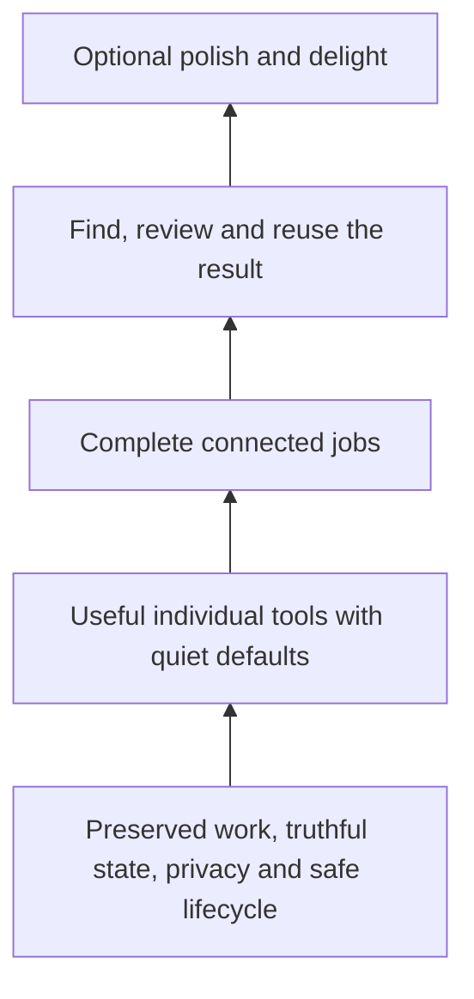

# Focused Mac foundation

Decided implementation brief, 6 October 2026. Prepared at main `7989426b41f84afaf8e38bf57ae4b2a68935aacb`. **Specification, not a claim that these changes work in the installed or public app.** [Research and observed baseline](research/mac-foundation-2026-10.md) distinguish current source, limited native inspection, user reports and platform evidence.

## Outcome and authority

Workbench helps someone speak, explain and present in the apps they already use, then keep and reuse the result. Its landing promise is small, useful Mac tools. The default experience must deliver that promise without learning a taxonomy, preparing a scene, connecting an assistant or approving unrelated permissions.

The [product contract](workbench.md) owns the product and names; [interaction contract](product-spec.md) owns existing jobs; [source map](design.md) owns implementation boundaries; the [handbook contract](../site/handbook/contract.json) owns Present capability and acceptance status; [#7](https://github.com/Ship-Work/workbench/issues/7) remains the only programme/release gate. This brief decides the refinement target and bounded work packages. It does not create another roadmap, store or release process. Its dated target supersedes conflicting older proposals for these packages; historical records retain their provenance. Implementors update each owning contract when behavior changes, rather than appending another competing design.

**Chosen approach: recompose and finish the existing native foundations.** Keep capture, recovery, History, immutable handoff inputs and toolbar lifecycle owners. Replace an implementation internally where evidence warrants it, but preserve its data and external behavior. A wholesale app rewrite would discard useful tested preservation logic while leaving managed-device constraints unchanged. A cosmetic pass would leave incomplete delivery and permission journeys unchanged. An additional onboarding wizard or universal workspace would add more to learn.

The decisions below are fixed: user outcomes, names, defaults, data/permission boundaries, retirement, closure and acceptance. Layout within the hierarchy, native control selection, Swift types, factoring and implementation order inside a package remain flexible. Material deviations need an evidence-backed update to the owning issue, including the simpler alternative and affected acceptance; ordinary coding choices do not need another product decision.

## 1. One understandable offering

The durable contribution policy is [Value before scope](workbench.md#value-before-scope), not a new checklist owned by this project brief. Its value hierarchy is:

Every addition must strengthen a named job on accepted foundations. Delivery infrastructure supports this entire hierarchy; it is not another product to grow. Marketing explains the hierarchy; it does not set a broader roadmap. If an exploratory request conflicts with it, first investigate the underlying need and recommend subtraction or an existing route. Do not mechanically implement nouns and adjectives from a prompt.

Call them **tools** in user-facing explanations. Keep the names Dictate, Meetings, Read, Snap, Snap & Talk, Draw, Present and Persona. Timer remains a small companion, not a new desktop destination. Keep Home, History, Library and Settings. Do not add Create, Workspace, Studio, Mirror or another mode hierarchy.

**Present stays Present.** Its subtitle is “Your phone on a clean stage.” Apple iPhone Mirroring is a separate external product with different requirements; renaming Workbench's USB preview to Mirror would obscure that difference. A still scene remains usable without a phone. Backdrops are optional polish, not the starting job.

| Tool | First useful action | Normal completion / useful exit | Secondary choices |
| --- | --- | --- | --- |
| Dictate | Speak into the intended app | Words saved, delivered if verified, otherwise copied with a manual paste cue | Text style, delivery, dictionary, activation |
| Meetings | Choose call audio, explicitly start | Full transcript visible and one-click Copy transcript | Microphone inclusion, recording options, review/export, follow-up |
| Read | Review selected/pasted text, then Read | Pause/Stop and return to the same draft | Voice/pace; setup stays in Models |
| Snap | Capture or deliberately paste/import an image | Inspect at readable size; Save & Copy | Crop/marks; preserve original |
| Snap & Talk | Capture screens with optional narration | Review ordered material, then a complete handoff | Skill/template only when needed; session/output choices explained |
| Draw | Mark the screen | Escape returns input to the underlying app; marks remain by existing rules | Tools/board and Timer |
| Present | Show the chosen phone in a neutral or saved stage window | End releases only Present's owned resources | Scene options, full screen, concise connection help |
| Persona | Show chosen artwork | Hide/Show preserves it; End releases the visit | Appearance, groups, optional camera/voice response |

**Surface decisions:**

- Sidebar retains the current flat Voice / Screen / Saved groups, stable names/icons and keyboard routes. No new navigation level. The page title and one-sentence outcome explain unfamiliar names.
- Home shows current work first when it exists, then four compact preparation links: Dictate, Meetings, Snap & Talk, Present; then the existing five newest History results. Replace Home's Snap quick-start with Present; Snap stays directly reachable in the sidebar, panel, toolbar and shortcut. Opening a preparation link never starts capture. Keep first-dictation guidance dismissible and returnable.
- Use a static Home heading. Remove the typewriter greeting and decorative teaching that repeats each visit. Move the existing Me profile edit entry to Persona, retaining its profile/artwork identity; no new profile system. No large capability cards, readiness dashboard, repeated setup checklist or promotional content ahead of work.
- Each tool page has a stable content area, one prominent action appropriate to its phase, and relevant status beside it. Stop/End, content selection and a useful result action must remain reachable. Put optional setup in one clearly named group for the current task; do not replace a wall of visible controls with a nested wall of menus.
- The panel remains a fast action list. The toolbar retains the already-decided compact/reveal lifecycle and fixed active-work priority in [floating-toolbar.md](floating-toolbar.md); this is not another toolbar redesign. Use the same action/admission owner on each entry point. Reuse the existing menu, keyboard and accessibility conventions.
- History owns saved results; a result may be reviewed and copied at its origin through that exact record. Library owns reusable resources/packs. Settings owns application preferences, Keyboard, Models and Connections. Do not add another result list or hide essential Copy behind assistant setup.

First viewport, at the app's supported minimum size and larger text, must show the current job, its content/status and its primary action without scrolling through optional settings. A legitimate recording or recovery warning takes priority over decorative content. Native keyboard and VoiceOver traversal are acceptance, not inferred from a screenshot.

### Why the tools connect

Tools correspond to a different input, output or live lifecycle, not every operation on those things. Dictate delivers short speech into another app; Meetings deliberately retains a long recording and transcript. They share recognition and History, not one overloaded page. Snap produces an editable image; Snap & Talk produces an ordered explanation that may become a deck. They share capture and preserved image bytes, not a mandatory session wizard. Read consumes text; it does not require that Workbench created it. Draw and Timer support a live explanation and keep their own explicit endings. These are useful separations. A provider, template, style, backdrop or delivery destination is a choice within a job, never a new tool.

| Connection | Fixed ownership and reason | Remove or constrain |
| --- | --- | --- |
| Persona → Present | Persona owns saved cards and independent artwork/camera over other apps. Present may place a **frozen still copy** inside its own shared window, so the receiver sees that composition. | Replace the embedded full Persona library with a selection-only saved-card picker: choose/cancel and an explicit Open Persona route. No creation, deletion, groups, appearance editor, camera or voice meter inside that chooser. Scene size/placement changes affect only the copy. Editing the original never silently changes a running stage. |
| Persona preparation → live Persona | Default is one selected card and Show. Advanced multi-card preparation remains within Persona; the live inspector acts on the actual shown copy. | Keep groups and layouts' distinct stored meanings; explain them as an optional set of cards and its arrangement. Do not expose these concepts to single-card first use or introduce another stage. Use direct manipulation and one shared accessible inspector, not repeated Size/Position/Appearance menus with divergent state. |
| Present → prompts | No inherent connection: text reuse is useful in any app and does not compose the phone window. Library owns saved prompts and their picker/delivery. | Remove Saved Prompts from Present and Prompts from its toolbar accessory. Preserve Library records, filters, exact text, delivery cancellation and Copy prompt as baseline. Optional Insert requires a valid captured target; opening Library must not infer one. No new Prompts tool or shortcut. |
| Library → tool preparation | Library owns shared prompts, links, skills and packs. A deliberate use/import passes a selected resource to its owning tool. | Saved scenes stay in Present; saved cards stay in Persona. No duplicate scene/persona master galleries. Legacy downloaded photos retain conditional Library access. Packs remain in Library, not a second Settings destination. |
| History → reuse | History owns saved results; tool result views and handoff link the exact record/attempt. | No separate Meetings archive, assistant inbox or new dashboard. A direct origin Copy is useful access to the same record, not duplication of ownership. |

**Settings has four sections with specific jobs:** General holds app lifecycle/appearance preferences; Keyboard owns one conflict-checked catalogue; Models holds speech recognition, text cleanup and the reading engine; Connections holds optional supported assistant destinations. Read owns voice and pace for that engine, using the same persisted selection across its entry points. Each model row first shows the job, selected choice and actual readiness. Alternate engine details and credentials appear only for the selected relevant option. Do not expose every provider field at once. Task choices such as Dictate delivery or Read voice/pace use a single `[Tool] options` owner, reachable contextually; a Settings shortcut can open that same owner. Existing Mac menu/keyboard aliases are useful when they dispatch the same action. The cut is competing ownership and irrelevant choices, not an arbitrary count of entry points.

**Present's optional composition is deliberately small:** backdrop, phone frame/fit, an optional logo and a saved still persona copy. A logo identifies the presentation without introducing another live tool; keep its existing optional import/placement, rendering, removal/export and missing-asset recovery, with no branding wizard. Keep one neutral default and native window resizing. Use the shared compact Position… control for keyboard placement rather than nested window-size/window-position preset menus. Preserve usable fullscreen/exit and exact End. Decorative hand-cutout authoring is legacy-only, not another group hidden under Scene options. The live controls refer to the running window; preparation refers to the saved scene. Neither silently rebuilds the other.

## 2. Meetings finishes with usable words

Retain `MeetingModel`, `LiveVoiceSession`, `MeetingRecovery`, shared recognition and the existing transcript store. Current main already has live text, pause/resume, reconnect, retained audio, completed text and shared transcript review; rebuilding those is outside this package.

The first completed result is **Copy transcript**, with Review transcript / Export and Prepare follow-up as secondary actions. Copy resolves the committed transcript UUID and uses its complete current text, including the final words of a long meeting. Native selected-text Command-C copies only that selection. Review exposes current/original wording and existing recording review without loading Dictate, changing the shared selection or starting playback. No guessed speaker identities; channel labels remain channel labels.

Before Start, show actual recognition readiness and source admission. Do not say Ready to record when the host will immediately reject the action for model setup or conflicting work. Model preparation reuses Models and preserves source/microphone choices. Opening Models or returning from it never starts recording. New recording prepares a fresh recording; Start is still explicit.

Represent capture problems as domain-specific reason and available action, not string equality against a microphone error. Distinguish mic denial, app-audio refusal/restriction where known, unsupported OS, source disappeared, no samples, recognition unavailable, save failure and unknown failure. Main copy says what could not happen and what was preserved; technical details remain secondary. Recheck availability on return and at dispatch.

When valid, explicitly offer microphone-only after app-audio failure, explaining that remote participants through headphones will be missing; offer app-only after microphone refusal. Never silently substitute sources or label partial coverage complete. If neither is available, preserve work, explain the limit and allow exit. No attempt to reset privacy, bypass management or install audio drivers.

During recording, Pause/Resume/Finish remain bound to that session generation. Finish waits for or reports incomplete final transcription; completed text must not conceal a missing tail. Delayed permission, audio or recognition callbacks after Cancel cannot restart capture or overwrite a newer session. Existing stop-and-keep, no-speech, save retry and quit recovery remain intact. Retry saving uses the same UUID and never repeats an external paste.

**Not in this package:** pasted external transcripts, new audio import, speaker diarization, automatic notes/send, calendar integration or another Meetings library. External transcript import needs durable provenance and unknown-duration handling before audio review can be offered correctly. Reconsider it only after repeated observed input need. “Simple copy/paste” here means useful native copying and manual paste into the user's destination.

## 3. Handoff works without optional setup

Keep one existing review over immutable selected inputs, a request and the chosen skill. A meeting follow-up uses the existing appropriate skill/reference roles; advanced editing remains possible, but the normal route does not require reselecting every role or engine.

**Copy instructions is always first-class when the material can be prepared safely.** For text it includes the actual needed content and request. For images/rich files it explains the exact attachment or local-folder step and exposes the selected files. A local path is not an attachment. Missing/unreadable evidence blocks preparation with a reason; it must never silently omit the source. Do not recursively package trash, unused audio, sibling folders or credentials.

Manual app opening and a connected run have different labels and outcomes:

| User action | Truthful outcome | Must not imply |
| --- | --- | --- |
| Copy instructions | Instructions copied; paste and attach the named files if needed | Submitted, sent or running |
| Open receiving app | The actual resolved app opened, instructions still available | Files attached, account connected or task accepted |
| Run with Claude Code / Run with Codex | Explicit compatible runner accepted this frozen task | The desktop conversation is being controlled or arbitrary rich-file tools are available |
| Result available | Validated result is readable and linked to the exact task in History | Exit code or window launch proves useful output |

Recheck provider state and distinguish off, checking, missing/unsupported executable, sign-in needed, status unverifiable/restricted, input limit, incompatible skill, busy, ready and a dispatch failure. Present one relevant explanation beside the selected destination and keep the manual action usable. Setup is secondary, retains the entire review and rechecks on return without auto-running. Preserve organization controls and the existing runner restrictions. No credential migration, paid API substitution or automatic cloud fallback.

Use current `HandoffJobsModel`, provider readiness and existing receipts. Failed/interrupted tasks keep frozen inputs and attempt identity, with Copy instructions and an explicit Retry. Unknown remote completion stays uncertain, so Retry cannot be advertised as duplication-free. Copy/review results uses the exact saved text; missing or unreadable results remain recoverable problems. Do not create a generic permission/agent framework to share a handful of view states.

Bind copied/opened/failure feedback to the originating attempt and resolved host. Closing, replacing or repeating a handoff invalidates its older callbacks. An earlier launch failure must not overwrite a newer handoff notice. The two-attempt reversed-completion case belongs in H2; #274's host-name repair alone does not close this separate race recorded in #63.

Consume [#274](https://github.com/Ship-Work/workbench/pull/274)'s actual-host labeling and [#275](https://github.com/Ship-Work/workbench/pull/275)'s research when available. [#63](https://github.com/Ship-Work/workbench/issues/63) separately owns agreement between Snap & Talk's prompt, frozen deck skill, optional template and output location. Complete that bounded scope; do not make a general artifact runner part of this reset. A manual rich-file result returns through the existing session/file/History affordances, with the file visibly accessible; do not claim automatic import/return where it is absent.

## 4. Present is a durable phone stage

[**#276**](https://github.com/Ship-Work/workbench/issues/276) and its existing Claude implementation own this work. Do not start a competing Present branch. Keep direct USB video, window by default, one explicit first device selection, exact-device reconnect, a neutral still scene without mandatory library preparation, and optional saved scene customization. The default page shows the preview, observed connection status, next useful action and Present/End. Scene editing and help are secondary.

Supplement #276's proposed PhoneLink behavior with these required distinctions:

- No phone detected is different from a failed/unavailable USB probe. A USB device without a usable screen source does not prove missing Trust. A discovered source is available to try, not proof of live video.
- Camera access not requested, pending, denied and restricted have different transitions. Observation may run without opening capture; opening Present/help never prompts for unrelated access. Permission granted after End cannot revive capture.
- Generic capture/configuration failure says the picture could not start. Say another app is using it only when the platform error establishes that cause. Preserve a bounded underlying error for diagnostics.
- Keep Choose source reachable when the remembered source is missing and exactly one alternative exists. Never switch to that alternative, a webcam or another phone without explicit selection.
- Keep source available, current-generation picture live locally and receiver-verified sharing separate. Stalled frames lose Live honestly. Reconnect/lock/sleep and stale callbacks cannot retain a false Live state. Ending is idempotent and invalidates outstanding work.
- A compact Can't see your phone? help sheet gives current facts, short conditional checks and approved alternatives. If Trust was already completed, do not loop back indefinitely. QuickTime is an optional diagnostic; failure there is another observation, not proof of a cable or policy cause.
- Opening QuickTime or another fallback waits for Workbench capture release and stage closure, launches once and reports launch failure. The saved scene survives. No personal Apple Account login, privacy reset or managed-policy change is a remedy Workbench performs.
- USB baseline remains video only. Say phone sound is not included. A Teams/Zoom route is separately rehearsed; a Mac picture cannot establish that an audience hears phone replies. Apple iPhone Mirroring remains secondary, with its same-account and phone-microphone limitations visible when selected.

Connection details are an explicit locally reviewable copy/export of **observed facts, possible causes and unknowns**. Record exact build/source/OS, probe success, source counts, authorization, phase, current-generation frame state and bounded error code. Exclude serials, raw device IDs, personal device names, accounts, media and unfiltered error dictionaries. A receipt cannot promise to identify every work-Mac restriction. Verify a headless probe's identity before transferring its permission result to the app.

Do not mark the reported work-machine problem fixed until that machine's approved route works or its restriction is established and a useful supported fallback is demonstrated. A blocked hardware gate remains explicit; synthetic PhoneLink tests do not close it.

## 5. Remove dormant scope without losing work

Retirement is a behavior change with preservation tests, not file deletion. #276 already owns Present route/motion/wallpaper simplification and its announced separate photo-sync door removal. Coordinate with that owner, including the exceptions below.

| Area | Decision now | Preservation / return trigger |
| --- | --- | --- |
| Present motion and animated desktop | Remove from the normal Present surface and new-use paths; default still renderer | Keep assets/config readable. Stop owned motion safely; never restore over later manual wallpaper. Return only after a named use case and receiver-tested prototype. |
| Wallpaper creation from scenes | Retire user-facing creation actions; no new Wallpaper tool | **Keep pending Restore desktop/recovery reachable** until resolved, with existing ownership check. Removing setup must not strand a prior effect. |
| iPhone photo/cloud transfer | Remove Home arrival cue and new-use Library/Settings promotion as coordinated in #276; keep conditional legacy access for existing records or opt-in | Keep every downloaded item inspectable/exportable, including successful transfers never imported into a scene. Retain scene references, record provenance, pending/failed recovery and existing disable/cloud-removal controls for opted-in users. Do not leave refresh running with its switch hidden. No automatic remote deletion, entitlement removal or data migration in a UI-removal PR. Resolve active transfers before retiring their controls. |
| Scene iCloud sync | Pause new setup and routine cloud activity separately from phone-photo transfer | Keep `MacSceneSync`'s local portable storage, migration, materialized assets and recovery. Preserve pending operations and undownloaded records honestly; local availability must not be claimed for cloud-only assets. Conditional legacy recovery may explicitly retrieve/export existing work, without enabling ongoing sync. No automatic cloud deletion or entitlement removal. |
| Chrome destination integration | Make the existing pause effective across UI and runtime, as specified below | Saved URLs/profile bindings/shortcut assignments remain inspectable and exportable; normal URL opening is explicit and makes no profile guarantee. No new browser infrastructure. |
| Decorative hand cutouts | Remove new authoring/import/tone/position controls from the core scene flow | Render existing saved assets; retain remove/export and missing-asset recovery. No background asset migration. |
| Animated greeting / profile promotion | Static Home; Me profile editing under Persona | Preserve the same profile and existing art. No reset or new account. |
| New recipe engines, agent/MCP bridge, arbitrary imports, extra platforms | Defer | Only return for observed repeated friction the current file/native route cannot solve, with an owner and acceptance. |

Existing issues are the queue. #58/#57/#26/#27/#59/#65/#70 and other speculative work are not dependencies of this reset. The release owner records their disposition in their existing issues when reconciling, preserving unfinished recovery or accepted obligations. Do not bulk-close them as fixed or infer retirement deletes data. #130/#131 and #75 do not become active through this brief. The old #134 plan's “Meetings inside Dictate” is superseded by current main's Meetings destination; do not reintroduce that fold.

**Paused must mean unavailable to start, not merely hidden.** Browser package G removes Present's Switch to Browser Tab, application-menu Switch to…, shortcut editing/catalogue promotion and registration of saved Switch to bindings. Fresh default bindings are already disabled; upgrade profiles are the important additional case. Remove Chrome connection Enable/Repair/extension-install promotion from Library. Stop automatic socket/listener startup from `browser.enabled`; reject indirect Library activation, extension commands and stale callbacks while paused. Retain the preference/binding values without registering or acting on them. An older extension may still retry from Chrome: refuse commands, never queue them for later replay, and do not claim the app controls Chrome's process or uninstalls the extension.

Saved browser links retain their target metadata. Show a concise paused explanation with Copy link and explicit Open in default browser; opening must neither silently clear the profile binding nor claim the intended signed-in profile was used. A conditional existing-connection status can allow Stop/disconnect. Do not move browser setup to another Settings page. Keep source and compatibility tests for a later evidence-backed decision, but remove active promotion and new installation/package instructions. A single product availability decision must govern entry, registration, startup and dispatch; this does not justify a general feature-flag framework or user switch.

Phone-photo and scene-cloud retirement follow the same closure rule: no hidden automatic network refresh on launch, activation or page visit after new use is paused. Cancel owned refresh safely, preserve pending/uncertain outcomes and local records, retain explicit legacy stop/recovery/export, and never equate a local archive with confirmed cloud deletion. Package E may land connection repair and these removals in separate bounded PRs under its existing owner. For each retired integration, record visible entries, shortcuts, startup/indirect routes, running callbacks, saved-state behavior and packaging/docs; source search and behavioral tests must supplement the surface registry.

Legacy scene retrieval must be read-only against existing cloud records. Do not call the current general `SceneLibraryModel.refresh()` as a recovery shortcut: it resumes sync and can upload queued edits, and its cloud sync can create a zone. An explicit retrieval/export cannot enable recurring sync, create/delete records or transmit unrelated pending edits. Preserve that queue unchanged. Test a cloud-only scene alongside dirty local work; missing account/access yields an honest recoverable state, never an empty-scene overwrite. Reuse bounded existing read operations; this exception does not authorize rebuilding cloud sync.

## 6. Make refinement a delivery requirement

More prose alone will not prevent regression. Add acceptance to the existing surface checks, PR review and publication path, with one integration/release owner. No new quality dashboard, background monitor, telemetry or cleanup schedule.

**Contribution check:** Add the existing [Value before scope](workbench.md#value-before-scope) questions to the existing PR template during package F. Review changes across product and supporting utilities together. Name the removed/replaced complexity or justify its net increase. A claimed simplification that adds another workflow, settings group or persistent service fails until a smaller option has been ruled out. This is proportionate review, not an additional approval system or document per fix.

| Supporting area | Decided boundary | Acceptance / existing owner |
| --- | --- | --- |
| CI/CD | Preserve the single `.github/workflows/ci.yml`, its scope classifier, merge-group handling and required aggregate gate. Extend existing jobs; do not add a separate “quality” workflow, orchestrator or release command. Parallel phases are not sprawl merely because there are several jobs. | Each added check names the concrete failure caught and its execution/maintenance cost. Test selective skips and negative gate cases. Consolidate only proven duplicate coverage; do not weaken protections to reduce a count. |
| Updates | Keep `WorkbenchUpdates`/Sparkle and one installation/promotion path. Show version/value, useful progress and a clear deferral while work is active. No new upgrade wizard or competing checker. | Actual old-to-new update, busy deferral, cancellation/failure, relaunch and saved-data preservation. Reuse #271 and the release workflow. |
| Permissions | Contextual requests only for the action that needs access; local saved-material operations remain useful | Denied/restricted/unknown and return-from-Settings checks; no global “finish setup” wall or permission-reset support recipe. |
| Settings | General, Keyboard, Models and Connections retain shared preferences; task options live with their tool | A new switch needs a real persistent user choice. Resolve design uncertainty with a default and evidence, not by exposing both designs as switches. |
| Marketing/docs | One focused landing promise and one owning contract per capability. Derive status from accepted package/route evidence | Audit each current claim and route against the release. Correct “Signed by Apple” to accurate Developer ID signing/notarization wording; qualify universal call support, automatic rich-result return, lossless absolutes and setup-duration claims unless the evidence supports them. No new microsite or feature-led page for this reset. |

The CI baseline already has one workflow, read-only permissions, explicit merge-group triggering, a documented native split and a final conditional aggregate. No evidence here justifies replacing that foundation. The missing acceptance tie should be a small addition to the existing publication preflight. If its implementation grows a second framework, reduce it before merging.

**Implementation check:** Every affected journey names its entry, state owner, default success, unavailable dependency, cancellation, retained work and useful exit. Extend the relevant existing behavior harness and production surface gallery. Check actual enabled actions and callbacks, including stale menu/permission completions; a test of the label function alone is insufficient. Use independently specified expected outcomes. A deliberately broken case must fail the intended assertion.

**Native check:** Use synthetic material on the signed candidate, record the in-app build identity and keep the test result separate from source/build/CI. Do not reset production data or TCC. Actual denial, restricted access, keyboard/paste, device and receiver behavior must be tested by an owner able to exercise them. Fixtures can cover combinations but cannot stand in for those observations.

**Comprehension check:** Before accepting the combined experience, a person who did not implement it attempts three outcome-only tasks without coaching: finish a meeting and paste its words, prepare an assistant handoff with connections unavailable, and put a phone on the stage or recover from an unavailable phone. Record the first action, wrong turns, help needed and result. A normal path that needs the implementor to explain which verb/menu/setup to use fails this review even if all buttons technically work. Correct the hierarchy or words in the owning slice, not with another tutorial. One independent contributor is sufficient for this bounded gate; it is not a claim of statistically representative user research.

**Release check:** Extend the existing release evidence and `scripts/release/publish_update.py` preflight with a versioned acceptance receipt next to `release.json`, bound to source, channel, build, bundle and final archive hash. The receipt references the release's human-readable evidence, lists required journey IDs and pass/fail/not-tested dispositions, exact environment and observer. It contains no user content. A missing/unknown ID, stale artifact identity, missing evidence, or failed/not-tested required scenario rejects promotion before an external write. CI tests these rejection cases with fixtures. A document claiming pass is an attestation, not a substitute for observation or independent review.

The existing version-controlled release configuration supplies the baseline and impacted/promoted capability/route requirements **independently of the candidate receipt**. The receipt cannot choose its own smaller required set. Expand H2/P1 into explicit tested host/client/route variants for every promoted route; a generic aggregate pass cannot cover an omitted variant. Changing that policy requires an explained scope/claim change in review. Keep reset-completion requirements distinct from the impact policy for an unrelated patch release.

Keep cheap core smoke checks for each candidate; expand native coverage for the affected source/runtime/OS boundaries. Older evidence can support an unchanged path only with an explicit impact review and still-valid environment, never solely because the version number increased. Preview findings transfer to production only with source/configuration equivalence plus exact-production-package identity, opening and permission/delivery smoke. UI screenshots are not that equivalence check. Consume the release-lead work in [#277](https://github.com/Ship-Work/workbench/pull/277), rather than adding another release tool.

All eight visible tools and saved-work access receive a core smoke. The detailed foundation gate below is required before this reset is described as complete. An unrelated patch release may retain a documented known limit, but it must not promote the unaccepted capability or claim this reset is finished. Withdraw or narrow an unsupported claim at the owning site/guide contract; do not write a waiver that calls failed behavior accepted.

| ID | Complete journey / acceptance | Required evidence |
| --- | --- | --- |
| D1 | Dictate from a real app, stop, preserve words, verified insertion or obvious manual Copy/Command-V; no automatic submit | Native ordinary field plus unavailable Accessibility path; retained draft/history and changed-target case |
| M1 | Start appropriate call source, live words, pause/resume, finish, full Copy transcript and paste, review original/export, new recording | Signed native call + mic and app-only/headphones; long transcript final marker; >30-minute recording; actual source loss/recovery |
| M2 | Unready model, permission refusal, invalid source, cancel during setup, save failure, quit/retry | Targeted harness plus native permission/settings-return scenario; same UUID, retained audio and no late capture |
| H1 | Text-only follow-up with both assistants unavailable, full instructions copied/pasted, unchanged prepared work | Native clipboard/keyboard/VoiceOver; no inference process, setup or Accessibility needed |
| H2 | Image/file handoff with attachment-only host, limits, setup return, interruption/uncertain completion, retry and result reuse | Frozen selection tests; native real host manual roundtrip; connected roundtrip only for each promoted supported runner |
| S1 | Snap capture, inspect, crop/mark, Save & Copy, search/reopen, cancelled selector | Native window/region selector and paste; original retained; no phantom record after cancel |
| ST1 | Five synthetic Snap & Talk sections, reorder/correct one, deliberate template/no-template, handoff, inspect useful deck and find it again | #63 exact prompt/skill checks plus actual selected host and rendered output; original bytes unchanged; no false auto-return claim |
| P1 | No phone, discovered phone, explicit selection, current frame, window sharing, End, reconnect; managed unavailable route | #276 state/lifecycle checks plus actual approved work Mac/phone and named meeting receiver; distinguish local video/audio claims |
| P2 | Remembered device missing/one alternative, failed probe, unknown error, denied/pending access, fallback launch failure, late frame after End | Negative state tests and native applicable paths; independent work and saved scene survive |
| R1 | History search → exact transcript/result/image review → copy/export/reuse → back | Consume #263/#137 evidence; native foreground-refresh and exact-task receipt navigation still need their own observation |
| U1 | Read current selection/draft, pause/stop; Draw then Escape; Persona Show/Hide/End; Timer end/restart | Affected signed native entry points, keyboard, active-work precedence; consume #264/#265/#267 work rather than rebuild |
| U2 | Existing installation discovers an update, explains it, defers for active work, installs/relaunches and preserves saved material | Actual old-to-new artifact and edition; native busy/cancel/failure path, separate existing Sparkle preference retention; consume #271 |
| X1 | Minimum-size/larger-text/VoiceOver, relaunch with retained work, upgrade an existing profile, fresh account first use | Exact candidate; data preserved; scoped actual denied permissions; no inaccessible primary/Stop/Copy or startup permission wall; three uncoached outcome tasks |
| X2 | Retired doors and runtime admission absent, old resources and pending recovery reachable, marketing matches tested package | Registry plus source-route audit; upgraded enabled browser/shortcut and cloud/photo profiles; never-reused download and cloud-only scene; no listener/refresh/command replay, native access/export/stop and desktop recovery; site/handbook claim review |

For presentation, a remote participant must see readable current video after resize/rotation/reconnect and a clean End. Any promoted audio route additionally requires presenter voice, phone reply, interruption and a second response without echo on the named app/OS/client/headphone setup. No universal “any call” or “works on managed Macs” claim follows from a local preview. Test the minimum supported OS and the current release OS for affected capture/permission APIs, or explicitly narrow the supported route.

## Delivery packages and dependencies

GitHub issues below own status and implementation claims; this table is a handoff map, not a second task tracker. Before starting, reread current main, issue comments and open PRs. Another owner may have completed part of a slice since this snapshot.

| Package | Existing owner / code starting points | Boundary and merge order |
| --- | --- | --- |
| A: focused ownership and surfaces | New scoped issue; `WorkbenchHome`, Persona preparation/live inspector, Library/prompt picker, page headers, `SurfaceGallery`, surface registry | §1; Home hierarchy, Me route, one settings owner and prompts out of Present. #276 owns Present's selection-only Persona picker and stage controls; agree file ownership first. No toolbar reducer rewrite. |
| B: Meetings completion | New scoped issue; `MeetingWorkspaceView`, `MeetingModel`, `MeetingAudio`, `TranscriptReview`, `AppModel` transcript copy/retention | §2 and M1/M2; first committed Copy, then admission/problem projection. Review/export reuse #263. No new import/recognition engine. |
| C: resilient handoff | New scoped issue; `HistorySelectionControls`, `HandoffJobs`, `SubscriptionCLI`, existing delivery feedback | §3 and H1/H2; adopt #274 first or coordinate equivalent change. Availability/readiness then truthful manual and failed-task paths. |
| D: portable deck contract | Existing [#63](https://github.com/Ship-Work/workbench/issues/63); `ReadbackModel`, `ReadbackView`, bundled deck skill and checks | ST1, template/output scope and exact host trial. Independent of generic runner work; no auto rich-artifact engine. |
| E: phone stage | Existing [#276](https://github.com/Ship-Work/workbench/issues/276); StageKit capture/presentation/PhoneLink, handbook | §4, scoped §5 retirement and P1/P2. Existing Claude owner; this brief supplies boundary corrections and cross-app acceptance. |
| F: durable acceptance | New scoped issue under #7; existing harnesses/gallery, release scripts/evidence, contributor instructions | §6; implement receipt validation before integration promotion. Coordinate #277. Reconcile previous open acceptance by actual evidence, not ticket age. |
| G: effective browser pause | New scoped issue; `PresenterBridge`, `PresenterPanel`, `DemoLibraryView`, app menu/hotkeys/catalogue, browser host compatibility | §5 and X2. Close every entry and runtime admission; preserve targets/settings. Separate from A's prompt ownership and E's cloud/photo retirement. No adapter expansion or browser uninstall. |

A/B/C/G can proceed with agreed file ownership; `WorkbenchHome`, Library and `main.swift` changes must have one writer at a time, not competing bulk edits. E stays with its current owner. D can progress independently. F begins with acceptance infrastructure and finishes only after the combined signed candidate passes. Do not put independent app behaviors in one giant PR. Use a documentation/spec PR first; implementors create bounded code PRs referencing their issues and this brief.

**Completion means:** all fixed decisions implemented or explicitly superseded with evidence, relevant source/CI checks pass, this matrix has actual required native/device/receiver evidence, old reachable contradictions are reconciled, and the exact public package plus site claims match the accepted result. A spec PR or green fixture suite completes neither implementation nor release. This cannot guarantee no future bugs; it makes incomplete journeys and new sprawl a reviewable, enforceable delivery failure instead of a future user cleanup request.
