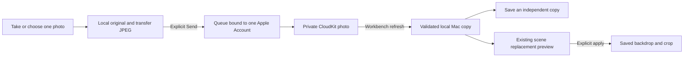

# Photo for Mac

Product and engineering contract for selected-photo handoff. A real existing iPhone photo has downloaded on the installed Mac Preview after a transient timeout and retry, and the newer install retains it. This is one observed download, not proof of every deferred-delivery or account-recovery path. Editable scenes are a separate journey: see the [personal-scenes contract](research/personal-scenes.md) and [canonical public evidence](https://workbench-mac.vercel.app/scenes/#evidence). Paired editable-scene delivery remains unverified; the signed and notarized Mac Preview 3 now includes handoff. The iOS build has been uploaded to App Store Connect, with tester distribution and review still pending.

## The job and its boundaries

**Take or choose a photo while away from the Mac, deliberately keep it for later, then find a usable local copy in Workbench when returning to the Mac.** Optional private iCloud handles the distance between devices. Workbench handles the selected collection, honest status and the next useful action.

| Rank | Outcome | Current scope |
| --- | --- | --- |
| **1** | A chosen photo reaches the Mac later, without matching folders by hand. | Native Camera/Photos, optional name, local preservation, explicit Send, private account-bound cloud queue, Mac **Saved resources → From iPhone**. One real received photo is verified; repeat deferred delivery and recovery remain acceptance work. |
| **2** | Reuse that photo as a backdrop without rebuilding a composition. | **Use as backdrop…** chooses an existing saved scene and opens its ordinary replacement preview. Applying saves only its backdrop/crop; foreground layers and currently presented output stay intact. Implemented. |
| **3** | Take a nearby photo directly into the Mac. | Apple's Continuity Camera integration is parked. It is a different, Mac-initiated job and does not solve capture while away. |

This feature transfers selected photos; it does not synchronize the whole Photos library, transcripts, recordings, dictionary or scene edits. Optional editable-scene sync is owned separately by `SceneSyncKit`, with its own records, zone and preservation rules. It creates no public download link or shared team library. Ethan and Matt using different Apple Accounts do not receive each other's private photos. Desktop wallpaper and presentation composition remain independent jobs; handoff never installs wallpaper or starts a presentation.

## What Apple already supplies

| Native option | Already useful for | What Workbench adds, if needed |
| --- | --- | --- |
| **iCloud Photos** | Photos available across the user's devices. | A small, deliberately selected Workbench collection and a direct next action. If ordinary Photos availability solves the job, no new transfer tool is needed. [Apple guide](https://support.apple.com/en-gb/108782) |
| **AirDrop** | Explicit transfer to a nearby Apple device. | A durable pending item for a Mac that will be used later. AirDrop arrival does not itself import an item into Workbench. [Apple guide](https://support.apple.com/guide/iphone/use-airdrop-to-send-items-to-nearby-devices-iphcd8b9f0af/ios) |
| **Files / iCloud Drive** | Deferred file availability in Files and Finder, including manual export. | Selection, account-bound retry and clear local availability without asking the user to pair folders. Cloud visibility alone does not mean a file is downloaded. [Apple sync guide](https://support.apple.com/en-au/guide/icloud/mm19ef899373/icloud), [download controls](https://support.apple.com/guide/mac-help/work-with-folders-and-files-in-icloud-drive-mchl1a02d711/mac) |
| **Continuity Camera** | A supported Mac app requests a nearby iPhone/iPad photo or document scan. | A future native entry into the existing import flow. This is distinct from iPhone-as-webcam and the existing device presentation feed. [Apple user guide](https://support.apple.com/en-gb/102332), [AppKit integration](https://developer.apple.com/documentation/appkit/supporting-continuity-camera-in-your-mac-app) |

## Competitor research and what survives the review

Reviewed primary product documentation on 13 September 2026, with a bounded trial attempt rather than a claim to have exhaustively tested these products.

| Reference | Useful pattern | Workbench decision |
| --- | --- | --- |
| [Yoink for Mac](https://eternalstorms.at/yoink/mac/) and [iOS](https://eternalstorms.at/yoink/ios/) | A temporary shelf makes moving selected content easier; nearby Handoff/Continuity and iOS cloud capabilities have distinct availability. | Borrow one recognisable arrival surface, not a general cross-app shelf. The official trial was installed after Developer ID/signature verification; native automation did not obtain an operable trial window. No completed hands-on transfer is claimed. |
| [Anybox](https://anybox.app/) | Private Apple-device collection and retrieval. | Borrow deliberate collection and useful recall; reject tags, albums and an all-content organiser for this job. |
| [Dropover](https://dropoverapp.com/faq) | Quick gathering and optional cloud-link sharing. | A shareable download link serves another recipient; it is not a private same-account inbox. No public-link backend added. |
| [LocalSend](https://github.com/localsend/localsend) and its [protocol](https://github.com/localsend/protocol) | Nearby cross-platform transfer without a hosted file store. | Retain as a future interoperability reference. It does not solve deferred arrival while the receiving Mac is absent. |
| [Unclutter](https://unclutterapp.com/changelog) | A files shelf with provider-backed folder workflows; its fixes document placeholder/rename edge cases. | Shared-folder access needs hydration, conflict and permission care. It is an alternative, not a shortcut around sync correctness. |

A Claude architecture critique received a generic design brief, not repository source or private records. We accepted its reliability-first framing, optional naming and insistence that cloud upload cannot prove Mac arrival. We rejected its shared-folder-first recommendation: it moves setup and provider repair onto every user. Apple confirms both CloudKit and iCloud Documents support Developer ID distribution; neither is an App-Store-only route. CloudKit also does not automatically supply an Android migration path. The decision below records those tradeoffs rather than treating the critique as authority.

## The current journey

1. On iPhone or iPad, open **Saved → Photo handoff** (opens **Photo for Mac**) using its toolbar action, or reopen a saved photo. Take a photo or select one with the native Photos picker. Camera denial, cancellation or unavailable hardware leaves Photos available. For the primary presentation-preparation job, **Tools → Scenes** owns camera/photo selection directly; it does not require a separate photo handoff first.
2. Review the image and optional name. **Keep on this device** saves locally. **Send photo** saves locally first, then explicitly queues that photo for the connected private iCloud account. Enabling handoff alone does not send older local photos.
3. On the Mac, enable handoff using the same Apple Account and open **Saved resources → From iPhone**. Launch, activation and **Refresh** check for arrivals when enabled. A downloaded copy can be used offline.
4. Choose **Save a copy…**, or **Use as backdrop… → saved scene → Preview backdrop**. The replacement editor requires a deliberate apply action. With no saved scene, prepare one in **Present a device** first; receiving a photo does not create a duplicate scene.



There is no constant background receiver, push notification or delivery-time promise. Refresh performs bounded work and may ask for another refresh. A suspended app, offline device, unavailable account, quota error or retry delay can postpone transfer. Turning handoff off stops further cloud work; local files and already accepted cloud copies remain. Cancellation cannot retract a write the server already accepted.

## Data, status and lifecycle contract

**Original means the bytes supplied by the selected-photo or camera adapter before Workbench processing.** The camera may supply an encoded image rather than a sensor/RAW original. Workbench retains those bytes on the sending device; it does not silently add a camera capture to the system Photos library. The Mac receives an optimised derivative, not the full original asset.

The current normalisation accepts one decodable still image, at most 64,000,000 input bytes and 50 megapixels. It applies orientation, draws a fresh sRGB image, flattens transparency to white and encodes JPEG at quality 0.88 with a maximum 3840-pixel long edge. GPS/EXIF and source comments are not copied into that JPEG. The transfer limit is 40,000,000 bytes. These limits describe this implementation, not a promise to preserve HDR, transparency, Live Photos or every source format.

| Visible status | What has happened |
| --- | --- |
| **Only on this device** | Local image files and manifest were saved. No cloud send was requested. |
| **Queued for iCloud** / **Uploading to iCloud** | Send intent is durable for one account; upload is pending or in progress. |
| **In iCloud** | Cloud upload was acknowledged and that state saved locally. This does **not** mean the Mac has received it. |
| **Downloaded on this device** | The receiver validated the JPEG and committed its local files and manifest. |
| **Removal queued** | A cloud removal intent is saved and still needs completion. |
| **Removed from iCloud · local copy kept** | Cloud removal was acknowledged or observed; this device's independent copy remains. |

Engineering invariants:

- `PhotoHandoffModel` owns one local, versioned `photos.json` manifest plus UUID-named image directories. Media is staged before installation; the manifest uses atomic writes. Files are validated before publishing a usable result. An unreadable or future-version manifest blocks writes and preserves its files.
- A photo has a stable UUID, version, title, creation time, source platform, byte count, dimensions and SHA-256 digest. Retrying the same UUID/content is idempotent; the same UUID with different content or ownership is an error. User titles and remote metadata never become storage paths. Received data is checked for supported version, size, digest, JPEG decoding and dimensions.
- Queue ownership and refresh checkpoints use **container + environment + opaque CloudKit user record identity**. Explicit Send may queue offline for the last verified owner; it never binds an unknown owner. Before network work, the current account must still match. Account changes and disablement cancel owned operations and invalidate late completions. Reconnecting another account does not retarget the previous account's queue; its data remains stored separately.
- Cloud records use the private `WorkbenchPhotosV1` zone and `PhotoV1` record type. Outgoing IDs use the verified account record name. Incoming IDs may contain that same owner or Apple's `CKCurrentUserDefaultName` alias, accepted only within the verified private-database operation; envelope ownership, identity and account guards remain required. This fixes the returned-zone-owner rejection seen on a real photo without accepting another account. Signed account-switch recovery remains a separate check.
- A receiver advances its per-account change checkpoint only after every item in that batch is validated and durably handled. Damaged or conflicting data keeps the previous checkpoint. An expired checkpoint is cleared for a later rescan, with UUID/digest deduplication. Server retry-after delays are retained. There is no endless retry loop.
- Local removal deletes the app-owned local item and retains an account/UUID/digest suppression receipt, so an ordinary refresh does not immediately download it again. It does not delete an existing cloud copy. Removing a queued local item also removes its pending send. Cloud removal is separate and explicit; its durable intent takes precedence over upload retries. Already downloaded copies and independent scene/export copies survive cloud removal.
- A scene receives its own copy only when the existing replacement transaction is applied. Cancel leaves the scene unchanged; apply checks for a stale backdrop and preserves newer unrelated scene fields. The live presentation and desktop are not rewritten by this save.

## Architecture decision: private CloudKit, with local ownership

The decision is driven by a small collection with stable item identity, explicit send/removal and status. It is not a workaround for missing developer signing. Apple identity and storage remove the need for a Workbench account or service credential; account/storage availability still matters.

| Option | Decision and trigger to revisit |
| --- | --- |
| **Private CloudKit + local queue** | Chosen and implemented using bounded operations, immutable photo records and change checkpoints. Keep local work usable independently of the transport. See [Apple's CloudKit choices](https://developer.apple.com/documentation/cloudkit/deciding-whether-cloudkit-is-right-for-your-app) and [asset lifecycle](https://developer.apple.com/documentation/cloudkit/ckasset). |
| **App-owned iCloud Documents container** | A credible alternative if ordinary files visible in Files/Finder become the main product. It avoids manual folder matching but still needs provisioning, file coordination, download/conflict handling and account lifecycle. Both CloudKit and iCloud Documents support Developer ID distribution; neither is rejected as App-Store-only. [Apple document example](https://developer.apple.com/documentation/uikit/synchronizing-documents-in-the-icloud-environment), [capability table](https://developer.apple.com/help/account/reference/supported-capabilities-macos/) |
| **User-chosen cloud folder** | Keep manual export as an escape path. Automatic folder pairing is not implemented: permission/bookmark repair, provider placeholders and matching two folders would add setup to the primary job. Revisit for an explicit interoperability need. [Apple directory access](https://developer.apple.com/documentation/uikit/providing-access-to-directories) |
| **Portable hosted or self-hosted service** | Deferred until a real non-Apple or multi-user job justifies identity, storage, deletion, security and operating costs. A future transport may reuse stable local item semantics; the current account type is CloudKit-specific and is not claimed to be a completed portable service API. Do not add a server or generic plugin framework now. |

The photo adapter continues to use bounded CloudKit operations and its own durable checkpoints. **Scenes already uses `CKSyncEngine` in a separate adapter**: enabled foreground edits coalesce after 800 ms; backgrounding cancels transfers while retaining waiting work. Neither route guarantees arrival time. Photo queues and scene-engine checkpoints must not be combined. See the [scene architecture](research/personal-scenes.md#current-shared-architecture) and [Apple reference](https://developer.apple.com/documentation/cloudkit/cksyncengine-5sie5).

## Human, agent and developer entry points

| Reader | Canonical entry and responsibility |
| --- | --- |
| **Human** | Saved → Photo handoff on mobile (opens Photo for Mac); Saved resources/From iPhone on Mac. Enable, choose, send, refresh and reuse are visible actions. Keep local and cloud removal distinct. Use native Share/Save a copy when cloud is unavailable. |
| **AI agent** | Follow this contract and the user's chosen action. There is no photo-handoff CLI, App Intent, public API server or automatic agent upload entry. Do not edit the manifest to bypass consent, account binding or signing. Use explicit synthetic test mode for demonstrations; never substitute personal photos or reset a live library. |
| **Developer** | [`PhotoHandoffKit`](../Sources/PhotoHandoffKit) owns model, store, validation and the `PhotoHandoffTransport` seam. [`PhotoHandoffView` on mobile](../Mobile/Workbench/PhotoHandoffView.swift) owns native capture/selection; [Mac UI](../Sources/LocalVoice/PhotoHandoffView.swift) owns recall/export. [`StageKitController`](../Sources/StageKit/StageKitController.swift) opens the existing [`DemoScenes`](../Sources/StageKit/DemoScenes.swift) replacement transaction. |

The Mac compiles the shared code as a SwiftPM target. The mobile project generator references those same files directly; it does not copy their logic or import AppKit. The model accepts a caller-owned directory and injectable transport for isolated tests. `allowsCloudAccess: false` forces a local-only transport. Mobile Debug test arguments create fresh temporary libraries; `--ui-testing-handoff` additionally exposes a synthetic photo, never a live-library reset.

## Signing and configuration gate

Mac Settings and the From iPhone collection show handoff settings only when the existing runtime configuration check succeeds. This retains the provisioned Preview route and any genuinely configured production build, while an unconfigured public Workbench build does not advertise an unavailable cloud option. Already downloaded and local photos remain accessible; this visibility rule does not change their files, cloud settings or transport.

Ordinary mobile builds default to cloud disabled. The optional [`PhotoCloud.xcconfig`](../Mobile/Configuration/PhotoCloud.xcconfig) and [entitlements](../Mobile/Configuration/PhotoCloud.entitlements) enable the provisioned paired Preview. Both apps must be authorised for `iCloud.com.ethdawg.workbench.preview` and the **same Production environment** for the current Developer ID Mac pairing. A Development iPhone build against that Mac accesses a different database. A Release build configuration alone does not select Production CloudKit. [Apple iCloud configuration](https://developer.apple.com/documentation/xcode/configuring-icloud-services)

[`check-photo-cloud.py`](../scripts/check-photo-cloud.py) checks exact Preview bundle/team, CloudKit container and environment, profile platform/expiry, and, for `--app`, the actual signature and embedded profile. It does not create capabilities, sign in or prove account/transfer availability. Mac runtime additionally inspects signed entitlements. iOS uses the packaging-verified build marker because it has no public `SecTask` entitlement API; setting a marker alone is not sufficient provisioning evidence.

A profile describes what Apple **authorises**; a signed app declares what it **uses**. The issued profiles inspected during setup had the following shapes. The checker accepts these profile allowlists without allowing them as app claims. [Apple TN3125](https://developer.apple.com/documentation/technotes/tn3125-inside-code-signing-provisioning-profiles)

| Location | iCloud services | CloudKit environment |
| --- | --- | --- |
| Issued Developer ID Mac profile | Literal string `*` | String `Production` |
| Issued iOS ad hoc profile | Literal string `*` | Array containing `Production` and `Development` |
| Signed paired app | Array containing `CloudKit`, with no wildcard entries | Exact string `Production` |

Profile environment arrays must contain distinct supported values and authorise the requested environment. The container array must explicitly include the paired container. Generated signing entitlements narrow the authorisation to that container, `['CloudKit']` and the selected environment string; profile wildcards and environment arrays are never copied into the app's claims. Synthetic checker tests cover wrong-environment, malformed-array, substring and profile-versus-app cases. Run the current suite with `python3 scripts/test-photo-cloud.py`; earlier 29-check results describe that historical setup revision. These tests do not establish that an issued profile includes a particular phone or authorises a selected signing certificate; check those separately before installation.

After authorised profiles exist, preflight them and the resulting apps with the actual team and paths, for example:

```sh
python3 scripts/check-photo-cloud.py --platform ios --team TEAM_ID --environment Production --profile /path/to/iphone.mobileprovision
python3 scripts/check-photo-cloud.py --platform macos --team TEAM_ID --environment Production --profile /path/to/mac.provisionprofile
python3 scripts/check-photo-cloud.py --platform macos --team TEAM_ID --environment Production --app "/path/to/Workbench Preview.app"
```

The optional Mac packaging command is `bash scripts/build.sh --preview --photo-cloud-profile /path/to/mac.provisionprofile`; select the intended Developer ID identity if more than one is available. It verifies the profile before building and the signed app afterwards.

For iOS, register the intended physical phone and use an installed **ad hoc distribution profile** plus its authorised **Apple Distribution** certificate. The profile must include that phone; an App Store profile is not a substitute for direct installation. Regenerate with `python3 scripts/mobile-project.py`, then archive the `WorkbenchMobile` scheme for a device. The generator writes explicit target defaults `NO` and `Development`: merely assigning a base xcconfig can leave those target values winning. Use `-xcconfig` as an override, or explicitly change the target's Release values, and inspect the resolved settings before building. For example, with the actual team/profile and output paths substituted:

```sh
xcodebuild -project Mobile/Workbench.xcodeproj -scheme WorkbenchMobile \
  -configuration Release -destination 'generic/platform=iOS' \
  -xcconfig Mobile/Configuration/PhotoCloud.xcconfig \
  -archivePath /path/to/WorkbenchMobile.xcarchive \
  DEVELOPMENT_TEAM=TEAM_ID CODE_SIGN_STYLE=Manual \
  CODE_SIGN_IDENTITY='Apple Distribution' \
  PROVISIONING_PROFILE_SPECIFIER=PROFILE_NAME archive
```

In Xcode 26, **Organizer → Distribute App → Release Testing** exports an installable build for registered devices. For CLI export, `release-testing` is the current method name; `ad-hoc` is deprecated. Use a local `ExportOptions.plist` with the actual team/profile substituted:

```xml
<?xml version="1.0" encoding="UTF-8"?>
<plist version="1.0"><dict>
  <key>method</key><string>release-testing</string>
  <key>destination</key><string>export</string>
  <key>iCloudContainerEnvironment</key><string>Production</string>
  <key>teamID</key><string>TEAM_ID</string>
  <key>signingStyle</key><string>manual</string>
  <key>signingCertificate</key><string>Apple Distribution</string>
  <key>provisioningProfiles</key><dict>
    <key>com.ethdawg.workbench.mobile.preview</key><string>PROFILE_NAME</string>
  </dict>
</dict></plist>
```

```sh
xcodebuild -exportArchive -archivePath /path/to/WorkbenchMobile.xcarchive \
  -exportPath /path/to/Export -exportOptionsPlist /path/to/ExportOptions.plist
```

Inspect the exported IPA's `Payload/WorkbenchMobile.app` with the `--app` preflight before installation. Export can re-sign the archive: verify its final profile, signature and Info values, not just the source entitlements or archive. Workbench's Info marker must be enabled and its Info environment must match the signed `Production` entitlement. Install that exact export and launch normally without test arguments; an ordinary Debug Run may overwrite it with a Development build. This route needs no TestFlight or App Store upload. [Apple registered-device distribution](https://developer.apple.com/documentation/xcode/distributing-your-app-to-registered-devices), [current distribution methods](https://developer.apple.com/documentation/xcode/distributing-your-app-for-beta-testing-and-releases)

The schema was deployed to Production and its field types verified during setup on 13 September 2026:

| Record type | Field | CloudKit type |
| --- | --- | --- |
| `PhotoV1` | `metadata` | Bytes |
| `PhotoV1` | `image` | Asset |

To reproduce it without creating service tokens, open CloudKit Console, select this container's **Development** environment and **Schema → Record Types**, then create or verify `PhotoV1` and those exact fields. Save, choose **Deploy Schema Changes**, review the changes and deploy to Production. Confirm both fields there. This copies schema, not Development records. The app creates each user's private `WorkbenchPhotosV1` zone; no manually shared zone or public photo record is needed. Its zone-change and record-ID fetches require no query index. A `recordName` QUERYABLE index is optional for Console record searches. [Apple schema editing](https://developer.apple.com/documentation/cloudkit/inspecting-and-editing-an-icloud-container-s-schema), [schema deployment](https://developer.apple.com/documentation/cloudkit/deploying-an-icloud-container-s-schema)

Production security-role inspection showed `_world` and `_creator` listing only the system `Users` record type, and `_icloud` listing no record types: **no `PhotoV1` public-role grants were present**. Keep that distinction when reviewing access. Apple describes these role permissions as public-database access control; each user's private database remains private to that user. Workbench uses the private database and does not need a public grant to transfer the user's photos. An account-availability check alone does not prove transfer. A later actual photo download is recorded separately in the canonical evidence. [Apple database and access-control model](https://developer.apple.com/icloud/cloudkit/designing/)

See [iOS Preview](ios-preview.md) for the native target workflow. Provisioning and schema setup do not establish a completed paired photo transfer, notarization, TestFlight, App Store or public release status.

## Verification and acceptance

The [personal-scenes evidence record](research/personal-scenes.md#evidence-and-remaining-acceptance) and [public evidence table](https://workbench-mac.vercel.app/scenes/#evidence) own current cross-device status. Keep photo reception, scene upload and scene reception as three different facts.

The installed Mac received an existing real iPhone photo after the owner-alias correction and a transient timeout/retry. Later Mac installs preserve that photo. The physical updated iPhone app has installed and launched normally, with Scenes and personal-sync settings visibly inspected through iPhone Mirroring. Mac scene uploads have matching saved-revision acknowledgements; native editable-copy export/import and automatic edit uploads were also observed. Phone-side scene opt-in/reception remains pending: **paired editable-scene delivery is not yet verified**. An “In iCloud” label cannot establish reception on the other device.

Earlier synthetic handoff UI, initial 19 shared tests, signing-preflight counts and CI results are historical evidence for their respective revisions. The [mobile verification notes](ios-preview.md#verification-current-versus-historical) describe the final 57-unit/8-UI case results across full and targeted reruns; they do not claim one clean final suite. The production hit-area fix has another archive underway under the same build identity, so inspect the exact exported/installed artifact instead of inferring it from the version. Nothing in these checks establishes a public release, physical camera capture or microphone/model readiness.

The isolated [shared-model tests](../Tests/PhotoHandoffKitTests/PhotoHandoffKitTests.swift), [synthetic mobile UI tests](../Mobile/WorkbenchUITests/PhotoHandoffUITests.swift) and [backdrop transaction tests](../Tests/StageKitLegacy/BackdropReplacementTests.swift) use disposable state. Run:

```sh
swift test --disable-sandbox --filter PhotoHandoff
python3 scripts/test-photo-cloud.py
bash scripts/test-mobile.sh
MOBILE_DEVICE_FAMILY=iPad bash scripts/test-mobile.sh
```

Coordinate builds and native UI tests with other work in the checkout. Do not reset a live library to make a test pass.

Acceptance remains two separate levels:

1. **Local/model correctness:** supplied-original preservation across restart; local save without cloud; account-bound offline queue; nonduplicating retry; rejection of late acknowledgements after disable/account change; malformed input/storage errors without false success or checkpoint advance; removal without erasing independent copies; Camera cancellation/denial and scene Cancel/Apply preserve intended state.
2. **Repeated real paired photo delivery:** verify both exact signed apps, profiles, account, container, environment and schema. Capture or choose a disposable image on the physical iPhone/iPad, send, reopen the Mac and verify downloaded content/status. Repeat offline/relaunch, interruption, unavailable/replacement account and removal; check backdrop preview/cancel/apply using that received file. Record artifacts, dates and observed outcomes without publishing private photos or account identifiers.

One real photo reception is established. The complete repeated-delivery matrix remains open. There is no phone-side receiver acknowledgement, background-delivery guarantee, verified physical camera result or public handoff release claim. Scene reception and mobile wallpaper Save to Photos remain their own acceptance checks; successful handoff does not complete them.
