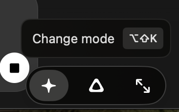
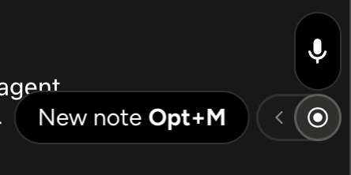
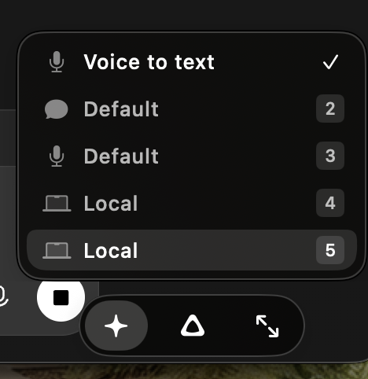
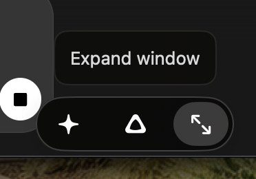
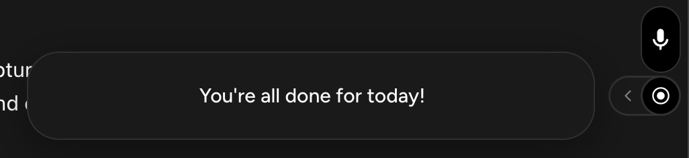

# Compact controls that teach as you use them

Visual references and proposed Workbench adaptations · 20 September 2026. Read with [product direction](../commodity-strategy.md) and the [interaction contract](../product-spec.md). The five crops below were supplied for this review and are preserved unchanged. They are competitor references, not Workbench screenshots or implementation specifications.

The first three controls match Superwhisper's documented recorder/mode controls. The last two were supplied as Wispr Flow examples; the visible Option+M action agrees with its Notetaker documentation. Exact app versions and the cause of the completion message are unknown. Static images do not establish keyboard behaviour, accessibility, preserved recording state or what a meeting recipient sees.

## Put the shortcut beside the action

This Superwhisper tooltip gives an unfamiliar icon a useful name and shows its shortcut in the same place. The design teaches a faster route while the person is already trying to perform the action. Its [recording-window guide](https://superwhisper.com/docs/get-started/interface-rec-window) documents the control and main/mini views.

The second example spells out the action and shortcut together. Wispr Flow's [shortcut guide](https://docs.wisprflow.ai/articles/2612050838-supported-unsupported-keyboard-hotkey-shortcuts) documents Option+M for Notetaker; it also explains configurable bindings and conflict checks.

**Workbench adaptation:** show the actual configured shortcut next to Dictate and Snap & Talk in the available menu space, and in help for compact buttons. Reuse the keyboard catalogue rather than hard-coding today's default. A disabled or conflicting shortcut must not appear usable. Keep the click action obvious; tooltips cannot be the only way to discover Stop or understand an icon.

This needs no AI. Existing `ShortcutKeycap`/`ShortcutControl` already expose editable assignments. [PR #62](https://github.com/EthDawg/workbench/pull/62), merged on 20 September, adds the persistent toolbar; improve that surface rather than creating another launcher. Link shortcut editing to the existing Keyboard flow when idle, preserving its conflict and cancellation rules.

## Make selection different from navigation

In this crop, **Voice to text** has the checkmark. The lower **Local** row is highlighted; that is not evidence that a local engine is active. The numeric badges are visible, but the image alone does not establish their scope or whether these are default bindings. [Superwhisper's switching guide](https://superwhisper.com/docs/modes/switching-modes) documents its selection methods.

**Workbench adaptation:** use a checkmark for the selected value, a separate focus/highlight treatment for the row being navigated, and names that explain the result. Repeated labels such as Default or Local in this example would be difficult to distinguish without extra context. Workbench's Original/Light/Natural choices describe text treatment; Dictate/Snap & Talk/Present are jobs. Keep those concepts separate.

A contextual chooser can show current cleanup or a prepared persona group where it is relevant. It does not require a universal mode system. Preserve the configuration frozen for an active capture. If numeric selection is trialled, scope it to the open picker so typing into another app or an editable field still works normally; do not add global number shortcuts.

## Expand the same task in place

The small strip has an explicitly named expansion action. The useful idea is a compact working state with an obvious route to detail. It does not prove that every transition is seamless; that requires interaction testing.

**Workbench adaptation:** keep microphone state and Stop available while recording. Expand to secondary detail and position options without restarting the operation, losing text, moving away from the chosen anchor or changing the insertion destination. Workbench already has compact/expanded recording controls and shared placement logic; this is refinement of an existing behaviour.

Superwhisper documents hover-revealed controls in its mini view. Preserve Workbench's discoverable Stop action and keyboard access. Click, keyboard focus and VoiceOver must provide usable routes without requiring hover. Do not infer screen-share exclusion from a floating appearance.

## Use completion space for the next useful action

This contextual message shows that the same small area can explain a state beside the controls. The crop does not establish what “done” refers to or whether a calendar was consulted. Wispr Flow's [bar documentation](https://docs.wisprflow.ai/articles/1790396454-move-and-dock-the-flow-bar-on-desktop) describes resting, recording and processing states plus contextual controls.

**Workbench adaptation:** use specific outcomes such as Saved to session, Copied, or Instructions copied, followed by one useful action such as Review, Open folder or Retry. Derive the message from the completed operation. Do not say a deck was handed over because an app opened, or declare all work done from one successful save. Keep recovery visible when processing or saving fails.

An adjacent reference is [CleanShot's Quick Access Overlay](https://cleanshot.com/features): its documented copy/save/annotate/drag actions keep delivery close to the captured artifact. Apply that principle to a completed Snap & Talk section or session, keeping the existing file-handoff boundary in [#63](https://github.com/EthDawg/workbench/issues/63).

## Small experiments for the existing controls

| First change to trial | User-visible gain | Check before accepting |
| --- | --- | --- |
| Actual shortcut beside existing actions | Learn the faster route without opening Settings first. | Change a binding; menu/help update. Disabled/conflicting keys are honest. Clicking preserves the original text destination. |
| Clear current selection and explicit expansion | Understand what will happen without inspecting model settings. | Keyboard/VoiceOver identify selection; Escape closes the picker; recording/configuration and window anchor survive expansion. |
| Specific completion plus one next action | Continue from capture to review or handoff without reopening Home. | Saved/Copied appears only after success; Retry preserves originals; opening a host never reports file delivery. |

Observe a first-use attempt and a repeat attempt with synthetic content. Record wrong clicks, whether the person can identify the active state, time to the next useful action and any loss of focus. Test light/dark, Reduce Transparency, keyboard/VoiceOver, constrained display space and receiver visibility where affected. A static crop or another model's preference is not usability evidence.

Coordinate the first refinement with [#56](https://github.com/EthDawg/workbench/issues/56)'s existing acceptance work; the now-merged PR #62 is not an open implementation task. These references do not broaden that issue's closure requirements. Later receipt work stays with its existing owner. Source references are [shortcut controls](../../Sources/LocalVoice/QuickControls.swift), [keyboard catalogue](../../Sources/LocalVoice/KeyboardCoach.swift), [recording panel](../../Sources/LocalVoice/CapturePanel.swift), and the merged [floating-toolbar change in PR #62](https://github.com/EthDawg/workbench/pull/62/files). Source inspection is not a new installed-app test.

## Keep future visual ideas this concrete

For a consequential UI idea, include one relevant image, its original product/documentation link, what can actually be observed, the proposed Workbench adaptation and a small acceptance check. Label competitor screenshots, generated concepts and real Workbench evidence separately. Prefer a few well-explained references over an uncurated screenshot gallery.

The supplied crops contain small unrelated background fragments; no identity, credential or customer content was observed. They are included for limited design discussion, not as reusable application assets. Depicted interfaces and trademarks belong to their respective owners; the repository's code license does not relicense those interfaces. No generated or reconstructed image is presented as competitor evidence.
