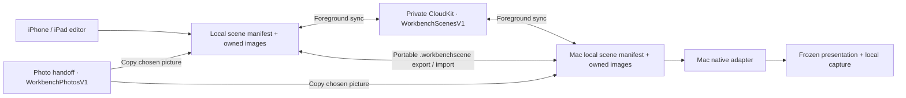

# Personal scenes: prepare on iPhone, present on Mac

Product and implementation record, **15 September 2026**. [CI at release source `48bc7c0`](https://github.com/EthDawg/workbench/actions/runs/34761974846) passed Mac, iPhone and iPad. The later local iPhone review retained one intermittent navigation failure and three successful unchanged repeats; see the [mobile record](../ios-preview.md#release-preparation--14-september-2026). The scene source is included in signed and notarized Mac Preview 3; the iOS build is uploaded to App Store Connect but not publicly released. Paired scene sync remains **unverified**. The [public visual guide](https://workbench-mac.vercel.app/scenes/) explains these decisions; concepts are separate from running-app evidence.

## Jobs, activation and native forms

Take a picture of a place, prepare a useful branded scene, and later open that editable scene on the Mac. Personal sync means **one person's Apple Account across their devices**. A shared workspace with Matt requires a separate ownership and permissions decision.

| Job | Entry and activation | Workbench's responsibility | Boundary |
| --- | --- | --- | --- |
| Prepare a scene | iPhone/iPad **Tools → Scenes**; Camera, Photos, starter or photo-handoff arrival. Home Screen **Capture for scene** routes into the foreground camera flow. | Save backdrop/crop, device geometry and optional branding. iPad provides more editing space. | Camera permission and an active app are required. Cancel leaves saved scenes intact. |
| Present a device | Mac **Present a device**; choose a saved scene and local video source, then full screen or window. | Compose the source with a frozen scene; provide deliberate controls and End. | No remote phone input, meeting management or verified audience-only controls. |
| Explain a persona | Prepare a Mac persona group; Show over browser or explicitly Use in scene. | Switch only among prepared members; edit new cards' role labels and colours. | Mac panels are not arbitrary iPhone/iPad overlays. Whole-screen sharing may include controls. |
| Make wallpaper | Independent mobile **Wallpapers**; Save to Photos, with Share secondary. | Keep this wallpaper's original, aspect and crop. | Apple owns final Home/Lock selection. Mac application/restoration follows the separate [desktop contract](../../site/handbook/contract.json). |
| Speak, listen, mark up | Independent Dictate, Read aloud and Mark up. Home Screen **Dictate** opens its workspace. | Native input, explicit delivery and original preservation. | Scenes is not a prerequisite. Receiving a quick action never itself records audio. |

Keep mobile Tools/Saved navigation. Scenes replaces the primary Backdrops and Take a photo for Mac tiles; photo handoff remains a selected-picture feeder. Earlier handheld compositions remain available and recoverable, but presenting them inside the phone is not the main Scenes journey. A device frame represents the live screen to be shown later on Mac; it does not require a second photograph inside a phone outline.

## Native capability versus what we build

| Native starting point | Useful capability | Workbench decision |
| --- | --- | --- |
| Photos/Files, camera and system sharing | Chosen imports and explicit export. | Copy selected image bytes into the scene; retain editable metadata. |
| [Home Screen quick actions](https://developer.apple.com/documentation/uikit/add-home-screen-quick-actions) | App shortcuts and launch routing. | Two actions, foreground routing and unsaved-edit guards. No background microphone shortcut. |
| [CloudKit's private database](https://developer.apple.com/icloud/cloudkit/designing/) | Storage associated with Apple identity. Apple's documented security roles govern the public database. | Use `privateCloudDatabase`, separate scene/photo zones and opt-in. No Workbench account service or team-sharing claim. |
| [CKSyncEngine](https://developer.apple.com/documentation/cloudkit/cksyncengine-5sie5) and [Apple's sample](https://github.com/apple/sample-cloudkit-sync-engine) | Sync coordination and serializable engine state; the sample demonstrates notification-driven updates. | Workbench schedules enabled local edits after an 800 ms pause while active; CKSyncEngine’s own automatic scheduling remains disabled. No background-arrival or delivery-time promise. |
| [Apple Wallpaper](https://developer.apple.com/wwdc26/wallpaper/) | Apple describes Photos → Share → Use as Wallpaper. | Save a prepared picture; leave installation to the supported system flow. No private Settings URL. |
| [OBS collections](https://obsproject.com/kb/scene-collections) and [sources](https://obsproject.com/kb/sources-guide) | Separate contexts and independently positioned image/text/colour sources. | Borrow prepared groups and editable card parts, without a streaming studio or general layer editor. |
| [Wispr's iPhone keyboard guide](https://docs.wisprflow.ai/articles/7453988911-set-up-the-flow-keyboard-on-iphone) | Documents its custom keyboard, sign-in, network/Full Access requirements and possible return-to-app gesture on iOS 26.4+. | Keep Workbench's foreground voice tool independent. A competitor screenshot is not evidence of unrestricted cross-app dictation. |

This review uses public documentation, the user's supplied screenshots and local source inspection. No completed competitor hands-on comparison or exhaustive market review is claimed. The broader [mobile research](../mobile-research.md) and [photo-handoff record](../photo-handoff.md) retain category comparisons and their limits.

## Current shared architecture

| Source owner | Responsibility |
| --- | --- |
| [`SceneDocument.swift`](../../Sources/SceneSyncKit/SceneDocument.swift) | `PortableScene`: UUID/name, background/crop, device geometry, optional logo/hand/persona. New persona cards carry portrait, visible label, plain RGB and a rendered fallback. Retained assets and a versioned mobile attachment support recovery. |
| [`SceneLibraryStore.swift`](../../Sources/SceneSyncKit/SceneLibraryStore.swift) | `scene-library.json` and immutable `Assets/<SHA-256>.image` files. Validate hashes, names, bounds and files; reject symlinks/stale manifests. Write assets before committing their references. |
| [`SceneLibraryModel.swift`](../../Sources/SceneSyncKit/SceneLibraryModel.swift) | Local commits, UUID revisions and acknowledged bases, account-bound pending work, deletion markers and UI state. Optional foreground scheduling coalesces committed edits after 800 ms; receipts and unchanged saves never schedule another upload. |
| [`CloudSceneSync.swift`](../../Sources/SceneSyncKit/CloudSceneSync.swift) | `CKSyncEngine`, `automaticallySync = false`, private zone `WorkbenchScenesV1`, record type `SceneV1`. Each record contains a small `metadata` envelope and complete `packageAsset`. Persist the account-bound engine checkpoint through the model. |
| [`MacSceneSync.swift`](../../Sources/StageKit/MacSceneSync.swift) | Native rendering adapter, immutable compatibility image cache and safe legacy adoption. Preserve portable-only recovery fields on later Mac edits. |
| [`MobileSceneEditor.swift`](../../Mobile/Workbench/MobileSceneEditor.swift), [`MobileSceneImport.swift`](../../Mobile/Workbench/MobileSceneImport.swift) | Native preparation, visible edit conflicts, cancellation/stale-result checks, and explicit conversion/recovery of earlier mobile projects. |

Mobile compiles the shared SceneSyncKit sources; it does not import AppKit or StageKit. Mac StageKit consumes SceneSyncKit. Neither view maintains a competing canonical scene manifest.

A `.workbenchscene` export is a binary property list containing one document and every referenced image. The same package is the transport payload, so export/import works without CloudKit. `SceneFile.swift` declares `com.ethdawg.workbench.scene`; Mac and iOS expose explicit file-copy import/export. A native Mac export/import round trip preserved the background, portrait and rendered persona card in a separately identified scene; both original and copy received matching cloud revision receipts. On iPad Simulator, a synthetic Mac export subsequently opened through Files, accepted a renamed scene and left device placement, persisted after closing the editor, and exported through **Share editable scene → Save to Files**. The output retained all three image assets byte-for-byte and the persona settings; reimport through Workbench's own picker reopened the edited composition. This was local file exchange with cloud disabled, not physical-device or paired-cloud proof. Other platform and failure paths remain separate acceptance checks. Current validation permits images up to 40 MiB and 50 megapixels, aggregate picture data up to 90 MB, a package up to 100 MB, and 1,000 records. Invalid or unsupported input is rejected with originals kept.

When sync is enabled, a committed local create, edit, deletion, migration, duplicate or package import schedules one cycle after 800 ms without another edit. Asset-only work, ordering, receipts, checkpoints and unchanged saves do not trigger a cycle. Edits made during a successful upload schedule one follow-on only if matching-account work remains dirty.

Backgrounding cancels both the delay and in-flight work. Waiting revisions remain durable and resume through the next foreground refresh. A failed cycle stops automatic retries—even later edits do not restart it—until manual or foreground refresh. Disable and account changes cancel scheduled work; late callbacks cannot bypass the account guard. These are controller semantics verified with synthetic transport, not a background-delivery or latency guarantee.

A foreground cycle verifies identity, establishes its zone when necessary, fetches changes, then sends eligible captured local revisions. Receipts commit locally before progress advances. Invocation/account guards reject late events. A newer fetched server revision cannot be overwritten by an older captured upload. Scene operations never advance photo checkpoints or delete inbox pictures. Separate zones in the same provisioned private container provide this separation; another container is not required by this design.

## Rules that preserve work

| Event | Behavior |
| --- | --- |
| Rename or edit | Preserve UUID; create a revision. Dates describe recency, not which author wins. |
| Both devices edit | Retain the incoming revision and a separately identified editable **kept copy** of unsent local work, including text and geometry. |
| An acknowledgement follows another local edit | Update applicable base/system fields only. Preserve newer content, timestamp and conflict provenance; do not falsely mark it clean. |
| Delete a scene | Commit a revisioned deletion marker; retain assets. Concurrent edits survive as kept copies. Unexpected physical record/zone removal stops that cycle and reports an error rather than erasing the library. |
| Account changes | Pause transfers and retain local bytes. A replacement account cannot silently adopt previously bound work. Identity includes user record, container and environment. |
| Corrupt/newer/externally changed library | Preserve bytes and block unsafe saves. Never reset to empty. A rejected merge leaves the caller's archive unchanged. |
| Source picture or library card changes | Placed artwork remains an owned snapshot. Reapplying later card edits is explicit; deletion does not cascade. |
| Sync while presenting | Update saved preparation, not the active presentation's captured scene or prepared persona set. |

Physical asset reclamation is deferred. Removing a library item does not establish that no scene, kept copy or recovery attachment still needs its image.

## Earlier work and recovery

Mac adoption copies valid legacy assets and commits a stable source marker with the new record. Repeated/interrupted adoption does not create another copy. Missing/corrupt sources remain repairable; the original scene file is unchanged.

Mobile **Create scene for Mac** creates a new UUID, retaining the full original project and an original-name-to-content-hash map. The foreground, logo and persona source images travel as retained assets. Caption, PencilKit data, original kind, aspect and crop stay in the attachment. Recovery rejects unknown/newer attachment fields without replacing their bytes.

The new scene uses a landscape layout, another crop convention and zoom up to 3; the earlier editor allowed 5. Foreground/caption/ink are not flattened into this preview. **Recover mobile original** saves a separate mobile project with new local image names and its original editable values. The source project and scene both survive. Wallpaper stays independent.

Here, “snapshot” means placed artwork and a frozen presentation document. A prepared-scene PNG is not proof of a fresh device-screen snapshot. Exporting live video as a still needs its own frame-freshness and physical-device checks.

## Persona preparation and controls

Eight fictional starter portraits are offered one at a time. Actual transparency lets native card backgrounds show through; role labels and colours are editable values. Finished imported cards retain their artwork. Adding a card respects the active group's membership.

Live choices contain only the prepared members. Private group/library names stay in preparation, including tooltips and accessibility labels. Removing the visible member hides it, without falling back to another customer's first item. Artwork lock permits clicks through the picture while separate controls remain usable. Show valid snap targets only during drag, emphasize the candidate and retain named Position commands. Whole-screen sharing can include these controls; this is not capture exclusion.

## Concepts and critical decisions

**Concept A, generated—not released UI.** Adopt the saved-scene journey, ordinary backdrop/device/logo/persona controls and two quick actions. Reject the pictured third mobile tab, invented favourites/filters, extra quick action and cloud badges implying measured near-instant arrival. The example organisation is fictional.

**Concept B, generated—not released UI.** Adopt prepared-group switching, editable role/colour and click-operated controls with drag guides. Reject a new Brand/Shortcuts sidebar, oversized artwork as a universal default and live group/library editing. Illustrated taglines are not requirements.

Claude critiqued the supplied brief and public documentation, not source or a running build. Adopted: portable local data, owned copies, honest progress, bounded live choices and frozen presentation state. Rejected: flattening old collages; clock-based wins for labels/positions; treating another container as a necessary safety boundary; making voice/reading/markup subordinate to Scenes. iCloud Drive remains credible if Files/Finder documents become the primary job. No competing sync adapter or latency comparison has been built. A hosted account service is deferred until cross-account/team ownership becomes a requirement.

## Evidence and remaining acceptance

| Evidence at this review | Established | Still separate |
| --- | --- | --- |
| Installed Mac Preview | Existing photo and migrated scenes remained intact. The eight-portrait chooser, native card editor and switching within a prepared two-role floating menu were checked. A synthetic review scene with a Site manager persona automatically uploaded after an edit without manual refresh; its durable revision receipt matched. | Paired editable-scene transfer and a reliable transfer-time bound. No private photo is published. |
| Native scene-file round trip | Mac Export/Import panels produced an independent scene ID, retaining all three assets. The renamed copy and original received matching cloud revision receipts. A synthetic Mac file also passed iPad Simulator Files import, edit, save/reopen, Save to Files export and in-app reimport; all three embedded assets and persona settings were preserved. | Physical mobile file exchange, interrupted/malformed imports and recovery after subsequent cross-device edits. The initial Simulator picker dismissal did not recur after Files initialization; no production fix or proven cause is claimed. |
| Older composition through both implementations | At source `8f4237e`, an isolated iPad Simulator test exported an authored project with four distinct images, caption, crop, date and a non-empty PencilKit drawing. Actual Mac scene/backdrop APIs changed its name, device layout and background, rejected a stale edit, then reopened and exported it. Recovery in a fresh mobile store preserved every original authoring field and image byte, created independent IDs/names and reopened from disk. The edited Mac scene and source packages stayed intact. Both targeted mobile tests passed; the Mac leg passed 69 assertions. | This exercised production code in an inert iOS test host and Mac command-line runner, with cloud disabled. It does not establish UI operation, visual parity, physical file sharing or paired iCloud delivery. |
| Native recovery after Mac editing | At source `da4f0f4`, the actual Mac scene editor imported a synthetic mobile package, changed its name, device layout and backdrop, exported through the native Save panel and reopened after Quit. On iPad Pro 13-inch (M5), iOS 26.5 Simulator, one native UI test passed: open that exact package, Recover mobile original, replace its title using native Select All, find both items in Saved, and reopen after app relaunch. All four original image bytes and original authoring fields survived; the separately edited Mac scene remained unchanged. | The Mac used an isolated host compiling unchanged StageKit sources. Mobile used the full app with a fresh sandbox and public file-open handoff, not Files-picker browsing. Cloud, physical-phone transfer, every-layer editing and Pencil input remain unverified. The multiline caption and ink are retained in data; this is not full preview parity. |
| Running presentation stays fixed | At source `da4f0f4`, native Mac controls started a windowed synthetic still presentation. Editing the saved name, backdrop and placed persona did not alter the running view. End and restart displayed the new preparation. The menu exposed eight named positions; Top left, a drag to Bottom right, position retention, click/keyboard reveal, Escape collapse/End and the End button were observed. | Device capture was off and cloud unavailable in the isolated host. This does not cover live video, a meeting receiver, fullscreen transitions, all eight drag targets, guides during drag, multiple displays or VoiceOver. |
| Eight positions and full-screen controls | At source `7e45213`, the unchanged isolated Mac host placed expanded controls at all eight named positions, with Position and End reachable. The compact tile dragged from Bottom right to Left centre, stayed collapsed on release and reopened with Command Slash. A native full-screen transition kept controls reachable; Escape collapsed them, then ended and returned to Scenes. | Synthetic still on one display, device capture and cloud off. Not every compact position or drag target, mid-drag guides, VoiceOver, live video, a meeting receiver or the installed signed shell. |
| Integrated native Mac checks | `--scenes-only`: **65 checks, 2,001 assertions, zero failures**, including preservation, rendering and migration checks. | Current device feed, receiving meeting participant, VoiceOver and multi-display journeys. |
| Shared scene/storage and scheduling | Strict Swift 6 suite: **48 tests, zero failures**, including 26 lifecycle tests; the integrated repository suite passed all 73 photo and scene tests. Shared sources passed iOS typechecking. Synthetic transport covers coalescing, no-op/receipt loops, background cancellation, durable waiting, manual retry, stale acknowledgements, conflicts and accounts. | Paired scene recovery. The 800 ms value is a local scheduling delay, not measured arrival time. |
| Physical iPhone scene preparation | The normally installed app created a synthetic **Phone scene review** from Coast. Native controls saved its name, left device placement and a Field lead starter edited to Site manager with a yellow card. After closing the app through the App Switcher, cold launch and camera cancellation returned to the scene with those values intact. Phone cloud sync was off throughout. | This proves local persistence without cloud sync, not airplane-mode/offline behavior: network remained on. Paired reception remains unverified. |
| Native quick actions | Both warm routes were observed. Warm Dictate from scene-sync settings preserved the draft and did not start recording. Warm and cold Capture for scene reached the native camera; Apple's camera-unavailable alert, dismissal and Cancel returned to Scenes without creating another scene. | Cold Dictate also opened correctly after the subsequent signed update. Actual capture remains untested. [iPhone Mirroring cannot access the phone's camera or microphone](https://support.apple.com/en-ng/120421); reaching its camera UI does not prove a captured image. |
| Quick action with an unsaved scene | At source `7e45213`, a normal-startup iPad Simulator app retained a blank-name draft after the genuine Home Screen Dictate action. Correcting the name triggered local autosave, then opened Dictate once without starting recording. The renamed scene reopened after relaunch; all other scene content and five assets remained intact. The native result records one passed test, zero failures. | Xcode cleanup was interrupted after the test passed; this is not an exit-zero test-command claim. The first attempt stopped at an ambiguous Home/Dock icon selector, corrected by selecting the Home icon. No physical phone, Capture for scene, storage I/O failure, remote conflict or speech-quality result. |
| Speech preparation follow-up | The installed phone first reported English (Australia) ready, then Download speech language. A preparation retry remained non-ready after Apple's initial installation attempt returned. A bounded diagnostic/recheck patch passed ten focused native tests, was signed and installed, and then reported **ready on this device** through cold Dictate and the previously failing warm scene-settings route. Existing draft and scene were preserved. | Those readiness checks passed; a fresh spoken recording and a longer reliability check remain separate. Apple permits the initial installation attempt to finish without establishing readiness, so the cause is not proven to be an asset-status inconsistency. |
| Mobile wallpaper | Saving the synthetic Coast wallpaper reached the native **Saved to Photos** completion state on the installed phone. | Final installation through Apple's Wallpaper picker, denial/retry, and repeat-save behavior. |
| Mobile tests and CI | [CI at `a434b92`](https://github.com/EthDawg/workbench/actions/runs/34760192289) passed all Mac, iPhone and iPad jobs, including the later speech correction. Earlier local coverage of 57 unit and eight UI cases came from full plus targeted runs. The older photo-discard CI failure was not addressed by a production behavior change; the same case also passed three local reruns. | The speech correction also passed ten focused tests, signed archive/export verification, physical installation and cold/warm readiness checks. Fresh spoken recognition remains separate. |
| Scene schema and personal sync | Production `SceneV1` has `metadata` (BYTES) and `packageAsset` (ASSET), with no new public RBAC grants; `PhotoV1` and `Users` were unchanged. Mac opt-in created the private zone and completed uploads. | Phone scene sync remains off pending the person's explicit opt-in. Paired reception and round-trip behavior remain **unverified**. The Mac implementation is now in notarized Preview 3. The iOS build is uploaded to App Store Connect; tester distribution and App Review remain pending. |
| Photo handoff | An existing real iPhone photo downloaded after an owner-alias correction and transient timeout/retry; later installs retained it. | Repeated deferred delivery and account recovery. Photo reception does not prove editable-scene reception. |

Apple states that [`downloadAndInstall()`](https://developer.apple.com/documentation/speech/assetinstallationrequest/downloadandinstall()) returns after an initial installation attempt succeeds **or fails**; the configured module status must establish readiness. The follow-up preserves those distinct outcomes and does not treat a returned call as a successful installation.

Remaining acceptance includes airplane-mode creation/restart; edits in both directions; simultaneous changes; delete/rename/missing-image recovery; account switching; offline and interrupted file exchange; physical old-composition recovery after a Mac edit and editing every recovered layer; active-presentation isolation with live device video and incoming sync; all native drag targets and guide behavior during drag; final wallpaper selection and Photos-save failure handling; actual camera capture and further unsaved-work routes, including storage failures; and native keyboard, accessibility, light/dark and receiver checks. Public captures use synthetic media. A model review, compile or schema deployment is not a substitute for observed behavior.
