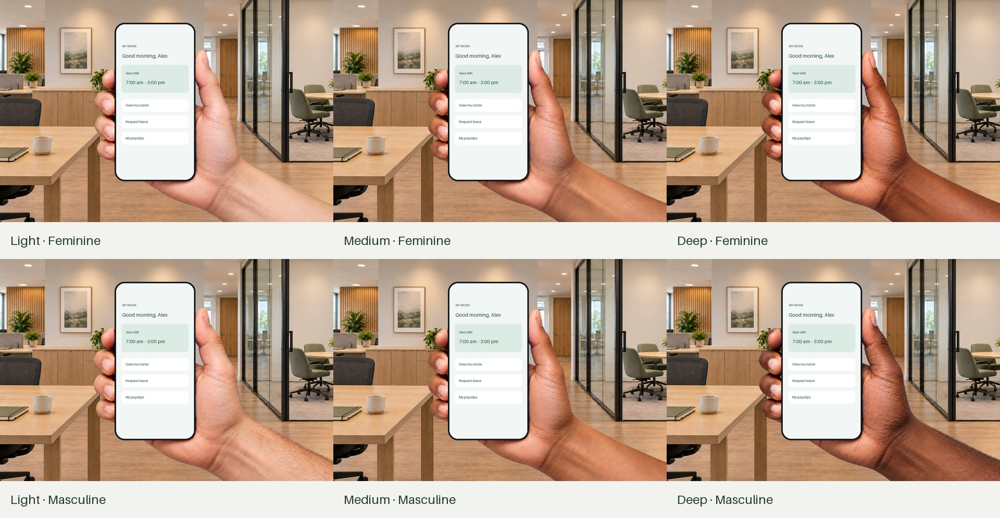

# Add hand: recover the assets and finish the native grip

Research and implementation brief, 21 September 2026. Source baseline: [`c692a4b`](https://github.com/EthDawg/workbench/tree/c692a4b), after #62. This PR recovers assets and specifies the remaining work; native integration remains proposed in [implementation issue #70](https://github.com/EthDawg/workbench/issues/70).

## What was found and why it is useful

Two separate pieces existed. Workbench gained **Add hand cutout…**, which imports one transparent PNG with manual size, offset, flip and tone controls. A separate 9 September experiment produced six grip styles, 12 transparent layers, exact placement data, a browser prototype and Swift reference. That kit remained outside the repository and was never wired into the app.

The missing feature is a **fitted hand choice that follows the phone**. Reuse the kit: fingers and palm can maintain their contacts independently as phone width changes. A presenter chooses a style once, moves the assembled phone and gets consistent composition in preview, presentation and output. **None** remains the default. The hand must not reduce screen readability or become a prerequisite for mirroring, annotation or capture.



[Open the recovered kit](../assets/phone-hand-grips/README.md) for the PNGs, manifest, prompts, resize illustration and runnable reference. Its photographs are generated; the example screen is fictional. No further generation is needed to begin implementation.

## Research and approach

| Approach | Value and trade-off | Recommendation |
| --- | --- | --- |
| Existing single-PNG import | Arbitrary personal cutouts with manual placement; cannot keep two opposite contacts aligned independently | Preserve for old scenes and custom imports |
| Recovered two-layer grip | Fits the existing frontal procedural phone; six verified image sets; no model at runtime | Implement this bounded extension |
| Static mockup editor | [Mockuuups Studio](https://mockuuups.studio/learn/editor-walkthrough/) separates device, hand, background and effects; [clothing choices](https://mockuuups.studio/learn/customize-clothing/) demonstrate broader customization | Borrow simple selection, not assets or a large clothing editor |
| 3D mockup / animation | [Rotato's generic devices](https://rotato.app/generic) accept screenshots/video and export stills/animation | Useful external route for perspective collateral; excessive for this frontal live viewport |
| More generation, segmentation or tracked hands | May enable new poses/photos/motion; adds masking, anatomy and runtime complexity | Revisit only when the six styles/manual import fail a demonstrated need |

These are documented capabilities and product judgments, not hands-on competitor tests. The opportunity is dependable live-scene composition and reuse; hand mockups themselves are established.

## Current owners and gaps

| Owner | Existing behavior | Required extension |
| --- | --- | --- |
| [SceneHand.swift](../../Sources/StageKit/SceneHand.swift) | One image, aspect-preserving height scaling, heuristic placement and transparency check | Distinct fitted rig; preserve the single-image path |
| [DemoScenes.swift](../../Sources/StageKit/DemoScenes.swift) | PNG import/copy, shared hand-before-bezel rendering, missing-asset export checks | Atomic two-layer selection and cached image loading through the shared renderer |
| [DemoScenesView.swift](../../Sources/StageKit/DemoScenesView.swift) | Manual controls, viewport slider/presets; width drag preserves the left edge | Six-choice/None UI and one operation preserving right/bottom in grip mode |
| [DeviceViewport.swift](../../Sources/StageKit/DeviceViewport.swift) | Shared outer device and inner screen rectangles | Derive hand geometry from the existing outer rectangle |
| [MovingSceneView.swift](../../Sources/StageKit/MovingSceneView.swift), [DemoPresentation.swift](../../Sources/StageKit/DemoPresentation.swift) | Shared foreground; video above it, branding above video; live aspect fit | Both grip layers remain behind the phone; no above-video pass is needed |
| [SceneDocument.swift](../../Sources/SceneSyncKit/SceneDocument.swift), [MacSceneSync.swift](../../Sources/StageKit/MacSceneSync.swift) | Portable reference collection and native conversion enumerate one hand image | Validate, retain, convert and package both images plus their source geometry |
| [SceneLibraryStore.swift](../../Sources/SceneSyncKit/SceneLibraryStore.swift), [MobileSceneEditor.swift](../../Mobile/Workbench/MobileSceneEditor.swift) | Formats 1–2; mobile retains a known hand but does not preview it | Explicit version boundary, old-data preservation and mobile roundtrip/disclosure |
| [DesktopMotion.swift](../../Sources/StageKit/DesktopMotion.swift) | Freezes hand imagery for independent running wallpaper | Freeze both images/geometry; later edits must not alter that job |

An alpha check alone does not establish anatomy, removed dummy-phone pixels or correct edge contact. Existing single-hand tests are in [DemoModeTests.swift](../../Tests/StageKitLegacy/DemoModeTests.swift); `swift test` alone does not execute the legacy StageKit runner.

## Smallest complete native increment

1. Offer **None**, six inspectable thumbnail choices and **Import cutout…** in existing hand controls. Give each an accessible name and selected state distinct from focus. Keep old import/manual controls; do not apply legacy exposure, flip or offsets implicitly to the fitted rig.
2. Selecting a style copies its two immutable images into the owned scene asset store and records variant, revision and source geometry. Either both succeed or the previous scene remains unchanged. No runtime download or generation.
3. Draw background → palm → fingertips → bezel → clipped screen → branding using one placement calculation. Move the phone and grip together. Preserve live aspect fit; hands never obscure UI or control the device.
4. Width/bezel changes retain the outer phone's right/bottom contact; fingertips follow the moving left edge. Use a left-edge width affordance for this mode. Sliders, keyboard controls, presets and dragging call the same model operation. Preserve legacy resize behavior outside grip mode.
5. Save/reopen, duplicate, replacement, transfer and mobile edits retain both assets. Removing one scene's hand cannot delete an asset another scene or running wallpaper uses.

Fitted grip and imported cutout are mutually exclusive with explicit replacement, not silent conversion. Mirroring, rotation, tablet grips, recoloring, sleeves and per-finger handles are later ideas. User-imported cutouts retain existing capabilities.

### Geometry, limits and recovery

The [Swift reference](../assets/phone-hand-grips/reference/GripGeometry.swift) converts top-left source pixels to an unflipped AppKit target. For source canvas `W × H`, source phone `(sx, sy, sw, sh)` and target outer phone:

```text
scale = target.height / sh
imageSize = (W × scale, H × scale)
y = target.minY - (H - sy - sh) × scale
palm.x = target.maxX - (sx + sw) × scale
fingers.x = target.minX - sx × scale
```

Width never changes scale. Keep the full transparent canvas and each style's exact bounds. After a width/bezel edit, convert the desired fixed-contact target back into normalized phone placement, accounting for margins/clamping. Merely changing `viewport.aspect` does not preserve contact. Reject nonfinite/invalid inputs before drawing.

[Apple's aspect-fit gravity](https://developer.apple.com/documentation/quartzcore/calayercontentsgravity/resizeaspect) preserves content proportions, while [capture preview gravity](https://developer.apple.com/documentation/avfoundation/avcapturevideopreviewlayer/videogravity) controls video placement. Keep the current aspect-fit path and rounded screen clip. Do not stretch video or a whole hand to force a fit.

Demonstrated ranges are screen aspect **0.43–0.565**, border **0.004–0.025** of outer height, and corners **0.03–0.16** of screen width. They are narrower than general device controls. Constrain grip sliders accordingly. Unsupported presets, rotation or hiding the phone suspend the grip with an explanation and preserve its saved choice; returning to supported geometry restores it.

The forearm must leave the actual output's right edge:

```text
phoneRight + (sourceCanvasWidth - sourcePhoneRight) × scale >= canvasRight
```

Also require a valid on-canvas phone rectangle. Check each output aspect, not just editor dimensions. On failure, retain the style but hide the grip and offer **Fit hand** or **None**. Fit hand previews the smallest feasible rightward move at the current height and commits one scene edit; if impossible, explain that a larger phone is needed. Do not silently reposition a saved scene, expose the cut wrist or stretch it to the edge. All render/export/apply paths use the same eligibility decision and report an omitted grip before producing output.

The prototype only demonstrates a fixed 3:2 stage. Native 16:9/16:10 behavior and recovery need validation. Source images are 1536 × 1024; inspect real presentation-size quality, especially 4K, before claiming it. Upscaling does not add detail.

### State, compatibility and delivery

Add a separate optional grip record containing both asset references, variant/revision and bounded source geometry. Never reinterpret legacy single-PNG fields. Selected assets travel with the scene under existing content-addressed ownership; no local bundle paths or assumptions about another machine's built-ins.

Extend exact asset-reference collection, hash/path validation and Mac materialization/rewrite together. Source rectangles must fit declared dimensions. Reject incomplete rigs. Count the extra images against package byte/item limits and report failure instead of discarding another retained asset.

Current package/library formats accept versions 1–2. Adding an optional field under an old version permits older writers to discard it or reject unexpected assets. Introduce an explicit tested version boundary for both package and saved library, with backups/recovery in the current owner. New code must preserve old no-hand/single-hand scenes; old-client handling must preserve originals and refuse unsupported writes. Verify sync's actual mixed-version behavior before enabling the rig there.

Mobile grip editing is deferred; preservation is part of this increment. Updated shared schemas must survive a mobile name/background edit without losing layers or geometry. Extend the existing “preview on Mac” disclosure to the rig. Native mobile rendering remains separate.

Deliberately package runtime PNGs/manifest through applicable direct/Preview/Store paths. Exclude browser/reference/gallery files from app payloads; verify archive hashes. Check [scene-snapshot PR #68](https://github.com/EthDawg/workbench/pull/68) before editing shared rendering and test its fresh-frame composition once available. Static scene/desktop export does not acquire live pixels merely by adding hands.

## Acceptance and shipment

| Evidence | Required result |
| --- | --- |
| Assets | 12 expected hashes, 1536 × 1024 RGBA, genuine transparency, no key/dummy-phone contamination |
| Geometry/state | Six source rectangles; fixed contacts; uniform scale; group drag; unsupported shapes/placement; failed selection/cancellation preserves old work |
| Persistence | Old scenes unchanged; rig save/reopen/duplicate; both assets survive transfer/mobile edits; safe missing-asset, future-version, stale-save, limit and removal behavior |
| Native visuals | Synthetic screen, light/dark and two supplied backdrops, narrow/wide/thin/thick boundaries, 16:9/16:10; preview/PNG/rendered-wallpaper parity; no wrist cuts, fringes or stretch |
| Live presentation | Actual phone alignment/letterboxing, readable screen, fullscreen and disconnect/reconnect/End; one receiver check if meeting behavior is advertised |
| Delivery | Packaged asset verification; signed Preview upgrade retains old scenes; revision-labelled evidence and limits; normal review/signing/notarization/publication steps |

Run the reference with `node docs/assets/phone-hand-grips/reference/geometry.test.cjs`. For implementation, extend/run relevant `scripts/test-stage.sh` cases and `swift test --filter SceneSyncKitTests`, followed by normal project checks. Coordinate interactive checks that acquire shortcuts; do not quit the user's apps or change their desktop to create evidence. Use isolated synthetic libraries for migration/export tests.

After native acceptance, update [the structured experience contract](../../site/handbook/contract.json), its generated guide and release notes to reflect demonstrated behavior. Assets, a reference test, native implementation, an installed Preview and a published binary are separate milestones.

## Evidence from this recovery

On 21 September all 12 copied layers matched their original hashes and decoded as RGBA with transparent, partial-alpha and opaque pixels. A pixel check found no dominant green/blue key remnants at alpha above 50%. The existing **324 geometry cases passed**, and the Swift reference typechecked. The gallery and resize proof were visually inspected. The recovered browser prototype was also exercised at narrow/thin and wide/thick settings with two styles, confirming visible edge contact and an unobscured illustrative screen. [verification.json](../assets/phone-hand-grips/verification.json) records these checks and native/release gaps.

A read-only worker audited source; consequential findings were checked against code and the recovered kit. An initial foreground-finger suggestion was rejected: both layers belong behind the screen. No new images or app behavior were created. Native parity, live mirroring, portable/mobile roundtrip, 4K appearance and release packaging remain implementation work.
