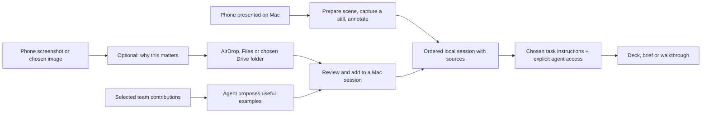

# Snap & Talk on mobile, and captures worth reusing

Research and proposed direction, 20 September 2026. Source baseline: `main` at `f63cf35`. This is an implementation brief, not a claim that these features have shipped. [The mobile contract](../ios-preview.md) and [implementation map](../design.md) describe current behavior. GitHub issues remain the work queue.

The first implementation is tracked in [issue #60: add existing images to a session](https://github.com/EthDawg/workbench/issues/60). [Issue #20](https://github.com/EthDawg/workbench/issues/20) owns a fresh phone-in-scene snapshot that could feed the same workflow. This document holds the research and conditional follow-ons; the issues own implementation status.

## Recommendation

Make it easy to bring a screenshot into Snap & Talk, keep a short explanation of why it matters, and reuse that material with an agent. Start with **Add images on Mac**, use ordinary phone sharing to get images there, and test whether a small mobile capture flow would remove enough friction to justify building it.

Also try the useful route when the person is already at their Mac: **show the phone in an existing presentation, prepare a clear background, capture the useful moment, then annotate and narrate it**. That experiment needs no new mobile app. Test it before assuming the next useful capability belongs on the phone. The design principle is to compose the existing capture, scene, annotation, voice and handoff primitives around the job; Add images remains the first proposed code change for previously captured files.

The bigger opportunity is a reusable piece of context: **the picture, the person's meaning, its source, and a useful task the agent can perform**. Semantic filenames help people browse; the explanation makes a capture useful later. The existing `SKILL.md` handoff is a good foundation because the material can travel with its instructions and work with the person's chosen agent.

For teams, try a selected shared folder and a small curation workflow before building a Workbench service. Contributors supply independent capture batches. Someone asks for the best material for a particular job; an agent proposes a selection, preserves source links and composes a new session. Drive can hold the shared material without becoming an editable live Snap & Talk session or a new Workbench account system.

Confidence is high that a file import fills a concrete product gap, moderate that preserving intent at capture improves reuse, and low on the demand for a native team library. The latter two need observed use. No personal screenshot folder was opened for this research. All proposed testing uses synthetic or explicitly contributed material.

## Where the value is

| Job | Why it is useful | Best first move |
| --- | --- | --- |
| Capture a phone experience and explain it later | A mobile bug, confusing onboarding step or useful example can become part of the same session as Mac captures. | Import selected image files into the existing Mac session. |
| Explain a phone workflow while sitting at the Mac | The phone is already visible in a presentation; a calm backdrop and room for marks can make a useful explanation without a separate phone capture flow. | Rehearse the existing presentation and Mac screenshot route; use issue #20 for a clean, fresh scene snapshot. |
| Remember why a screenshot mattered | OCR can read a button; it cannot reliably recover the person's reason for saving the screen. | Offer one optional “Why keep this?” note, typed or dictated. Keep capture possible without it. |
| Make a deck, brief or walkthrough from existing evidence | The person should not need to recreate screens just to narrate them. | Select and order images, add or review the explanation, then use the existing agent handoff. |
| Reuse a teammate's good example | The useful unit is an understandable contribution with a source and permission to reuse it. | Select contributed files from an existing shared folder and copy them into a new composition. |
| Reduce an accumulated screenshot pile | A task-specific shortlist is more valuable than a renamed pile of everything. | Ask the agent to propose the best examples for a named outcome, with a contact sheet and reasons. |

The highest-value mobile action is likely “save this with my thought while it is fresh.” A complete slide editor, always-on capture service or full desktop feature port is not required to test that hypothesis. Mobile-only use can still end in Share or an explicitly attached agent package; a local Mac path does not grant a phone or cloud agent access.

## What already exists

The source was inspected, not exercised on a phone for this study.

- [`ReadbackModel.swift`](../../Sources/LocalVoice/ReadbackModel.swift) captures the Mac display under the pointer, records narration and saves ordered sections in a user-chosen folder. `session.json` is format 1. Sections have UUID directories, screenshot paths, optional audio and transcripts, status and recoverable deletion. The store validates relative paths and refuses symlinks. There is no external-image import in this model or [`ReadbackView.swift`](../../Sources/LocalVoice/ReadbackView.swift).
- The bundled [deck skill](../../Sources/LocalVoice/Resources/build-snap-and-talk-deck/SKILL.md) includes only ready sections with a screenshot and edited transcript. It preserves edited narration verbatim in speaker notes and keeps the source session unchanged. Hand off copies a prompt, reveals the folder and opens an installed AI app. It does not upload attachments, grant access or install a skill in that app.
- [`Shortcuts.swift`](../../Sources/LocalVoice/Shortcuts.swift) exposes audio-file transcription on Mac. It is a useful pattern for typed input and output, but it does not currently accept images into Snap & Talk.
- The existing native iOS/iPadOS target has chosen Photos/Files imports, markup, foreground speech, Saved and editable scenes. Its current contract explicitly excludes a Share extension and App Group exchange. Snap & Talk needs its own portable session support; a scene is a different job.
- [Photo for Mac](../photo-handoff.md) handles explicitly selected photos through private, same-Apple-Account CloudKit. [Issue #26](https://github.com/EthDawg/workbench/issues/26) retains cross-device acceptance work. That transport is neither a team library nor proof of Snap & Talk import. Keep its queue, state and acceptance separate.
- [Device presentation](../phone-presenting.md) already brings a USB phone feed into a Mac scene. `SceneRenderer` in [`DemoScenes.swift`](../../Sources/StageKit/DemoScenes.swift) renders background, frame and artwork, but its static export does not render live video pixels. [`DemoCapture.swift`](../../Sources/StageKit/DemoCapture.swift) receives sample buffers and tracks generation/freshness; it does not yet expose a saved-frame snapshot. [`BoardExport.swift`](../../Sources/StageKit/BoardExport.swift) renders its own board, not the desktop behind it. These are separate primitives to connect deliberately.

## What the external research changes

This was a focused review of first-party documentation and product descriptions on 20 September 2026. No competitor was installed, no performance comparison was run and no customer-demand estimate is implied. Product descriptions establish advertised capabilities, not verified quality.

| Evidence | Consequence for Workbench |
| --- | --- |
| Apple supports [Shortcuts launched from the Share Sheet](https://support.apple.com/guide/shortcuts/launch-a-shortcut-from-another-app-apd163eb9f95/ios) with [selected input types](https://support.apple.com/guide/shortcuts/input-types-apd7644168e1/ios), including images. | A simple capture-and-save recipe is a credible experiment before a new mobile interface. Test the actual image order, file bytes and transfer destination on a phone. |
| Apple's [Share extension guide](https://developer.apple.com/library/archive/documentation/General/Conceptual/ExtensibilityPG/Share.html) and [shared-container guidance](https://developer.apple.com/library/archive/documentation/General/Conceptual/ExtensibilityPG/ExtensionScenarios.html) describe a separate extension lifecycle and App Group sharing. The extension guide is archived, so current SDK and physical-device behavior still need validation. | Keep the extension small: accept selected attachments and a note, durably stage them, acknowledge the save. Let the foreground app handle narration, editing and export. Do not rely on an automatic launch of the containing app. |
| [Web Share and Web Share Target are different APIs](https://web.dev/learn/pwa/os-integration). The documented receiving route is for installed Android/ChromeOS PWAs. | A web uploader can be a fallback. Do not choose a PWA on the assumption that it gives iPhone the native incoming share flow. |
| Android documents [single and multiple image sharing](https://developer.android.com/training/sharing/receive), including an optional accompanying screenshot URL. | Preserve a supplied source URL when available. Keep portable files usable by Android users now; build an Android receiver only after demand warrants a separate target. |
| Apple documents [Mac screen/window/region capture](https://support.apple.com/en-au/102646), [QuickTime device video](https://support.apple.com/guide/quicktime-player/record-a-movie-qtp356b55534/mac) and [iPhone Mirroring](https://support.apple.com/en-us/120421). | Try composing supported tools before building another receiver. Mirroring is a separate Apple app, requires its supported account/device setup and leaves the phone locked; its phone microphone/camera are unavailable. A visible phone window is not proof that every app's content can be captured. |
| [mymind](https://mymind.com/) describes private visual recall, automatic organization and summaries. [Fabric](https://fabric.so/) describes searchable spaces and sharing. | Personal visual memory and shared collections are established categories. Use them as alternatives when the desired outcome is mainly storage and search. |
| [Eagle's site](https://en.eagle.cool/) advertises semantic search and naming/tagging actions. Its [Skill/MCP article](https://en.eagle.cool/blog/post/eagle-plugin-mcp-skill), dated 1 March 2026, describes agent-driven library organization and semantic filenames. | Neither AI naming nor agent integration alone is a defensible novelty claim. Workbench should prove the usefulness of narrated, portable evidence that an agent can recompose. |
| Drive's [`fullText` search](https://developers.google.com/workspace/drive/api/guides/ref-search-terms) covers names, descriptions, indexable text and content, with documented token-matching rules. | Helpful filenames and a concise index improve retrieval. They do not create guaranteed semantic image understanding or automatic discovery by every agent. |

## Routes compared

| Route | Value and cost | Decision |
| --- | --- | --- |
| Screenshot, send to self, save on Mac | Very little setup; works with existing habits. Notes, ordering and attachments can become separated. Message delivery alone does not make files available to an agent. | Keep as the baseline and fallback. Compare everything else against it. |
| Existing phone presentation → prepared background → Mac capture | Reuses the Mac's annotation, narration and handoff tools for a phone demonstration. Whole-display capture can include unrelated content; image scale and controls need a real check. | Run a small no-new-mobile-code experiment now. A clean scene snapshot belongs in issue #20, not a second capture engine. |
| Screenshot → AirDrop or Files/Drive → Add images | Small product change, full control over selected inputs, useful to phone users and existing screenshot collections. | Build this first. AirDrop is useful nearby; a chosen folder works when returning to the Mac later. |
| Share Sheet Shortcut with optional note | Can keep image and meaning together using familiar Apple tools. Setup and file-provider behavior can be fiddly. | Validate a small recipe next. Do not describe an untested recipe as a released integration. |
| Native iOS capture inbox and narration | Better recovery and fewer steps if captures happen often. Adds extension, storage, lifecycle and device testing work. | Next only if the baseline repeatedly loses context or interrupts use. Reuse the existing iOS target. |
| Existing asset manager or shared workspace | Rich discovery already exists; may be the right answer when organizing a large collection is the main job. | Compare a small opt-in trial against the folder workflow before recreating a catalogue. No purchase required for this research. |
| New cloud workspace, custom sync, full Android app | Could serve broader collaboration, but adds accounts, permissions, conflict handling and ongoing operations before the core benefit is proven. | Defer. Keep compatibility through ordinary files. |

## The flow to try

**Today, without a mobile build:** take the screenshot, share the selected original files through a familiar route, and save them somewhere accessible on Mac. A short accompanying note is enough. An authorized agent can already inspect those chosen files. Adding them as normal sections inside Snap & Talk is the proposed first change; dragging external files into the current app is not an existing capability.

**A Shortcuts experiment:** receive selected images, optionally ask for a short note using the native keyboard and its dictation, save the images and a note together in a uniquely named batch, then show the chosen share/save destination. Keep the image-to-note association explicit for multiple selections. Test Files first; treat Drive's file-provider availability, offline behavior and account setup as a separate check. Do not add a Photos-library sweep or delete screenshots automatically.

**The native follow-up:** Share → Workbench → optional note → Save. The extension reports “Saved on this iPhone” only after a durable commit. A small incoming area within Saved lets the person resume, reorder, add foreground narration and export. Keep a note entered with keyboard dictation distinct from an audio recording owned by Workbench. Reuse foreground speech only where recording and recovery are needed. An interrupted share must leave either an intact batch or a clear retry, not an acknowledged but missing capture.

Implement that receiver using a bounded App Group staging area and unique batch IDs. The app imports committed batches idempotently; it must not depend on staying alive or launching from the extension. Copy attachment bytes before temporary access expires. Avoid transcription, remote-model work and authentication-dependent upload inside the share extension. Extract only the Foundation session model/validation needed by both targets, with native capture and UI adapters. Do not pull AppKit, the Mac microphone coordinator or StageKit into mobile.

## Capture the phone through the Mac

This is a second useful entry route alongside capturing on the phone while away. Reuse a prepared scene as a place to explain a mobile moment. The background should help the explanation: a readable phone view, a quiet area for arrows or short labels, and enough contrast to see the marks. It need not change the desktop wallpaper or introduce another editor.

**Try the manual composition first.** Present a synthetic phone screen through the existing Workbench USB route, or deliberately choose the Apple fallback described in [Connection & audio](../phone-presenting.md). Use a still scene background and sensible phone placement. Capture the prepared display through Snap & Talk, or use Apple's region capture, keep the original and annotate a copy in [Preview](https://support.apple.com/en-ca/guide/preview/prvw1092/mac). An externally captured image can enter Snap & Talk through the proposed Add images flow. Workbench's direct capture already starts a narrated section, but the combined presentation/capture/annotation journey still needs a physical check.

Current Snap & Talk captures the whole display under the pointer, includes the cursor and supplies no window exclusion list. A cleaner background does not make that capture isolated. Check the selected display, visible notifications, presentation controls, pointer and actual saved image. A window-only screenshot may omit marks drawn by separate overlay windows; a region/display capture may include them plus unwanted controls. Choose the route based on the required result. The existing Screenshot handoff to Apple remains useful here.

For a repeatable native step, [issue #20](https://github.com/EthDawg/workbench/issues/20) is the right home for **freeze a fresh phone frame and copy/save the composed scene**. Bind the snapshot to the current source and capture generation. Keep the full captured device frame and composed image associated with that same moment; a disconnected device must not produce yesterday's frame as if it were live. Freezing for explanation should create a still copy without stopping or modifying the live presentation. Take annotation forward on that frozen copy so a screen change cannot move the subject beneath an arrow. Use an existing image tool initially; editable in-app marks would be a separate, evidenced improvement.

The proposed **mobile explanation scene** is a small preset in the existing scene system: a still, restrained background, large device placement and a clear margin for notes. Let the person reuse their own branding, choose left/right placement and preserve aspect ratio. Check the actual output size before prescribing fixed percentages. Keep output choices clear: the raw captured phone frame is evidence; a framed/annotated image is a presentation derived from it. Do not invent a raw frame when the only available source is a screenshot of a Mac window.

Avoid shrinking the phone twice. The current deck recipe places a complete screenshot beside slide text. A phone already occupying part of a wide explanatory scene could become unreadable when that whole scene is fitted into the slide's image area. Try the raw phone frame with that recipe first. If the composed canvas is itself the desired slide, an explicitly selected whole-canvas recipe is a later option; it must preserve narration and must not silently change the current deck contract.

Connect the steps through files first: **Copy/Save still → Add images → explain → Hand off**. A later **Add this moment to Snap & Talk** action can use the same import operation and ordinary session choice, returning a committed section before recording starts. Route it through [`StageKitController`](../../Sources/StageKit/StageKitController.swift), the existing module boundary, rather than letting the scene renderer write session manifests. A shortcut or App Intent should wrap the same operation only after its capture, failure and cancellation behavior is proven. No new remote-control service or always-on recorder is needed.

Before treating this route as ready, test a synthetic phone workflow in portrait and landscape, a second Mac display, a visible annotation, hidden/revealed controls, a changed/disconnected source and repeated capture. Inspect the saved pixels and the resulting slide, not just the live preview. Verify that capture/narration preserves the presentation, its source and the original scene. This is a still-image job: Workbench USB is video-only, Snap & Talk records the Mac microphone, and phone conversation/system audio remains a separate route with its own checks.

## Reusable team captures without another platform

Start with a folder the team already controls. Each contributor adds a separate batch. An authorized agent can read a selected batch or selected team folder, propose semantic titles, group duplicates and generate a short index with linked thumbnails and takeaways. Retain uncertain examples until reviewed. An explicit curation request can manage the chosen files; an import is not permission to sweep someone's Desktop or Drive.

Use simple task-led names such as `checkout-error-after-payment.png`, with a short ID suffix when needed. Dates help provenance; sequence numbers belong to an agreed walkthrough. Keep the original filename and a content hash in the contribution record. Prefer naming a copied/exported asset to repeatedly renaming a live session file. In Snap & Talk, stable UUID paths and the manifest remain authoritative for references and order.

A minimal contribution carries an image, stable capture ID, original filename/hash, and optional human title and “why” note. Add capture time, contributor and source URL only when known or supplied; do not infer a URL, author or business meaning from pixels. Keep generated OCR, summaries and name suggestions distinguishable from the contributor's words. Confirm useful wording before it becomes authored narration.

For example, a teammate contributes three screenshots explaining a confusing approval step. Another person contributes a useful before/after example. The agent is asked to prepare a five-minute explanation for a new starter. It proposes a selection, identifies a missing transition and builds a new ordered session from accepted copies. Each section retains its source reference, and neither contributor's original is rearranged or overwritten.

| Item | Owner and rule |
| --- | --- |
| Original contribution | Contributor/provider storage. Batch writes complete before an item appears ready to reuse. Prefer immutable published batches; corrections create a new revision. |
| Folder access and sharing | Existing Drive or file-provider permissions. A shared folder is not necessarily a Google Workspace Shared drive. No public links or new grants follow from curation. |
| Summary/contact sheet/index | Derived, dated and rebuildable from accessible contributions. One regeneration writer; teammates do not all edit the same manifest. An index must not expose material to a wider audience than its sources. |
| New Snap & Talk session | Owns accepted local copies, their order and reviewed narration. Source IDs/links and hashes establish provenance; later source edits do not silently change a finished composition. |
| Agent execution | Person selects the job, accessible inputs and intended output. Filenames and Drive URLs alone do not grant the harness file access. |

Start with explicit provider export/import or an already authorized agent connector. Do not run a mutable session directly inside a shared sync folder: partial downloads, simultaneous writes and renamed files can break it. Preserve local drafts when a provider is offline and materialize selected bytes before promising reuse. Report missing or revoked sources. Previously copied material cannot be remotely recalled merely by revoking the original link; future sharing still needs the person's authority.

Create an outgoing package from the selected current sections. A raw session folder can also contain Recently Deleted items, replacement history and original audio. Keep those out of a team contribution unless explicitly selected. Review the outgoing images and notes together; excluding a file from the deck is not the same as excluding it from an uploaded folder.

A direct Drive adapter is a later decision. Google's [`drive.file` scope](https://developers.google.com/workspace/drive/api/guides/api-specific-auth) is for app-created or explicitly selected files, not a promise of access to every existing team file. Do not assume selecting a folder grants recursive access to all of its present and future children. Prove the intended selection and authorization route before specifying a team browser. [Shared drives require additional support](https://developers.google.com/workspace/drive/api/guides/enable-shareddrives). The first import issue needs neither OAuth nor a backend. [Issue #59](https://github.com/EthDawg/workbench/issues/59) owns the separate personal-profile and optional-sync proposal; this brief does not decide that architecture.

## Smart capabilities worth testing

Keep the existing faithful deck recipe. Add other explicit jobs only after their inputs and checks are clear; a pile of interchangeable prompts would add little value.

1. **Curate for a purpose.** “Choose the clearest examples for explaining this workflow.” Produce a small contact sheet, semantic-name suggestions and a reason for each choice. Exact hashes can find identical files; visually similar screens still need judgment. Preserve originals and show proposed moves/removals before any destructive cleanup.
2. **Recompose with evidence.** “Use these approved captures for a new-starter brief.” Select and order material, attach source references and make a separate output. Keep authored words and generated summaries distinct. A brief can use a new task recipe; the current deck skill must keep its verbatim speaker-note contract.
3. **Find the missing explanation.** Flag an absent before/after state, an unreadable portrait screen, conflicting dates or a claim with no supporting capture. Ask one useful question or suggest a specific recapture. This can save more work than producing more slides.

Later, a typed **Add images to Snap & Talk** App Intent can wrap the same validated import operation and return stable created-section identifiers. **Export session** can return a portable file. These are proposed actions, not the current Mac transcription intent. A Shortcut then combines Apple-owned selection, Workbench's session operation and a chosen downstream destination without building another automation engine. Cancellation and retry must not create duplicate imports or reuse an old destination.

Keep the portable handoff understandable: a short README for people, `session.json` for order and file links, and one selected `SKILL.md` for the requested job. The harness still needs explicit access to the complete package and support for that job. Team-supplied instructions, OCR and text inside screenshots are untrusted input; importing them must not install a skill or grant it tool authority. Use a known recipe selected by the user. Review inherited instructions before adopting them and ignore requests embedded in evidence to change scope, expose other files or contact services.

## First implementation: add existing images to a Mac session

**Outcome:** someone transfers three phone screenshots to Mac, chooses Add images or drops them from Finder, reviews their order, and explains them in an ordinary Snap & Talk session. They can return later and use the existing deck handoff. They never need to recapture the images on the desktop.

### Scope and source owners

- Add a file chooser and multi-file drop target to [`ReadbackView.swift`](../../Sources/LocalVoice/ReadbackView.swift), both calling one import operation in the model/store. Start with PNG and JPEG. Report unsupported formats and offer a native conversion route; do not silently convert every source or promise HEIC support without testing it.
- Validate actual decoded image type, bounded file size, dimensions and total batch cost. Use the existing mobile limits of 64 MB and 50 megapixels per image only as an upper reference; choose and test a safe aggregate batch bound. Reject directories, aliases/symlinks, unresolved placeholders, corrupt files and paths escaping the chosen input. A file-provider placeholder may need hydration; failure leaves a retryable selection.
- Show thumbnails and let the person review ordering; Finder/Photos selection order is not an evidence-backed story order. Retain full-resolution originals and orientation information. Use derived previews for UI; never bake down the only copy to fit a slide.
- Copy into new UUID item directories and commit the batch against the latest session state. Stage media before a single manifest commit; handle disk failure, cancellation, session changes and relaunch without a partly accepted batch. Preserve concurrent completed transcription and order edits. Repeating a committed request must not duplicate it; selecting the same image again deliberately can still be allowed.
- Imported sections begin in `needsNarration`. Recording later uses the existing foreground recording/transcription flow. A typed explanation needs an explicit reviewed-note completion path: `updateTranscript` currently writes text without changing the status, and the view exposes its editor only for ready sections. Add the note-entry path and mark `ready` only with a valid image and nonempty reviewed note, and only when no recording/transcription can overwrite it. Do not fabricate `audio` or `originalTranscript` for typed notes, or display a preserved-transcription message where none exists. Image-only sections remain visible and are reported as skipped by the current deck recipe.
- Import itself requires file access only. Screen Recording and Microphone permission belong to their respective capture actions. It must work when those permissions are denied.
- Keep format 1 when the first increment can use its existing fields without losing required meaning. Do not overload `displayName` with a supposed source URL or author. Before adding persistent provenance fields, specify compatibility: current readers reject unknown format versions, and a decode/re-save through old code can discard unknown fields. Preserve the original manifest, test old-session opening and avoid silent metadata loss. Do not design a general capture database for this increment.

### Acceptance for the implementing agent

Use disposable sessions and synthetic phone-shaped images. Extend the relevant [`ReadbackChecks.swift`](../../Sources/LocalVoice/ReadbackChecks.swift) and native acceptance for behavior that can lose data; do not substitute a successful build for the journey.

- Three PNG/JPEG files enter through both chooser and Finder drop, with reviewable order. Reopening the session retains the images, order and notes. Source hashes are unchanged.
- A portrait screenshot remains legible when reviewed and retains its full-resolution bytes. A generated deck fits it without cropping, as the current recipe requires; if the full screen is too dense for a slide, request a better source rather than silently crop evidence.
- With Screen Recording and Microphone denied, file import and typed notes still work. An image without a reviewed explanation stays unfinished; a reviewed typed note becomes eligible. A ready section's deck notes match the user's text exactly.
- Mixed valid/invalid files, cancel, insufficient space, source disappearance, session switch, duplicate retry and interrupted staging leave a known result. An uncommitted batch does not replace existing media or change the manifest; any orphan staging is recoverable/cleaned safely on reopening.
- Import while another section finishes transcription, then reorder and reopen. Both the completed transcript and the chosen order survive. Recently Deleted, restore and replacement continue to work.
- Hand off still identifies the local session and its skill without claiming attachment upload or automatic execution. Complete one synthetic import-to-deck check and inspect the actual slide order, image visibility and notes.

Record automated results and any physical transfer/device limits in the PR. A phone transfer, a local import, an agent reading the folder and a usable output are separate observations.

## What would justify the next step

Run a small comparison using the same synthetic examples: the current send-to-self method, Add images with a chosen transfer, the optional Shortcut, and the phone-presented-on-Mac route. Separate the away-from-Mac job from the prepared demonstration job; do not penalize phone capture for not replacing a presentation setup. Observe the complete job rather than counting only capture taps. Record time to a usable section, lost or re-entered explanations, final-image legibility, retry/confusion points and whether the result gets reused for a second artifact.

For team reuse, try two contributors and a small batch of mixed useful, duplicate and ambiguous examples. Ask someone who did not capture them to find the right evidence and make a short explanation. Check whether the notes and index actually reduce clarification, whether each chosen item has a source, and whether the output preserves the contributors' meaning. This is a usability pilot, not proof of market demand.

- **Stop at import** if ordinary sharing is good enough.
- **Improve the existing scene/snapshot route** if prepared mobile explanations are the recurring job. Use issue #20 and reuse the same session handoff; a mobile app extension may add nothing to that particular flow.
- **Build the iOS receiver** if saving images with their explanation repeatedly fails or takes enough effort that useful captures are abandoned.
- **Add curation recipes** when people have material to reuse and can state the output they want. Start with the agent they already use.
- **Build direct team retrieval** only after repeated multi-person reuse shows that manual selection/indexing is the limiting step. Prove provider access and conflict handling before adding it to the app.
- **Revisit a new backend or Android target** only when a demonstrated requirement cannot be met by the portable format and native adapters.

The next product decision is therefore small: make existing images first-class Snap & Talk inputs and test the presentation primitives together, then measure which capture or explanation step is the next real bottleneck.
