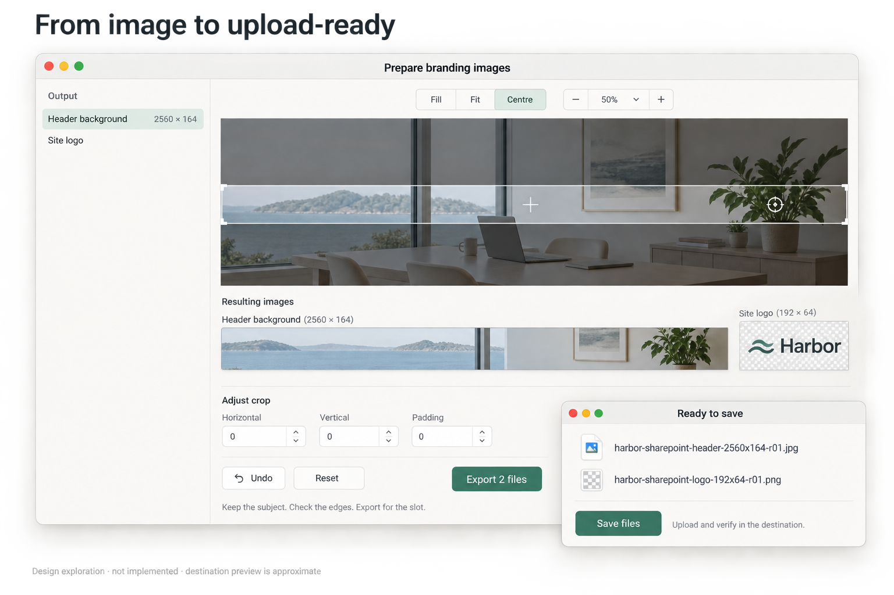

# Prepare tenant branding images for upload

Research and proposed first increment · 20 September 2026. This is a product proposal, not implemented functionality. Public documentation and current Workbench source were inspected; no customer tenant was accessed or changed. The products below are representative examples, not a commitment to support every tenant.

## The useful outcome

Start with an approved or generated image, choose the destination slot, fine-tune the crop and placement, then export clearly named files that are easy to upload. The job is the last few minutes of preparation: keep the subject in view, make the logo sit properly, respect the target's constraints and avoid repeatedly guessing in an upload form.

Use **Prepare branding images** as the working action name. It describes the outcome without implying tenant administration. A background-generation brief can supply the starting artwork, but an existing image should work without any model call. This extends the asset-reuse direction; it is a different deliverable from a Workbench presentation scene.



**Generated design exploration, not a Workbench or vendor screenshot.** Keep the output-slot list, source/crop comparison, separate logo and named export review. Treat the depicted geometry as illustrative: the implementation must render exact output dimensions. Centre is an action, not a third mutually exclusive mode beside Fill/Fit; Padding needs a stated unit and relevant scope. The image's faint footer is insufficient labelling by itself, so retain this visible caption wherever it is used. [Generation prompt](tenant-branding/finisher-concept-prompt.md).

## What the SaaS evidence changes

| Destination and official evidence | What is actually documented | Product implication |
| --- | --- | --- |
| [Microsoft Entra sign-in branding](https://learn.microsoft.com/en-us/entra/fundamentals/how-to-customize-branding) | PNG/JPG background listed at 1920 × 1080, maximum 300 KB; header and banner logos both listed at 245 × 36, but with different maxima of 10 KB and 50 KB. Backgrounds crop with the window and can sit behind the sign-in box. | Key a preset to the specific slot, not just “Entra logo”. Show occlusion/crop as an approximation. The article's “Image size” label does not consistently establish exact-versus-maximum pixel rules. |
| [SharePoint image recommendations](https://support.microsoft.com/en-us/sharepoint/web-parts-and-apps-in-sharepoint/image-sizing-and-scaling-in-sharepoint-modern-pages) | Recommended site logo 192 × 64, thumbnail 64 × 64, extended-header logo 300 × 64, extended background 2560 × 164. Header background accepts JPEG/PNG. Responsive layouts change crops. | A recommendation is a useful starting canvas, not a guaranteed rendering contract. Separate a very wide header from a page hero, and preview at multiple widths. |
| [ServiceNow Service Portal branding](https://www.servicenow.com/docs/r/platform-user-interface/service-portal/c_BrandingEditor.html), Australia release, updated 22 April 2026 | The portal header scales its logo into a maximum displayed box of 200 × 46. Logo padding positions it relative to the header. The homepage background belongs to a widget container. | The display box is not an exact upload-size requirement. A contain/padding preview is useful; this page does not establish file-size limits or universal background dimensions. Do not apply its rules to every ServiceNow interface. |
| [Shopify image guidance](https://help.shopify.com/en/manual/online-store/images/theme-images) | A focal point helps retain the subject through theme cropping; one point applies wherever the image is reused. Theme compatibility matters and the subject need not appear visually centred. The guidance recommends keeping slideshow/background text in the theme rather than the picture. | Distinguish framing the subject from centring the canvas. Keep destination-owned text editable; do not flatten it into every background. A Workbench focus marker cannot configure a SaaS theme by itself. |

There is an instructive documentation conflict: [Microsoft Graph's branding schema](https://learn.microsoft.com/en-us/graph/api/resources/organizationalbrandingproperties?view=graph-rest-1.0) gives square logos a 10 KB limit where the Entra admin guide lists 50 KB, and its background-size wording conflicts with the admin guide. Record the source and upload route; do not combine conflicting claims into a universal “tenant-compatible” check. Preserve vendor KB/MB notation, show actual encoded bytes and make an unverified byte conversion explicit.

These products already provide some finishing controls. SharePoint's [Change the look → Header](https://support.microsoft.com/en-us/sharepoint/sites-in-sharepoint/change-the-look-of-your-sharepoint-site) includes background overlay, opacity and focal-point adjustments, with availability varying by cloud/layout. The opportunity is repeatable preparation across slots and destinations. If the destination's own editor handles a one-off adjustment easily, use it.

## Three pieces of information, one small editing flow

**Brand ingredients:** the selected logo, approved colours and any supplied clear-space rule. Keep the source and original bytes. Do not infer a brand specification from a website or generated picture.

**Destination specification:** product, interface/slot, upload route, source link and checked date; pixel dimensions and whether they are exact, minimum, maximum or recommended; formats, transparency, byte limit and any verified crop/occlusion behaviour. Unknown fields stay unknown. A custom size remains available. Save the chosen specification with the draft so a later preset update does not silently change its output.

**Composition:** which source goes into each selected slot, Fill or Fit, position/zoom, padding/background and deliberate overlays. Brand intent stays separate from a vendor's upload constraint. Reusing a brand can create another output without changing a live scene or earlier export.

1. **Choose outputs.** Start with an existing image and one named slot, then add a second variant when needed. A narrow header and transparent logo exercise genuinely different requirements. Show dimensions and the source of any suggested preset.
2. **Fine-tune.** Fill crops without stretching; Fit contains the whole image with explicit transparent or solid padding. In Fit, constrain zoom and offsets to keep the source fully visible; choose Fill explicitly when clipping is wanted. Offer Centre, drag/zoom, numeric offsets, arrow-key nudges, Undo and Reset. Express precise nudges in output pixels, independent of Retina screen points. Preview any transparent-padding trim before applying it: whitespace may be required by the brand. Preserve alpha; removing an opaque background is a separate optional operation. Keep the first increment to image placement and padding; add a small logo/text overlay only for a demonstrated flattened-output need.
3. **Check the result.** Show the exact export rectangle, an actual-pixel view and wide/narrow destination approximations. Display decoded dimensions, format, alpha and encoded byte count. Check edges, low-resolution enlargement, logo legibility and light/dark contrast. Explain whether a result meets a verified constraint, a recommendation or an assumption. A focus point or guide is not exported as an instruction the SaaS app will automatically understand.
4. **Export and upload.** Save selected variants to a chosen folder, with an optional ZIP for several files. On Mac this is a native save/export action; a future web implementation could download the same outputs. Show names before saving and provide the relevant vendor upload instructions. The final check happens in the actual destination.

JPEG export needs an explicit background when the source has transparency. Use a predictable web colour space, normalize orientation, omit unnecessary source metadata and inspect the final encoded file. Re-encode to meet a byte budget only within a visible quality choice; never silently shrink a required canvas or declare an unreadable result acceptable. Preserve originals and the editable draft.

## A useful export, not a mystery download

Use `{brand}-{application}-{slot}-{width}x{height}-{variant?}-r{revision}.{ext}`, with a readable user-approved prefix and filesystem-safe slugs. For the fictional Harbor example:

```text
harbor-sharepoint-header-background-2560x164-r01.jpg
harbor-sharepoint-site-logo-192x64-r01.png
harbor-entra-sign-in-background-1920x1080-r01.jpg
```

Names describe the actual encoded output. Do not invent customer names, include account identifiers or overwrite a prior export silently. Offer an editable name and explicit replace/new-revision choice. Multi-file failure must identify which files were saved; Retry must not erase good originals or claim the whole pack succeeded.

For multiple outputs, a short `Upload guide.md` can map each filename to its slot, dimensions/bytes, checked source and remaining destination steps. Keep the recipe beside the local draft; no new dashboard is needed. The useful receipt is **Files saved**, then **Open folder**. Upload completion and correct rendering are separate facts.

Representative final steps, following the linked vendor instructions:

- Entra: an authorised branding administrator opens Entra ID → Custom Branding, edits the appropriate sections and reviews the result. Check the actual sign-in experience, including cropping and any obscuring prompt.
- SharePoint: Settings → Change the look → Header, choose the applicable layout/design, upload the matching image, adjust native placement if needed and Save. Recheck the page at the widths people will use.
- ServiceNow Service Portal: Service Portal Configuration → Branding Editor, select the portal and use Quick Setup / Theme Colors. Check the selected portal's header/background; other interfaces have separate rules.

An upload walkthrough should say where the file goes and what still needs configuring. It should not request credentials or automate publication as a side effect of exporting.

## Build on Workbench carefully

Current source inspected at `f63cf35197221866c0501d6f1ced23c808401d20` already provides bounded image decoding, backdrop crop/preview/cancel and scene export. Start with [BackdropReplacement](../../Sources/StageKit/BackdropReplacement.swift), [its view](../../Sources/StageKit/BackdropReplacementView.swift), [LogoImport](../../Sources/StageKit/LogoImport.swift) and [scene rendering/export](../../Sources/StageKit/DemoScenes.swift).

Reuse tested decoding and geometry where their contracts fit. Do not reuse the scene export wholesale: it exports a presentation composition and currently defaults to the scene name plus `.png`. In addition, `LogoImport.normalizedPNG` automatically trims transparent padding and downsamples to a maximum dimension of 4096. That policy can discard intended brand spacing or resolution. A branding draft needs an original-preserving import path and explicit output-specific trimming/resampling.

Keep this an action beside existing image preparation/export. The first single-output slice uses an in-memory draft with Undo and Cancel; keep it available after a failed save. The later reuse slice saves a recipe and original references with the selected destination specification. It must not create a fake phone scene, alter desktop wallpaper, start capture or write tenant settings. Extract a small common image operation only when the second caller actually needs it. The background brief in [#65](https://github.com/EthDawg/workbench/issues/65) is an optional upstream input; the [existing asset library and prompts](../design-images.md) are the starting material. Logo discovery and current scene usability remain owned by #58.

## Smallest sequence and acceptance

**First prove the job:** use synthetic approved artwork to finish a header and logo manually, then repeat for another audience. Compare with the target SaaS editor or an existing design tool. Record whether saved framing, clear filenames and repeat export remove work. Choose the first actual product/slots with the user before shipping presets; this research is not evidence of their frequency.

**First implementation:** one image, a custom or source-labelled canvas, Fill/Fit, position/padding, Undo/Reset and exact PNG/JPEG export. Then add saved recipes and named multi-output reuse when the first path works. Generation and extra overlays can follow demonstrated need; neither is required for this outcome.

First-slice acceptance uses asymmetric synthetic art, a padded transparent logo and an oriented photograph, plus corrupt and oversized inputs. It must establish:

- Preview and decoded export agree on crop, pixel dimensions, orientation, colour and alpha; Fill never stretches, Fit never clips, and nudging stays predictable at different display scales.
- Padding survives import unless explicitly changed; Centre, Undo/Reset and Cancel preserve the original and unrelated scene state. Light/dark and keyboard/VoiceOver controls remain usable.
- Encoded byte limits, unsupported formats and insufficient resolution are handled honestly. A recommended dimension does not become a hard rejection, and an unknown vendor rule does not become a pass.
- The single export has a predictable editable name and collision handling. A failed write keeps the draft available and never reports success or modifies the original.
- A permitted test upload accepts the files, and the relevant destination looks correct at wide/narrow sizes. Without that check, report local export validation only. No real tenant test or publishing authority is implied by this proposal.

The later reuse slice additionally checks recipe reopening, missing-original recovery, repeatable geometry, name revisions and multi-file partial failures. It must identify saved/unsaved outputs and retry safely without another model call. These are not extra closure requirements for the first single-output change.

Keep a general design suite, tenant/CSS administration, account integration, automatic brand scraping and a model-dependent finishing path outside the first increment. Success is a file the person can confidently upload and reuse.
