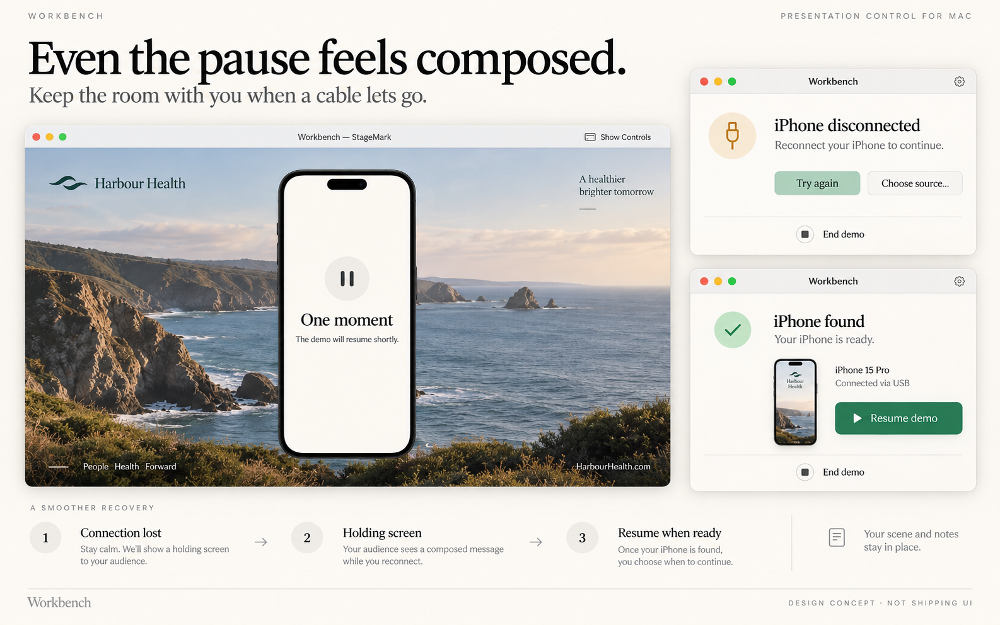

# Older Workbench work: recovered, covered or deliberately deferred

Audited 21 September 2026 against `main c692a4bd1249a4ddeb3e0606754a18137e6f41c3`, the public Preview 4 source `95d54409f638423a3f4ef1a27679f1dd522bf459`, local feature refs/worktrees, existing issues/PRs and two older design packs. This is a dated decision record, not a second backlog. Follow the linked GitHub owners for subsequent status.

**Result:** the material omissions are unfinished presenter additions, a standalone audience-window experiment, and unpublished review preparation. Most apparently lost committed code already landed through integration or has an active PR. Preserve useful experiments without presenting every old idea as a product commitment.

## Recoveries worth keeping

| Work | Decision and reason | Owner / next evidence |
| --- | --- | --- |
| Existing Chrome bookmark → correct profile | Recover source; first candidate for a small implementation. It preserves existing query/fragment routes without a second bookmark library. No specific rejection reason was found. | [Presenter recovery](presenter-recovery/README.md), with historical patch and ordered acceptance. Coordinate with [PR #55](https://github.com/EthDawg/workbench/pull/55). |
| Profile-aware cue / local preparation notes | Recover the attempted source. Validate the profile cue separately; reconcile notes with the existing destination-owned proposal. A profile is not a signed-in account. | [Presenter recovery](presenter-recovery/README.md); notes stay under [#38](https://github.com/EthDawg/workbench/issues/38). |
| Controlled audience-window prototype | Preserve independently as an experiment. It was intentionally kept outside the product; real capture, receiver and performance checks were absent. | [PR #72](https://github.com/EthDawg/workbench/pull/72); existing [#38](https://github.com/EthDawg/workbench/issues/38) and [#29](https://github.com/EthDawg/workbench/issues/29). No runtime integration promised. |
| App Review evidence preparation | Recover reusable build-matched instructions, stripping private review identifiers and stale status. This is a delivery prerequisite, not a feature. | [PR #73](https://github.com/EthDawg/workbench/pull/73). Physical evidence and final selected-build checks remain necessary. |
| Phone-hand kit | Already recovered with assets, geometry and native implementation boundaries. | [PR #71](https://github.com/EthDawg/workbench/pull/71), [#70](https://github.com/EthDawg/workbench/issues/70). No duplicate recovery. |

The presenter patch came from an inactive older task's dirty worktree at `887a6e0`; no files in that owner checkout were reset, committed or rewritten. App Review preparation was a separate unpublished commit `0db38e6`. Preserve the distinction between an interrupted task, a consciously deferred experiment and an idea that was only illustrated. We cannot infer a historical rejection from age or an unmerged branch.

## Work that should not be recreated

| Older work / apparent gap | Evidence and disposition |
| --- | --- |
| Quick Look lifecycle branch | `3893283` was incorporated as `1014c93`. Current source contains the lifecycle fix. |
| Scene media/browser/motion branch | `4fcd6f3` was incorporated as `a5cea3a`; the relevant logo browser/import, motion policy/renderer and tests match current main. |
| Native scene-list usability | `dd81666` was incorporated as `d9aff53`; [PR #62](https://github.com/EthDawg/workbench/pull/62) is merged. |
| Archived StageMark logo import / viewport polish | Normalized source comparison found the logo import/gallery and viewport implementation in current StageKit. Preserve the archive; do not restart development there. |
| Original Shortcuts/Speko branch | Closed PR #12 is not proof of lost work. Unified source contains the integration; remaining composition testing belongs to [#10](https://github.com/EthDawg/workbench/issues/10). The app-owned microphone prototype was abandoned because cancellation was unreliable; Apple's Record Audio followed by Workbench transcription is the retained route ([integration evidence](../voice-integrations.md)). |
| Current browser setup, compact controls, fresh snapshots | [#55](https://github.com/EthDawg/workbench/pull/55), [#69](https://github.com/EthDawg/workbench/pull/69), [#68](https://github.com/EthDawg/workbench/pull/68) already own these changes. |
| Mobile imports, handoff recipes, tenant-image finesse, contextual metadata and optional model work | [PR #61](https://github.com/EthDawg/workbench/pull/61), [PR #66](https://github.com/EthDawg/workbench/pull/66), issues [#60](https://github.com/EthDawg/workbench/issues/60), [#24](https://github.com/EthDawg/workbench/issues/24) retain this direction. Read their individual scope rather than creating new feature lists. |

**Merged is not downloaded:** Preview 4 predates PR #62. The persistent toolbar, scene list, logo browser and editor-motion usability changes exist on main but are absent from that public binary. [The usability evidence](../verification/2026-09-20-mac-usability.md) and issues #56–58 retain the remaining acceptance. This needs the existing release process and verification, not another implementation PR. [Preview 4's release record](../releases/2026-09-20-preview-4.md) owns delivered-build evidence; this audit did not install or publish a replacement.

## Design work that should not become thirteen features

The 12 September studies consisted of six StageMark journey boards and seven Mac-menu alternatives. They were generated concepts, not tested UI. Related later illustrations and guidance already appear in the repository. The following preserves the useful decisions without adding another gallery or mandating incompatible controls.

| Original concept | Disposition |
| --- | --- |
| Quiet controls | Existing controls and PR #69. Do not revive its old “Live” label against the current HUD guidance. |
| Ready in seconds / scene setup | Existing scene model and #57. Reuse saved setup; validate the preparation flow. |
| Presenter view | #38; separate shared output/unshared controls must be demonstrated. |
| Make the point / annotations | Existing ink/fade; #19 and #29 own editing and receiver acceptance. |
| Calm recovery | Preserve the selected image below. The remaining hypothesis is deliberate audience reveal, not basic reconnection. |
| A clean finish | Fresh frame work belongs to #20 / PR #68. Defer an end-of-demo modal until people demonstrably cannot find the output; the original concept explicitly made it optional. |
| Adaptive capsule | Principle adopted in current persistent toolbar and PR #69. |
| Magnetic placement | Reuse current placement/persistence; snapping needs observed benefit before adding another behavior. |
| Mode switcher | PR #69 owns Change mode and discoverable shortcuts. |
| Smart dropdowns | Contextual action hierarchy is guidance, not a new service or separate menu system. |
| Detachable panel | Optional depth; defer until one stable control surface proves insufficient. |
| Edge dock | An alternative to the capsule, not an additional feature. No reason to ship both was established. |
| Quick-action tray | Another alternative; defer to the current compact-controls choice. |

Harbour Health and the board's domain/content are fictional. “Your scene and notes stay in place” and the separate controller are proposed behavior, not verified privacy or current capabilities. [Exact original prompt and image hash](../assets/recovered-concepts/README.md) preserve provenance.

Current `DemoCapture.swift` already retains the selected source, invalidates stale frames and reconnects only that device. `DemoPresentation.swift` preserves the scene with failure/reconnect controls. The unresolved idea is a calm audience holding state that remains until the presenter explicitly chooses **Resume** after fresh frames return.

Keep this **validate next only if a real interruption exposes the need**. Rehearse unplug/reconnect with synthetic content and a receiving participant. Record whether automatic reveal or in-stage diagnostics causes an actual problem. If so, propose a small hold/reveal state with scene preservation, honest detected connection messages, keyboard access and Stop behavior. Do not infer trust/permission causes, promise hidden controls, freeze an old image as though it were live, or add a general capture compositor. If the current flow is adequate, keep the illustration as a considered alternative.

## Quality gate for later recoveries

Use an existing issue/PR whenever it already owns the outcome. A new recovery needs an actual artifact or decision, a verified gap against current source, one useful user result, a simpler alternative, and a bounded test that can reject it. Retain why an idea was stopped when evidenced; write “unknown” otherwise. Separate source, synthetic checks, observed native behavior, merge, downloadable release and installation.

No private Drive library, customer scenes, credentials or live browser profiles were read for this audit. Original owner worktrees and archived projects remain unchanged. The fresh validation receipt is in [presenter recovery verification](presenter-recovery/verification.md).
