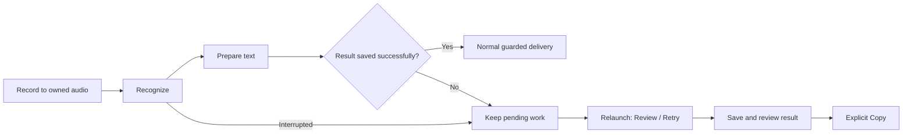

# Voice to text: where Workbench should compete

**Status note · 20 September 2026:** the leading Mac recovery proposal below is now implemented; see [the 15 September verification](../verification/2026-09-15-recent-journeys.md). This is a dated research record, not the current queue or release status. The [project-wide direction](../commodity-strategy.md) and [model evaluation issue #24](https://github.com/EthDawg/workbench/issues/24) guide subsequent investment. Later [release records](../releases/2026-09-20-preview-4.md) supersede the historical submission/distribution statements below.

Research and proposals, **14 September 2026**. Current source reviewed at `363abbce32183e082543b08e398547ac233d53b0`. These recommendations are not implemented features or release evidence. Apple sign-in, submission declarations and physical-phone acceptance remain paused.

**Proposed next implementation: recover unfinished Mac dictation after an app restart, and require a successful save before removing its recording.** This closes a concrete reliability gap in the current source. It is a prerequisite for a dependable utility, rather than a novel competitive moat. The smallest subsequent mobile improvement is **Remember correction** in transcript review.

The broader proposition should be: **speak once, keep control of the original, and get usable text with little effort.** Free pricing and a choice of models are already common. Our advantage must come from dependable behavior, low setup effort and restrained native design. Accuracy superiority has not been established.

## What the comparison establishes

I reviewed official product/help pages, Apple documentation and App Store listings; inspected installed Superwhisper and Wispr Flow Mac interfaces; and audited Workbench's source. Two delegated audits covered mobile evidence and existing implementation. Claude critiqued a supplied brief containing public competitor documentation only. Its answer was checked and selectively used; it did not independently browse or inspect Workbench.

The native walkthrough confirmed Superwhisper's modes/model controls and Flow's shortcut, microphone, language and separate personalization surfaces. It did **not** measure recognition, latency, energy use or cross-app insertion. Superwhisper's Pro trial was exhausted; no purchase or additional access was made. No physical iPhone competitor tests, private transcript exports, calendar connection or account changes were performed. Vendor demonstrations and claims remain distinct from observed behavior.

The useful outcome metric for later testing is **time from deciding to dictate to correct text in its intended destination**. A fast recognizer can still produce a slow experience if setup, correction, copying or recovery is cumbersome.

## Which products are actually comparable?

| Product | Main job and useful craft | Processing / commercial distinction | What Workbench should learn |
| --- | --- | --- | --- |
| **Apple Dictation** | Speak directly into the current field; typing and dictation can coexist. Punctuation and formatting already exist. | Included with the OS; language/device availability varies. | This is the baseline to beat. For an ordinary short iPhone message, it may already be the best answer. [iPhone guide](https://support.apple.com/guide/iphone/dictate-text-iph2c0651d2/26/ios/26), [Mac guide](https://support.apple.com/guide/mac-help/use-dictation-mh40584/mac). |
| **Wispr Flow** | Writing at the cursor, personal vocabulary and destination-specific style. Installed Mac UI separates Dictionary, Snippets and Style from the recorder. | Cloud transcription. Training participation, context and cloud synchronization are different controls. Free allowance and paid plans. | Delivery and personalization matter as much as raw recognition. Avoid copying ambiguous privacy labels. [Context](https://docs.wisprflow.ai/articles/4678293671-Context-Awareness), [current privacy controls](https://docs.wisprflow.ai/articles/3842996553-privacy-mode-private-cloud-sync), [personal settings sync](https://docs.wisprflow.ai/articles/5284722493-sync-flow-across-your-devices). |
| **Superwhisper** | Independently selected speech and text-processing stages; reusable modes; full/mini recorder; history reprocessing. | Local or cloud speech; optional AI processing has its own destination. Local language models are documented for **Mac**, not mobile. | Keep the pipeline explicit while making the everyday recorder small. Reuse interaction principles, not its hover-dependent reveal. [Modes](https://superwhisper.com/docs/modes/modes), [recorder](https://superwhisper.com/docs/get-started/interface-rec-window), [reprocessing](https://superwhisper.com/docs/get-started/transcribe-history), [processing boundaries](https://superwhisper.com/docs/security/sensitive-data). |
| **VoiceInk** | Local dictation, custom vocabulary and literal replacement; open-source source with commercial packaged builds. | Local default with optional cloud speech or text enhancement. Its privacy policy is more qualified than the homepage's absolute local claims. | A close comparator for the commodity strategy: engine access alone is not the whole product. The practical value is reliable insertion and repeatable correction. [Product](https://tryvoiceink.com/), [privacy](https://tryvoiceink.com/privacy), [original source](https://github.com/Beingpax/VoiceInk). |
| **MacWhisper** | Broader audio/file transcription alongside dictation, with local/cloud choices and automation. | Vendor documentation distinguishes dictation in its website build from its Mac App Store build. Older provider lists are stale. | Use one underlying job through different entry points; don't force a meeting editor into short dictation. Distribution parity needs separate verification. [Product](https://www.macwhisper.com/), [dictation guide](https://docs.macwhisper.com/article/14-how-to-use-the-dictation-feature), [CLI](https://docs.macwhisper.com/article/57-macwhisper-command-line-tool). |
| **Speechify Voice Typing** | Now a direct dictation competitor as well as a reading product. Advertises cleanup, dictionary and cross-app writing. | Currently advertises free unlimited dictation and an offline model/fallback. The offline FAQ lists desktop requirements; identical iPhone behavior is **unverified**. | Free alone will not distinguish us. Accessibility and low cognitive load are useful design references; “zero typos” and speed multipliers are marketing, not our measurements. [Current offer](https://speechify.com/voice-typing-dictation/), [iOS/Mac announcement](https://speechify.com/news/speechify-voice-typing-ios-mac-launch/). |
| **Otter** | Record a conversation, find what was said, replay, summarize and collaborate. | A meeting/conversation service with account and subscription capabilities. | Borrow clear capture/review/recovery. Do not inherit meeting bots, speaker attribution or team workspaces for a short text-entry utility. [Official App Store listing](https://apps.apple.com/au/app/otter-transcribe-voice-notes/id1276437113). |
| **Aiko** | Deliberately simple record/import → local transcription → export, including Shortcuts. | On-device Whisper; mobile model and foreground execution constraints are documented. | A closer comparator to Workbench's saved mobile capture than a custom keyboard is. Its simplicity is a useful limit on scope. [Developer's product and FAQ](https://sindresorhus.com/aiko). |

The other icons in the supplied photo belong to adjacent jobs. **ElevenReader** narrates written content; **ElevenMusic** creates/listens to music. **ElevenLabs Scribe** is a hosted recognition engine/API that could inform a future adapter, but it is not an offline commodity default. A streaming API's advertised latency is not end-to-end app latency. [ElevenReader](https://help.elevenlabs.io/hc/en-us/articles/26197672002833-What-is-ElevenReader), [ElevenMusic](https://elevenlabs.io/music), [Scribe](https://elevenlabs.io/docs/overview/capabilities/speech-to-text).

These products are therefore not one ladder from worst to best. Flow and Superwhisper are the closest writing-workflow references; VoiceInk tests our free/local proposition; Otter is a different job; Apple is the most important baseline.

## App Store category and the award

**Productivity is the strongest primary-category recommendation.** Apple explicitly lists audio dictation under Productivity. Otter, Wispr Flow and Superwhisper's Australian listings use it. Utilities remains a plausible secondary category for Workbench's broader tools, provided the actual app and listing emphasize those tools. The category describes the main customer job, not whether the app is small or free. No category was changed during this research. [Apple category definitions](https://developer.apple.com/app-store/categories/), [Wispr listing](https://apps.apple.com/au/app/wispr-flow-ai-voice-keyboard/id6497229487), [Superwhisper listing](https://apps.apple.com/au/app/superwhisper-ai-dictation/id6471464415).

**Otter has verified Apple Editors' Choice recognition.** I did not establish that it won an Apple Design Award. **Speechify won the 2025 Apple Design Award for Inclusivity**: Apple's explanation emphasizes approachable reading, Dynamic Type, VoiceOver and reduced cognitive load. That is evidence worth borrowing for design, not proof that its speech recognition is more accurate. [Otter editorial recognition](https://apps.apple.com/au/app/otter-transcribe-voice-notes/id1276437113), [Apple's award record](https://developer.apple.com/design/awards/2025/).

## Mobile and Mac need different product promises

| Situation | Appropriate surface | Workbench's useful role |
| --- | --- | --- |
| A short message in an iPhone app | Apple's keyboard microphone in that field | Preserve the native option. Workbench need not mediate every sentence. |
| A thought or imported recording worth retaining on iPhone | Foreground Dictate workspace, then review and explicit Copy/Share | Keep original audio, help with recurring spellings, and make reuse easy. |
| A repeatable mobile automation | An explicit audio-in/text-out App Intent, if implemented | Let Shortcuts own recording and onward delivery. This mobile adapter does not exist yet. |
| Writing into another Mac app | Global shortcut plus compact, clickable recording HUD | Preserve focus, make insertion fit the destination, report delivery honestly, recover failures. |
| Reviewing settings or an unfinished capture | Normal app window | Provide space for meaningful controls without enlarging the everyday HUD. |
| Presenting an iPhone screen | Mobile's own input methods and separate presentation controls | Mac dictation does not belong in the presentation tile merely because both features share an app. |

An iPhone custom keyboard cannot directly use the microphone, including with Full Access. Some fields and apps exclude third-party keyboards. Apple's current review rules also constrain launching another app from a keyboard. Both Flow and Superwhisper document a manual return after microphone activation on iOS 26.4+. Their behavior establishes a usability cost; it does not establish an approved public implementation route for us. A replacement keyboard is a separately scoped feasibility decision. [UIKit open-access rules](https://developer.apple.com/documentation/uikit/configuring-open-access-for-a-custom-keyboard), [field restrictions](https://developer.apple.com/library/archive/documentation/General/Conceptual/ExtensibilityPG/CustomKeyboard.html), [review §4.4.1](https://developer.apple.com/app-store/review/guidelines/#extensions), [Flow setup](https://docs.wisprflow.ai/articles/7453988911-set-up-the-flow-keyboard-on-iphone), [Superwhisper changes](https://superwhisper.com/docs/common-issues/ios-26-keyboard-changes).

Apple is also raising the baseline. Its announced advanced Dictation uses a newer model on a narrower hardware tier than general Apple Intelligence eligibility. The announcement includes particular iPhones and Macs/iPads meeting chip and memory requirements; it is not a capability of every iOS 26/27 device. These announcements do not prove that the public SpeechTranscriber API produces the system keyboard's exact output. Keep OS and model updates measurable rather than treating an OS version number as a quality guarantee. [Apple announcement and hardware footnote](https://www.apple.com/newsroom/2026/06/apple-introduces-siri-ai-a-profoundly-more-capable-and-personal-assistant/), [language availability](https://www.apple.com/ios/feature-availability/).

## The actual starting point in our code

| Capability | Mac now | iPhone/iPad now |
| --- | --- | --- |
| Speech engine | Local English Parakeet; optional explicit loopback server. Finished-file transcription. | Apple SpeechAnalyzer/SpeechTranscriber, device/locale checks and model preparation. Finished-file transcription. |
| Text preparation | Original / Light / Natural; Natural already supports Apple Foundation Models or local Ollama with conservative fidelity checks. | Light cleanup, original text and edit-aware Undo. Natural is not integrated into mobile. |
| Personal corrections | Remember correction, preview, explicit save and scoped Undo. | Rule storage and application exist; no current rule-authoring interface was found. |
| Delivery | Focus/secure-field checks, clipboard ownership, copy fallback and typed delivery receipts. | Explicit Copy/Share/Save/Read aloud. No arbitrary-app paste or custom keyboard. |
| Capture recovery | Retry uses a temporary, process-local audio reference. No discoverable restart recovery. | App-owned recording plus a durable recovery marker; successful saving retains original audio. |
| Recorder controls | Compact/expanded, draggable/snapping HUD and shortcut coaching already exist. | Native workspace with level/duration and Finish; words appear after processing. |

Source anchors: [Mac engine](../../Sources/LocalVoice/RecognitionProviders.swift), [Mac capture/save](../../Sources/LocalVoice/AppModel.swift), [delivery](../../Sources/LocalVoice/TextDelivery.swift), [cleanup](../../Sources/LocalVoice/LocalRefinement.swift), [mobile speech](../../Mobile/Workbench/SpeechService.swift), [mobile review](../../Mobile/Workbench/TextWorkspaces.swift), [mobile storage](../../Mobile/Workbench/MobileDocument.swift). These are source findings, not fresh hardware acceptance.

The architecture already separates recognition, cleanup and delivery. Another general agent framework, provider marketplace or second voice database would add little. The useful gaps are lifecycle reliability, destination behavior, mobile personalization and evidence for future model changes.

## Three mobile architecture priorities

Ranks balance likely benefit, reuse of existing code, implementation burden and evidence confidence. They are judgment, not measured market scores. Small = localized work; medium = several lifecycle paths and device validation. Dependencies are explicit so interface and engine work do not masquerade as separate completed features.

| Rank | Proposed change | Concrete delta and tradeoff | Acceptance / relative effort |
| --- | --- | --- | --- |
| **1** | **Live transcription with a retained original** | One capture owner both writes audio and feeds SpeechAnalyzer. Keep provisional words separate from final text. Current code only starts recognition after Stop. This reduces waiting and helps a person notice a missed phrase, but adds audio lifecycle and energy complexity. | Physical tests must show readable partials, correct finalization, retained recovery and no draft overwrite after interruption. Measure time to first words and post-Stop wait. **Medium.** |
| **2** | **Language-aware, optional local refinement** | Reuse the Mac's recognition → optional cleanup → approved corrections separation. Freeze language and settings per capture. Add mobile Natural only where Foundation Models and the locale are supported; preserve Light and Original. Avoid forcing Australian-English rewriting on a different language. | Test unsupported devices/languages, unready models, edits during processing, names/numbers/negation and fallback. A prettier rewrite that changes intent fails. **Medium.** |
| **3** | **A mobile audio-in/text-out action** | Reuse the existing mobile service behind an App Intent so Shortcuts can record audio and pass it in. Capture remains owned by Shortcuts or the foreground app, never both. The Mac already has this adapter; mobile does not. | Invocation-specific results, cancellation, wrong file/format, unavailable language, and no unsolicited clipboard changes or message submission. **Small–medium.** |

Apple documents `progressiveTranscription` for live input, but adopting its preset alone will not turn the current finished-file path into streaming. Foundation Models needs separate availability and locale checks. [Live transcription preset](https://developer.apple.com/documentation/speech/speechtranscriber/preset/progressivetranscription), [Foundation Models language support](https://developer.apple.com/documentation/foundationmodels/supporting-languages-and-locales-with-foundation-models).

## Three mobile usability and design priorities

| Rank | Proposed change | User benefit and boundary | Acceptance / dependency |
| --- | --- | --- | --- |
| **1** | **Remember correction from the result** | A short Heard → Use instead sheet with a preview, explicit save and Undo. Reuse Mac matching rules. A correction to a product name should help next time without silently monitoring every edit. | Case-only changes, existing/conflicting rules, failed save and stale Undo are handled. Rules remain local; personal sync is a separate choice. **Small**, supported by existing shared storage/rules. |
| **2** | **Readable words while speaking** | Show a few useful lines, with provisional text clearly unsettled and a clear finish/review transition. Reduce waveform decoration; preserve the previous draft until the new result is accepted. | Dynamic Type, VoiceOver without announcing every unstable syllable, no partial text saved as final, sensible iPad layout. **Depends on mobile architecture #1.** |
| **3** | **One successful first result** | Guide a real capture through review and Copy/Share using the existing workspace. If model setup is unavailable, explain the usable system-keyboard Dictation option. Successful setup means useful text, not a green readiness label. | Test a fresh user, refused permission, cold model preparation, a failed save and iPad with hardware keyboard. One clear next action; no introductory slideshow or permanent mic indicator. |

Approved literal corrections are different from recognizer hints and from saved snippets. Apple's `AnalysisContext.contextualStrings` documentation specifies **DictationTranscriber**, not proof of support in our current **SpeechTranscriber** module. It recommends brief phrases and a bounded list. Do not advertise a personalized acoustic model or wire every saved rule into an unsupported hint API. [Exact Apple API contract](https://developer.apple.com/documentation/speech/analysiscontext/contextualstrings).

## Three Mac architecture priorities

| Rank | Proposed change | Concrete delta and tradeoff | Acceptance / relative effort |
| --- | --- | --- | --- |
| **1** | **Durable pending capture and checked saving** | Retain a recoverable, app-owned original through failures/restart. Require an explicit successful result commit before deleting it. Current `saveNow()` catches errors while its caller can still deliver and delete the audio. | Save failure, quit/relaunch, corrupted audio, cancellation and duplicate delivery checks. No claim that every frame survives power loss. **Medium; high confidence in the source gap.** |
| **2** | **A separate insertion plan** | Make spacing fit the caret/selection for supported Accessibility fields. Keep the saved transcript independent of placement-specific spaces. Recheck focus and selected range immediately before insertion; preserve copy fallback when context is unreliable. | Sentence start/middle/end, selection, no spaces, existing punctuation, code, moved caret and secure fields. Local deterministic handling, not a whole-document model prompt. **Small–medium; existing [#14](https://github.com/EthDawg/workbench/issues/14).** |
| **3** | **An enforced model-change quality gate** | Turn the existing evaluation template into a small reproducible corpus/run artifact. Compare raw and cleaned output, critical meaning errors, cold/warm delay and capabilities before changing defaults or model dependencies. Provider switching already exists. | Same inputs/settings, held-out samples, cancellation and recorded regressions. Identify actual vs merely configured server models. **Small–medium; existing [#24](https://github.com/EthDawg/workbench/issues/24), [template](../model-evaluation.md).** |

## Three Mac usability and design priorities

| Rank | Proposed change | User benefit and boundary | Acceptance / dependency |
| --- | --- | --- | --- |
| **1** | **Dictation that fits the sentence** | For a caret between “bring” and “tomorrow,” speaking “the blue folder” should produce properly spaced text. This is daily finesse, not another style picker or a speculative rewrite. | Preserve names, code and intended punctuation; fall back honestly on unsupported fields. **Depends on Mac architecture #2.** |
| **2** | **A calm recovery row in Dictate** | After a failed/interrupted capture, show one understandable unfinished item with Review/Retry and deliberate Discard. Show the applicable step: retry saving an existing result, or re-transcribe recovered audio. Keep ordinary successful dictation fast. | Keyboard/VoiceOver operable, no hover-only action, no misleading Saved claim, no automatic paste after relaunch. **Depends on Mac architecture #1.** |
| **3** | **First successful delivery, end to end** | Join the existing model preparation, permissions and shortcut practice around one harmless text destination. Finish with the actual delivery receipt and explain Copy fallback. | A new user can complete it without us operating the app. Include larger text, keyboard operation and contextual VoiceOver labels for repeated history actions. **Existing [#15](https://github.com/EthDawg/workbench/issues/15); accessibility detail [#3](https://github.com/EthDawg/workbench/issues/3).** |

## The one implementation I recommend

**Implement Mac recovery and checked saving first, with the small recovery row above.** It is one user outcome crossing persistence and UI: a failed attempt should not require speaking the same thought again when an intact original exists.

The specific evidence is `AppModel.swift`: `transcribe` adds the result to history, calls nonthrowing `saveNow()` at line 362, then delivers and removes temporary audio at line 373. `saveNow()` catches storage errors at lines 611–614; shutdown also removes the process-local recording. The store itself performs atomic writes; the missing part is propagating the success/failure result and retaining discoverable pending work. This is a **source-evidenced failure path**, not an allegation that a particular user's words were lost. [Capture lifecycle](../../Sources/LocalVoice/AppModel.swift), [atomic store](../../Sources/LocalVoice/Core.swift).

Proposed boundary:

1. Create an app-owned pending-capture identity, original audio reference and frozen request settings before processing. Reuse mobile's preservation ideas without extracting a large cross-platform framework.
2. Treat recording, recognition, prepared text, committed result and delivery as distinct states. If text exists and only saving failed, retry that save rather than re-running the model unnecessarily.
3. Keep a pending original on a failed commit or interrupted processing. Remove it only after an acknowledged result commit or deliberate discard. Imported external files remain untouched.
4. On restart, validate the retained file and show the unfinished item in Dictate. A recovered request produces a reviewable result, not an automatic paste into whichever app happens to be open. Successful processing and delivery should not create duplicate history entries.
5. Keep the initial capacity explicit: one unresolved capture, with Retry/Review, Export or Discard before replacing it. No silent overwriting and no unlimited audio archive. Confirm this rare-failure tradeoff in usability testing before expanding capacity.
6. Display “Recording recovered” only for a readable retained recording. Failed initial disk writes and truncated/corrupt audio require honest errors. Do not promise recovery of data that was never written.

The normal path does not add a confirmation screen. The recovery path deliberately requires review. This does not make us uniquely better than every competitor: history/reprocessing already exists elsewhere. It makes the existing free utility more trustworthy. After this fix, **Mac sentence-aware insertion** is the strongest daily-polish candidate; **mobile Remember correction** is the smallest useful phone change.

Generated design studies using the built-in image tool, based on the restrained mint/slate palette, system typography and existing Dictate workspace. The left study shows restart recovery when re-transcription is needed; an already-transcribed save failure would offer Retry save instead. The right study is a subsequent mobile proposal, not part of the selected Mac change. The image does not establish implementation, accessibility, exact native layout or device acceptance. [Generation brief](voice-category-2026-09/image-prompt.txt).

## How to test the next decisions fairly

Use the existing [model-change evidence template](../model-evaluation.md), with two separate tracks. Neither track has been completed in this research round.

| Track | Evidence to collect | Decision it supports |
| --- | --- | --- |
| **Workflow comparison** | Same kinds of short message, email and note; record activation effort, time to first words/final result, manual correction, copy/app-switch effort and completion. Use actual supported iPhone/iPad/Mac with consented speech. | Whether the next bottleneck is recognition, formatting, personalization or getting text into place. |
| **Failure and quality regression** | Identical licensed/consented audio across models; silence, pauses, names, lists, explicit corrections, times, numbers and negation. Separately inject save/provider failure and test restart/cancel/retry. | Whether a provider/default change preserves meaning and whether the app preserves work. |

Start with 15–30 varied audio items and held-out examples rather than a giant benchmark. Record raw text separately from cleanup output. Natural speech is necessary for acoustic claims; synthetic fixtures are useful for wiring and deterministic failure tests. Report warm and cold preparation separately, and measure time to **correct usable text**, not only model inference. On mobile, observe background/foreground transitions, calls/audio interruption, physical microphone capture and energy/thermal behavior. On Mac, use a synthetic TextEdit document and a browser fixture, not a private draft.

The selected recovery change should not ship until fault injection demonstrates that failed saves retain the original, relaunch discovers it, retries do not duplicate paste/history, explicit discard works, and a successful normal capture retains current clipboard/focus behavior. Existing app tests alone do not establish this new guarantee.

## What to defer, and what would change the recommendation

- **Replacement iPhone keyboard:** revisit after proving a permitted activation path and measuring a recurring need that native Dictation plus explicit capture cannot meet. Full Access, background mic sessions and seamless return are not assumptions.
- **Meeting bots, speaker diarization and team workspaces:** Otter's strengths answer a different job. Add them only after a separate customer need is established.
- **More engines or a new backend by default:** first evaluate the current raw/cleaned result. Keep reading, recognition, text cleanup and scene sync separate; photo/scene CloudKit does not authorize or imply transcript synchronization.
- **Automatic observation of every correction:** deliberate, previewed rules provide a useful first step without monitoring unrelated typing. Recognition hints, literal replacements and snippets should remain distinguishable.
- **Another recorder redesign:** compact/expanded/snapping controls already exist. Preserve the user's click preference. The award lesson is accessible, understandable interaction, not extra animation or glass.

If normal-use measurements show very frequent meaning-changing recognition errors, improving that measured quality would outrank new convenience features. The source-evidenced save/retention defect still deserves correction before presenting reliability as a product promise. If mobile capture is rarely used because native Dictation solves the whole job, do not build a keyboard merely to match a competitor's feature matrix.

## Evidence qualifications and review decisions

Several primary sources disagree. Flow's context article retains privacy wording that differs from newer training-toggle documentation; this report relies on the explicit cloud-transcription statement and leaves exact retention/payload behavior unverified. Superwhisper's help describes iPad, while current store compatibility does not establish an optimized native iPad app. VoiceInk's privacy policy permits optional cloud ASR despite broader local-only homepage language. Speechify's offline FAQ does not establish mobile parity; its June announcement's characterization of Wispr as desktop-only is not reliable competitor evidence. MacWhisper's old guide is useful for its distribution distinction, not its now-stale provider list.

The source audit prevented several duplicate recommendations: Mac already has Natural refinement, correction memory, clipboard receipts and a snapping HUD; mobile already has recovery and reversible cleanup. It also identified the exact Apple module limit for vocabulary hints.

Claude's public-evidence critique contributed the end-to-end measurement frame and the warning against importing meeting complexity. I rejected its suggestion of hover-revealed controls for this app, restricted streaming to Workbench's own mobile workspace, and did not adopt its generic cloud escalation or automatic sync suggestions. Claude did not validate Workbench code. Automatic review rejected the first brief containing code-audit details; the completed critique used a different, public-source-only brief.

All external links are primary sources checked for this report. App Store rankings, star ratings and vendor accuracy/speed superlatives were not used as comparative quality measurements. No existing guide, production setting, GitHub issue, website deployment or app binary was changed as part of these proposals.
