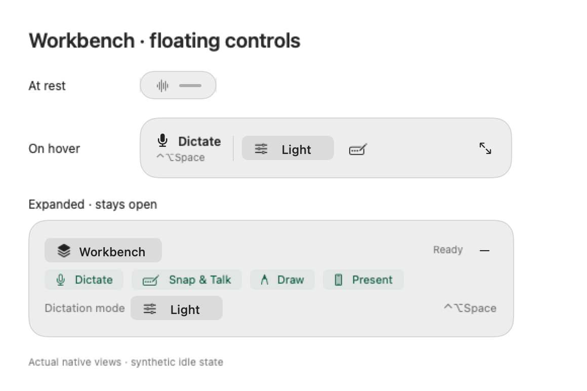
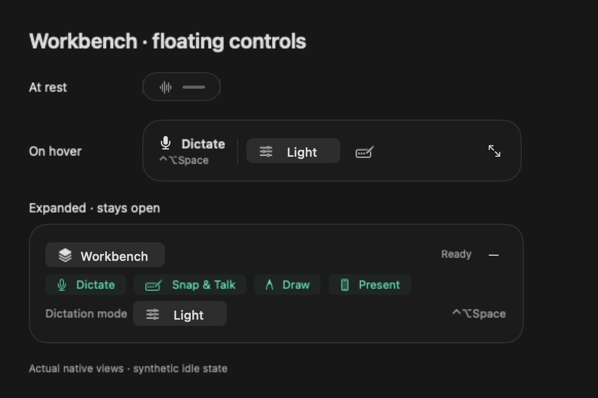

# Compact floating toolbar · 21 September 2026

Follow-up to merged #62 and the remaining #56 acceptance. This change implements quiet idle disclosure and a contextual dictation mode chooser; it does not close the outstanding hardware acceptance in #56.

## Behavior

- A 76 × 28 point resting indicator expands on hover to 368 × 60 quick actions. Click/Expand pins the 480 × 116 full tools. Collapse and expansion are remembered independently of show/hide and recording detail.
- Native mouse movement reveals controls with a restrained 380 ms spring and a short content fade. Reduce Motion disables both. Pointer exit allows 450 ms to reach controls. Re-entry cancels collapse; native menu tracking, keyboard interaction and dragging retain controls.
- Minimise clears the previous hover state and measures the future pill before accepting re-entry. Window resizing cannot manufacture pointer gestures. Explicit collapse works during a reveal or from an open menu. The unexplained six-dot idle grip is removed; drag the empty header space or use Position in the menu.
- Change mode uses Original/Light/Natural cleanup preferences and native checkmarks. Native menu highlight is navigation. The current recording retains its captured configuration.
- Dictation and Snap & Talk show configured shortcut information, including disabled/failed bindings. Stop, processing, failure and receipt surfaces retain their existing lifecycle; screenshot acquisition hides the complete shared window.
- Ordinary pointer use preserves external focus. Window → Focus floating toolbar explicitly focuses the native action menu; Space/Return opens it, arrows navigate and Escape leaves. This command only focuses idle tools. All idle actions and Change mode are also available from this menu.
- Anchored resizing preserves the display/edge. Free placement saves both origin and size so relaunch can restore its centre even if it last exited while hover-expanded.

## Verified locally

- Debug and release builds passed. Package suite: 107 tests, zero failures.
- All 45 focused toolbar checks passed, covering transient disclosure, genuine pointer motion, bounded spring motion, exit grace/re-entry, menu and drag holds, keyboard transitions, saved expansion, honest shortcuts and all eight anchor positions.
- All 23 disposable native controller checks passed: ten repeated minimise/reopen cycles, stationary pointer samples, first re-entry, continued movement outside, menu holds/collapse, intermediate animated window sizes, same-turn and mid-animation cancellation, dragging, recording takeover, hiding and closing. They drive the production controller with synthetic pointer samples; they do not inject OS mouse events.
- Core regression checks passed, including frozen capture settings, capture geometry, keyboard, clipboard receipts, cleanup and integration checks.
- The actual debug app runs in a disposable bundle with separate preferences and storage. Native inspection verified quiet and expanded layouts, main-window closure, and Original/Natural mode selection. Keyboard inspection exposed a focus issue; the repair explicitly focuses a native button containing all actions.
- Full `bash scripts/test.sh` passed, including StageKit: 139 tests / 2,828 assertions, 64 extension tests and the provider, persistence, clipboard and keyboard regressions. All 8 website tests and its static build passed.
- Final native keyboard check: Window → Focus floating toolbar focuses the native Workbench button; Space opens it; five Down presses and Right reach Change mode; Return selected Original; Escape returned to the resting indicator.
- Settings reflected the selected Original mode. Dark appearance, compact/expanded microphone-off recording preview and return to the remembered expanded idle toolbar were inspected in the actual disposable app.
- Signed Preview packaging verified Developer ID, the retained Production iCloud profile/entitlements and real Transcribe with Workbench metadata. No notarization or public publication was performed.
- Hosted CI is linked from the PR. Local installation and hosted checks are separate from release publication.

No live user library was replaced. No public release, notarization, website deployment or mobile behavior change is part of this PR. Physical hover/mouse motion, crowded/notched menu bars, multiple displays, VoiceOver narration and live microphone-to-field delivery need their own observations; deterministic checks are not claims of those hardware results.

## Design reference

The [Superwhisper recording-window guide](https://superwhisper.com/docs/get-started/interface-rec-window) documents persistent mini controls and hover disclosure. [Wispr Flow's bar guide](https://docs.wisprflow.ai/articles/1790396454-move-and-dock-the-flow-bar-on-desktop) describes a resting status bubble. Workbench keeps its own operation model and visible Stop action. These are interaction references, not competitor assets copied into the app.

## Rendered production controls

These images render the actual SwiftUI/AppKit toolbar with synthetic idle state in the isolated debug bundle. They establish layout, not physical hover or microphone acceptance.

Reproduce with `swift build --disable-sandbox`, `scripts/build-usability-fixture.py` and the resulting fixture executable's `--render-floating-toolbar-fixture OUTPUT_DIRECTORY` or `--check-floating-toolbar-native`. Production bundles reject both commands before loading an app model or library.
