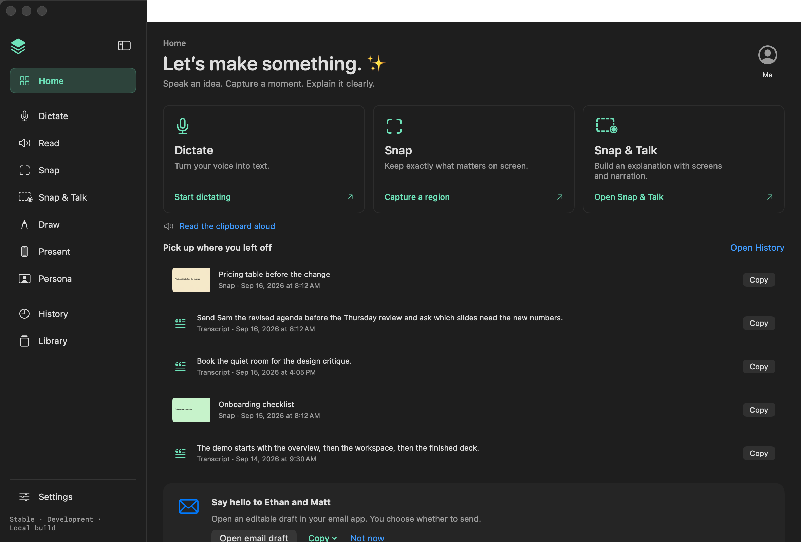
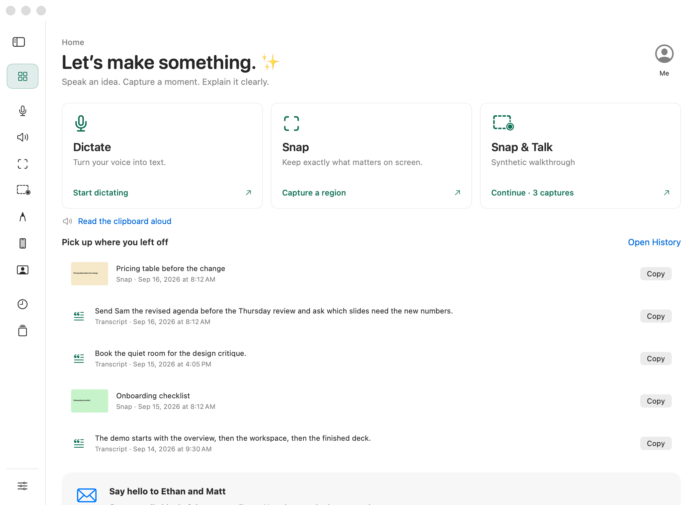
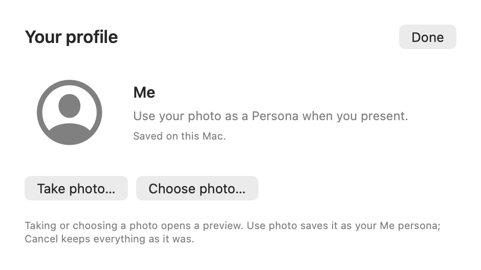

# Mac experience candidate — 29 September 2026

[PR #229](https://github.com/EthDawg/workbench/pull/229) brings together the Home, sidebar, local Me profile, floating controls, voice feedback and download-copy changes. It is an installed Preview candidate. No new public archive, update feed or website deployment is claimed.

## Build and test boundary

- Installed and running: **Workbench Preview 2.3.1**, build **20260929121540**, clean source **bca3ecf1d7bbc0152f88c0dfb5083835189f8c85**.
- Identity: `com.ethdawg.workbench.preview`, signing team `GHVAAH9P5Z`, existing signed Preview install/update path. In-app Settings showed the matching build and source; Copy build details was invoked. Bundle metadata and the installer's signature/profile checks matched.
- Hardware: MacBook Air / Apple M5, macOS 26.5.1, built-in microphone. The lid was open for the earlier baseline and reported closed during the final audio probe. No external microphone, receiver or additional-display acceptance is included.
- Stable remained 2.3.1 build `20260929044112`, source `6aac0cba05764556321216296fb524f240f4b1eb`.
- Later commit `9592c90` changes only a test's accessibility-mode setup. It does not change the installed app implementation. Later receipt and contract edits likewise do not identify a new installed binary.

One integration owner installed and operated Preview. Worker builds and galleries used synthetic data. The installed review preserved the existing loaded session, transcripts, library and profile; toolbar mode and sidebar state were restored. No permission resets or grants were used.

## Installed checks

These actions used the native app through accessibility and keyboard controls.

| Scenario | Result | Evidence and boundary |
| --- | --- | --- |
| Home and branding | Pass | Dictate, Snap and Snap & Talk lead the page; one recent-work section and Open History; Me profile; settled action greeting. Existing loaded-session count and recent items remained visible. The greeting's timing is source/fixture coverage, not a frame-timed native claim. |
| Sidebar | Pass | Collapse retained named accessibility controls; Dictate navigation worked while collapsed; Control–Command–S expanded it; Home remained reachable. Native physical hover and tooltip timing were not exercised. |
| Profile choose/cancel | Pass | Choose photo accepted a synthetic gallery PNG, opened the existing Circle/Card/Original appearance editor, and Cancel returned to the unchanged Me profile. Take photo, permission denial and camera capture remain untested. Saved identity and old scene artwork preservation are covered with disposable-library tests. |
| Floating toolbar chooser and More | Pass, scoped | All seven modes opened their More menu. Dictate's menu also opened after native Tab/Tab/Space traversal from the launcher. This proves accessibility and keyboard operation. |
| Floating accessories | Pass, scoped | Draw's Tools menu opened. Snap & Talk's Review opened the existing session with the same capture count. An initial AX read after navigation failed; a fresh read confirmed the destination. An immediate More activation during menu dismissal needed a retry after tracking ended. |
| Reported unresponsive pointer-hover pill | Not verified | Source fixes native popup tracking to begin on the original mouse-down. The controller has no hover/mouse-move API, and baseline coordinate attempts returned a controller window-position error. Earlier Stable also opened More through accessibility. These observations do not establish that the user's physical-hover report is fixed. |

## Voice evidence

The recording trace uses a faster input response and admits softer microphone levels. Persona keeps the audience-facing response and a quieter resting outline. Neither change substitutes synthetic samples for microphone input.

- A new low-level regression failed against the baseline at the intended assertions and passed after the change: a **−50 dBFS** input becomes visible within the first **100 ms** of the simulated sequence.
- Review found and corrected a Reduce Motion outline cache mismatch. Native layer assertions now check opacity when presence changes while intensity is unchanged.
- The signed candidate opened the real microphone and received its first frames in **101 ms**, with **42 deliveries in four seconds**. Hiding, disabling, the Persona key and shutdown closed input in **under 3 ms** in this run.
- **The final speech/coexistence audio-amplitude probe failed.** Every input sample was zero (the recorder measured −120 dBFS) while `AppleClamshellState` reported closed. Both the Persona source and independent recorder/engine received silent buffers. Lifecycle delivery passed; hearing speech, visible speech timing and usable concurrent recorded audio did not. The run retained no audio.
- The earlier open-lid baseline demonstrated real input and recording coexistence, but its synthetic playback calibration did not establish all onset/release targets. Natural speech, soft speech, continuous speech and headset/receiver behavior still need a suitable hardware run.

No current native speech-response acceptance is claimed. The local receipts retain the failed measurements; public images below use synthetic content only.

## Automated validation

- Full `bash scripts/test.sh` passed locally at the installed implementation: **305 Swift package tests**, including **one explicitly gated on-screen keyboard skip**; **243 StageKit tests / 4,808 assertions**; **120 Snap checks**, plus the script's core, keyboard, delivery, history, handoff, meeting and other required checks.
- The integrated surface gallery passed: **260 renders, 140 entries, zero flags**. It uses isolated synthetic homes and production hosts, and covers light/dark, constrained layouts, loaded-session Home, profile, menus and toolbar states.
- The production toolbar motion renderer passed at both anchors: **66 frames each**, ten distinct window widths, fixed launcher anchor, expansion before the final icon fade. This is an offscreen host check.
- The packaged archive and signed Preview installer passed resource checks, including **32 pack checks**, **129 transcript handoff checks** and **11 handoff runner checks**.
- Website: **19 tests** and the production-record build passed. Browser checks at 1280, 390 and 320 pixels found no overflow or console errors. Existing archive URLs and signed update feeds were preserved.
- First Mac CI run exposed a new hosted-trace test inheriting the runner's Reduce Motion setting. The app's fixed 1.5-point reduced-motion shape was correct; the test assumed a zero-amplitude quiet line. `9592c90` explicitly checks both native drawing modes, including sample-driven brightness and quiet recovery. All **nine focused interaction tests** passed locally afterward. Final CI status is recorded on [PR #229](https://github.com/EthDawg/workbench/pull/229).

Review also caught and corrected tooltip handoff timing and a Control–Command–S conflict with saved global shortcuts. Both shortcut backends preserve the saved choice but reject a conflicting active registration.

## Visual review

These are rendered production views with synthetic records, not screenshots of the user's library or proof of physical hover acceptance.

[Left-anchored motion](motion-left.gif) · [Right-anchored motion](motion-right.gif)

## Remaining acceptance

Physical hover and click-through across reveal/collapse, camera capture/denial, natural speech and concurrent usable audio, full VoiceOver traversal, additional displays and audience receivers remain open. This candidate does not close the [Mac release gate #7](https://github.com/EthDawg/workbench/issues/7).

[Draft release notes](../../releases/2026-09-29-mac-experience-candidate.md) are ready for an accepted release. Public publication must follow the shared signed archive/feed/site workflow.
