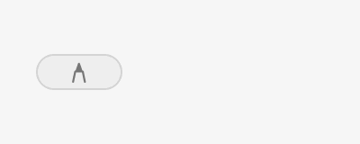
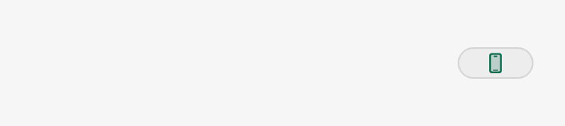

# Floating pill refinement — 29 September 2026

## Decisions

The goal is a quiet resting handle that opens into clear controls, with one predictable way to choose a tool and one way to act.

### Resting identity reconsidered

The initial refinement put a 12-point tool symbol in a 20-point capsule. Reviewing its actual size and Ethan's feedback changed that decision: the symbol requires interpretation, selected mode can be mistaken for live state, and one icon cannot explain concurrent work. It does not earn the extra visual weight. The settled design uses the same thin neutral handle at idle and during ordinary live work. Tool identity, the action and its shortcut belong to the revealed row. This is a design judgment from the rendered interface, not a claim of measured user-study results.

Recording, reading, processing, paused work and unresolved results retain their visible signals. They convey ongoing transport or a reason to return to the controls. Full activity descriptions remain available to VoiceOver. No preference or new state owner is added.

| Detail | Decision and reason |
| --- | --- |
| Action padding | Fit the visible verb with 12 pt on each side and a 64 pt minimum. Draw now needs a 160 pt row instead of 248 pt. Longer actions retain their full wording. During one reveal the action may grow, but cannot shrink and pull nearby targets away; collapse resets it. |
| Control order | Keep tool + chevron at the anchored end, then action, optional accessory, More. Mirror the row at right docks so the launcher never leaves the pointer. More describes the selected tool's options. |
| Cog | Keep it for Settings. A tool symbol with a chevron communicates a tool choice and retains the selected identity. |
| Closed pill | A neutral 48 × 8 handle at idle and during ordinary live work, within the existing 48 × 28 pointer target. No small Draw, Present, Persona or timer icon, and no colour code to learn. Recording, playback, processing, paused work and results retain their 48 × 20 signal capsule. The target and anchor never move. |
| Icon creation | Reuse `ToolbarMode.symbol`, the same SF Symbols used by the menu bar and desktop. The revealed symbol and chevron appear at the anchored centre as the handle opens. No additional bitmap artwork or competing icon vocabulary. |
| Hover text | The action's native tooltip and VoiceOver help name the action and its usable key. Hold and Release are explicit where required. Omit a key if it would perform a different action, or is off/unavailable. Remove the competing whole-row tooltip. |
| Motion | Keep 120 ms hover dwell, 450 ms leave grace and one 160 ms ease-out native window animation. Chrome, masking and control visibility follow the current window layout. A control appears only after its full label fits. The same path reverses on closing; Reduce Motion is immediate. |
| Interruptions | Keep the pending-hover cancellation and stale-callback protections from the first part of this PR. No second timer, saved preference or toolbar state owner. |

The first intermediate render exposed a launcher shift in windows narrower than the row, an asynchronous background lag and a doubled tool symbol. The final implementation supplies the actual viewport through synchronous layout, accepts small window proposals, and shares the symbol centre. Regression checks cover all eight anchors with both undersized and oversized hosts.

[Light gallery](overview-light-standard.png) · [Dark, larger text](overview-dark-large.png)

## Research

The earlier local Superwhisper and Wispr Flow study supplies reference observations, not a measured timing specification. Their recording-first compact controls are useful references for continuity. Workbench remembers the selected tool across Draw, Present, Persona and capture workflows without requiring a persistent miniature icon.

- [Apple: SF Symbols](https://developer.apple.com/design/human-interface-guidelines/sf-symbols) supports one familiar symbol system, aligned with text and platform semantics.
- [Apple: Motion](https://developer.apple.com/design/human-interface-guidelines/motion) supports brief, purposeful and interruptible transitions, with reduced-motion alternatives.
- [Superwhisper changelog](https://superwhisper.com/changelog) records mini-pill animation/tooltip polish and fixes for hover dismissal and focus. These reinforce testing transitions and interruptions, not just static appearance.
- [Wispr Flow updates](https://wisprflow.ai/whats-new) and the local study inform the compact-control comparison. No competitor assets or private screenshots are included here.

## Verification

`ToolbarGalleryRenderer --motion DIR` records the production row inside a real, offscreen, nonactivating NSPanel using `ToolbarWindowMotion`. The GIFs use sampled native frames, not a separate animation mockup. Every sampled launcher must remain 24 pt from its anchored edge. `motion.json` records the actual dimensions and anchor checks.

The ordinary renderer covers idle/live modes, all docks, dark/light, larger text and accessibility variants. The native tests cover content fit, width retention/reset, tooltip/accessibility parity, anchor stability and interrupted hover/animation handling. The complete Mac app is compiled separately so the actual shortcut-owner projections are checked too.

Initial implementation evidence (before the resting-identity revision): source `f3fcb7f79948e14925dc58e54a6f98b3d183089b`, after integrating main's voice/result host (#211). The integration retains the shared voice trace, result and attention badges, and the recording's elapsed-time hint. The launcher mask leaves its full status area visible.

- Complete LocalVoice source build passed.
- 150 ToolbarCore/ToolbarKit tests passed.
- 115 synthetic control checks passed, plus the existing prompt insertion, delivery, accessibility and picker checks.
- 300 production-view fixtures rendered; both native motion sequences passed every sampled anchor check.

Final CI and surface-gallery results are recorded in the PR. This is source and synthetic native evidence. It does not claim installed Preview acceptance, physical hover, VoiceOver traversal or multi-display hardware acceptance. The installed QA owner retains the shared Preview and desktop input.
