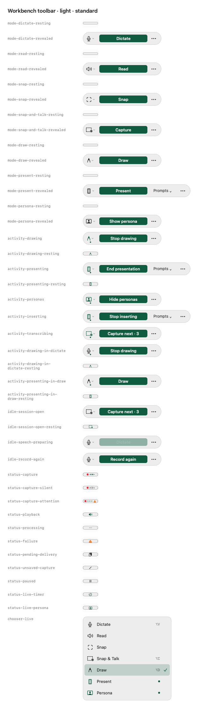

# Compact-pill hover follow-through

29 September 2026. Quality refinement for [#134](https://github.com/EthDawg/workbench/issues/134), based on main `e698f53`.

## Decision

Keep the compact pill, fixed launcher anchor, 120 ms dwell, 450 ms exit grace and 160 ms ease-out frame animation. The previous competitor study already informed those choices, and [#211](https://github.com/EthDawg/workbench/pull/211) owns recording continuity and the shared voice trace. This slice makes the existing interaction dependable when native tracking is interrupted.

`ToolbarTrackingView` previously let its delayed reveal run after `acceptsCrossings` became false. A resize or drag could therefore receive a reveal from the old geometry. An exit missed by AppKit could also leave the gate thinking the pointer was still inside, preventing the next entry from starting its dwell.

The tracker now cancels on suspension and detachment, rejects callbacks from older entries, and resets the gate when the pointer has left by expiry. The host still reconciles the pointer once its geometry settles. No action, owner, saved preference or entry point changes.

## Verification

Environment: Apple Silicon, macOS 26.5.1 (25F80), Swift 6.3.3.

- The new suspension regression failed against the original production tracker: the pending callback remained, and firing it emitted `pointerEntered` while tracking was disabled.
- **139 ToolbarCore and ToolbarKit tests passed**, including 12 native tracking tests. They compile the repository's production source and test files through an isolated Swift package, with the real StageKit geometry and palette files. No recognition dependencies, global shortcuts, microphone, clipboard or user stores are involved. The tracking fixtures use an offscreen nonactivating panel and injected pointer coordinates/deadlines.
- Coverage includes pass-through, repeated entry, suspension, a stale callback after a newer entry, a missed exit, detachment, explicit settle, placement and frame-animation completion.
- **232 production toolbar fixtures rendered** in light/dark and standard/larger text. Representative contact sheets below were inspected. These are offscreen 1× renders; they confirm presentation and fit, not live hover timing.
- Surface registry: 406 entries valid. Surface-checker tests: 55 passed. `git diff --check` passed.

Canonical repository commands for CI or an available development Mac:

```sh
swift test --disable-sandbox --filter 'ToolbarCoreTests|ToolbarKitTests'
swift run --disable-sandbox ToolbarGalleryRenderer /private/tmp/workbench-toolbar-gallery
python3 scripts/check-surfaces.py
python3 scripts/test-check-surfaces.py
```

## Evidence and limits

[Light, standard text](light-standard.png) · [Dark, larger text](dark-large.png)



The source checks reproduce the delayed-event defect; no claim is made that the original subjective animation concern was reproduced with a physical pointer. The existing installed-app QA owner retains Preview. Signed installed acceptance still needs slow entry, fast pass-through, entry interrupted by drag or resize, repeated exit/re-entry, Reduce Motion, display edges and VoiceOver. No app was installed, updated or published by this slice.
