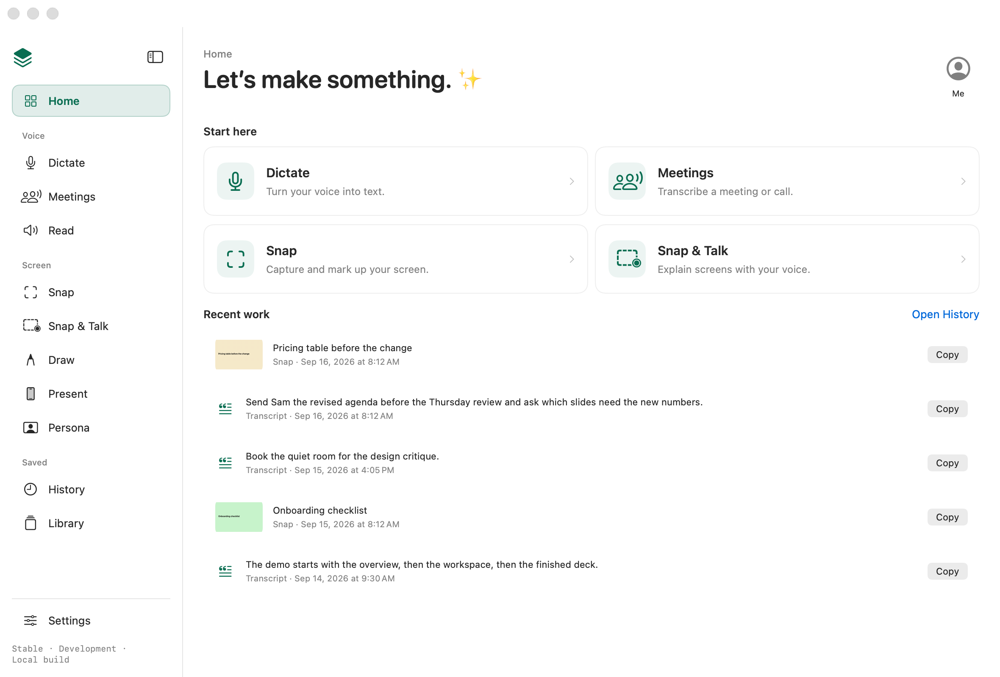
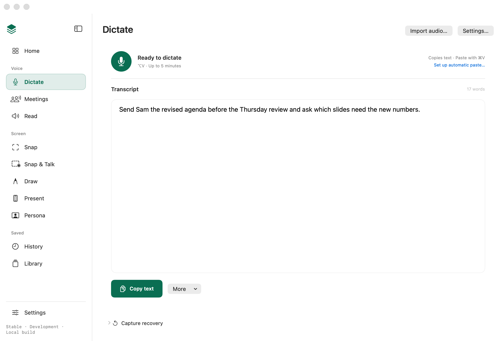
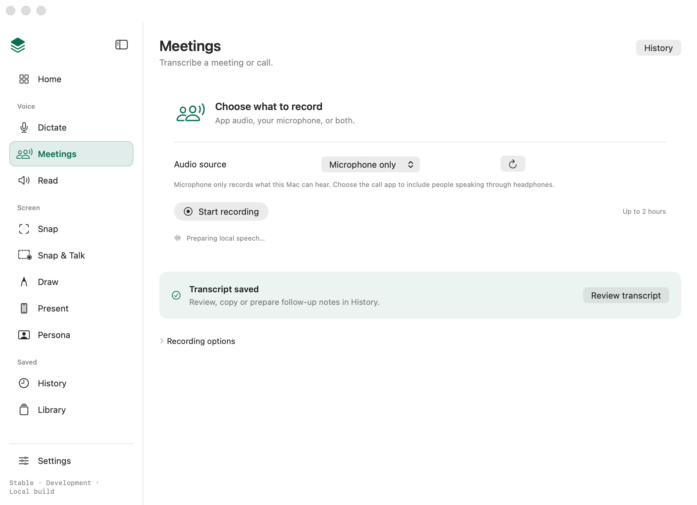

# Desktop cohesion candidate

30 September 2026. Implements Ethan's request to rethink the desktop as complete journeys, with less configuration on working pages and a visible meeting/call workflow. [Issue #134](https://github.com/EthDawg/workbench/issues/134) remains the contract and review index.

## Experience

- Home opens four stable workspaces: Dictate, Meetings, Snap and Snap & Talk. Opening one starts no recording, playback, capture or session replacement.
- The sidebar has Voice, Screen and Saved groups. Settings stays pinned. Meetings is a visible destination; Timer stays with Draw and its existing quick controls.
- Dictate puts the microphone and transcript first, with Copy text and More for result actions. One settings sheet owns delivery, text style, activation and dictionary access.
- Read puts text and playback first. Voice & pace opens one sheet; the page still shows whether text will stay on the Mac or go to Speko.
- Meetings connects explicit source choice, recording, transcription, recovery and review of its exact saved transcript. Choosing Microphone only leaves a valid source; it starts nothing.
- History owns completed results. Library owns reusable resources. Retained unfinished audio stays with its workspace. No new data store or queue is introduced.

The [interactive studies](../../experience/index.html) provide repeatable synthetic scenarios. They illustrate the journeys; source renders and installed acceptance are separate evidence.

## Source and integration

The checked desktop source is `e756aae`, based on `main` at `b06fbaa`. Subsequent documentation commits retain the same native implementation. This branch is the combined desktop review candidate; component PRs remain open and unmerged.

- [#230](https://github.com/EthDawg/workbench/pull/230): quiet toolbar/paste source through `62f8ba5` is a merge ancestor. Its later evidence correction `45276a6` is included as `225fe5e`.
- [#231](https://github.com/EthDawg/workbench/pull/231): recovery/sidebar source and evidence through `be49223` are merge ancestors. The current desktop contract takes precedence over that component's earlier eleven-destination screenshots.
- `878f7cc` integrates the bounded Dictate/Read worker; `a09d7de` integrates its isolated gallery checks. `2cdd8a3` completes operation-specific result feedback; `328c43e` isolates the capture fixture's Accessibility input; `e756aae` corrects transparent screenshot compositing.

Review and merge the component dependencies before this desktop PR so their already reviewed changes fall out of its diff. Do not cherry-pick this combined branch back into either component branch. The coordinator owns final merge order and installed Preview handoff.

## Journey review

| Workspace | Prepare and start | Finish or reuse | Cancel and recovery |
| --- | --- | --- | --- |
| Home | Open a workspace; first-use guidance retains its saved choice | Current work and five newest eligible History results | Navigation leaves recovery audio, drafts and selections unchanged |
| Dictate | Explicit microphone control or Import audio | Copy text; More contains clean, save, original, correction and prompt actions | Cancel capture/cleanup; Capture recovery retains retry, files and confirmed discard |
| Meetings | Choose app audio and optional mic, or Microphone only; Start recording | Stop & transcribe; Review transcript opens that exact History ID | Stop & keep for later; retry retained audio; cancelled/failed deletion preserves the completion link |
| Read | Enter/import text, review replacement, choose Listen | Pause/resume/seek/stop and Save audio | Keep current preserves playback; Replace uses the existing import owner; failed audio offers Retry |
| Snap | Open preparation, then choose capture or import | Existing image editor, Save & Copy, canonical Snap History | Selector cancellation makes no item; image originals remain intact |
| Snap & Talk | New session or continue the current loaded session | Capture, narrate, review and Hand off | Navigation does not reload/enqueue the session; prior narration and saved recovery remain owned by the session |
| Draw and Timer | Existing board/tool controls; explicit countdown start | Drawing ends independently; timer pause/resume/restart remains one owner | Hide preserves the timer; stopping another job does not stop it |
| Present | Existing scene and explicit source preparation | Live controls and End presentation | Existing reconnect guidance; ending a scene preserves independent overlays and later desktop choices |
| Persona | Browse and prepare before Show | Shown and selected remain distinct; Hide and Show again retain arrangement | Browsing does not replace the shown card; Cancel keeps saved art |
| History | Search and deliberate source selection | Exact result review, copy, export and Hand off | Missing references remain explicit; successful removal invalidates the matching meeting review link |
| Library | Existing resources, Packs and From iPhone sections | Reuse through each resource's existing owner | Opening a resource does not replace unrelated active work |

## Regression evidence

All fixtures use synthetic text, audio and temporary stores. No live user records were replaced.

- Surface registry: 456 entries; 57 extractor/regression fixtures pass.
- Meeting lifecycle: 165 checks, plus 34 linked-recording removal checks.
- Capture persistence: 158 checks, including failed and successful transcript-only removal and trusted/untrusted drawing delivery.
- Cleanup and export: 19 checks, including repeated save, Cancel while an unrelated status changes, and editing during cleanup.
- Reading playback/export: 141 checks with an offline engine and no audio device.
- Reading imports: 29 model, 8 metadata and 6 source-door checks.
- Dictionary corrections: 101 checks.
- History: 87 model and 31 page checks; transcript handoff: 129 source and 11 runner checks.
- Website guide: 19 tests and the static build pass. The site was not deployed.
- Preview packaging/update safeguards: 11 packaging and 12 update tests pass using temporary Applications directories.
- Combined feedback: 32 clipboard-receipt, 124 feedback, 9 Accessibility-setup, 38 prompt-picker and 190 independent-control checks pass.
- Debug build passes. The bounded desktop gallery produces 128 renders, 142 entries and zero flags, in light and dark at the default and minimum window sizes. Each appearance runs 34 Home journey, 113 page/navigation and 14 recent-work checks.

The operation feedback checks invoke extracted production methods. Save text returns no result on Cancel or failure. Save audio and cleanup report their own completed result, including repeated identical outcomes; the page does not infer success from a change to shared status.

An initial sandbox capture run failed at drawing deferral. The fixture had read the runner's real Accessibility trust before asserting a trusted paste path. Its trust input is now explicit, both outcomes are tested, and async fixture waits use bounded elapsed time. All 158 checks pass inside the sandbox without changing TCC. Reading's initial sandbox run could not construct an AudioUnit; the approved offline run passed all 141 checks without an audio device.

The combined branch includes the reviewed [quiet toolbar and paste work](../2026-09-30-quiet-toolbar/README.md) and [retained-audio/sidebar work](../2026-09-30-home-navigation/README.md). Their installed evidence applies only to the builds identified in those records.

## Visual evidence

These are production SwiftUI views with synthetic content. They show the debug build's local-development label, not an installed Preview receipt.

The gallery opens the real Dictate settings sheet through the existing Settings request, verifies its 570 × 510 frame and nonempty scroll viewport, and invokes its actual Done action through a Return event delivered only to that synthetic sheet. It verifies that the draft, original wording, selection and recovery bytes remain unchanged. Its completed meeting fixture goes through the real recovery/commit owner, then opens the exact transcript in History while preserving the current Dictate draft and recording journal.

Initial PNGs contained transparent scroll backgrounds that appeared black in an image viewer. The renderer now composites the completed layer tree over the window's resolved native background; no product colours or user settings were changed to make the evidence pass.







Also reviewed: [Dictate settings](dictate-settings-light.png), [Voice & pace in dark appearance](voice-settings-dark.png), and [Read's import decision at the minimum width](reading-import-dark.png).

Reproduce the bounded pass after building:

```sh
WORKBENCH_DESKTOP_GALLERY_ONLY=1 .build/debug/LocalVoice --render-surfaces .build/desktop-gallery
```

The complete gallery retains its separate toolbar, placement and prompt-picker passes. The interactive study's browser review covered real exported state acknowledgement, Dictate sheet open/close, reading Keep current, exact meeting review, and URL scenario selection. The imported Pill study was separately replayed for failed recovery and pausing Timer while Meeting remains recording. Its proposed native relocations remain labelled proposals.

## Installed acceptance

The installed Preview remains reserved by the paste/toolbar owner for Ethan's Claude and ChatGPT keyboard check. An idle chat is not an installation handoff. This desktop candidate has not replaced that build.

After explicit handoff, follow [the shared install workflow](../../updating.md), verify Copy build details and check:

1. Home cards and sidebar open the expected workspace without starting capture or changing drafts.
2. Dictate Settings and Settings → Dictate settings open the same sheet. Done/Escape and dictionary navigation preserve the draft.
3. More → Remember correction uses the selected text; a cancelled Save text shows no success; a repeated successful save does.
4. Read imports retain Keep current / Replace; Voice & pace and repeated Save audio work without unrelated status appearing.
5. Meetings app-only → Microphone only remains ready. Record a disposable sample, keep/retry it, review its exact result and remove only that disposable result. Failed or cancelled removal keeps the valid link.
6. Collapsed sidebar hover labels, keyboard navigation, VoiceOver and independent Timer/Present/Persona work remain correct.

The complete shortcut-registration suite waits until all installed editions can be quit. Natural speech, two-sided/headphone call audio, real receivers, fresh or restricted permissions, VoiceOver behavior and multiple displays are not established by synthetic checks or screenshots. No public binary, notarization, release, site deployment or merge is claimed here.
