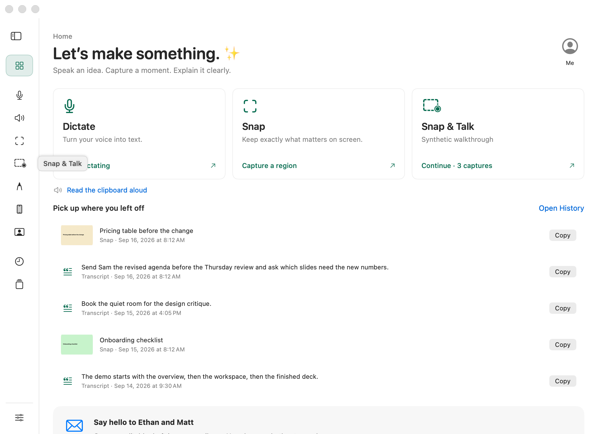
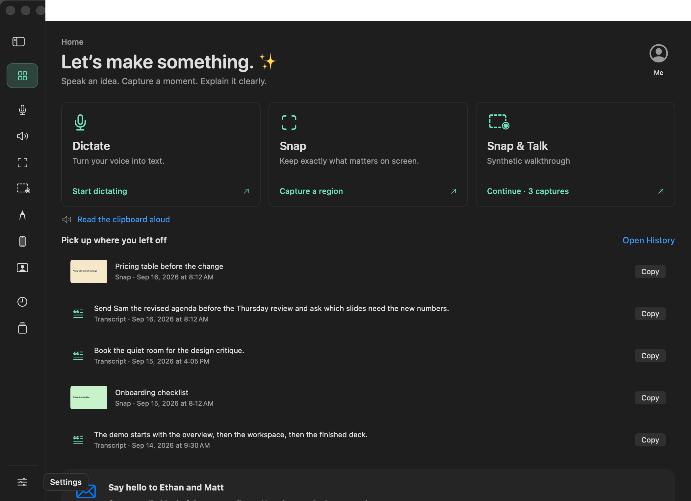

# Home recovery and collapsed navigation, 30 September 2026

Home no longer treats retained dictation audio as current work or shows the permanent Retry transcription banner. Completed transcripts remain in History. Unfinished dictation audio is a separate recovery record, reachable on Dictate through Retry transcription or Retry saving, Show recovery files and the confirmed Discard recovery action. Starting another recording retains eligible old audio in Saved recordings. This change does not edit those owners or their data.

Collapsed sidebar icons now reveal their page name on hover. Settings, the expansion control and an available update use the same hint. The hint draws beside the icon above the native scroll content, ignores clicks and adds no accessible control. The original buttons keep their accessible names and selection. Pointer exit, clicking a page, changing pages, expanding the sidebar and loss of window focus clear the hint.

This is a separable quality change on `codex/home-navigation`, based on `b06fbaa944e6b624641f2fb5557f83329c1c263d`. The commit containing this record identifies the reviewed source. The shared Preview integration owner retains installation and combined acceptance.

## Ownership

- `Sources/LocalVoice/WorkbenchHome.swift`: remove Home's duplicate recovery row and its current-work trigger; show and clear collapsed sidebar hints.
- `Sources/LocalVoice/WorkbenchDesktopChrome.swift`: hint anchors, passive native hosting and appearance.
- `Sources/LocalVoice/SurfaceGallery.swift`: pending-audio fixture, hint layout and click-through checks, and rendering native hints after native scroll layers.
- `docs/workbench.md`, `docs/design.md`, `docs/surfaces.json`: update the owning contracts and remove the two obsolete Home recovery entries.

No capture, transcript or recovery storage implementation is changed. History does not currently list unfinished dictation audio, so it must not be described as replacing Dictate's recovery path.

## Validation

| Check | Result |
| --- | --- |
| `swift build --disable-sandbox` | Passed |
| `PYTHONDONTWRITEBYTECODE=1 python3 scripts/test-capture-persistence.py` | 155 checks passed using exact AppModel methods and synthetic audio |
| `python3 scripts/check-surfaces.py` | 442 entries classified |
| `PYTHONDONTWRITEBYTECODE=1 python3 scripts/test-check-surfaces.py` | 56 tests passed |
| Home journey, page and recent-work checks within the Home gallery | 37, 111 and 14 checks passed in each appearance |
| `WORKBENCH_HOME_GALLERY_ONLY=1 .build/debug/LocalVoice --render-surfaces OUTPUT` | 38 renders, zero flags, light and dark, default and minimum widths |
| `git diff --check` | Passed |

The bounded Home pass starts with a retryable synthetic recording under its verified temporary home. It refuses an existing recovery folder or a path outside that temporary home. Visiting Home and reviewing History retain the recording and journal byte for byte, with retry and explicit discard still available. Existing checks also preserve the current Dictate draft and selection when an older transcript is opened.

The gallery checks that each rendered hint has the expected name, fits in the window and passes hit testing through to the underlying controls. The fixture selects the hovered item; it does not simulate a physical pointer. Actual pointer entry/exit, native keyboard navigation, VoiceOver and signed installed Preview acceptance remain for the combined build. The full `scripts/test.sh` suite requires exclusive shortcuts and is left to that integration run. No app was installed or published by this change.

## Visual evidence

These are production views with synthetic content, including a pending recording. They show layout, not installed acceptance.

## Installed acceptance remaining

After the integration owner installs the signed combined Preview, verify Copy build details. Collapse the sidebar and hover every destination, the expansion control and Settings. Check that names remain visible, clicking and keyboard navigation still open the same pages, and labels clear on exit, selection, expansion and switching apps. Confirm Home has no retained-recording banner while Dictate still offers the existing recovery actions. Do not discard real user recordings for this test.
