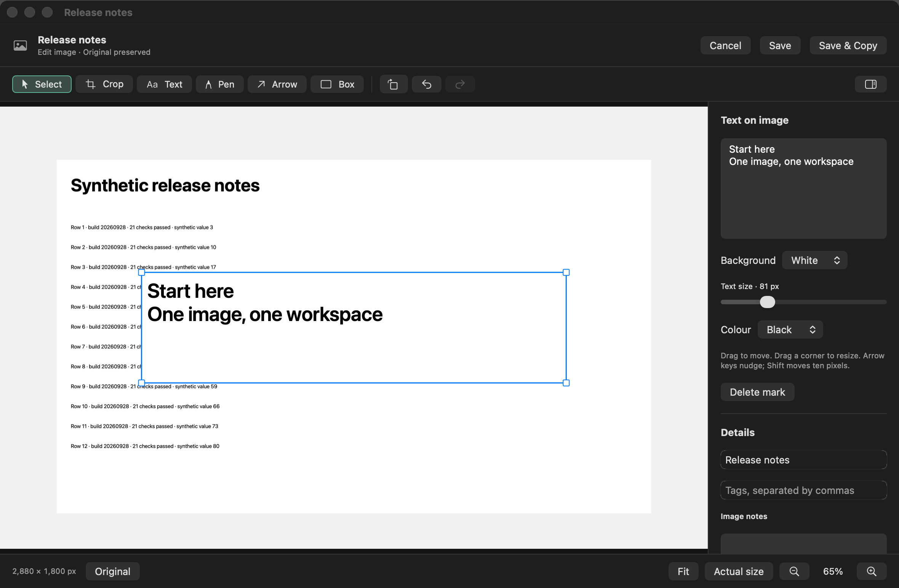
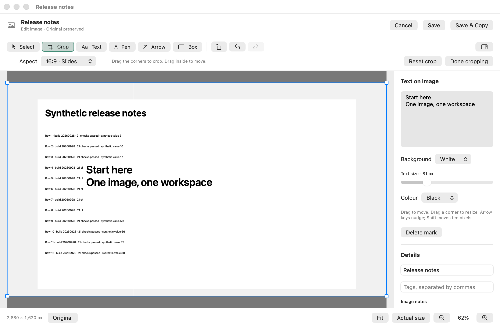
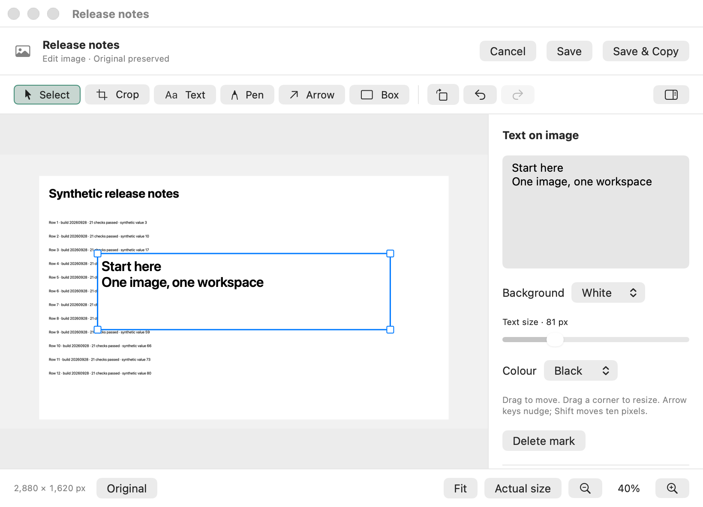

# Shared image workspace verification

## Result

One resizable window now owns image viewing and Snap editing across the Mac app. It includes collection navigation, text/comment boxes, crop presets, annotations, rotation, zoom, undo/redo, original comparison, copy and export. External and frozen images become new Snaps when edited; their source records remain unchanged.

The change is on `codex/image-workspace`, based on the Mac integration candidate `af19a8b32ac288595c96d0adbb7834d196162a14` in PR #229. The source and evidence are committed together. This record covers source checks and offscreen rendering. Shared Preview installation, installed acceptance, merge and publication remain pending.

## Checks run

Host: Apple Silicon, macOS 26.5.1 (25F80), Apple Swift 6.3.3.

| Check | Result |
| --- | --- |
| `swift build --disable-sandbox` with an isolated temporary scratch path | Passed, no compiler warnings |
| `LocalVoice --check-image-workspace` | 33 checks passed |
| `LocalVoice --check-capture-preview` | 60 checks passed |
| `LocalVoice --check-snap-capture` | 128 checks passed |
| `bash scripts/test-snap.sh` | 133 checks passed |
| `python3 scripts/test-library-recall.py` | 31 checks passed |
| `python3 scripts/check-surfaces.py` | 434 entries passed |
| `LocalVoice --render-surfaces` | 266 renders, 140 entries, zero gallery flags |
| `git diff --check` | Passed |

The 385 focused checks cover same-window navigation and editing, selection and drag events, arrow endpoint direction, keyboard movement after rotation, aspect crops, undo/redo, full source bytes after display downsampling, EXIF orientation, draft protection, saved-copy display, save/reopen, immutable originals, stale revisions and v1 metadata backups. SVG files retain the existing Library opener because ImageIO cannot decode them.

All image and storage fixtures are synthetic and temporary. The offscreen checks do not capture the screen, use the microphone, change live Snap data or install an app. The full `scripts/test.sh` run remains with integration because it probes exclusive shortcuts and requires the installed apps to be quit first.

## Visual evidence

These are native AppKit/SwiftUI layer renders of the implemented window, using the shared production canvas. They are not screenshots of the installed Preview. Light and dark gallery passes run in separate processes with isolated preferences. The editor's light, dark, crop and compact states were inspected for visible controls, readable text and clipping.

## Integration acceptance still required

Use the existing signed Preview identity and the shared installation owner. Verify Copy build details before testing. Exercise New Snap from the capture doors; paste/import; text entry, dragging and resize handles; crop, zoom and rotation; Save and Save & Copy; collection arrows; Edit a copy; and Keep editing/Discard. Compare copied/exported output with the canvas using synthetic content.

Check the running app's focus, full-screen behavior, appearance changes, VoiceOver and external-display behavior. The source event tests and layer renders do not establish these hardware and accessibility paths.

Text or rotation writes Snap format 2. The first promotion of an existing v1 record preserves its exact prior metadata, original and earlier image files. Old binaries reject v2 records; see [Snap ownership and preservation](../../snap.md#ownership-and-preservation) before any downgrade. Existing v1 records without these new edits stay v1.
