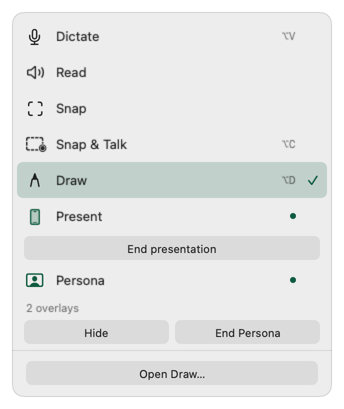
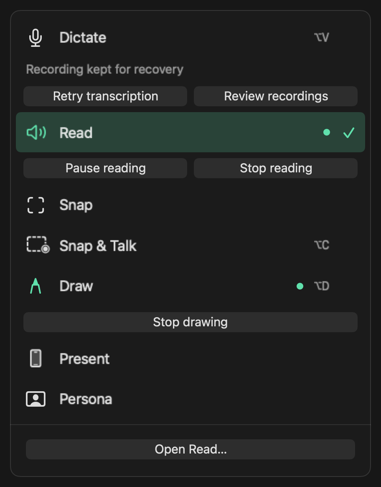
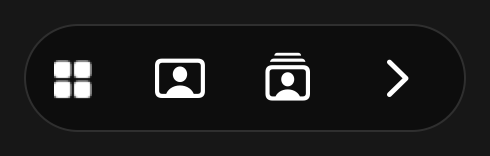
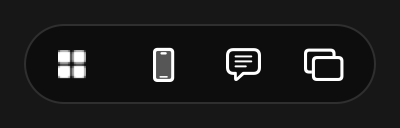
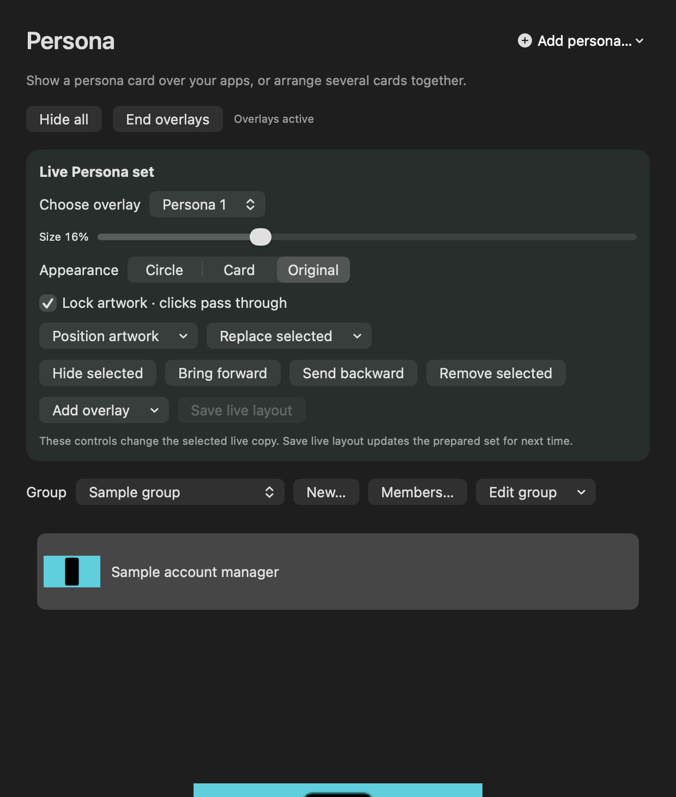
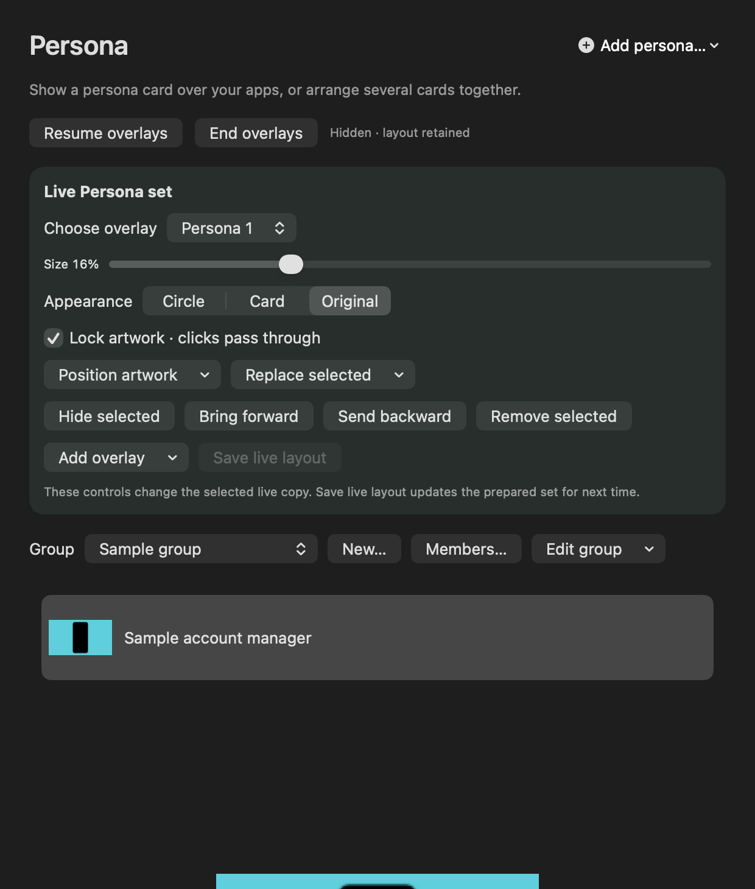
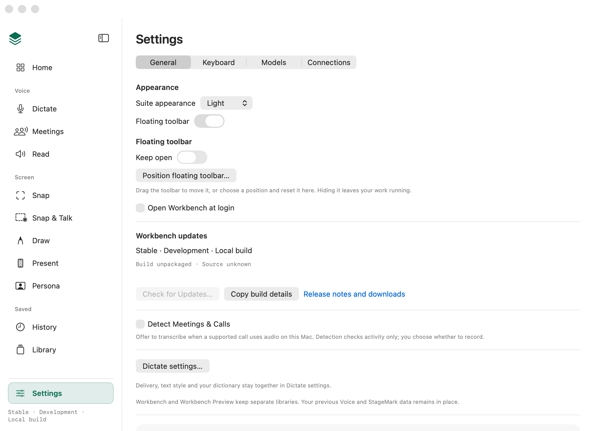

# Floating pill without overflow — source handoff, 30 September 2026

The native pill no longer has a `⋯` button. It keeps the current action, fast
Persona/set selection and cycling, and applicable Present controls. Its seven-tool
chooser holds concurrent activity commands and recovery beside the owning tool.
Detailed controls have real workspace homes. This completes the 31-group native
relocation below; combined installed acceptance is still pending.

Source branch: `codex/pill-actions`, based on
`57fa1ef6469819db9234bbcada586916bd43df5a`. This receipt belongs to the implementation
commit `4355a714801eadcdd010c79493cd5c2f365c267d`. Integration owns the combined candidate, signed Preview,
installed verification and existing PR #232. This worker made no installation,
foreground-app interaction, release or public publication.

## Verification

- Final ToolbarCore/ToolbarKit: **210 tests, 2 deliberate on-screen skips, 0 failures**.
  Includes exact-operation replacement, same-command return after a state change,
  unrelated timer ticks, all eight dock bounds, both contextual controls, large
  text/narrow scrolling, stable workspace footer, native Tab and accessibility press.
- Production toolbar renderer: **352 fixtures** across light/dark and standard/large
  text. The four examples below were visually reviewed here and by integration.
- Meeting owner: **168 synthetic meeting checks and 34 recording-removal checks**.
  An old recording generation cannot stop a replacement, including the async boundary.
- Surface registry: **497 entries pass**; scanner regression suite **57 tests pass**.
- StageKit source and complete legacy runner **compile successfully**. Its new
  Persona assertions cover frozen cycling, hidden state, one-choice omission and
  stale Next after returning to the same card. The bounded offscreen-only Persona
  run passes **1 test, 7 assertions, 0 failures**, including the active and hidden
  prepared-set layouts. Each has one complete live-set editor. This worker did not
  run the full runner: it opens native windows, and integration owns the foreground.
- Final full app surface gallery: **296 renders, 157 entries, 0 flags**, using
  isolated synthetic homes. Final debug build passes. Handbook contract tests:
  **3 tests pass**.
- The final bounded Home/Settings gallery passes **40 renders, 154 entries,
  0 flags**. Its fixture restores the real toolbar-settings owner after chooser
  teardown; visual review confirms Keep open and Position in narrow General.
- All 31 action groups have a `nativeHome` in the retained study contract, and the
  current packaged `pill.html` and inline source SHA-256 match their recorded hashes.
  The original imported hashes remain in `artifactHistory` and `sourceSHA256`.
- The two watchdog corrections were made in the actual canvas and portable page:
  waiting dictation keeps Stop drawing primary with Copy in the Dictate row;
  dismissing Read failure returns to Listen with retained text. The focused headless
  browser run passes **58 checks**, including these transitions, all **14** scenario
  deep links and resets, three widths (320/736/1024), and **0 page errors**. Script
  syntax also passes. These are simulated journeys, not installed app acceptance.

The first full gallery attempt stopped at its completed-meeting fixture containment
check before creating that fixture. The corrected harness creates a fresh direct
child of the already verified synthetic home and refuses an existing path. It
retains the containment guard while avoiding different macOS Data-volume aliases
for nonexistent path components. No live data was used or replaced.

Actual final logs are `/private/tmp/workbench-pill-tests.log`,
`workbench-pill-gallery.log`, `workbench-pill-meetings.log`,
`workbench-pill-stage-compile.log`, `workbench-pill-persona-layouts.log`,
`workbench-pill-settings-final.log`, `workbench-pill-canvas-check.log`, and
`workbench-pill-surfaces-final.log` in the
same temporary directory. Offscreen rendering and synthetic checks do not establish
installed focus, physical capture/audio, external paste, USB recovery, multiple
displays or receiving-participant behavior.

## Native views

## Complete action map

The browser study’s proposal, original hashes and original limits remain design evidence.
Its current hashes include the two native-alignment corrections; scenario IDs,
reset behavior and direct-entry links are retained.
Its `nativeImplementation` record and this table identify actual source behavior.
Read Dismiss keeps text and voice; Listen renders again. Retry only exists while
there is a failure. Copy now is directly available in the Dictate chooser row;
the primary retains Stop drawing while Draw owns input.

| # | Former action group | Native home |
| --- | --- | --- |
| 1 | Switch tool | Launcher: seven fixed tool headers; selecting changes mode only |
| 2 | Cancel dictation request, recording or transcription | Dictate chooser row: Cancel for the actual recording/request/transcription |
| 3 | Copy now while drawing | Dictate chooser row: Copy now; primary remains Stop drawing while Draw owns input |
| 4 | Retry, Record again, Open Workbench, Dismiss dictation failure | Dictate chooser row: applicable Retry, Record again, Dismiss and Review recordings; Dictate workspace owns recovery |
| 5 | Copy again, Review, Dismiss delivery receipt | Dictate chooser row: Review delivery, Copy again when allowed, Dismiss; desktop owner retains durable delivery and exact History review |
| 6 | Reading cancel, pause, resume, stop, retry and dismiss | Read chooser row: Cancel/Pause/Resume/Stop and applicable Retry/Dismiss; Read retains text and voice, and Listen after dismissal |
| 7 | Open Dictate, Read or Snap | Chooser footer opens the selected tool workspace, unaffected by hover |
| 8 | Unsaved Snap review | Snap chooser row: Review unfinished Snap opens the workspace retaining the exact draft; shared editor Review reopens it |
| 9 | Snap & Talk Review and Cancel | Snap & Talk chooser row: current-take Finish/Cancel and current-session Review; pill Review remains |
| 10 | Drawing controls | Draw Tools on pill; existing Draw workspace and menu-bar Options; chooser Stop drawing |
| 11 | Present source, reconnect, connection help | Present View and live presentation section: conditional Source, Reconnect and help |
| 12 | Match Device Proportions, Full Screen, Window Size, Window Position | Present View and live presentation section: proportions, full screen, size and position bound to the running window |
| 13 | Pause/resume background motion | Present View and live presentation section: motion only for a scene that supports it |
| 14 | Show presentation window | Present View and live presentation section: Show presentation window |
| 15 | End Preview & Open QuickTime / iPhone Mirroring | Existing connection guide: End preview and open installed Apple app after capture/window release |
| 16 | End Presentation | Present primary and chooser row: End the exact current presentation |
| 17 | Saved Prompts | Present Prompts accessory and Saved Prompts workspace button reuse the same frozen-target picker; Library owns management |
| 18 | Switch to Browser Tab | Present workspace: Switch to Browser Tab opens the existing explicit destination panel |
| 19 | Choose Persona and Next/Previous | Persona picker: the cards, then Camera (1 October), whatever is live; Next Persona for a shown card; existing Previous/Next keys; no Next for one candidate |
| 20 | Choose prepared set | Live prepared Persona set: Choose Set and Next set; no Next for one set |
| 21 | Choose overlay; size, lock, position, appearance | Persona workspace live-copy section and menu-bar Options: selected copy, size, lock, position, appearance |
| 22 | Replace shown/selected; update shown appearance | Persona workspace shown-copy controls: explicit Replace and Update |
| 23 | Show again, hide, end; hide all/resume set | Persona primary/chooser/workspace: Hide, Show again and explicit End; hidden snapshots retained |
| 24 | Bring forward/send backward; remove/add overlay; save layout | Persona live-set section: front/back, add/remove, explicit Save live layout; saved preparation remains separate |
| 25 | Persona voice response | Persona workspace: existing React to my voice control and microphone owner |
| 26 | Stop transcribing meeting and meeting recovery | Independent Meetings activity row: exact-generation Stop transcribing and Open Meetings for live/recoverable work |
| 27 | Timer pause, resume, end, restart | Independent Timer activity row: expected TimerStep transport and End; existing Draw/menu controls remain |
| 28 | Position and Reset | Settings General: Position floating toolbar opens existing positioning/reset control; right-click shortcut remains |
| 29 | Keep open | Settings General and toolbar right-click: same Keep open reducer preference |
| 30 | Hide toolbar / restore | Existing visibility switch in General and menu-bar panel; Window Show/Hide/Focus and toolbar right-click; independent jobs continue |
| 31 | Settings and shortcut editing | Existing Workbench Settings and shortcut editor; chooser remains tool/activity focused |

## Ownership and lifecycle

`ToolbarActivityActions` reads the existing owners. Dictate, Read, Meetings,
narration takes, drawing activations, presentations, insertion attempts and
Persona sessions contribute their operation identity. `ToolbarChooserModel`
latches the command at mouse-down and rejects changed/removed/replaced commands;
its per-command generation also rejects a command that disappears and returns.
Timer uses its existing `TimerStep`. Meeting Stop checks its generation again
when the asynchronous task starts. No new recording, presentation or saved-data
owner was introduced.

The single Persona card and prepared-set cycle remain distinct. Frozen public
labels and artwork stay with the live owner; a cycle revision invalidates a held
Next after a full return or hide/resume. Detailed adjustments target the actual
live copy and group, not the item selected in saved preparation. Present’s live
section holds the current presenter directly, so selecting a different saved
scene or a read-only library item cannot retarget or disable it. A missing device
has connection help and recovery, not an empty Source submenu.

`CaptureHUDControls` and its reducer remain the only Keep open/placement owners.
The chooser’s perform closure is released on close and denied opening, without
losing a command chosen during dismissal. The context menu is only an optional
shortcut to toolbar settings. The resting handle, recording signal, quiet receipt
and protected active-input behavior retain the integrated baseline.

## Combined acceptance owned by integration

Use the existing signed Preview workflow and verify Copy build details before
claiming acceptance. Exercise the shortened pill at all docks, large text,
keyboard/VoiceOver, stationary-pointer collapse, menu dismissal and Hide/restore.
Then exercise Present + Persona, Draw + Read, prior Copy + Meeting + Timer,
retained Snap across tool changes, narration replacement, hidden Persona and
prepared-set switching. Check the full live Persona adjustments and Present
source/window controls while a different saved item is selected. Verify prompts
with the original external target and the workspace’s honest Copy path, native
handoff teardown, and every chooser workspace door. Physical device, microphone,
multiple-display and receiver checks retain their separate limits.

The parent integrates the retained Snap editor, durable delivery/History review,
meeting-original review and Library adapters with this branch. No overlapping PR
or installer is created by this worker. After the clean handoff, branch edits
freeze unless review identifies a concrete correction.

## Combined Settings follow-through

The combined full gallery exposed an obsolete check that treated every General
`NSSwitch` as the visibility control. General now has independent Floating toolbar
and Keep open rows. The check selects each real native switch by its labelled
row's measured frame, using the existing optional gallery callback (nil in the
app), and still requires exactly one matching control. Offscreen SwiftUI does not
materialize the labelled accessibility proxy, so raw switch order or value is
not used to guess the owner.

Exercising both controls found a real relocation defect: the ordinary toolbar
event path rejects input while hidden or suspended, which also rejected Settings'
Keep open change. `ToolbarSession.setKeepsOpen` now updates the same saved
preference without activating a hidden surface, scheduling grace, or replaying
menu work. Visible changes retain the normal reducer. Late hidden pointer/menu
events still use the protected event path.

The focused session suite passes 11 tests, including hidden preference changes,
normal visible behavior, persistence and rejected late events. The bounded native
Home/Settings pass passes 40 renders / 154 entries / zero flags in both appearances.
It now runs the visibility door, click/Space, named control and preference
independence checks as well. The complete combined gallery, fresh signed package,
installed acceptance and final CI remain in issue #134's integration receipt.
