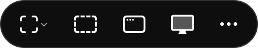
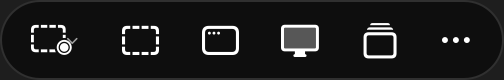
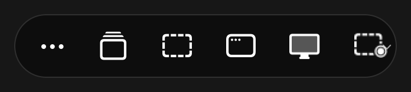
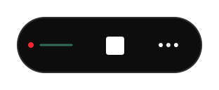

# Snap hover controls — 30 September 2026

Snap exposes Region, Window and Screen directly in its expanded floating toolbar. A prepared Snap & Talk session offers the same choices alongside Review. Selecting a source captures first, then begins narration. Stop narration returns to the capture choices. An unopened session retains its existing setup action.

The change is on `codex/snap-hover-actions`, based on PR #229 head `af19a8b32ac288595c96d0adbb7834d196162a14`. The commit containing this record identifies the reviewed source. The shared Preview integration owner handles the combined regression run, signed installation and installed acceptance.

## Behaviour and ownership

- Each source is an immediate action. Snap's shortcut still captures a region; Snap & Talk's shortcut still captures the display under the pointer.
- Native buttons retain hover hints, accessible names, keyboard traversal and the existing held-click and drag handling. Region, Window and Screen stay in that reading order at either dock.
- Active input keeps its existing Stop, Pause or Cancel action. Capture admission is checked on press and release. A changed action or Snap & Talk session invalidates a held capture click.
- Snap's existing selector supplies regions and windows to Snap & Talk. Readback retains the capture request and session identity until selection finishes. Escape, task cancellation, session close and shutdown create no capture or narration.
- The existing Snap History owner saves a successful capture before its immutable copy enters the portable session. If narration cannot start, the image remains available with narration still needed.

## Checks run

All records and images were synthetic. Capture checks used injected image and permission providers; they acquired no real screen or microphone input.

| Check | Result |
| --- | --- |
| `swift build --disable-sandbox` | Passed |
| `swift test --disable-sandbox --filter 'ToolbarCoreTests\|ToolbarKitTests'` | 185 tests, one explicitly gated on-screen test skipped, zero failures |
| `.build/debug/LocalVoice --check-readback` | 219 checks passed, including 41 capture-choice checks |
| `bash scripts/test-snap.sh` | 120 checks passed |
| `python3 scripts/check-surfaces.py` | 437 entries classified |
| `python3 scripts/test-check-surfaces.py` | 56 tests passed |
| `.build/debug/ToolbarGalleryRenderer OUTPUT` | 344 production-view fixtures rendered in both appearances and text sizes |
| `WORKBENCH_TOOLBAR_GALLERY_ONLY=1 .build/debug/LocalVoice --render-surfaces OUTPUT` | 38 final production-host renders, zero flags; all six Snap/Snap & Talk source buttons reached the correct callback |
| `node --test site/tests/*.test.mjs` and `node site/build.mjs --require-production` | 19 tests passed; handbook and guide generated against the existing production release record |

The capture checks cover selected Region/Window images, default Screen routing, Escape, permission refusal, late admission refusal, replaced session identity, close/shutdown/cancellation during selection or settling, editor restoration, exact image preservation and failed narration startup. Offscreen native controls also verify named accessibility targets and Tab order at both docks.

A focused read-only agent review identified session and cancellation races during implementation. These were corrected and checked locally; the final review found no remaining actionable issue.

The full `scripts/test.sh` suite was left to the combined integration run because it requires exclusive global shortcuts and quitting the shared Preview. No app was installed by this change. The gated `TOOLBAR_KEY_WINDOW_TESTS=1` test likewise needs exclusive native interaction.

## Visual evidence

These images show rendered production AppKit/SwiftUI views with synthetic state. They establish layout, not physical hover or installed capture acceptance.

Snap, ready to choose a source (production window, light appearance):

Snap & Talk, prepared session with Review (production window, dark appearance):

Right dock and larger text (production row fixture):

Narration running while Snap is selected (production row fixture):

## Installed acceptance remaining

On the combined signed Preview, first verify Copy build details. Exercise physical hover, source hints and clicking Region/Window/Screen at both docks. For Snap & Talk, use a disposable session and verify selection → narration → Stop → next capture or Review. Escape must leave the session and Snap History unchanged. Confirm keyboard focus, actual microphone recording, capture on additional displays and coexistence with active tools separately.

No current installed, receiver, microphone or physical-hover acceptance is claimed here.
