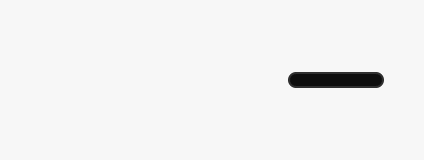
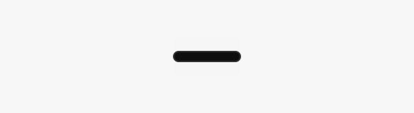

# Floating toolbar placement and hover — 30 September 2026

The collapsed toolbar has a clean edge. Top, bottom and free positions expand around the resting mark; side and corner positions expand inward. Hints share one stable position above or below the row. Dragging attaches along whole edges, with a guide for the exact landing frame and attraction to corners and edge centres.

This follows the [Snap hover controls](../2026-09-30-snap-hover/README.md) change, on `codex/snap-hover-actions` after `a613728ff86ff478b1093b85eaa43731e36cb53e`. The commit containing this record identifies the source. The shared Preview integration owner retains the combined installation and native acceptance step.

## Corrections

- Removed two faint rectangular fills and the toolbar window's native shadow. The visible idle capsule remains 48 × 8 inside the existing 48 × 28 native target. One 8-bit alpha step on that target preserves WindowServer hit routing. Recording, transport and recovery retain their signals, including the complete recording warning badge.
- Aligned the row, capsule, window and resting reference to the same growth policy. One cancellable 160 ms frame clock handles expansion and collapse. Interrupted motion retains the reference without accumulating macOS frame-rounding errors. Reduce Motion uses immediate placement.
- Anchored all source hints to the row. Short and long hints keep the same horizontal centre and the same edge nearest the toolbar. Removed the competing native tooltip and the old text crossfade that resized words between actions. Moving or resizing dismisses hints; unseen controls cannot respond to clicks or activation keys.
- Replaced eight isolated snap points with continuous top/bottom/side attachment. The whole dragged window determines the nearest edge, including overshoot. The final mouse-up position contributes to the drag. Preview and release use identical placement geometry.
- Saved edge fractions and display identity alongside the existing free-position record. Named docks also retain display identity, with their legacy anchor/frame copy used to detect later moves by older builds. Synthetic display resizing, removal and reconnection retain the attachment. Older records preserve their resting location; an older build's later manual move still wins.

## Verification

Run on an Apple silicon Mac with macOS 26.5.1. Data, captures and displayed states were synthetic. These checks did not acquire microphone or screen content, change a live session, install an app or reset privacy grants.

| Check | Result |
| --- | --- |
| `swift build --disable-sandbox` | Passed |
| `swift test --disable-sandbox --filter 'ToolbarCoreTests\|ToolbarKitTests'` | 197 tests, two explicitly gated on-screen tests skipped, zero failures |
| `TOOLBAR_WINDOW_HIT_TESTS=1 swift test --disable-sandbox --filter ToolbarInteractionTests.testCollapsed` | Two tests passed: real WindowServer hits across the full 48 × 28 target and no visible haze |
| `.build/debug/LocalVoice --check-floating-toolbar` | 183 checks passed; supporting prompt, delivery, accessibility and picker checks also passed |
| `.build/debug/ToolbarGalleryRenderer --motion OUTPUT` | Eight native animation sequences, 66 sampled frames each, including interrupted expansion and collapse |
| `WORKBENCH_TOOLBAR_GALLERY_ONLY=1 .build/debug/LocalVoice --render-surfaces OUTPUT` | 38 production-host renders, zero flags; placement, migration, relaunch and capture-source callbacks checked |
| `python3 scripts/check-surfaces.py` | 437 entries classified |
| `python3 scripts/test-check-surfaces.py` | 56 tests passed |
| `git diff --check` | Passed |

The animation checks assert reference stability within half a point at every sampled frame, correct content alignment and no padding above one 8-bit alpha step outside the collapsed capsule. The [sampled native frames](motion.json) cover all eight anchors. Separate tests cover wide rows, larger text, edge thresholds, arbitrary edge positions, overshoot, negative display coordinates, small displays, hint placement and disabled controls during expansion.

A bounded Codex review identified release-coordinate, hidden-control and display-affinity gaps. The parent applied the corrections and ran the native checks above. Further parent inspection caught and corrected clipping of the recording warning, rounding drift in the wider Snap animation and transparent padding losing native hits. The on-screen check uses Apple's [native hit-window query](https://developer.apple.com/documentation/appkit/nswindow/windownumber(at:belowwindowwithwindownumber:)) without posting input or taking focus.

The first sandboxed control check could not access its isolated pasteboard. Its normal permitted native rerun passed. Early animation runs exposed interrupted-resize drift; the recorded final run passes. An initial alpha-zero target and a fill lost during compositing failed native hit queries. A single 8-bit alpha step passes both the hit and pixel checks. These failures were not accepted as verification.

## Native render evidence

These are the production SwiftUI/AppKit row and native window motion rendered offscreen. They establish layout and sampled motion, not installed physical-hover acceptance.

Snap at the top centre, including a rapid reversal:

Snap & Talk at the bottom centre:

Right-side attachment grows inward:

Fully collapsed idle state:

## Shared Preview acceptance still required

The installed Preview inventory still identifies `bca3ecf1d7bbc0152f88c0dfb5083835189f8c85`, build `20260929121540`. That inventory is not a Copy build details receipt for this change.

After the integration owner combines the work, run the repository's full source checks, install through the existing signed Preview workflow and verify Copy build details. Then use real pointer and keyboard input to check:

1. Hover and click the full collapsed target, including the clear space above and below the capsule. Move across it briefly, dwell, leave and reverse direction rapidly. Confirm clean collapse and stable expansion.
2. Drag the compact and expanded toolbar to each edge, edge midpoint and corner, with overshoot and with the final movement occurring at mouse-up. Confirm the guide matches the landing position. Repeat at arbitrary points along each edge, then in free space.
3. Traverse short and long hints across every opened action at the top, bottom and sides. Confirm they remain readable, stay on one rail and disappear during movement, menus and collapse. Repeat with larger text and Reduce Motion.
4. Exercise Snap and a disposable Snap & Talk session through Region, Window and Screen, cancellation, narration, Stop and Review. Confirm hidden controls cannot start work during expansion.
5. Verify saved position after relaunch. Test real display reconfiguration separately; synthetic display geometry is not evidence of a physical additional-monitor run.

The full `scripts/test.sh` run and gated keyboard test require exclusive global shortcuts/native interaction and remain part of that combined acceptance. No installed, microphone or physical multiple-display acceptance is claimed in this record.
