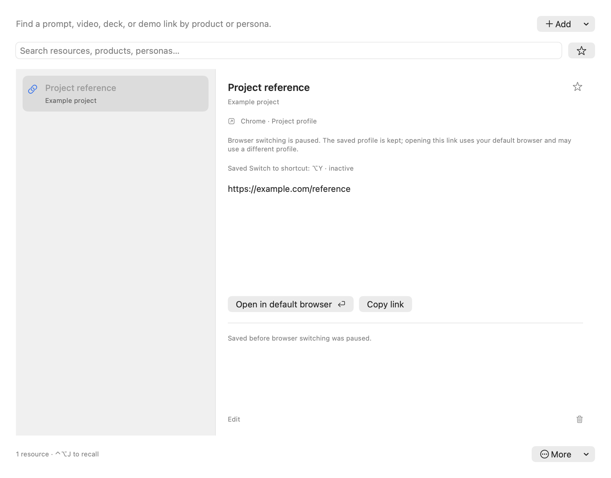
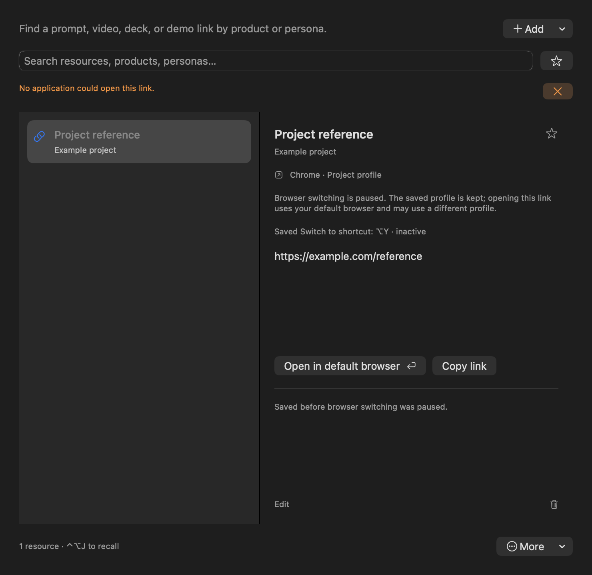

# Browser pause: source verification, 6 October 2026

Foundation G, [#283](https://github.com/Ship-Work/workbench/issues/283), from canonical main
`b2fea0faf770cf85397bcb209a51da3629f0753c` on `codex/pause-browser-admission`.
The tested app source is `f5e79be7ca4501613acbd72aaf133378f10f3fc2`; this final
receipt update changes only this document.
This is source and synthetic verification, not installed or released acceptance.

The production availability guard cuts off setup/manifest installation, automatic and
explicit listener startup, native-host retries, receive/activation and stale callbacks.
Saved shortcut id 4 is neither registered nor dispatched; id 6 remains for the separate
Read retirement. App-menu, Present, Library setup and quick-panel promotion are removed.
The interactive presenter fixture launch route is removed. Retained protocol checks use
only explicitly injected disposable `/tmp/wb-presenter-*` sockets.

Old connection preferences and bound Library records remain unchanged across two model
launches. Copy and explicit Open in default browser retain the exact URL and binding;
ordinary opening makes no profile guarantee. Library's conditional More action exports a
readable, inert browser-settings JSON, separate from portable Library exchange. It keeps
connection values, bound link IDs/titles/URLs/profile metadata and the raw id 4 assignment,
including unknown fields, while excluding unrelated preferences and Library content.
The action is absent for fresh preferences/machine ID alone. It cannot import or enable
the integration. Unreadable preferences fail visibly rather than produce a partial export.

## Checks completed

| Check | Result and scope |
| --- | --- |
| `swift build -c release` | Passed with existing deprecation warnings. |
| `LocalVoice --check-presenter` | 41 pause/preservation checks and 27 retained protocol checks. Synthetic stores, defaults, sockets and effect spies; normal signal handling. |
| Setup admission negative control | Temporarily removed the production `enable()` guard. The first upgraded-profile assertion failed because setup became possible; restored source rebuilt and passed. No manifest was installed because the check injects the installer. |
| Native-host refusal | The compiled helper exited 1 with no output for an existing allowlisted extension origin; source guard runs before socket-path lookup. |
| `bash scripts/build.sh --component-package` | Passed; internal ad-hoc archive, strict signature verification, native action metadata and packaged readback-resource check. ZIP inspection confirmed the inert native helper remains and the BrowserExtension installation/store directory is absent. No installation. |
| `scripts/test-library-recall.py` | 31 checks on the actual model/view and temporary Library store. Repeated after adding recovery export dependencies. |
| `scripts/test-voice-preferences.py` | 96 preference-preservation checks. |
| `LocalVoice --check-shortcut-migration` | 35 checks; no global shortcut registration. |
| `node --test BrowserExtension/tests/*.test.js` | 64 retained adapter checks. |
| `python3 BrowserExtension/tests/package_test.py` | 9 retained extension package checks. |
| `scripts/check-surfaces.py` | 564 registry entries. The conditional export acts only on Library content; its recovery purpose is recorded on Library's Resources entry. |
| `node --test site/tests/handbook.test.mjs` | 3 contract/rendering checks. |
| `git diff --check` | Passed. |

Preference, shortcut and JS/package checks ran before the final isolated recovery-export
addition; their source owners were unchanged by that addition. The release build,
presenter checks, Library checks, renders, registry and handbook checks include it.
The component-package check also completed against the frozen app source. Its archive
is an internal check artifact, not a signed Preview or public release.

## Production-view renders

`python3 scripts/test-library-recall.py --render-browser-pause docs/verification/2026-10-06-browser-pause`
rendered the production Library view offscreen with synthetic data. The 920-point light
and 740-point dark views were inspected: retained profile and inactive shortcut, explicit
open/Copy, and failed-open feedback fit without clipping. Exact Library bytes stayed intact.
The More menu and native Save panel were not interactively exercised.

## Remaining acceptance

No installed app, live user preferences/Library, browser profile, provider, TCC grant or
external service was used. The integration owner must verify the exact signed Preview
identity, fresh/upgraded menu and shortcut absence, conditional recovery export/Cancel,
ordinary URL opening, and refusal of an older real extension across two app launches.
The app cannot stop Chrome's independent retry process or uninstall its extension.
This change neither resumes the extension nor establishes cross-profile native acceptance.

## Bounded installed check, 7 October

Signed Preview **2.4.1 (20261006123415)**, clean combined source `dec1f343413b9c3ce68583e81863e6c9278ec0df`, was identified through actual Copy build details on macOS 26.5.1 (25F80). The native Keyboard page omitted browser switching and retired Read; Connections omitted browser setup. Library retained an existing bound public link with an explicit paused explanation, default-browser action and inactive shortcut label. Choosing **Open in default browser** opened the public Workbench URL in the browser; its exact tab URL/title were observed. A capture-tool error after the click did not prevent that observed opening. No old browser profile was activated or promised.

**More → Export saved browser settings…** opened the native Save dialog with an inert-recovery explanation; **Cancel** returned to Library without saving. Reopening either the recovery or ordinary Library export through subsequent CUA menu activations did not reliably show a dialog. Complete export is therefore not passed; this observation does not isolate an application defect from the automation/focus path. Recheck it in the next native acceptance slot.

The saved browser connection/shortcut values and all Library bytes were compared before and after the bounded check and were unchanged. Private baselines and the local result remain under `.build/native-foundation-dec1f34`; no private settings, fingerprints or names are published. Search was cleared and Preview returned to Home. No integration was enabled, preference edited, provider started or installed app replaced during this check.

Fresh-profile behavior, complete successful export, older-extension refusal across actual relaunches, native shortcut dispatch and VoiceOver remain open. This addendum supersedes only the corresponding pending observations above, not the complete G acceptance gate or any public release claim.
