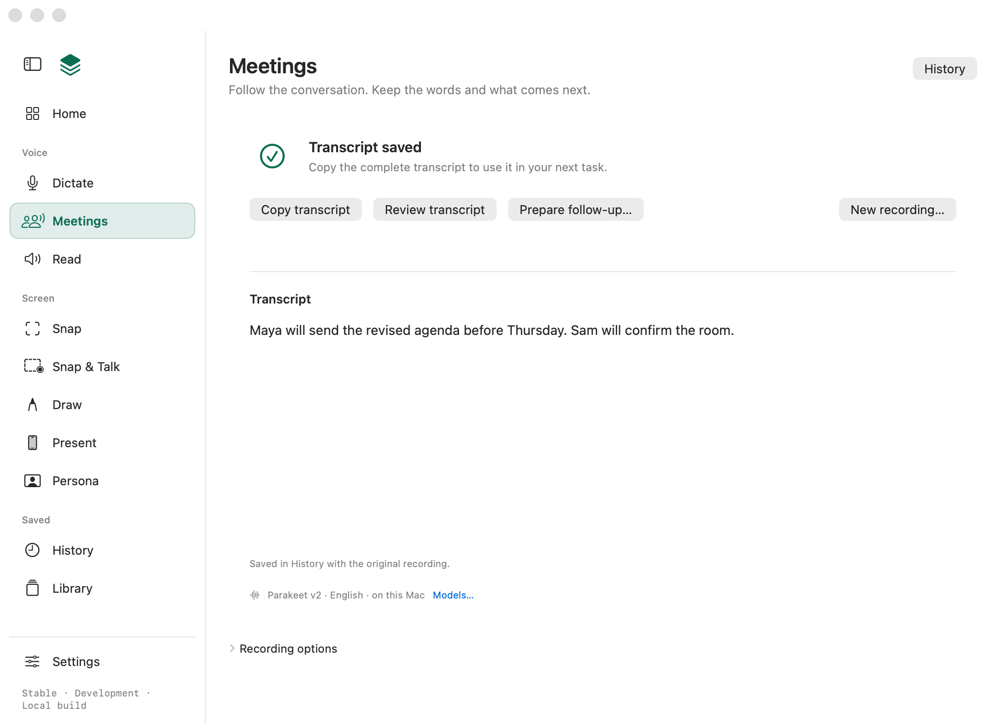

# Completed Meetings: copy the saved transcript

6 October 2026. Refs [#280](https://github.com/Ship-Work/workbench/issues/280).

The completed Meetings page now leads with **Copy transcript**, followed by Review transcript and Prepare follow-up. Copy resolves that meeting's committed UUID in current History, so a later saved correction is included and a newer unrelated capture cannot replace it. It uses the existing clipboard receipt/recovery owner, without a speech engine or assistant connection. Missing, deleted or empty records explain the problem instead of using stale displayed text. Original wording, saved text, Dictate's draft and shared selection are not changed.

Implementation started at `5d12768`; the lead integrated worker commit `00fd98b` onto foundation main `8985093`, including the production Home callback and surface registration. The source revision of the final change is the commit containing this record. Classification: Quality within Meetings; one direct action, no new store, permission, provider or background job.

The production-view render uses synthetic text and an isolated gallery profile. The image was reviewed on the owned implementation; it is layout evidence, not installed clipboard acceptance. The full gallery produced 186 renders with zero flags. Its Read navigation reflects the separate retirement still pending under #284.

## Verification

- Worker and independent reviewer each passed the release executable's `--check-meetings`: 218 Meetings, 21 live-voice and 14 experience checks. Twelve new Copy checks cover a transcript over 240 KB with a Unicode final marker, committed UUID, later saved edits, unchanged original/unrelated records, missing/deleted/empty records and propagation of a reported clipboard failure.
- A temporary wrong-record mutation failed the intended committed-UUID assertion. The checks use a private pasteboard and synthetic records, never live saved data.
- Independent review found no blocking defect in the bounded Copy behavior with the Home callback applied. It corrected an overstatement: an injected writer error proves failure propagation and unchanged saved wording, not preservation of previous clipboard contents after a real failed write. The production copy owner may clear the clipboard before a write fails.
- Integrated build, surface and focused-check results are recorded in the PR. These do not replace installed acceptance.

## Native acceptance still required

Use the sole integration owner's signed Preview milestone and record its Copy build details. With a completed long synthetic meeting, copy and manually paste the full text, including a unique final marker. Save a correction in History and repeat Copy from Meetings; verify that exact UUID rather than the newest transcript. Check selected-text Command-C, keyboard access, VoiceOver and the model/assistant-unavailable case. A deleted or empty record and a copy failure must not report success.

This slice does not close #280. Real long-call, microphone/app-only/headphone, final-tail, permission/settings-return, source-loss and same-UUID save-retry acceptance remain there. Recognition readiness, typed source recovery and explicit valid alternatives are subsequent work; no recording, permission change, installed replacement or public release is established by this record.
