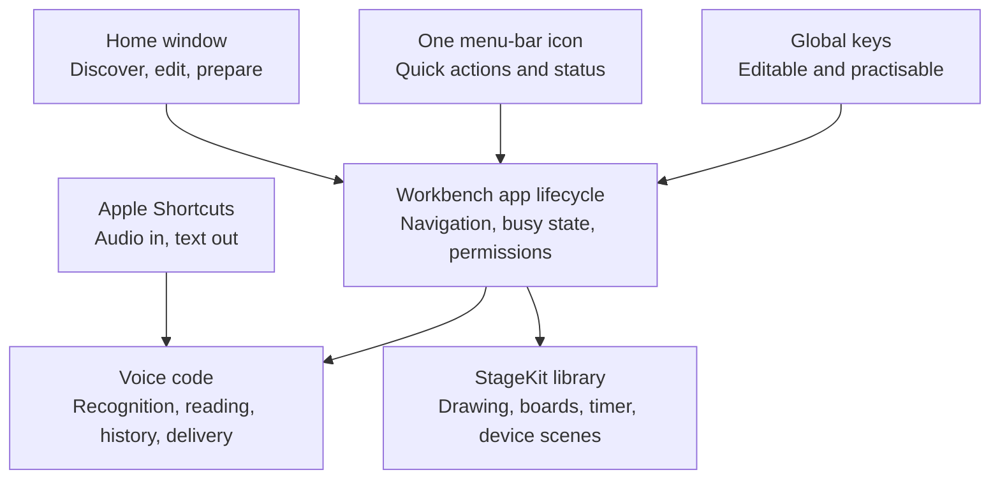
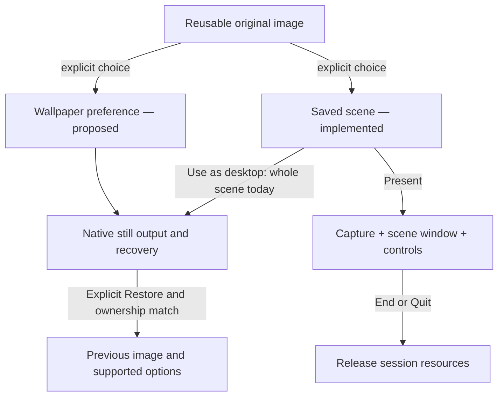

# Workbench product contract

Workbench is one native Mac app for speaking, explaining, presenting and shaping a useful desktop. It establishes a useful free baseline: dependable primitives, optional better models and a few thoughtful combinations. A feature earns its place by removing recurring friction beyond the Mac's existing tools.

This contract describes the direction and current consolidation structure. [The acceptance record](unification.md) distinguishes implementation from tested and released behaviour.

The separate native **iOS/iPadOS 26+ Preview** carries these useful jobs into phone/tablet workflows. [Its own contract and test record](ios-preview.md) govern foreground speech, reading, image markup, independent wallpaper export and editable scene preparation. Mobile uses an app window, chosen imports and explicit sharing; the Mac menu bar, global shortcuts, cross-app overlays, USB capture and desktop restoration below are not mobile capabilities. The two targets do not silently sync libraries or edits.

## Scope

| Primitive | Workbench's responsibility | Boundary |
| --- | --- | --- |
| Speak → text | Capture/import, recognition, optional cleanup, original wording, history and safe delivery | Other apps own the note, message or document made from the result. |
| Text → speech | Mac reading voices, playback/export and optional online reading | Keep provider setup explicit; do not turn the utility into a general agent platform. |
| Explain a screen | Live drawing, pointer emphasis, boards and a clear return to the demo | A meeting app owns distribution to the audience. |
| Present a device | USB video preview in a saved scene, branding, readable controls and a break timer | QuickTime and iPhone Mirroring remain separate Apple apps. |
| Enjoy a desktop | A distinct wallpaper journey: still-image baseline, independent settings and optional gentle motion | Direct wallpaper management is proposed; current source can apply a rendered scene as a still, with an explicit app-owned motion option in non-App-Store builds. Use native OS support and preserve later manual changes. |
| Reuse an item | Searchable prompts, links and file references already supported by the library | No tenant management, browser-profile rotation or team knowledge system. |

Screenshot capture/markup, Services and Share extensions are possible later improvements. Their native equivalents are the starting comparison. Broad demo orchestration, a generic plugin framework and a Windows rewrite are not prerequisites for this version.

## One app, several ways in

The normal window makes the app discoverable. The menu bar and keyboard accelerate familiar work. Recording controls, palettes and presentation windows appear when needed. Closing Home leaves the menu-bar utility running; Quit must stop capture, playback, drawing and presentation. Login launch is an explicit user setting.

Normal application menus, buttons and editable shortcuts remain available together. Spotlight can find the app by name. The existing App Intent accepts audio and returns text; it does not own microphone recording. Additional Spotlight actions, Services, Share extensions and URL automation must be treated as new integrations with their own evidence.

## Interaction rules

- Start microphones and device sessions through an explicit action. Request access when the feature needs it and explain a denied permission in context.
- Keep one owner for an active operation. Model selection cannot change an in-flight request. The host coordinates recording, drawing and keyboard practice so they do not accidentally trigger each other.
- Keyboard is one catalogue across modules. Duplicate assignments and common Mac command conflicts are explained. Failed registration must not silently replace a usable combination.
- Keyboard practice pauses Workbench global actions, consumes practice key presses, counts complete press/release repetitions and restores actions when it ends or the window loses focus. It does not claim a complete inventory of other apps' shortcuts.
- Capture the original app and field before dictation. Paste only when they remain valid; otherwise copy. Never press Return or submit a message. Restore the previous clipboard only after confirmed insertion while Workbench still owns the clipboard change.
- Preserve originals and saved work. Cleanup is optional and reversible. A generated rewrite is not evidence of factual or semantic correctness.
- Ending a scene releases its device capture, presentation window, controls and keep-awake activity. It does not restore desktop wallpaper, close unrelated apps or change system policies. Quit stops app-owned work; a still picture set through macOS and its recovery records persist. Restore desktop is a separate explicit action with an ownership check.

## Models stay replaceable

Parakeet is the account-free, on-device default. A separately run, loopback-only transcription server is an explicit alternative. The app preserves the same capture, cleanup, history and delivery flow when recognition changes. A saved configuration is not a connectivity or quality check.

Mac voices are the default for reading. Speko is a separate online choice with its own key and usage. No provider failure silently routes data elsewhere. User-managed server software controls whether its local endpoint forwards audio beyond the Mac; Workbench cannot promise its end-to-end privacy.

Prefer a small explicit provider contract over a general agent framework. Add another adapter when a real model/runtime can meet its input, cancellation, readiness and privacy requirements. See [model providers](model-providers.md).

## Appearance and onboarding

Keep the Workbench name and a shared restrained mint/slate palette, system typography, native controls, clear states and System/Light/Dark choices. The primary verbs are **Dictate**, **Read aloud**, **Annotate** and **Present a device**. A label should explain an action; a status should describe what actually happened.

Home introduces useful actions, first-use access requests explain themselves, and keyboard practice teaches muscle memory. Prefer these working experiences over an introductory slideshow. Use synthetic scenes, text and recordings in examples. Brand assets can improve later without changing the action or data architecture.

## Identity, migration and release

The unified identities are `com.ethdawg.workbench` and `com.ethdawg.workbench.preview`; packaged executables are `Workbench` and `WorkbenchPreview`. `LocalVoice` remains the internal Swift executable target/module. `StageKit` is a library in the same process, with no independent status item or application lifecycle.

Preview lives at `~/Applications/Workbench Preview.app` and has its own saved files, preferences and permissions. Supported legacy Voice/StageMark files are copied once into missing unified component directories; original data remains untouched. Do not run repeated merges from old app state. Do not reset privacy permissions or erase user data to simplify a release. Keep the signing identity and installation path consistent.

A build, an installed Preview, a reviewed merge, a notarized archive and a published release are separate claims. Each needs its own evidence. Before promotion, test the actual package: first use, permissions, migration, global keys, recording/cancellation, paste, presentation lifecycle and the hardware-dependent paths affected by the change. App Store submission is a separate workflow.

## Small-project maintenance

Use GitHub issues for agreed work, PRs for review and releases for downloadable versions. A substantial shared change needs an owner before implementation and another person's review before acceptance. [CONTRIBUTING](../CONTRIBUTING.md#proposed-ethanmatt-working-agreement) records the proposed Ethan–Matt practices; it does not assert that repository permissions or approval rules have been configured.

The short implementation map is [design.md](design.md). The earlier suite model of two independently shipped apps is superseded by this consolidation contract.

## Improving the commodity utility

The [category comparison](utility-comparison.md) ranks three useful steps per existing job. The [architecture decision](commodity-strategy.md) records stable jobs, replaceable engines and storage boundaries. Use the [model evaluation template](model-evaluation.md) before changing a default engine. GitHub issues remain the canonical contribution queue.

Scene preparation and persistent wallpaper are distinct, independently useful jobs. The user may adopt either without the other. Share original pictures by choice, with separate crop, layout and playback state. A direct Wallpaper entry is an accepted direction to prototype; current Preview still routes desktop apply through a rendered scene. Home placement remains a usability decision, not a reason to force both jobs into a common mode selector.

[Background management](background-management.md) remains the implemented scene-backdrop specification. The [visual-experience contract](../site/handbook/contract.json) is the canonical structured record for the broader lifecycle, capability status and acceptance scenarios. The [public handbook](https://workbench-mac.vercel.app/handbook/) generates its capability and lifecycle records from that same file. The existing guide explains use; neither creates a second work queue.

Native still wallpaper, time-of-day Dynamic Wallpapers, aerial transitions and continuously animated desktop rendering are different capabilities. Do not infer general video, arbitrary Space control or complete wallpaper-configuration recovery from the image-file setter. Gentle photo motion uses a native layer above a still; it does not install Apple aerials or arbitrary videos. Independent direct wallpaper selection remains proposed. Energy, multi-display and receiver claims require measurements beyond the current local checks.

The first independent wallpaper increment is choose → preview on a named display → apply → return to work, with explicit restoration that preserves later manual choices. The optional app-rendered motion stops on Quit and leaves its rendered still. Gentle motion is now an optional scene setting and an explicit Mac desktop action; there is no wallpaper automation endpoint. See [gentle motion](gentle-motion.md) for its bounded implementation and current evidence.

Three [authored ambient starters](research/ambient-scenes.md) reuse these destinations: Window light, Campus breeze and Coastal sky. Only cloud or foliage details move; the room, buildings, coast and presentation foreground remain fixed. Choosing a starter opts that new scene into motion. Pause shows its matching poster, while galleries and exports stay still. On iPhone/iPad, motion belongs to the visible scene editor, not the system wallpaper. The installed local candidate and public download have separate release status in the linked acceptance record.

## Visual state ownership

The current desktop output/recovery mechanism exists inside scene preparation. A separate wallpaper preference and direct entry are proposed. There is no automatic link between the two choices; ending a presentation does not restore a desktop picture. The structured contract provides the exact current behavior and remaining evidence gates.

## Selected-photo handoff

The optional iPhone-to-Mac photo route is governed by [photo-handoff.md](photo-handoff.md). It joins a selected photo to existing Saved resources and backdrop replacement, without synchronising whole libraries or changing a scene on arrival. The public Preview 3 Mac download preserves the verified Production iCloud capability and is signed and notarized. Enabling sync remains a separate user choice; publishing a capable package does not establish paired scene reception or a public iOS release.

## Personal scene preparation

[Personal scenes](research/personal-scenes.md) connects iPhone preparation to Mac presentation through an optional same-Apple-Account CloudKit transport around portable local files. It adds no Workbench login, team workspace or whole-library sync. Scene files can be explicitly shared as editable copies. Prepared Mac persona groups restrict live choices; changing a library card never silently changes its placed copy.

Optional group defaults for a scene, logo and persona are deferred. A saved scene already keeps the chosen combination together; adding automatic cross-library inheritance before validating that workflow would create more hidden coupling. Any future default should copy a suggestion on request and tolerate rename, deletion or missing source assets.

## Multiple presentation overlays

[The persona contract](personas.md) owns prepared Mac overlay groups and multiple independently placed copies. One session freezes the selected groups/artwork; its one click menu can switch sets, edit copies, temporarily hide, explicitly save a layout and End. Native overlays stay at screen positions as the presenter manually changes browser tabs or apps; page-aware attachment and composed live-window capture are separate integrations. No new app lifecycle, browser permissions or scene-sync format is introduced.
