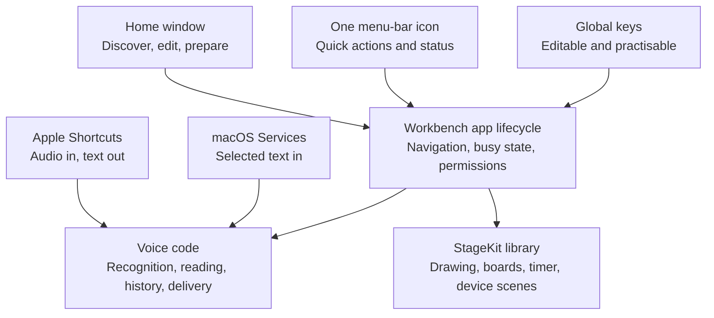
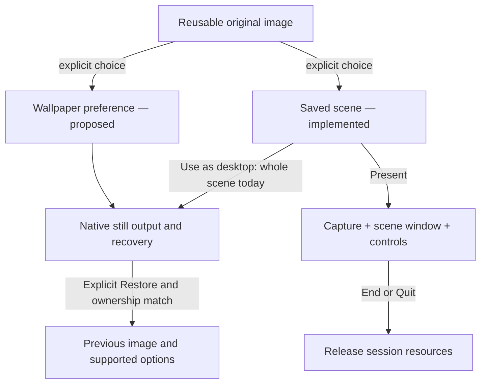

# Workbench product contract

Workbench is one native Mac app for speaking, explaining, presenting and shaping a useful desktop. It establishes a useful free baseline: dependable primitives, optional better models and a few thoughtful combinations. A feature earns its place by removing recurring friction beyond the Mac's existing tools.

This contract describes the direction and current consolidation structure. [The acceptance record](unification.md) distinguishes implementation from tested and released behaviour.

**Mac desktop quality is the active focus. iOS, iPad and Chrome extension development and promotion are paused until the Mac experience is dependable.** Existing code and saved work are preserved. The [mobile contract](ios-preview.md) records that separate target's limits; it is not a promise of sync or mobile scope for this Mac delivery.

## Scope

| Primitive | Workbench's responsibility | Boundary |
| --- | --- | --- |
| Speak → text | Capture/import, recognition, optional cleanup, original wording, history and safe delivery | Other apps own the note, message or document made from the result. |
| Text → speech | Explicit selected-text handoff, Mac reading voices, playback/export and optional online reading | Review imported text and keep provider setup explicit; do not turn the utility into a general agent platform. |
| Screen → Snap & Talk | Capture the display under the pointer, retain linked local audio/transcripts and prepare an ordered portable session | Screen Recording and Microphone access are explicit; slide generation does not silently reinterpret narration. |
| Explain a screen | Live drawing, pointer emphasis, boards and a clear return to the demo | A meeting app owns distribution to the audience. |
| Present a device | USB video preview in a saved scene, branding, readable controls and a break timer | [Connection & audio](phone-presenting.md) separates picture, voice and Mac control. QuickTime and iPhone Mirroring remain separate apps; an explicit fallback releases Workbench capture first. |
| Enjoy a desktop | A distinct wallpaper journey: still-image baseline, independent settings and optional gentle motion | Direct wallpaper management is proposed; current source can apply a rendered scene as a still, with an explicit app-owned motion option in non-App-Store builds. Use native OS support and preserve later manual changes. |
| Reuse an item | Searchable prompts, links and file references with explicit Quick Look; a named Chrome destination can return to its paired profile/tab | No tenant administration, credential rotation or team knowledge system. |

The explicit Screenshot action hands existing annotations to Apple Screenshot; it hides Workbench controls during capture and preserves the marks afterward. A standalone screenshot editor and Share extensions remain possible later improvements. Snap & Talk uses deliberate whole-display captures for a named narrated session; it is not a general capture editor. The bounded macOS Service accepts an explicit text selection into Read aloud; it is not a clipboard watcher or document reader. Native equivalents remain the starting comparison. Broad demo orchestration, a generic plugin framework and a Windows rewrite are not prerequisites for this version.

## One app, several ways in

**Switch to** extends Saved resources through a Chrome adapter and a transient native picker. One resource UUID identifies the link; machine-local profile bindings and disposable tab IDs do not sync or enter portable exports. The [presenter decision and acceptance contract](presenter-direction.md) covers setup, exact targeting, recovery and the weekly-password boundary. This describes retained source behavior; Chrome extension development and distribution are paused. Use the [production release record](../site/updates/production.json) to identify the current public Mac package and its source revision. It adds no credential store, private-note HUD or promise of hidden controls during screen sharing.

Three surfaces share the same operation and data owners:

- **Menu bar:** a compact quick panel with fixed primary rows: Dictate, Read, Snap & Talk, Draw, Present, Persona Overlay and Timer. Shortcut labels open the existing conflict-checking editor in place. Dictate options put Destination before Text Style and include Recent Transcripts. Open Workbench, Settings and Shortcuts are direct footer actions. Clipboard receipts and errors appear below the action rows; the idle panel has no empty feedback space. The stack icon stays recognisable; update status comes from the actual updater.
- **Floating toolbar:** live Snap & Talk, Draw, Present and Persona Overlay controls. The glyph reveals a row on hover and opens a native menu on click. Keep open is explicit. Present exposes a saved-prompt picker; the shared menu retains device source/reconnect/proportions, motion, window placement, native-app handoff and End. Persona controls retain frozen public labels, selection, size, position, lock, add/remove, hide/show, layout saving and End. Choosing controls never ends another operation. Dictate and Read use compact active controls; their preparation stays in Workbench. Assigned shortcuts are displayed here; editing stays in the menu panel or desktop Keyboard view.
- **Desktop:** the existing editors, scene/persona preparation, saved resources, models, settings, practice and history.

The toolbar has one window, saved position and lifecycle. It hides during screenshot acquisition. Its two-tier hover, native menu holds, positioning and Reduce Motion behavior are specified in [the floating-toolbar contract](floating-toolbar.md). Window → Focus floating toolbar provides explicit keyboard access; ordinary pointer controls preserve the other app's focus. Window → Show floating toolbar and Restore menu-bar icon recover access when macOS conceals a status item. Closing or minimising Home leaves the utility running; opening Workbench from the Dock restores its window. Quit stops app-owned work. Login launch remains an explicit user setting.

Saved prompts reuse Saved Resources records, favourites and Product/Persona tags. The picker freezes its choices and the original Mac field/value/selection when opened. It inserts literal text progressively only where Accessibility supports confirmed selected-text writes; otherwise it uses one guarded paste and labels that result as pasted. Escape, Stop, focus/value/selection changes and shortcut editing stop insertion. Partial or uncertain delivery is never replayed, and no Return, Tab or submit command is sent. No new prompt shortcuts or duplicate library are created.

Normal application menus, buttons and editable shortcuts remain available together. Spotlight can find the app by name. The existing App Intent accepts audio and returns text; it does not own microphone recording. The selected-text Service receives only the request pasteboard supplied by macOS, opens a reviewable reading draft and never starts playback. Additional Spotlight actions, Share extensions and URL automation must be treated as new integrations with their own evidence.

## Interaction rules

- Start microphones and device sessions through an explicit action. Request access when the feature needs it and explain a denied permission in context.
- Keep one owner for an active microphone operation. Model selection cannot change an in-flight request. The host coordinates ordinary dictation, Snap & Talk narration, drawing and keyboard practice so they do not accidentally trigger each other. Snap & Talk may queue saved audio while the next section records; recognition remains sequential.
- Keyboard is one catalogue across modules. Duplicate assignments and common Mac command conflicts are explained. Failed registration must not silently replace a usable combination.
- Keyboard practice pauses Workbench global actions, consumes practice key presses, counts complete press/release repetitions and restores actions when it ends or the window loses focus. It does not claim a complete inventory of other apps' shortcuts.
- Capture the original app and field before dictation. Paste only when they remain valid; otherwise copy. Never press Return or submit a message. Restore the previous clipboard only after confirmed insertion while Workbench still owns the clipboard change.
- Preserve originals and saved work. Cleanup is optional and reversible. A generated rewrite is not evidence of factual or semantic correctness.
- Shared-resource imports preview New, Changed and Unchanged records. Changed IDs default to Keep mine; Use incoming is explicit. Apply saves the choices together, while Cancel, invalid input and failed saves preserve the original library. File references travel without media or local browser/access grants.
- Ending a scene releases its device capture, presentation window, controls and keep-awake activity. It does not restore desktop wallpaper, close unrelated apps or change system policies. Quit stops app-owned work; a still picture set through macOS and its recovery records persist. Restore desktop is a separate explicit action with an ownership check.

## Models stay replaceable

Parakeet is the account-free, on-device default. A separately run, loopback-only transcription server is an explicit alternative. The app preserves the same capture, cleanup, history and delivery flow when recognition changes. A saved configuration is not a connectivity or quality check.

Mac voices are the default for reading. Speko TTS is a separate online choice with its own key and usage; it can use balanced automatic routing or a user-selected compatible catalogue voice. Speko STT is not currently a Workbench recognition provider. No provider failure silently changes between Workbench's local and online choices. User-managed server software controls whether its local endpoint forwards audio beyond the Mac; Workbench cannot promise its end-to-end privacy.

Prefer a small explicit provider contract over a general agent framework. Add another adapter when a real model/runtime can meet its input, cancellation, readiness and privacy requirements. See [model providers](model-providers.md).

## Appearance and onboarding

Keep the Workbench name and a shared restrained mint/slate palette, system typography, native controls, clear states and System/Light/Dark choices. The quick panel uses **Dictate**, **Read**, **Snap & Talk**, **Draw**, **Present**, **Persona Overlay** and **Timer**; preparation pages can retain their more descriptive names. A label should explain an action; a status should describe what actually happened.

Home introduces useful actions, first-use access requests explain themselves, and keyboard practice teaches muscle memory. Prefer these working experiences over an introductory slideshow. Use synthetic scenes, text and recordings in examples. Brand assets can improve later without changing the action or data architecture.

## Identity, migration and release

[Installation and updates](updating.md) owns the two editions, updater behavior, build provenance and the shared contributor delivery workflow.

The unified identities are `com.ethdawg.workbench` and `com.ethdawg.workbench.preview`; packaged executables are `Workbench` and `WorkbenchPreview`. `LocalVoice` remains the internal Swift executable target/module. `StageKit` is a library in the same process, with no independent status item or application lifecycle.

Preview lives at `~/Applications/Workbench Preview.app` and has its own saved files, preferences and permissions. Supported legacy Voice/StageMark files are copied once into missing unified component directories; original data remains untouched. Do not run repeated merges from old app state. Do not reset privacy permissions or erase user data to simplify a release. Keep the signing identity and installation path consistent.

A build, an installed Preview, a reviewed merge, a notarized archive and a published release are separate claims. Each needs its own evidence. Before promotion, test the actual package: first use, permissions, migration, global keys, recording/cancellation, paste, presentation lifecycle and the hardware-dependent paths affected by the change. App Store submission is a separate workflow.

## Small-project maintenance

Use GitHub issues for agreed work, PRs for review and releases for downloadable versions. A substantial shared change needs an owner before implementation and another person's review before acceptance. [CONTRIBUTING](../CONTRIBUTING.md#proposed-ethanmatt-working-agreement) records the proposed Ethan–Matt practices; it does not assert that repository permissions or approval rules have been configured.

The short implementation map is [design.md](design.md). The earlier suite model of two independently shipped apps is superseded by this consolidation contract.

## Improving the commodity utility

The [category comparison](utility-comparison.md) ranks three useful steps per existing job. The [architecture decision](commodity-strategy.md) records stable jobs, replaceable engines and storage boundaries. Use the [model evaluation template](model-evaluation.md) before changing a default engine. GitHub issues remain the canonical contribution queue.

Scene preparation and persistent wallpaper are distinct, independently useful jobs. The user may adopt either without the other. Share original pictures by choice, with separate crop, layout and playback state. A direct Wallpaper entry is an accepted direction to prototype; current Preview still routes desktop apply through a rendered scene. Home placement remains a usability decision, not a reason to force both jobs into a common mode selector.

[Background management](background-management.md) remains the implemented scene-backdrop specification. The [visual-experience contract](../site/handbook/contract.json) is the canonical structured record for the broader lifecycle, capability status and acceptance scenarios. The [public handbook](https://workbench-mac.vercel.app/handbook/) generates its capability and lifecycle records from that same file. The existing guide explains use; neither creates a second work queue.

Native still wallpaper, time-of-day Dynamic Wallpapers, aerial transitions and continuously animated desktop rendering are different capabilities. Do not infer general video, arbitrary Space control or complete wallpaper-configuration recovery from the image-file setter. Gentle photo motion uses a native layer above a still; it does not install Apple aerials or arbitrary videos. Independent direct wallpaper selection remains proposed. Energy, multi-display and receiver claims require measurements beyond the current local checks.

The first independent wallpaper increment is choose → preview on a named display → apply → return to work, with explicit restoration that preserves later manual choices. The optional app-rendered motion stops on Quit and leaves its rendered still. Gentle motion is now an optional scene setting and an explicit Mac desktop action; there is no wallpaper automation endpoint. See [gentle motion](gentle-motion.md) for its bounded implementation and current evidence.

Three [authored ambient starters](research/ambient-scenes.md) reuse these destinations: Window light, Campus breeze and Coastal sky. Only cloud or foliage details move; the room, buildings, coast and presentation foreground remain fixed. Choosing a starter opts that new scene into motion. Pause shows its matching poster, while galleries and exports stay still. On iPhone/iPad, motion belongs to the visible scene editor, not the system wallpaper. The installed local candidate and public download have separate release status in the linked acceptance record.

## Visual state ownership

The current desktop output/recovery mechanism exists inside scene preparation. A separate wallpaper preference and direct entry are proposed. There is no automatic link between the two choices; ending a presentation does not restore a desktop picture. The structured contract provides the exact current behavior and remaining evidence gates.

## Selected-photo handoff

The retained iPhone-to-Mac photo source is governed by [photo-handoff.md](photo-handoff.md). It joins a selected photo to existing Saved resources and backdrop replacement, without synchronising whole libraries or changing a scene on arrival. The earlier signed, notarized Preview 3 package carried the verified capability for Apple’s Production iCloud environment. That is historical evidence for the provisioned Preview identity. The production Workbench packaging path does not enable photo or scene CloudKit sync; the [production release record](../site/updates/production.json) identifies the current public Mac package. Mobile work is paused. In a capable Preview, sync requires explicit opt-in; package capability alone does not establish paired scene reception or a public iOS release.

## Personal scene preparation

[Personal scenes](research/personal-scenes.md) connects iPhone preparation to Mac presentation through an optional same-Apple-Account CloudKit transport around portable local files. It adds no Workbench login, team workspace or whole-library sync. Scene files can be explicitly shared as editable copies. Prepared Mac persona groups restrict live choices; changing a library card never silently changes its placed copy.

Optional group defaults for a scene, logo and persona are deferred. A saved scene already keeps the chosen combination together; adding automatic cross-library inheritance before validating that workflow would create more hidden coupling. Any future default should copy a suggestion on request and tolerate rename, deletion or missing source assets.

## Multiple presentation overlays

[The persona contract](personas.md) owns prepared Mac overlay groups and multiple independently placed copies. One session freezes the selected groups/artwork; its one click menu can switch sets, edit copies, temporarily hide, explicitly save a layout and End. Native overlays stay at screen positions as the presenter manually changes browser tabs or apps; page-aware attachment and composed live-window capture are separate integrations. No new app lifecycle, browser permissions or scene-sync format is introduced.

## Recent journey review · 15 September 2026

The [phone connection and audio guide](phone-presenting.md) adds route-specific preparation and safe native fallback. The same review fixed three preservation/recovery gaps: failed Mac capture saves retain a recoverable recording and stable transcript identity; mobile whole-draft Paste preserves the earlier draft atomically; single-card overlay failures remain visible after preparation closes. The [journey verification record](verification/2026-09-15-recent-journeys.md) distinguishes automated checks, isolated native inspection and pending hardware/meeting tests.
