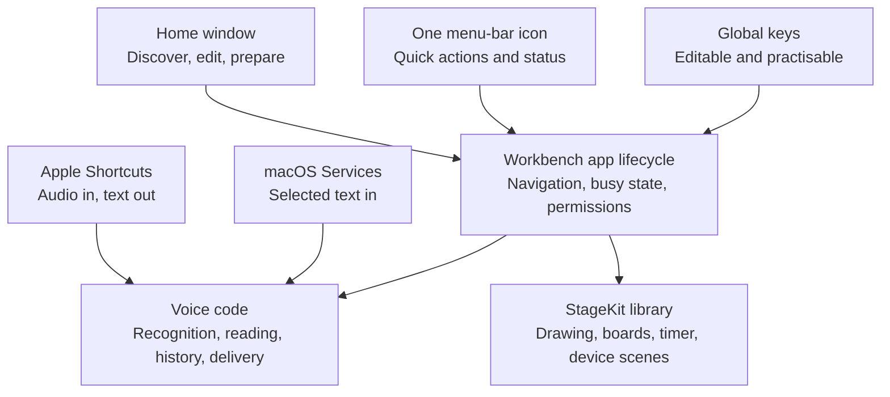
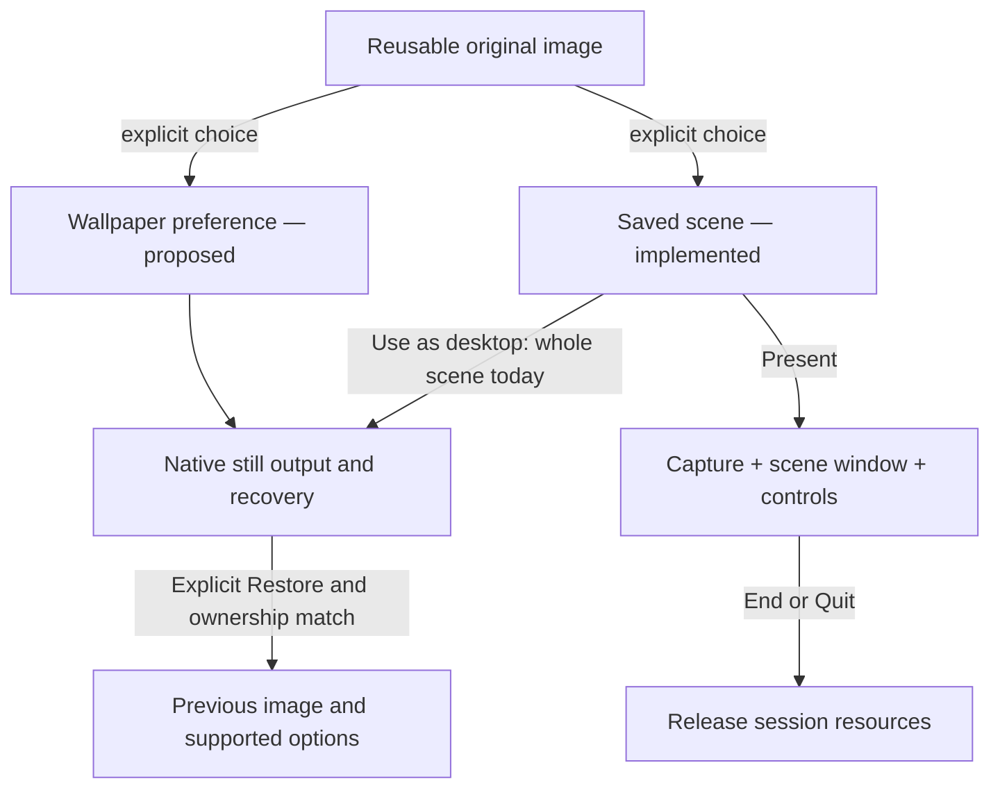

# Workbench product contract

Workbench is one native Mac app for speaking, explaining, presenting and shaping a useful desktop. It establishes a useful free baseline: dependable primitives, optional better models and a few thoughtful combinations. A feature earns its place by removing recurring friction beyond the Mac's existing tools.

This contract describes the direction and current consolidation structure. [The acceptance record](unification.md) distinguishes implementation from tested and released behaviour.

The current [capability delivery, issue #112](https://github.com/Ship-Work/workbench/issues/112), adds independent Snap and Persona, reusable selected history, optional assistant tasks and explicit meeting transcription. These are source changes undergoing combined validation. A source check, offscreen render or earlier release does not establish their installed or public availability; the production release record remains authoritative.

**Mac desktop quality is the active focus. iOS, iPad and Chrome extension development and promotion are paused until the Mac experience is dependable.** Existing code and saved work are preserved. The [mobile contract](ios-preview.md) records that separate target's limits; it is not a promise of sync or mobile scope for this Mac delivery.

## Grammar

Workbench stays learnable as more people and agents contribute by speaking one small language: a few capabilities you can reach without looking, options that belong to exactly one of them, and one place where captured work ends up. This section is how new work is judged. It does not by itself move or rename anything.

### Moments

Every entry must make one of these faster or calmer.

1. **Working.** You need a utility for seconds and return to work: Dictate, Snap, Read.
2. **Capturing.** You explain screens aloud and get a deck in seconds: Snap & Talk.
3. **Presenting.** You demonstrate with a device, your persona and live marks, and never get flustered: Present, Persona, Draw, Timer.

Reusing what you captured (History, then Hand off) supports these moments. It is not a fourth mode to navigate.

### Capabilities and named workflows

| Capability | Turns | Options live here, and nowhere else |
| --- | --- | --- |
| Dictate | voice into text | delivery, text style, activation and dictionary in Dictate settings; completed transcripts in History |
| Snap | the screen into an image | region, window or screen; crop and marks on the image; copy |
| Read | text into speech | voice, source text |
| Draw | marks over anything | pen, arrow, shape, board, undo, clear |
| Present | a device or scene into a live stage | scene, device, audio, saved prompts, Persona in the scene |
| Persona | you onto the screen | cards, live camera, size, position, voice framing |
| Timer | a break into a visible countdown | duration, placement |

**Named workflows** combine capabilities and keep their own name because they are a moment: **Snap & Talk** (Snap with narration, building a deck) and **Meetings** (Dictate with a meeting or call’s audio, as a longer session). Meetings is the existing Transcribe meeting or call workflow, promoted to a visible desktop destination. A new named workflow is a new capability for review purposes.

**Hand off** is an action on selected History items: a recipe (skill) and a destination (Copy instructions, Claude or Codex), with the result returning to History. It is not a destination of its own.

### Composition

Every use of Workbench is at most three visible choices: the capability, an optional recipe, and where the result goes (the field you were in, History, Claude or Codex, a file or the speakers). The source follows from where you started or what you selected, and is offered only when it is genuinely ambiguous, such as which app's audio to transcribe. A recipe is a skill file; Dictate's text styles stay its own cleanup options because they promise to keep your wording. A named workflow is a composition worth naming because it is a moment: Snap & Talk is Snap with narration, the Deck recipe and a file. A new idea should be a recipe or a destination before it is a capability.

### Places

- **History**: everything captured or produced (dictations, meetings and calls, Snaps, Snap & Talk decks, Hand off results), each keeping the material that produced it, reached through one door and searched and selected together. Existing stores stay where they are; History is a view over them.
- **Library**: things prepared for reuse (scenes, personas, saved prompts and links, skills and packs).
- **Settings**: preferences, keyboard, models and connections.

### Surfaces keep their roles

- **Menu bar panel**: a row per capability or named workflow, with that row's adjustments. Footer: Open Workbench, Settings, Shortcuts.
- **Floating toolbar**: live controls for Capturing and Presenting (Snap & Talk, Draw, Present, Persona), plus compact Dictate and Read start and stop.
- **Workbench window**: preparation pages named exactly as their capability, then History, Library and Settings.

### Names

One capability has one name on every surface, menu and shortcut. Action labels may follow state ("Read", "Stop reading"). A shortened label is allowed only if it cannot be mistaken for another capability. The same action uses the same words everywhere: one set of words for stopping, cancelling, hiding and ending, and one set of drawing tools and colours whether you mark the screen or a Snap. Persona means your on-screen presence only; how you speak or write is a Style.

### Rules for every change

1. **Classify before building.** Each user-facing change is:
   - **Quality**: an existing capability works better with no new entry. Preferred.
   - **Option**: a new choice inside one capability's own options, named in its words, off by default unless it is that capability's core behaviour.
   - **New capability, named workflow or place**: needs Ethan's decision, the moment it serves, and why it cannot be an option. Something else should merge or leave.

   A rename that keeps the same thing in the same place is Quality. Another door to an existing capability or place (a menu item, card or button that opens it) counts as an Option of what it opens and needs a reason, because each extra door is sprawl.
2. **Avoid branching.** An option inside an option folds into its parent or waits, unless it is a necessary source or privacy control.
3. **One door for captured work.** New stores, review folders, workspaces or result lists appear inside History. New ways to process captures are recipes.
4. **Recipes are content.** Built-in and shared skills use one file format. Getting a shared skill should be as easy as opening a file a colleague sent.
5. **Proactive features only offer.** Detection, collection and suggestions ask first, have one switch each, and change no system setting without an explicit opt-in. A recording always starts from the person's choice and shows a plain visible state while it runs.
6. **No dead ends.** Every entry opens its destination, shows active state and has a way back. Visible changes include renders of the surfaces they touch, with synthetic content.
7. **Foundations first.** A change that depends on another is not promoted until its foundation passes installed Preview acceptance.
8. **The surface map is checked.** CI compares every entry point against [the surface registry](surfaces.json). An entry point starts a capability, opens a place or page, or changes a setting that reaches beyond one page, wherever it appears: the panel and its menus, the toolbar, app menus, sidebar and Home, shortcuts, Settings and offers. Controls that act only on a page's own content are out of scope. A new or renamed entry point needs a deliberate registry change classified by these rules; the registry's kinds describe what an entry is, while the classification above describes a change. The check finds changes; people decide taste.
9. **Engines are chosen once, by job.** Recognition, writing and speech engines are set in Models, not per capability; a recipe may override them where it is edited. Each run shows where it happens, on this Mac or the named service, and work never moves from this Mac to a cloud service without an explicit choice.

### Fit

Seven rules for how a surface feels, each with the check that holds it. They come from the 28 September installed-app audit (#164) and #134's feedback decision, and apply to every visible change.

1. **Gestures own movement.** A floating surface moves by drag with a four-point threshold, snaps within sixteen points of a dock behind a visible guide, keeps a free position otherwise and stays inside the display. Its menu keeps Reset position and one Position… command that opens a compact keyboard-accessible placement control, never a tree of anchors. Direct resizing belongs to Persona artwork; the toolbar sizes to its content. Gesture semantics are shared; each surface keeps its own state.
2. **The result appears where you acted.** An editor, a receipt or a failure shows at the origin, in place, with the reason and the next useful action. A routine outcome returns to normal controls quickly; a decision about recoverable audio, a permission or something destructive keeps a reachable explanation. "Needs attention" is not a label.
3. **A picture opens as a picture.** Clicking a thumbnail shows it, Space previews it, the editor is one more click, and inspecting never replaces.
4. **Content fits its window.** Rows and labels size to content at standard and larger text, and a host window matches its row's measured size in every tier. The surface gallery drives the production toolbar host and flags a window smaller than its row.
5. **A transient surface leaves when you do.** The panel, menus, sheets and the shortcut recorder close on a click outside and on Escape in every state. A persistent surface (a toolbar kept open, the recording controls, a live overlay) collapses or hides only on an explicit action and keeps Stop reachable while recording.
6. **Every door gives the same result, under the same name.** Each capability has one host-level start that presents its editor or state, and Home, a panel row, the toolbar, a shortcut and a menu all resolve to it. A menu door carries the sidebar's name for the same page; whether a page has a menu door is a registry decision.
7. **Feedback is brief, teaches once and leaves work intact.** Live work keeps a truthful compact status. A real success is confirmed quietly beside its control for four seconds (Saved, Practice complete, a Snap saved or exported), in space kept for it, and a partial failure is never a timed success. An explicit mistaken gesture may show one coaching card, once per lesson, for four seconds of visible, unheld time with a countdown ring around its ×; pointer, focus and its own menu hold it, and with VoiceOver it waits to be dismissed. Ordinary state changes never open it. Every timed notice runs on one owner-held monotonic lifetime tied to its event, so a rerender cannot restart it and a stale timer cannot end a newer one. Hiding a notice never resolves, deletes, cancels, retries or submits anything. An undelivered result stays with its owner, saved with the session so quitting keeps it, until the same words are delivered again or the person dismisses it. It names where its words are (the transcript in History, or the draft while the draft is unchanged) and never keeps a copy of them. There is one slot: a newer undelivered result replaces an older one, whose words stay in History. A label that goes after four seconds is still heard: VoiceOver announces each success once, without interrupting. Routine no speech keeps its 1.6-second cue.

The surface gallery holds rule 4, the names in rule 6 and the look of rule 7's card and rings; `--check-core` and the capture harness hold rule 7's lifetimes, lessons and undelivered results; the registry holds rules 1 and 6, the toolbar's reducer tests hold its own machine, and a pointer pass on the disposable QA copy holds what only a pointer can show (rules 1, 2, 3 and 5), recorded with the PR like the renders in rule 6 above.

## Scope

| Primitive | Workbench's responsibility | Boundary |
| --- | --- | --- |
| Speak → text | Capture/import, recognition, optional cleanup, original wording, history and safe delivery | Other apps own the note, message or document made from the result. |
| Text → speech | Explicit selected-text handoff, Mac voices with word highlighting, playback/export and optional online reading | Review imported text and keep provider setup explicit; do not turn the utility into a general agent platform. |
| Screen → Snap | Capture a region, window or display; crop, annotate, copy and keep a searchable local history | Originals survive edits and reversible archive. Cancel creates no empty record or Desktop file. |
| Snap + narration | Compose saved Snaps or a new region, window or pointer-display capture into an ordered portable Snap & Talk session | Narration follows a new capture; cancelled selectors start no audio. Narration is optional for saved images. Existing sections, original audio and frozen skill packs remain intact. |
| Persona | Show saved artwork over windows and browsers, or place it in a Present scene | Independent overlays retain their own placement and lifecycle. The optional voice outline measures loudness only while its persona shows and never records. An explicitly started local camera can take the one floating slot as a mirrored bubble; it is video only, keeps no image, writes nothing and never opens the microphone. Remote streams, recording and a camera inside a Present scene are outside this source. |
| Meeting → transcript | Explicitly capture a selected Mac app's audio and optional microphone, retain recoverable audio and save into existing history | Detection is off by default and only offers transcription. Phone-only audio, protected routes and headset results require separate native evidence. |
| Explain a screen | Live drawing, pointer emphasis, boards and a clear return to the demo | A meeting app owns distribution to the audience. |
| Present a device | USB video preview in a saved scene, branding, readable controls and a break timer | [Connection & audio](phone-presenting.md) separates picture, voice and Mac control. QuickTime and iPhone Mirroring remain separate apps; an explicit fallback releases Workbench capture first. |
| Enjoy a desktop | A distinct wallpaper journey: still-image baseline, independent settings and optional gentle motion | Direct wallpaper management is proposed; current source can apply a rendered scene as a still, with an explicit app-owned motion option in non-App-Store builds. Use native OS support and preserve later manual changes. |
| Reuse an item | Searchable prompts, links and file references with explicit Quick Look; supported local images prepare a scene or persona through their existing owners; a named Chrome destination can return to its paired profile/tab | No tenant administration, credential rotation or team knowledge system. |

The [Snap contract](snap.md) owns capture, editing, canonical Snap History, reversible organisation and composition into Snap & Talk. The earlier Screenshot action still hands live annotations to Apple Screenshot and preserves those marks. A new Snap & Talk capture also enters Snap History; older sessions are not bulk-imported. Portable sessions keep their own frozen media so they remain usable independently of the history library.

Snap & Talk uses one session workspace: fixed capture controls, ordered thumbnails and one selected screenshot/narration. Sessions and Settings open on demand. Narration save failures keep the edit available to retry or copy; closing or switching waits for resolution. Hand off waits for the current session’s processing and unsaved edits.

The bundled deck skill uses a neutral default. Colleagues can optionally connect a private GitHub content pack in Library → Packs and choose its compatible skills for new sessions. Company content is maintained outside the public application. GitHub sign-in is needed only for private pack downloads and updates. Each session keeps its complete chosen skill and assets; updates never rewrite earlier or customised sessions. Branded templates are explicit choices and optional branding cannot block neutral creation. Rich-file/deck skills retain the complete portable manual handoff; Workbench does not execute their helpers or silently replace their output contract with a text-only task.

The bounded macOS Service accepts an explicit text selection into Read; it is not a clipboard watcher or document reader. Native equivalents remain the starting comparison. Broad demo orchestration, a generic plugin framework and a Windows rewrite are not prerequisites for this version.

## History and optional assistance

The [creation and handoff decision record](research/creation-handoff-2026-10.md) connects current host capabilities, standards and experiments to this contract. [Research and decisions](research/README.md) retains earlier alternatives, reasons for deferral and conditions for reconsideration; it does not add product scope.

History lists transcripts, Snaps and Hand off results newest first, with one search and the filters All, Transcripts, Snaps, Results and Archived. It is a view: the existing transcript store, the one Snap store and each task's own folder remain authoritative. Transcripts retain original wording and editable purpose/person/company/tags. Ordinary dictation defaults to Prompt; meetings and calls are distinct purposes. Search keeps each kind's own matcher: a transcript's original and edited text and details, a Snap's title, notes, tags and image text, and each result's title, request and available saved answer. One shared selection owner keeps typed UUID references across filters and restarts; a filter never changes the selection, and results are not selectable. Named selections are loaded, renamed and updated deliberately; tags describe items and do not create another grouping store. New recordings cannot evict older selected evidence.

**Review transcript** opens the complete saved current text and original wording in a read-only History sheet. Home’s recent transcript and Meetings’ Review transcript open that same exact record. Inspecting, switching wording or closing never replaces the Dictate draft or changes the shared selection. Copy current text names its wording explicitly; export follows the chosen wording. More → Open in Dictate remains a deliberate action through the existing draft-replacement decision.

Completed Hand off results are searchable by their saved answer as well as title and request. A matching earlier task remains reachable inside its review group. Read result shows the exact cached wording used by Copy result and Read aloud; Read aloud opens the existing Keep current / Replace reading decision and never starts playback. Returning to Workbench refreshes an externally edited answer. Missing, invalid or oversized results show a reason and keep their task folder; unavailable words are not reused. Passive Snap reloads and result-file reads run off the main thread, and an older load cannot replace a newer accepted change.

History’s **Snap & Talk sessions…** opens the existing session picker without reloading or replacing the current session. Choosing another session uses the same busy and unsaved-edit admission as Snap & Talk. Sessions remain portable folders, not another History record type.

A saved meeting or call has **Review recording** beside its transcript. This opens the original audio with explicit Play/Pause, seeking and Reveal recording; it never starts automatically. Closing the review stops playback. Hiding, closing or minimizing Home pauses it without automatic resume, and competing capture or reading pauses it. The transcript and original audio remain unchanged.

Removing a completed meeting or call transcript asks for confirmation that also names its saved recording. Confirming removes both from this Mac; Cancel preserves them. Existing handoff snapshots and exported copies remain separate. A recording still in use cannot be removed. Stopping or cancelling an active recording retains its existing recovery behavior.

Hand off reviews selected content, its role and destination before starting. Meeting speech and images default to reference material. Edited Snaps share the visible cropped/annotated image by default; retaining the uncropped original locally does not authorize sending it. A job freezes selected bytes, checks them before dispatch and keeps its own receipt, attempts and result. Later selection edits do not change an active job. Repeated identical preparation and retries reuse the known task/result; a deliberately changed task or input creates a separate snapshot. Hand off starts from History's selection footer and stays in History, which reveals the task it prepared or reused. Each task shows what it was made from, read from its frozen copies, labelled when an original was since archived, removed or is missing.

Copy instructions asks the receiving assistant to write manual deliverables inside the selected work folder's `outputs/`. Its source-link guidance accounts for each delivered document's location, including nested output folders. Connected text results keep their existing source links at the task root. Updating the copied guidance does not rewrite saved inputs or outputs.

Local capture, search, tags, selections and Copy instructions work without a provider account. Optional connections use the user's installed official CLI and that provider's native sign-in. This is explicit opt-in, not Workbench account linking, browser-token extraction or a paid API fallback. The bounded connected route supports draft text with selected rendered images through Codex or Claude Code; source and provider limits appear before launch. Missing, signed-out, limited, cancelled, interrupted and failed states remain visible. A launched process is not a completed task. Connection setup retains the open review, and a saved Ready job can start later without reconstructing it. Rich-file skills and complete Snap & Talk packs retain the manual route. An assistant result never automatically becomes a Saved Prompt or overwrites original evidence.

Detect Meetings & Calls is off by default. Enabling it inspects supported Mac audio-activity metadata and can offer Review, Not now or Snooze; it does not record or upload audio. The Mac calling service can offer a possible call only after sustained simultaneous input and output activity. A supported meeting app or browser takes precedence, and other shared audio services remain manual sources. Start is a separate source-reviewed action. The source design supports a selected Mac app's audio with an optional current microphone, local recording recovery and transcription in bounded segments for up to two hours. The existing speech engine and shared audio admission remain authoritative. Actual permission denial, app/route loss, headphones and calls routed through the Mac need signed Preview evidence. Calls that remain solely on a phone are outside this Mac capture.

The [live voice backend](live-voice.md) adds a shared session projection for Meetings and Dictate, progressive Parakeet words, pause/resume, and recovery of the same selected source after an audio-device change. Confirmed words are checkpointed beside original audio; a revisable ending stays separate. A complete live pass finishes its remaining windows and commits once, while an incomplete pass uses saved-audio recovery. Dictate still delivers only the final result. The offer owner exposes a single explicit Start for the exact displayed app and rejects stale offers; detection itself never starts capture. The UI integration and physical Mac/headphone acceptance are separate from these backend checks. A separately selected local server retains its finish-then-transcribe behavior, with an explicit explanation that live words require Parakeet.

## One app, several ways in

**Switch to** extends Library through a Chrome adapter and a transient native picker. One resource UUID identifies the link; machine-local profile bindings and disposable tab IDs do not sync or enter portable exports. The [presenter decision and acceptance contract](presenter-direction.md) covers setup, exact targeting, recovery and the weekly-password boundary. This describes retained source behavior; Chrome extension development and distribution are paused. Use the [production release record](../site/updates/production.json) to identify the current public Mac package and its source revision. It adds no credential store, private-note HUD or promise of hidden controls during screen sharing.

```mermaid
flowchart TB
    Window["Home window<br/>Discover, edit, prepare"]
    Menu["One menu-bar icon<br/>Quick actions and status"]
    Keys["Global keys<br/>Editable and practisable"]
    Intent["Apple Shortcuts<br/>Audio in, text out"]
    Service["macOS Services<br/>Selected text in"]
    Shell["Workbench app lifecycle<br/>Navigation, busy state, permissions"]
    Voice["Voice code<br/>Recognition, reading, history, delivery"]
    Stage["StageKit library<br/>Drawing, boards, timer, device scenes"]
    Window --> Shell
    Menu --> Shell
    Keys --> Shell
    Intent --> Voice
    Service --> Voice
    Shell --> Voice
    Shell --> Stage
```

Three surfaces share the same operation and data owners:

- **Menu bar:** a compact quick panel with one row per capability in moment order: Dictate, Read, Snap, Snap & Talk, Draw, Present, Persona and Timer. Each row follows only its own capability’s state (`Dictate` / `Stop`, `Read` / `Stop reading`, `Snap`, `Snap & Talk` / `Stop narration` / `Capture next · N`, `Draw` / `Stop drawing`, `Present` / `End presentation`, `Persona` / `Hide persona` / `Hide personas` / `Show personas`, `Timer` / `Stop timer`) and acts on it itself. Drawing or dictation changes only its own row; other live rows keep their own endings. Starts, Capture next and Show personas respect their owners’ admission, and waiting actions are disabled. A click commits only the operation it showed, after checking the current state again. The floating toolbar retains its single contextual next action. Snap's row captures a region; its options choose Region, Window or Screen and open Snap. Shortcut labels open the conflict-checking editor in place. The panel leaves when you do: a click in another app, Workbench losing focus or Escape closes it, and every close ends the editor and its recording, so the panel always opens again in its normal state. Each row's options hold only that capability's own choices and one door to its page: Dictate keeps Delivery and Text style, named as on its page, then History… (which opens History on its transcripts), Meetings… and Open Dictate, and Draw's tools and boards end with Open Draw…. Open Workbench, Settings and Shortcuts are direct footer actions. The panel is 320 points wide inside a 12 point inset, under one header and above one footer; each row is at least 36 points tall with its capability's symbol, the toolbar's and sidebar's, before a 13 point label, and its shortcut and Options read at 11 points, so larger text grows a row rather than clipping it. Its material and corners are the system popover's. Clipboard receipts appear below the action rows. Anything that needs attention is one sentence there, with the whole message on hover and a door to the page that shows it in full with its recovery. The page is recorded with the problem where it is raised, never read from its words: Open Dictate… for dictation, capture and delivery; Open Read… for reading and its audio; Open History… for removing or exporting a transcript; Open Home… when the speech model could not be prepared, beside Retry model; Open Models… while speech is still preparing; Open Snap & Talk…, Open Draw…, Open Present… or Open Persona… for their notices; Open Keyboard… for recording a shortcut; and Open Settings… for login and saved drawing settings, which General shows. Exact labels and installed reachability belong to the combined candidate's acceptance.
- **Floating toolbar:** a quiet resting handle, with a red dot and voice trace only while recording. Reveal shows the tool launcher, the current input action and only applicable contextual controls; there is no overflow button. The launcher’s seven-tool chooser keeps each running or recoverable tool’s named commands together and opens the selected tool’s workspace. Meetings and Timer appear as independent activity rows when needed. Selecting a tool starts nothing and preserves other work. Snap and prepared Snap & Talk expose Region, Window and Screen; Snap & Talk also has Review. Draw has Tools. Present has Prompts and, while live, View for its running window, source and motion. A shown Persona has its frozen picker and one-click Next Persona/Next set when another choice exists; hidden artwork has Show again. Detailed Persona adjustments live beside the actual shown copy in its workspace and menu-bar Options. Present’s workspace keeps live controls separate from saved preparation, plus Saved Prompts and Switch to Browser Tab. Settings › General owns Keep open and Position using the existing owners, with right-click as an optional shortcut. The toolbar docks at eight named positions or stays where dragged; work never holds it open. Every command names and rechecks its operation, so a held Stop cannot affect newer work. Recovery remains with Dictate, Read and History. Read Dismiss retains text and voice; Listen can render it again. Assigned shortcuts appear in hints; editing stays in the menu panel or Settings › Keyboard.
- **Desktop:** Home is a way into work and back to recent results. The sidebar groups Voice (Dictate, Meetings, Read), Screen (Snap, Snap & Talk, Draw, Present, Persona) and Saved (History, Library), with Home first and Settings pinned below the scrolling list. Its twelve destinations open preparation and start nothing. Library holds Resources, Packs and From iPhone; Settings holds General, Keyboard, Models and Connections. Existing routes retain their meaning. Each workspace uses its sidebar name as its heading and keeps its primary action beside the content it affects. Dictate centres the microphone and transcript, with Copy text and More for result actions. Delivery, text style, the Dictate shortcut, activation and dictionary live in one Dictate settings sheet, in one aligned label column; both the page and Settings’ Dictate settings… open that same sheet. Read centres text and playback, with Voice & pace in its sheet and the local or online destination, the voice's quality and any free better-voices hint visible before Listen. Meetings makes one explicit Start on a detected or chosen source, live words, Pause/Resume, Finish meeting, recoverable audio and exact saved transcript review one continuous journey. It holds Detect Meetings & Calls and guarded Finish when call audio ends; silence and device reconnection cannot end a session. Prepare follow-up opens the existing reviewed handoff for that transcript. [Live voice](live-voice.md) owns the session and receiver limits. Each recording kept for later is listed with its own Transcribe, Show in Finder and Move to Trash; one that heard no speech is shown once with its audio kept and is never offered for retry. History owns completed work; Library owns reusable resources. Timer remains within Draw and the existing quick controls, with one name and one word set on every surface (1 October): its next step (Start, Pause, Resume or Restart timer), Show or Hide timer for its window alone, and Stop timer, which ends the countdown and closes its window. The panel row starts and stops it; its Options, Home's current work, the toolbar chooser and the timer's own window carry the next step and Show or Hide, and each reads one state line (its time, Paused, Time is up or Hidden). A finished timer stays until it is stopped. Duration and Position are its options; Position applies even before the window first opens. Closing settings or navigating preserves drafts, sessions and independent work. Every page uses shared 22 point semibold titles, 13 point section titles/body, 24 point padding and 16 point section spacing. Home keeps its once-only greeting and local Me profile. Present keeps its primary actions fixed, its Persona control near the scene heading and Connection & audio in its guide. Home’s live strip uses the same owner actions as the toolbar and panel.

The toolbar has one window, saved position and lifecycle. Its quiet resting handle remembers the selected tool for reveal; only recording adds a visible dot and voice trace at rest; other work remains in accessible status and the chooser. The revealed black capsule carries white action icons; its read-only hover hint names the action, assigned shortcut and required Hold or Release gesture. It hides during screenshot acquisition. Its two-tier hover, native menu holds, positioning and Reduce Motion behavior are specified in [the floating-toolbar contract](floating-toolbar.md). Window → Focus floating toolbar provides explicit keyboard access; ordinary pointer controls preserve the other app's focus. One saved preference shows or hides the toolbar between actions, from four doors that always agree: the menu-bar panel header's Floating toolbar switch, the same switch under Settings › General › Appearance, Window → Show or Hide floating toolbar, which names what it will do, and the toolbar's own Hide toolbar. Recording, recovery and prompt insertion keep their controls whatever it says, and capture suppression never changes it. Window → Show floating toolbar and Restore menu-bar icon recover access when macOS conceals a status item. Closing or minimising Home leaves the utility running; opening Workbench from the Dock restores its window. Quit stops app-owned work. Login launch remains an explicit user setting.

Saved prompts reuse Library records, favourites and Product/Persona tags. Library's Resources save the clipboard as a new prompt, with ⇧⌘S while they show. Present's Prompts and Saved Prompts… open one compact picker: search, favourites first and then every other prompt once, and one optional Product or Persona filter that narrows the list without submenus. It is at most 420 points wide and fits its display near either edge; long names wrap or truncate and keep their full accessible text. The picker freezes its choices and the original Mac field/value/selection when opened, and closes on Escape, a click outside or a choice. It inserts literal text progressively only where Accessibility supports confirmed selected-text writes; otherwise it uses one guarded paste and labels that result as pasted. Without Accessibility approval, or with no readable field, its action is Copy prompt: one copy of the exact text and dictation's Copied. Paste with ⌘V. receipt, whose Review opens Library, with no paste or Accessibility write. The last delivery is one line naming its destination, with Details for the full reason; guidance on delivery lives with the prompts in Library. Escape, Stop, focus/value/selection changes and shortcut editing stop insertion. Partial or uncertain delivery is never replayed, and no Return, Tab or submit command is sent. No new prompt shortcuts or duplicate library are created.

Normal application menus, buttons and editable shortcuts remain available together. Spotlight can find the app by name. The existing App Intent accepts audio and returns text; it does not own microphone recording. The selected-text Service receives only the request pasteboard supplied by macOS, opens a reviewable reading draft and never starts playback. Additional Spotlight actions, Share extensions and URL automation must be treated as new integrations with their own evidence.

## Interaction rules

- Start microphones and device sessions through an explicit action. Request access when the feature needs it and explain a denied permission in context.
- Keep one owner for an active microphone operation. Model selection cannot change an in-flight request. The host coordinates ordinary dictation, meeting recording, Snap & Talk narration, drawing and keyboard practice. Persona's voice outline is a meter, not a recording: it runs alongside these without taking their microphone. Snap & Talk may queue saved audio while the next section records; recognition remains sequential. Snap editing and active assistant tasks also participate in quit/update admission so work is retained.
- Keyboard is one catalogue across modules. Duplicate assignments and common Mac command conflicts are explained. Failed registration must not silently replace a usable combination.
- Shortcuts are presenter-first: two keys, one hand, no looking. Each default is Option plus one key under the left hand while the right hand stays on the mouse. Top row: Q Present on/off, W the Workbench menu (it lists every key), R next persona. Home row marks: A Arrow, S Shape (a box, or a straight line when dragged flat), D Draw, F Persona on/off. Bottom row: Z Undo, X Clear, C Snap & Talk, V Dictate. Hold a mark key to draw and let go to return to the demo; every on/off key stops what it started, and Escape leaves drawing. Everything else starts off and is one recording away in Keyboard. Option avoids Terminal's Control keys (⌃C, ⌃Z), Rectangle and Magnet's Control-Option window keys and ⌘ app commands; it skips accent keys such as ⌥E. Every global shortcut includes Control or Option: a combination such as ⌘S or ⌘T belongs to the app in front, so Workbench never registers one. An update moves only shortcuts still on an old default or on such an app command. A new default never takes a combination someone chose.
- Keyboard practice pauses Workbench global actions, consumes practice key presses, counts complete press/release repetitions and restores actions when it ends, the window loses focus, Workbench loses focus or a menu opens. Recording a new shortcut follows the same rule, so neither can capture later typing. It does not claim a complete inventory of other apps' shortcuts.
- Capture the original app and field before dictation. Supported readable fields can receive verified live updates to the owned speech span; final cleanup replaces that span after History commits. If ownership changes, stop those writes and never paste the whole transcript again. Unsupported fields retain the existing final paste, only when they remain valid; otherwise copy. The field captured when the menu-bar panel opens belongs to that visit and expires when the panel closes, so Home copies a saved transcript rather than pasting it into a field chosen earlier. Never press Return or submit a message. Restore the previous clipboard only after confirmed insertion while Workbench still owns the clipboard change. Without Accessibility approval, copying is the supported delivery: the floating receipt and the panel's and Home's clipboard shelf say Copied. Paste with ⌘V. and never repeat a permission request. Paste automatically stays chosen for a later approval, and Dictate, its panel options and Home's first dictation say that transcripts are copied for ⌘V until then, beside one Set up automatic paste… action and the note that an organisation may need to approve it. Its first use may show macOS's request, which macOS shows once; after that, or when no request appears, it opens Privacy & Security › Accessibility in System Settings, so it is never a dead end. A changed or unreadable field keeps its own reason. Sublime Text's standard editor exposes only a window: dictation can send one paste to that captured window while the app, window, title and focus remain unchanged and no editing input occurs during capture. Moving away and returning invalidates it. A dialog, missing observation or missing Accessibility approval copies instead. This compatibility path retains the transcript on the clipboard and briefly says “Sent to Sublime Text · still copied.” It does not create an unresolved delivery or suggest pasting again, and never claims confirmed insertion. Scrolling alone does not cancel the captured target. Accessibility checks have a short total timeout and run at a bounded rate; a timeout invalidates delivery and keeps the copied fallback.
- Preserve originals and saved work. Cleanup is optional and reversible. A generated rewrite is not evidence of factual or semantic correctness.
- Shared-resource imports preview New, Changed and Unchanged records. Changed IDs default to Keep mine; Use incoming is explicit. Apply saves the choices together, while Cancel, invalid input and failed saves preserve the original library. File references travel without media or local browser/access grants.
- Ending a scene releases its device capture, presentation window, controls and keep-awake activity. It does not restore desktop wallpaper, close unrelated apps or change system policies. Quit stops app-owned work; a still picture set through macOS and its recovery records persist. Restore desktop is a separate explicit action with an ownership check.

## Models stay replaceable

Parakeet is the account-free, on-device default. Its first setup is visible wherever readiness shows (Home, the menu-bar panel, Dictate and Settings › Models): checking files, Downloading Parakeet with its percentage, then preparing for this Mac. Settings › Models names the failure reason beside Try download again, and its one button says what it does (Download Parakeet, Try download again, Use Parakeet or Use local server, In use). A separately run, loopback-only transcription server is an explicit alternative. The app preserves the same capture, cleanup, history and delivery flow when recognition changes. A saved configuration is not a connectivity or quality check. Dictate shows the speech model and text style in use under its microphone, with Models… beside them, and Dictate settings names both models beside the same door. A recording longer than 15 seconds has its ending read a second time and joined to the transcript, so the last words are not dropped, cut short or invented; [model providers](model-providers.md) records the measurement and the other speech models measured and not offered.

Mac voices are the default for reading. Workbench lists installed voices with their quality and points to free better ones in System Settings; it never downloads or changes system voices. Neural voices are a second choice on this Mac: one download of about 530 MB, started only from its button in Read's Voice & pace or Settings › Models, then readings are made here with no internet, a sentence highlighted at a time. A reading with Neural voices chosen and no download says where to get it, and no other voice reads in its place. Settings › Models shows Reading voice beside the speech and writing models, with the same Read with choice as Voice & pace. Speko TTS is a separate online choice with its own key and usage; it can use balanced automatic routing or a user-selected compatible catalogue voice. Speko STT is not currently a Workbench recognition provider. No provider failure silently changes between Workbench's local and online choices. User-managed server software controls whether its local endpoint forwards audio beyond the Mac; Workbench cannot promise its end-to-end privacy.

Prefer a small explicit provider contract over a general agent framework. Add another adapter when a real model/runtime can meet its input, cancellation, readiness and privacy requirements. See [model providers](model-providers.md).

## Appearance and onboarding

Keep the Workbench name and a shared restrained mint/slate palette, system typography, native controls, clear states and System/Light/Dark choices. Voice feedback shares one look, dots that a voice raises into rounded bars, with a response suited to its audience. The recording pill shows the speaker what the microphone hears, including soft input, as a quick waveform beside the red recording dot, tallest in the middle. Persona's ring of dots rises into bars for the audience, each bar one part of the voice's range, in a colour the presenter chooses as Draw's ink colour is chosen. Both rest as dots in silence, never move on their own and hold their geometry with Reduce Motion. The quick panel and the window's pages follow the [Grammar names](#grammar) on every surface, so the renamed pages need no aliases in the surface registry. The sidebar, the Library and Settings switchers and the app menus' page items read each page's name and route from one page record in `WorkbenchHome`; a menu door adds at most the native … to that name. The surface check fails an app-menu item that names its page any other way when the item's own action shows which page it opens; it does not see a route chosen inside a condition or a helper, or a title built at runtime. A label should explain an action; a status should describe what actually happened.

Home leads with Dictate, Snap and Snap & Talk. Its greeting types “Welcome back!”, erases it and settles on “Let’s make something. ✨” once per window session; Reduce Motion shows the settled line immediately, and VoiceOver reads one stable heading. A hidden or stopped camera visit stays in Current work with Show camera again or Try again until End camera. The sidebar can collapse to labelled icons with its header control or Control-Command-S. Both widths share one icon column, so collapsing or expanding moves only the sidebar's edge: the control stays under the pointer, every icon keeps its place, and names fade rather than wrap. Reduce Motion changes the width at once. In the collapsed sidebar, hovering any page, Settings, the expansion control or an available update immediately shows its name beside the icon, outside the scrolling list. This hint never takes focus or intercepts a click, and leaves with the pointer, navigation, expansion or loss of window focus. A saved global shortcut using that chord stays saved but pauses with an explanation in Keyboard; the window command remains available. Hover and selection remain distinct in light and dark appearances; choosing a page starts nothing. The window carries the product name, while the sidebar carries the mark and Preview edition when applicable.

The [interactive experience studies](experience/index.html) provide resettable synthetic scenarios for reviewing these journeys. They do not establish installed acceptance.

Home starts with a compact greeting, any relevant first-use guidance, and Current work when something is active or paused. Its four stable cards open Dictate, Meetings, Snap and Snap & Talk; opening a card never starts recording, screen capture, playback or processing. A loaded Snap & Talk session continues by navigation alone. Recent work shows History All’s five newest eligible entries using stored timestamps, grouping and exclusions, rebuilt only when a store changes. A row opens that exact result without selecting it or replacing Dictate’s draft. Completed work lives in History; retained dictation audio stays in Dictate’s Capture recovery or Saved recordings, with explicit retry and discard. Opening Home never acknowledges, retries or deletes recovery. The separate Continue section, clipboard playback action and founder introduction no longer occupy Home. The founder introduction remains in Settings, and the quiet Saved from iPhone cue still opens its Library section.

Home’s Me control opens a local profile backed by an ordinary saved Persona. Take photo requests Camera access only on that explicit action and opens a live camera preview inside the profile; Choose photo opens a file picker. Both continue to the existing Persona appearance preview. Use photo commits, and Cancel leaves the saved profile, selection and source files unchanged. An existing selected Persona can become Me by reference. Replacing its photo preserves its identity, groups and artwork used by saved scenes or shown copies. The profile adds no account or sync service. Open Me in Persona selects that saved item for preparation without starting an overlay. Use synthetic scenes, text and recordings in examples.

## Identity, migration and release

[Installation and updates](updating.md) owns the two editions, updater behavior, build provenance and the shared contributor delivery workflow.

The unified identities are `com.ethdawg.workbench` and `com.ethdawg.workbench.preview`; packaged executables are `Workbench` and `WorkbenchPreview`. `LocalVoice` remains the internal Swift executable target/module. `StageKit` is a library in the same process, with no independent status item or application lifecycle.

Preview lives at `~/Applications/Workbench Preview.app` and has its own saved files, preferences and permissions. Supported legacy Voice/StageMark files are copied once into missing unified component directories; original data remains untouched. Do not run repeated merges from old app state. Do not reset privacy permissions or erase user data to simplify a release. Keep the signing identity and installation path consistent.

A build, an installed Preview, a reviewed merge, a notarized archive and a published release are separate claims. Each needs its own evidence. Before promotion, test the actual package: first use, permissions, migration, global keys, recording/cancellation, paste, presentation lifecycle and the hardware-dependent paths affected by the change. App Store submission is a separate workflow.

## Small-project maintenance

Use GitHub issues for agreed work, PRs for review and releases for downloadable versions. A substantial shared change needs an owner before implementation and another person's review before acceptance. [CONTRIBUTING](../CONTRIBUTING.md#send-your-change) records the contribution and review workflow; it does not assert that repository permissions or approval rules have been configured.

The short implementation map is [design.md](design.md). The earlier suite model of two independently shipped apps is superseded by this consolidation contract.

## Improving the commodity utility

The [category comparison](utility-comparison.md) ranks three useful steps per existing job. The [architecture decision](commodity-strategy.md) records stable jobs, replaceable engines and storage boundaries. Use the [model evaluation template](model-evaluation.md) before changing a default engine. GitHub issues remain the canonical contribution queue.

Scene preparation and persistent wallpaper are distinct, independently useful jobs. The user may adopt either without the other. Share original pictures by choice, with separate crop, layout and playback state. A direct Wallpaper entry is an accepted direction to prototype; current Preview still routes desktop apply through a rendered scene. Home placement remains a usability decision, not a reason to force both jobs into a common mode selector.

[Background management](background-management.md) remains the implemented scene-backdrop specification. The [visual-experience contract](../site/handbook/contract.json) is the canonical structured record for the broader lifecycle, capability status and acceptance scenarios. The [public handbook](https://workbench-mac.vercel.app/handbook/) generates its capability and lifecycle records from that same file. The existing guide explains use; neither creates a second work queue.

Native still wallpaper, time-of-day Dynamic Wallpapers, aerial transitions and continuously animated desktop rendering are different capabilities. Do not infer general video, arbitrary Space control or complete wallpaper-configuration recovery from the image-file setter. Gentle photo motion uses a native layer above a still; it does not install Apple aerials or arbitrary videos. Independent direct wallpaper selection remains proposed. Energy, multi-display and receiver claims require measurements beyond the current local checks.

The first independent wallpaper increment is choose → preview on a named display → apply → return to work, with explicit restoration that preserves later manual choices. The optional app-rendered motion stops on Quit and leaves its rendered still. Gentle motion is now an optional scene setting and an explicit Mac desktop action; there is no wallpaper automation endpoint. See [gentle motion](gentle-motion.md) for its bounded implementation and current evidence.

Three [authored ambient starters](research/ambient-scenes.md) reuse these destinations: Window light, Campus breeze and Coastal sky. Only cloud or foliage details move; the room, buildings, coast and presentation foreground remain fixed. Choosing a starter opts that new scene into motion. Pause shows its matching poster, while galleries and exports stay still. On iPhone/iPad, motion belongs to the visible scene editor, not the system wallpaper. The installed local candidate and public download have separate release status in the linked acceptance record.

## Visual state ownership

```mermaid
flowchart TD
    Original[Reusable original image]
    Original -->|explicit choice| Wallpaper[Wallpaper preference — proposed]
    Original -->|explicit choice| Scene[Saved scene — implemented]
    Wallpaper --> Still[Native still output and recovery]
    Scene -->|Present| Session[Capture + scene window + controls]
    Scene -->|Use as desktop: whole scene today| Still
    Session -->|End or Quit| Stop[Release session resources]
    Still -->|Explicit Restore and ownership match| Restore[Previous image and supported options]
```

The current desktop output/recovery mechanism exists inside scene preparation. A separate wallpaper preference and direct entry are proposed. There is no automatic link between the two choices; ending a presentation does not restore a desktop picture. The structured contract provides the exact current behavior and remaining evidence gates.

## Selected-photo handoff

The retained iPhone-to-Mac photo source is governed by [photo-handoff.md](photo-handoff.md). It joins a selected photo to the existing Library and backdrop replacement, without synchronising whole libraries or changing a scene on arrival. The earlier signed, notarized Preview 3 package carried the verified capability for Apple’s Production iCloud environment. That is historical evidence for the provisioned Preview identity. The production Workbench packaging path does not enable photo or scene CloudKit sync; the [production release record](../site/updates/production.json) identifies the current public Mac package. Mobile work is paused. In a capable Preview, sync requires explicit opt-in; package capability alone does not establish paired scene reception or a public iOS release.

## Personal scene preparation

[Personal scenes](research/personal-scenes.md) connects iPhone preparation to Mac presentation through an optional same-Apple-Account CloudKit transport around portable local files. It adds no Workbench login, team workspace or whole-library sync. Scene files can be explicitly shared as editable copies. Prepared Mac persona groups restrict live choices; changing a library card never silently changes its placed copy.

Optional group defaults for a scene, logo and persona are deferred. A saved scene already keeps the chosen combination together; adding automatic cross-library inheritance before validating that workflow would create more hidden coupling. Any future default should copy a suggestion on request and tolerate rename, deletion or missing source assets.

## Multiple presentation overlays

[The persona contract](personas.md) owns prepared Mac overlay groups and multiple independently placed copies. One session freezes the selected groups/artwork; its one click menu can switch sets, edit copies, temporarily hide, explicitly save a layout and End. Native overlays stay at screen positions as the presenter manually changes browser tabs or apps; page-aware attachment and composed live-window capture are separate integrations. No new app lifecycle, browser permissions or scene-sync format is introduced.

## Recent journey review · 15 September 2026

The [phone connection and audio guide](phone-presenting.md) adds route-specific preparation and safe native fallback. The same review fixed three preservation/recovery gaps: failed Mac capture saves retain a recoverable recording and stable transcript identity; mobile whole-draft Paste preserves the earlier draft atomically; single-card overlay failures remain visible after preparation closes. The [journey verification record](verification/2026-09-15-recent-journeys.md) distinguishes automated checks, isolated native inspection and pending hardware/meeting tests.
